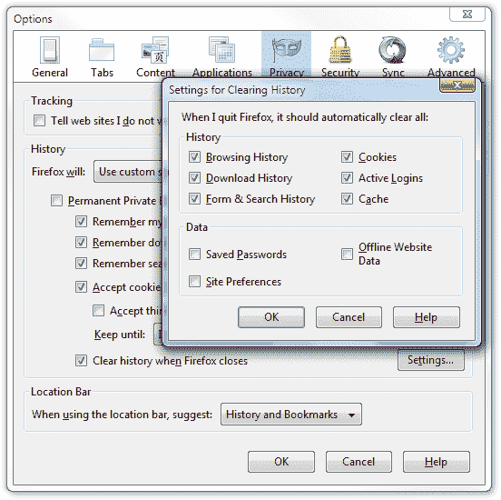
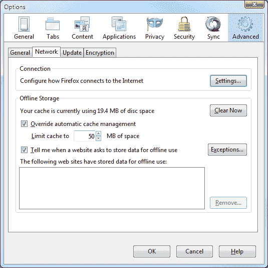
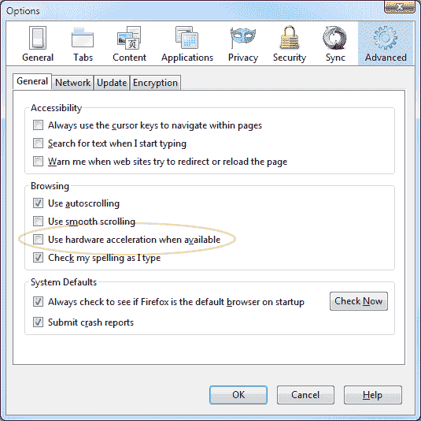

# 3 个改进让火狐 6 更快

> 原文：<https://www.sitepoint.com/3-tweaks-which-make-firefox-6-faster/>

直到最近，我才体验到火狐的速度问题。这个问题似乎影响到那些升级到火狐 6 的用户，但是我怀疑它会影响到火狐 4 和火狐 5 以及那些新安装的用户。如果遇到这种情况，浏览器会变得越来越慢:标签切换、页面加载、JavaScript 执行、CSS 悬停甚至在输入框中键入文本都慢得令人痛苦。

幸运的是，至少有三个选项可以修复 Firefox 的迟钝性能。

## 1.清除历史

旧版本的 Firefox 允许你设置 Firefox 保留浏览历史的天数。该选项在版本 6 中已被删除，您的历史将被无限期保留*(有 about:config 选项，但不清楚这些选项如何影响数据集的大小或效率)*。

对我来说，清除历史对速度影响最大。单击菜单>历史记录>清除最近的历史记录(或在 Windows 上按 Ctrl + Shift + Delete):

在时间范围内选择“所有”，然后确保选中“浏览和下载历史”。如果您的速度问题没有得到解决，您可以选择每个选项。点击“立即清除”,完成后，重启浏览器。

如果速度问题再次出现，您可以配置 Firefox 在关闭时清除历史记录。在选项对话框中选择隐私标签，并勾选“火狐关闭时清除历史记录”。“设置”按钮允许您指定要清除的数据:

但是，请注意，自动清除历史记录也会清除 Panorama 的选项卡组。希望 Mozilla 能尽快解决这个问题…

## 2.清除缓存

最新版本的 Firefox 实现了自动缓存管理，从理论上讲，应该使用最适合你的电脑的设置。我不相信。在我的安装中，缓存接近 1GB，Firefox 找到一个文件的时间可能比再次下载要长。

要修复缓存，请打开选项对话框，单击高级选项卡，然后单击网络:

点击“现在清空”给自己冲杯咖啡。这可能需要几分钟的时间，Windows 安装通常会报告应用程序没有响应。不要担心，让它完成。

现在，选中“覆盖自动缓存管理”并将缓存限制为 50MB。

## 3.禁用硬件加速

这可能有违直觉，但许多用户报告说硬件加速会对 Firefox 的性能产生负面影响。修复没有明显影响我的安装，所以这可能取决于你的操作系统，显卡，驱动程序或其他因素。

要更改硬件加速设置，请在“选项”对话框中选择“高级”标签，然后选择“常规”标签。然后取消选中“可用时使用硬件加速”:

重启火狐，检查速度。如果没有明显区别，您可以重新启用加速。

## 如果其他方法都失败了…

如果速度仍然有问题，您可能需要创建一个新的配置文件或完全卸载 Firefox，然后重新安装。

或者改用 Chrome。

希望这些提示对你有帮助。我的装置又可以使用了。

## 分享这篇文章