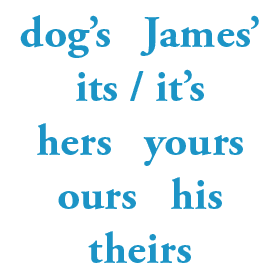

# 关于撇号要记住的 4 件简单的事情

> 原文：<https://www.sitepoint.com/4-simple-things-to-remember-about-apostrophes/>

撇号看起来像是微不足道的小事，几乎不值得它们引起的麻烦！但是它们非常重要。用得好可以让你的文章更清晰，用得不好会很难看。

所以花一些时间来确保你已经掌握了撇号。最后，我为你准备了一个简单的测试。

## 1.所有权

撇号的一个主要用途是表示拥有或所有权。比如**狗的骨头**就是**狗的骨头**。如果我们省略掉**狗骨头**中的撇号，我们就有**狗**，表示复数——也就是许多狗——这会给读者造成短暂的困惑。

### 例外

有一些重要的例外需要注意。传统规定这些所有格没有撇号:**她的**，**其**，**你的**，**我们的**，**他们的**，**他的**。

这些被称为**所有格代词**。你只需要记住他们没有撇号！(见下文更多关于**its**vs**its**。)

### 处理以*结尾的单词**s***

如果是詹姆斯的狗**呢？**詹姆士**已经在**的**结束。答案取决于你更喜欢用什么方式大声说出来。这两个都可以:**詹姆斯的狗**或者**詹姆斯的狗**。**

### 所有权和复数

**狗骨头**的意思是**狗骨头**——也就是说，只是一只狗的骨头。那么**的*狗*的骨头呢？**狗**末尾已经有一个 **s** 。答案很简单:只要在 **s** 后面加上撇号:**狗骨头**。**

注意一些复数形式。**公司**的复数是**公司**。所以我们得到**公司的网站**(即**公司的网站**)，但**公司的网站**(或**公司的网站**)。

姓氏可能很棘手。琼斯一家可以被称为琼斯一家。在这种情况下，你会提到**琼斯家的狗**，在结尾加上撇号。

也要小心使用像男人、**女人**和**孩子**这样的词。因为这些已经是复数了，你就像往常一样加上**的**就行了。比如**男团打女团**。

## 2.带复数的撇号

当你有不止一只**狗**的时候，你就有了**狗**。很简单:你只需要在单词后面加上一个 **s** 。

不幸的是，即使在不涉及所有权的情况下，也可能会有给复数加上撇号的诱惑。这是一个巨大的错误，传统上被称为蔬菜水果商的撇号，因为在水果店外面看到**苹果和**桔子的标志是很常见的。哦，亲爱的！

### 制造例外以避免混淆

偶尔，撇号*与复数*一起使用，以避免混淆。例如，短语**注意你的言行**如果没有撇号会令人困惑。

不过，要小心。提到**CD**、**DVD**、 **CMSs** 之类的没什么好混淆的，所以不要在那里用撇号(就像 **CD 的**)。在类似于 20 世纪 90 年代的**中没有必要使用撇号。**

## 3.丢失的信件

在英语中，我们经常把**缩写成**单词。例如，我们不说**很好**，而是说**很好**。**的**I**is**掉落， **s** 与的**汇合。**

你可能会说在这里省略一个撇号没什么大不了的，因为在英语口语中没有撇号。但是有两个原因可以证明这一点。首先，如果你连这么简单的事情都做不了，你看起来很傻。其次，忽略它会导致混乱。

比如把**他将**简化为**他将**是很常见的。这里省略撇号将是**地狱**。同样地，她会用代替**，我们会用**外壳**结束。而**我们会**会**娶**，**我们会**会**嗯**，**我们会**会读作**被**等等。**

尽管我们在英语口语中不用撇号，但我们发**he ' s will**和 **hell** 的音是不同的，所以在写作中区分它们是很重要的。

### 它与它的

也许最常见和最令人尴尬的标点错误是混淆了**是**和**是**。

**It's** 是**It ' s**的缩写(或者**It ' s**)。因此，确定**的**是否需要撇号的一个简单方法是看它是否有意义，因为**是**。

例如，**天气真好**和 ***一样有道理*天气真好**。因此，撇号是必需的。

但是，**狗啃的骨头**不能改成**狗啃的*是*骨头**。因此，撇号在这里是不合适的。

如上所述，**的**是所有格代词，传统上没有撇号——就像**的**、**的**等等。如果 **its** *的所有格形式*有撇号，就会和 **it's** 弄混了(**it ' s**)。

顺便说一句，如果你想知道什么时候用**it’**比较合适，答案是 ***永远不要用*** ！

### 其他容易混淆的词

当省略撇号时，其他单词会变得非常混乱。

你是 T1(T2 你是 T3 的简称)经常与 T4 你是 T5 混淆。这实际上只是一个纯粹的拼写错误，但部分原因是没有考虑到要表达的内容。

同样，**他们是**(**他们是**的简称)与**他们的**(意为其中的**)和**那里的**(表示位置)相混淆。**

而且不要把**谁是**(谁是的**的简称)和**谁的**(意为**中的**)混为一谈。**

## 4.带动词的撇号

动词是动作词，像**跑**、**坐**和**走**。与**他**、**她**、**它**一起使用时，我们加一个 **s** : **他跑**、**她坐**、**它走**。

一个常见的错误是加了一个撇号，这样就产生了 **run 的**， **sit 的**， **walk 的**。从来没有一个时候是合适的，这样的用法真的应该是死罪。

## 自我测试

好了，这里有一个考验自己的机会。这些例子中哪个使用了 ***正确的*** 标点？(答案如下。)

1.  提问是可以的。
2.  大多数狗都有尾巴。
3.  Marys 的博客更好。
4.  不要这么肯定。
5.  好吧，我们走着瞧。
6.  你会后悔的。
7.  她用切肉刀切掉了它们的尾巴。
8.  她是人民的代言人。
9.  汽车的轮毂盖掉了。
10.  老板的员工罢工了。
11.  DVD 现在有点旧了。
12.  一名女子在男子队打球。
13.  网络始于 20 世纪 90 年代初。
14.  她显然是走对了路。
15.  苹果先生的橘子很甜。
16.  他结婚时已经 40 多岁了。
17.  圣诞节庆祝耶稣的诞生。
18.  很难与邻居攀比。

那么，你是怎么去的？这篇文章中的解释有意义吗？如果你有任何问题，请在评论中提出。

*以下是上面列表中**个正确的**例子:*

1, 5, 6, 8, 9, 10, 11, 15, 16, 17, 18

## 分享这篇文章