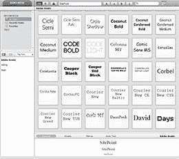
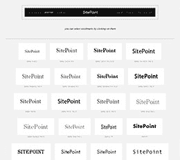
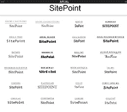
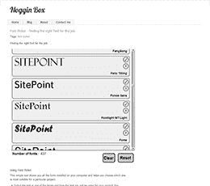

# 5 个最好的基于浏览器的字体浏览器

> 原文：<https://www.sitepoint.com/5-best-browser-font-viewers/>

你的电脑上可能安装了几百种字体。Windows、Mac OS 和 Linux 安装了各种各样的字体，您可能已经购买或下载了免费字体。如果你像我一样，当你需要创建一个新的徽标或标题时，你会定期浏览 font foundry 网站… *但你最终还是会使用你电脑上安装的字体*。

不幸的是，大多数操作系统提供的字体查看应用程序都是基本的。有一些商业的和开源的浏览器，但是很多都很笨重或者没有必要在你的系统上运行。幸运的是，有几种基于浏览器的替代方法可以预览您安装的字体。

**note:** How does a web app interrogate my fonts?

一句话:闪。这些系统中的大多数使用 Flash applet 来检索字体名称——即使界面主要是 HTML。

唯一的例外是依赖 JavaScript 的 flippingtypical.com。它使用已知字体名称的数据库，并通过将字体应用于元素并检测其尺寸是否改变来确定是否安装了字体。

## [我的新书](http://www.myfontbook.com/app/)

myFontBook 是最早的基于浏览器的字体浏览器之一，现在仍然是最好的。字体可以以列表或表格格式预览，打印，标记或评级。您可以在不注册的情况下使用该应用程序，但是如果您注册了，您的数据会在会话之间保存。

myFontBook 提供了比竞争对手更多的功能。唯一的缺点是它启动起来有点慢，你需要点击一种字体来查看自定义文本。

## [ wordmark.it](http://wordmark.it/)

这是你创建下一个徽标时应该访问的第一个网站。界面很简单:你输入的文本可以用各种字体预览。您可以选择和过滤任意数量的字体进行直接的并排比较。

wordmark .它可能没有 myFontBook 的功能，但它很快而且很实用。

## [flippingtypical.com](http://flippingtypical.com/)

flippingtypical.com 是这个列表中唯一不依赖 Flash 的字体浏览器。因此，它应该可以在你的 iPhone 或 iPad 上正常工作。

界面类似于 wordmark.it，但速度更快。主要的缺点是 flippingtypical.com 使用的字体名称数据库；它不可能是一个完全全面的列表，所以它不会找到你已经安装的所有字体。在我的个人电脑上，它只能找到 400 多种字体中的 72 种。也就是说，它仍然是一个有用的快速浏览系统。

## [头框字体选择器](http://www.nogginbox.co.uk/font-picker)

字体选择器是这个列表中最简单的工具之一，但是不要让它影响你。像 wordmark.it 和 flippingtypical.com 一样，你会看到一个显示你自定义文本的字体列表。然后，您可以通过单击“X”图标删除字体，以便比较一组合适的样式。

## STT 字体浏览器

与上面的工具不同，STC FontBrowser 是一个完整的 Flash 应用程序，最初发布于 2003 年。它非常类似于基于桌面的工具。

字体浏览速度很快，因为你只能以纯文本的形式看到所有系统字体的列表。您可以点按一种字体来查看该样式的预览文本。如果您已经选择了一种字体，并希望尝试更长的文本字符串和多种大小，这是一个理想的应用程序。

我包含了你最喜欢的基于浏览器的字体浏览器吗？你喜欢桌面应用程序吗？欢迎评论…

## 分享这篇文章