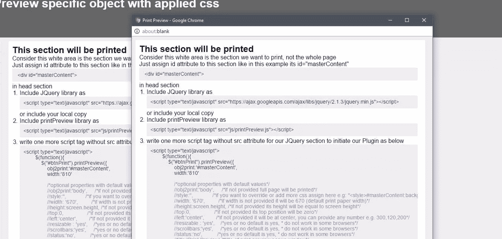
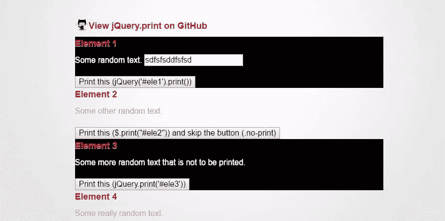
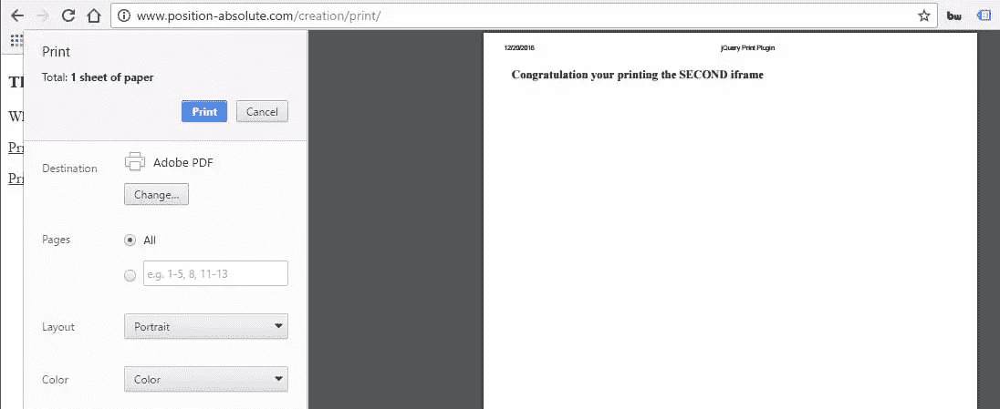
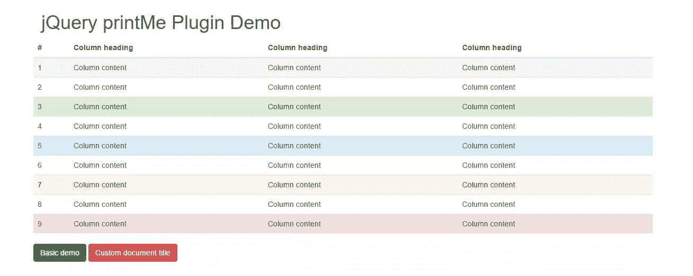
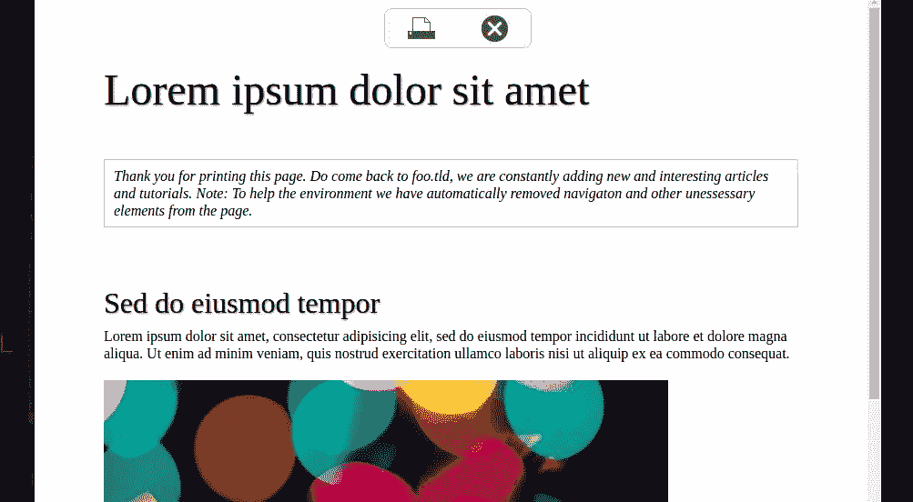

# 5 jQuery 打印页面选项

> 原文：<https://www.sitepoint.com/5-jquery-print-page-options/>

这篇受欢迎的文章于 2017 年 1 月更新，以反映 jQuery 打印插件的当前状态。与文章前一版本相关的评论已被删除。

您可能不知道的一件有趣的事情是，您可以在您的站点上动态控制打印预览 UI。默认情况下，浏览器会选择要打印的内容(很可能是整个窗口本身)，但是有几个 jQuery 插件可以让您控制要打印的内容。

虽然打印插件可能不是最令人兴奋的插件，但这里有一些你可能想看看。如果你喜欢冒险，我们还会谈到如何自己构建这个功能。

**注意:**古代的浏览器(我看的是你 IE8)在使用其中一些插件的时候可能会表现的很奇怪。然而，所有现代浏览器都以一致的方式处理打印预览，所以如果你需要完全的可比性，请记住这一点。

## jQuery 打印预览



这个小的 jQuery 插件允许你打开一个新的浏览器窗口来显示你的站点的特定部分进行打印。不像这个列表中的其他插件，这个插件不直接触发浏览器的打印功能，它只是打开一个最小窗口(这是完美的，因为你现在可以直接打印它)。

这个插件的用处是当你有想要打印的数据时，比如一张信息卡片或者表格中的一行。您可以在一个新窗口中打开它(为插件提供配置选项)，然后从那里打印。这确保您只打印您需要的内容。

它的浏览器支持似乎相当全面，在我的现代浏览器上运行良好。

不幸的是它不在 GitHub 上，所以很难知道它是否被积极支持。然而，这不应该阻止你，你应该看看它是否适合你，然后“照原样”使用它。

[网站](http://www.jqueryscript.net/other/jQuery-Plugin-For-Html-Print-Preview-printPreview.html)
[试玩](http://www.jqueryscript.net/demo/jQuery-Plugin-For-Html-Print-Preview-printPreview/)

## jQuery 打印插件



不要让丑陋的演示欺骗了你。jQuery 打印插件运行良好，并为您提供了一系列设置来定制您的打印需求。例如，您可以设置弹出窗口是否在当前窗口中出现(通过 iFrame)，设置打印显示呈现之前的等待时间，以及在弹出窗口之前/之后放置内容。

要启动并运行，只需给它传递一个 jQuery 对象或选择器，然后就可以了，插件会完成剩下的工作。

作者在 2016 年推出了几个提交来改进插件。虽然提交的数量不多，但看起来仍会继续增长。

[网站](https://doersguild.github.io/jQuery.print/)
[Github](https://github.com/DoersGuild/jQuery.print)
[Demo](http://doersguild.github.io/jQuery.print/demo/)

## jQuery 打印页面插件



让我们坦率地说这个插件。很久没有更新了。而有些人可能会在看到它最后一次更新是在 6 年前时逃离。其他人(包括我自己)可以看到这是一个简单的插件，可以简单地工作。

这个插件创建了一个带有消息和图像的小模态窗口，在主浏览器打印模态之前加载。当用在指向你想要打印的内容的锚标签上时，效果似乎最好。您可以将可打印内容添加到新页面，然后使用该插件进行打印。如果您的用户没有启用 JavaScript，它将正常链接，在一个新窗口中打开您的内容(您可以正常打印)

[Github](https://github.com/posabsolute/jQuery-printPage-plugin)T2[Demo](http://www.position-absolute.com/creation/print/)

## jquery 打印机



这个插件是最基本的。您只需在想要打印的 jQuery 元素上调用它，它就会调用打印预览窗口。没有真正的选项可言，它的工作方式与你想象的完全一样。

虽然它没有其他插件可能有的所有选项。这个插件是基本的，在我测试的浏览器中运行良好。我推荐这个工具的原因是，您可以查看它的源代码，了解它是如何逐步完成打印预览准备工作的。如果您想自己解决这个问题(并添加额外的功能和设置)，这实际上是一个很好的起点

我不指望这个插件支持。使用它，如果它的工作，这是伟大的！如果没有，你需要找到其他的东西(或者选择自己构建，如下所述)

[网站](http://www.jqueryscript.net/other/Any-Html-Elements-Printing-Plugin-For-jQuery-printMe.html)
[试玩](http://www.jqueryscript.net/demo/Any-Html-Elements-Printing-Plugin-For-jQuery-printMe/)

## jQuery 打印预览插件



最后一个是 jQuery 打印预览插件。这是为了给访问者提供一个网站印刷版本的预览。与传统的打印预览不同，这个插件在一个模态窗口中引入了所有的内容和打印样式。

作为一个额外的奖励，它是与一篇 SitePoint 文章一起发布的，你可以在这里阅读:[当访问者打印-关于打印样式表](https://www.sitepoint.com/when-visitors-print-about-that-print-stylesheet/)。

该插件有很好的浏览器支持(一直到 IE6)，但似乎没有提供任何额外的配置。它还有一堆未解决的问题，所以人们会认为它不再被积极维护了。

[网站](https://github.com/etimbo/jquery-print-preview-plugin)
[试玩](http://etimbo.github.io/jquery-print-preview-plugin/example/index.html)

## 我如何自己构建这个？

自己创造这种功能并不太难。大多数插件在幕后做的是动态创建一个`<iframe>`元素，将它附加到页面上(但是使用 CSS 定位在屏幕外)，设置`<iframe>`的内容，调用[。在 iframe 上打印()](https://developer.mozilla.org/en-US/docs/Web/API/Window/print)，然后在短暂的延迟后删除它。

下面是你应该怎么做。

```
function openPrintDialogue(){
  $('<iframe>', {
    name: 'myiframe',
    class: 'printFrame'
  })
  .appendTo('body')
  .contents().find('body')
  .append(` <h1>Our Amazing Offer</h1>
     `);

  window.frames['myiframe'].focus();
  window.frames['myiframe'].print();

  setTimeout(() => { $(".printFrame").remove(); }, 1000);
};

$('button').on('click', openPrintDialogue); 
```

这里有一个在中使用的[技术的演示。当你点击*打印优惠券*按钮时，你会注意到打印预览只显示优惠券和一个标题。这最好在 Chrome 这样的浏览器中查看，它会呈现打印预览。如果你在 Firefox 中尝试这样做，将输出保存为 PDF 以查看结果。](http://codepen.io/SitePoint/full/KaPNmx)

如果你想了解更多，Ben Nadel 有一个关于这种技术的有趣的(如果不是有点老的话)帖子/视频。

## 把一切都包起来

这个行业已经不再打印页面了(你以前多久打印过一次页面？)所以这些插件中有几个开始老化也就不足为奇了。

但是，在一些特殊情况下，打印页面或部分页面是有意义的。事件登记/条形码商品的打印，以及收据确认/购买证明是其中之一。

如果您正在构建一个网站/ web 应用程序，并且您需要打印，您可能想要创建一个仅打印的 CSS 文件(参见:[在几分钟内创建一个定制的打印样式表](https://www.sitepoint.com/create-a-customized-print-stylesheet-in-minutes/))并完美地调整您的布局。或者，您可以使用上述方法只打印您感兴趣的内容。这两种解决方案都可以很好地工作，但似乎趋势正在转向使用 CSS 来设计您的打印配置文件。

## 分享这篇文章