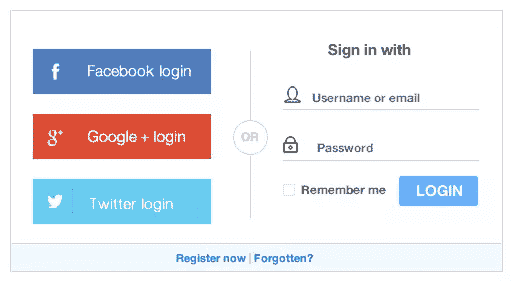
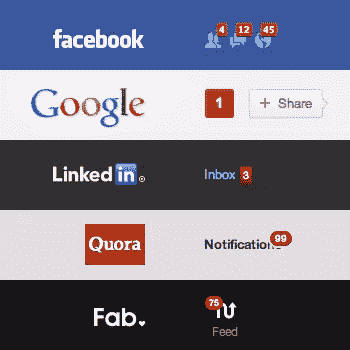
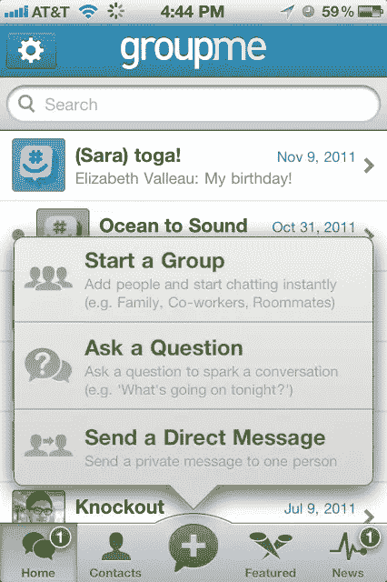
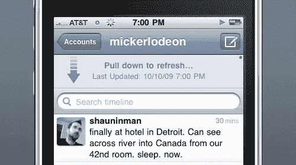
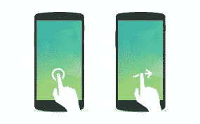

# 成功应用的 5 种移动设计模式

> 原文：<https://www.sitepoint.com/5-mobile-design-patterns-successful-app/>

在这个简短的关于移动设计模式的系列文章中，我介绍了一些在开发过程中用来解决问题的最常见的模式。在文章中，你已经学习了什么是设计模式，它的基本组成部分和解决问题的最佳方案。诸如表单组织、图库、搜索功能和交互建议等问题。您还应该了解为什么以及何时避免移动设计反模式。

作为本系列的总结，我将概述 5 种界面设计模式，你应该从流行的移动应用程序中识别出来，并且可以在你自己的项目中使用。他们将帮助你使你的设计对用户有用和直观。特别是，我将重点关注有助于您管理的模式:

*   社交分享
*   通知
*   弹出
*   内容更新
*   用户交互(滑动、点击等。)

## 社交登录

在文章[“让你的应用变得不那么烦人的 3 个小技巧”](https://www.sitepoint.com/3-tips-make-apps-less-annoying/)中，我们讨论了我们没有预料到的事件或事件有多烦人。我们看了一个游戏的例子，每当你运行它的时候，它会问你是否想用脸书登录，没有办法避免这个问题。脸书的使用让我想到了另一种情况，当需要注册服务、填写表格时，这种情况可能会很烦人。

在一个由社交网络主导的时代，我们需要以这样一种过时的方式提交我们的个人数据吗？社交登录设计模式是一个很棒的选择，它为用户提供了一种快速简单的登录方式。

用户不必再设置另一个将来可能不需要的帐户。相反，他们可以注册现有的社交账户(脸书、推特或谷歌等)。)并加快注册过程。还有其他几个很好的理由来说明为什么你应该在你的移动应用中加入这种模式:

*   通过现有的社交网络注册意味着用户不必担心另一个用户名/密码组合。
*   用户不必被迫将他们的详细信息输入到他们刚刚下载的不熟悉的应用程序中，这使得注册过程更加容易。
*   通过允许用户注册一个现有的社交网络账户，你可以获得用户的一些基本数据。然后，这可以用来更有效地使您的移动应用程序适应用户的需求。

## 通知

通知突出显示最近的活动和操作。我们每天消耗大量的信息，但同时我们又很忙，不能(或不想)花几个小时在手机上。我们喜欢在尽可能短的时间内做事情，并立即知道是否有新的活动或行动需要我们的关注。对通知设计模式的良好理解和实现是至关重要的。

许多著名公司的移动应用程序已经以不同的方式实现了这种模式:

*   LinkedIn 在新更新的标签上放置一个编号徽章。
*   Twitter 通过在时间线图标顶部放置一个小圆点来指示新的活动。
*   脸书在新闻提要中显示关于新项目的通知，并在应用程序中下拉一个弹出式横幅。

模仿你最喜欢的解决方案，测试它是否适合你的目的和用户。

## 弹出窗口和覆盖图

弹出窗口(也称为覆盖)是一种编程技巧，通常用于互联网广告。它们覆盖了主要内容，但没有创建新窗口。它们不能被广告拦截软件拦截，所以用户被迫看到它们。通常情况下，这对于用户来说是一个恼人的情况，但是在某些情况下，使用应用程序中断信息可能会对用户有所帮助。例如，用户可能希望在查看信息时不丢失他们在用户界面中的当前位置。

在这里，弹出式设计模式可以解决这个问题，它可以用几种方式来解决这个问题:

*   当用户执行某些操作或到达应用程序中的特定点时，会出现弹出窗口。然后，它会显示与该特定动作或位置相关的相关信息/控件。
*   应用程序中的原始内容或位置在背景中仍然可见，但弹出窗口让用户可以选择了解接下来的内容。
*   弹出窗口会引起用户的注意，并在需要的地方提供重要的通知。完成后，他们可以通过点击或滑动屏幕来消除弹出窗口并返回到他们之前的活动。

## 内容更新:拉动式更新

作为脸书、推特或谷歌等社交网络的普通用户，我们现在发现一个很自然的手势是从一个提要的顶部拉下以显示新内容。第一家使用这种设计模式的公司是苹果公司，从那以后它被广泛使用。

当您需要显示一个不是静态而是动态的项目列表，并且您不自动刷新该内容时，可以应用拉刷新模式。这是滚动到顶部的自然结果，一旦刷新完成，新项目就会显示在顶部。这是一个有用的模式，因为它节省空间(你不需要一个按钮)，而且很容易被发现。采用这种模式更新内容并不是唯一的方法，它还可以用来加载消息、照片或个人资料更新列表中的早期项目。

## 用户交互(滑动、点击等。)

继拉至刷新手势之后，滑动是智能手机上另一种常见的手势。一些应用程序允许你在推文/帖子上向左或向右滑动，以获得更多细节或执行其他操作。与依赖鼠标点击的典型网络应用相比，这是一个创造性的解决方案。

有太多的 Android 和 iOS 移动应用程序可以处理滑动、点击和其他特定的用户交互，你应该在你的项目中利用这些。每个应用程序对其用户都有不同的目的和价值。在将应用程序投入设计或开发之前，在线框化过程中尽早规划您的想法。在测试过程中，花时间考虑用户的反馈、建议和批评。

## 结论

在这篇文章中，我们研究了 5 种移动界面设计模式，希望能给你一些启发。如果你想了解更多关于其他主要设计模式的知识，我建议你下载 UXPin 的免费电子书[“移动 UI 设计模式 2014:深入了解当今最热门的应用”](http://uxpin.com/mobile-design-patterns.html)，这是一个简单明了的指南，可以帮助你开始深入分析广阔的移动设计模式世界。

## 分享这篇文章