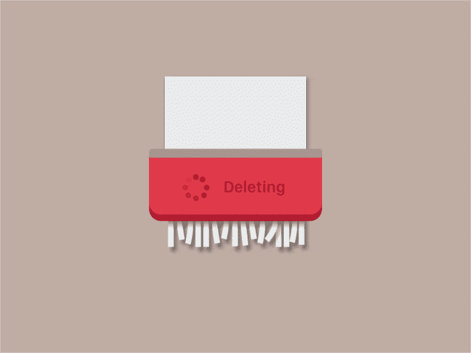
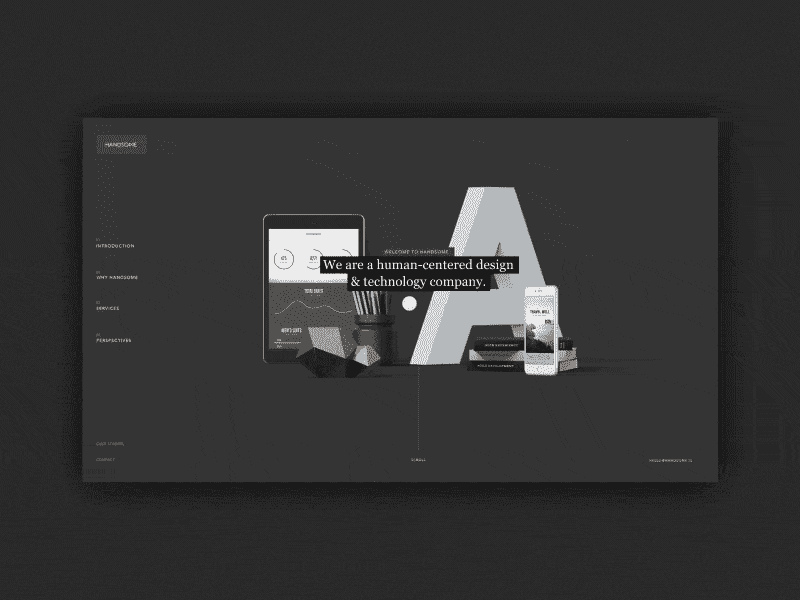
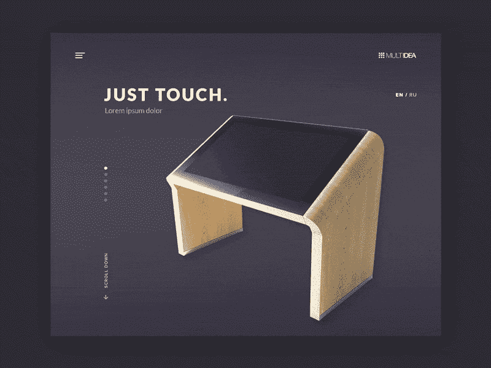

# 以下是伟大的设计师与众不同的 5 件事

> 原文：<https://www.sitepoint.com/5-things-great-designers-differently/>

对 UX 设计师的需求每年都在上升。大会估计 UX 设计将是 2020 年最有前途的职业之一，但是随着更多的需求……会带来更多的供给。以下是伟大的*设计师击败竞争对手的 5 件与众不同的事情。*

———

几乎每个领域，从健康、金融、科技，甚至零售，都需要用户体验设计师。这些*解决问题的大师*是创造在线和离线体验的天才，他们优先考虑用户的需求。

想雇佣一名优秀的 UX 设计师吗？这是其中一个的样子:

## 1.伟大的设计师写出非常好的缩微拷贝

你有没有在使用一个网站或 app 时，因为 UI 文字太模糊而感到茫然不知所措？当你在填写表格时，不太清楚你需要做什么，该怎么办？嗯，这种混乱是由**不良显微拷贝**直接造成的。

正如约书亚·波特(Joshua Porter)所说，*“微缩拷贝虽小，但功能强大。它又快又轻，而且致命。它是一个短句，一个短语，几个词。一个词。影响最大的是小文案。不要根据它的大小来判断……要根据它的有效性来判断。”*

当 microcopy 过于模糊或听起来像机器人时，用户不会像使用更具对话性、更像人类的语调那样与交流产生共鸣。伟大的设计师明白[编写界面微缩图](https://www.sitepoint.com/create-unforgettable-interface-copy/)是设计过程的一个核心方面，它*就像*原型制作、视觉设计或用户研究一样重要。

就拿 Tumblr 设计的这个表单来说吧。你看到哪里写着，“(你可以随时更改这个)”吗？microcopy 的这一小段告诉用户:“嘿，不要激动，你可以稍后再回到这一步”。它信息量大，有同理心，并且给用户提供了选择。如果没有这个缩微拷贝，用户可能会强迫自己去想一个合适的 URL。

## 2.伟大的设计师学习规则…并打破它们

伟大的设计师不只是跳出框框思考。随着技术的发展和用户需求的变化，他们学会了如何在必要时重新定义整个空间。伟大的设计师在决定打破规则之前尽可能多地了解盒子，因为他们知道重新发明轮子是昂贵的，有时还很冒险。

在设计体验之前对用户有一定的了解，可以让设计师在必要的时候偏离这些所谓的设计规则。了解这些规则，以及为什么要建立这些规则，意味着能够理解违反这些规则的后果(风险和收益)。

伟大的设计师是创新的。当他们*确实*打破规则时，当通常的解决方案不起作用时，他们会提出新的想法来解决用户面临的问题。这些想法的实现就是[设计趋势](https://www.sitepoint.com/5-emerging-trends-to-amp-up-your-web-designs-in-2017/)的诞生！

## 3.伟大的设计师偷窃

是的，你没看错。伟大的设计师偷窃，然后他们改进。我不是第一个这样说的人。事实证明，20 世纪最有影响力的美术家之一毕加索也有同感。

> “好的艺术家临摹。伟大的艺术家偷窃。”~巴勃罗毕加索。

在下面的例子中，Smena 创作了这张[时髦的碎纸机图片](https://dribbble.com/shots/824683-Shredder)。

谷歌的设计师汉娜·郑(Hanna Jung)对图片进行了轻微的重新设计，并添加了动画。很明显，荣格并没有提出最初的概念，但他仍然受到启发，对其进行了调整，使其变得更好。

我们在 Brandon Termini 为一家技术公司的网站设计的导航系统中找到了另一个例子。

受 Termini 导航概念的启发，[伊利亚·科斯汀](https://dribbble.com/shots/2286042-Stacked-navigation)决定尝试一些类似的东西，结果完全是优雅的。

## 4.伟大的设计师冷酷无情

> "简化的能力意味着消除不必要的东西，让必要的东西说话."~汉斯·霍夫曼。

在界面设计中，通常被认为是不必要的是视觉噪音、过多的文本、过度动画化的对象，以及基本上任何从必要元素中窃取焦点的东西。伟大的设计师知道这一点——他们试验各种想法，然后将整体设计简化。

“我们是领先的公司…，我们提供这个，那个，还有这个…，我们知道为什么…，我们会做这个，这个，那个…，等等…”。这些听起来是不是非常熟悉？极简主义不仅仅是使用白色背景和平面用户界面元素(实际上，它通常不是关于这两者中的任何一个)——清理从*内容*开始。

为什么？因为用户讨厌噪音，这浪费了他们的时间。普通用户只想知道:

1.  你的品牌/公司做什么
2.  这对他们有什么好处
3.  如何立即获得这些好处

当你把有价值的信息隐藏在花哨的视觉效果、不必要的功能和蓬松、无意义的文案中时，用户就越容易和另一个竞争对手碰碰运气。

我们以缓冲主页为例。该网页立即描述了 Buffer 的功能(“在社交媒体上分享”)，为什么你应该选择它(“一种更好的方式”)，并为用户提供了一个清晰的方向(“免费开始”)。

## 5.伟大的设计师理解速度的价值

奇妙的网站在美学上是令人愉悦的，移动友好的，使用清晰的印刷字体，有着吸引人的图像，完美的形式，和美妙的用户体验。但是，尽管所有这些功能都值得称赞，但如果网站不能在 3 秒钟内加载，它们就完全没用了。

面对现实吧，网站速度很重要。从各方面来看，加载速度更快的网站更好:更好的用户体验，更高的转化率，更有价值的参与，甚至更高的搜索排名。伟大的设计师明白[加载时间和*感知的*性能](https://www.sitepoint.com/web-performance-tricks-beyond-basics/)很重要，即使这一壮举的另一半由开发人员负责。

一项 Kissmetrics 研究显示，加载时间延迟 1 秒钟可能会导致 7%的转化率损失！

伟大的设计师与开发人员合作，分析用户参与其网站的方式，识别哪些网页/移动应用程序屏幕加载缓慢，或者哪些页面/移动应用程序屏幕由于过多的图像/功能而被*认为*缓慢。

然后他们重新思考，减少和改进！

———

显然，要成为一名伟大的设计师，除了上面提到的，还有很多很多的东西，但这是特别引人注目的 5 个热门设计技巧。那么，你是一个令人神魂颠倒的人，还是一个变脸的人？

## 分享这篇文章