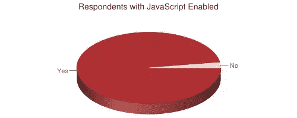

# 我学到的关于可及性的 5 件事

> 原文：<https://www.sitepoint.com/5-things-learned-accessibility/>

每个开发者每天都要学点新东西，至少那些想做好的人是这样。它可以像一个新的 CSS 属性一样简单，也可以像一个库一样复杂。不管是什么，只要学到东西都欢迎。

为了遵循这个原则，我最近决定专注于一个我真正关心的话题，直到现在，我还没有时间深化我的知识:可访问性。<dfn>无障碍</dfn>(通常缩写为 <abbr title="Accessibility">a11y</abbr> )被定义为<q cite="http://en.wikipedia.org/wiki/Web_accessibility">消除阻碍残疾人访问网站的障碍的做法。</q>

在这篇文章中，我将与你分享一些提高网站可访问性的技巧和诀窍。这些是我最近在参加相关活动时学到的(比如 [InclusiveDesign24](http://inclusivedesign24.org/) 和[伦敦网络标准五月会议](http://londonwebstandards.org/2014/05/19-may-lwsjawas/))。

## 1.*不*使用`accesskey`属性吗

几年前，我发现了一个叫做`accesskey`的 HTML 属性的存在。它可以与任何 HTML 元素相关联，其值由网页的作者确定。其目的是向用户提供一种通过使用一个键或组合键来激活或聚焦某个元素的方法。为了给你一个概念，让我们假设我们有下面这个使用了`accesskey`属性的菜单:

```
<nav>
    <ul>
        <li><a href="/" accesskey="h">Home</a></li>
        <li><a href="/blog" accesskey="b">Blog</a></li>
        <li><a href="/about" accesskey="a">About</a></li>
    </ul>
</nav>
```

乍一看，这似乎是一个很大的可访问性改进，因为我们使用户能够用一个命令访问给定的页面。但事实并非如此。事实上，我们在标记中设置的一个键可能正在被用户的辅助设备(例如屏幕阅读器)使用，或者被用户使用的浏览器使用，甚至被用户自己使用。似乎这还不够，我们也不能预测冲突，因为每个浏览器可能有不同的按键组合来使用指定的`accesskey`。

例如，一个 Chrome 用户想要使用`accesskey`属性中定义的值访问博客，必须按下`ALT` + `SHIFT` + `b`。很好，不是吗？是的，它是…直到你发现 Chrome 使用相同的组合来聚焦书签栏。想着换个值？或许一辆`t`是更好的选择。没有。Chrome 中使用组合`ALT` + `SHIFT` + `t`来聚焦工具栏。我们可以继续讨论一会儿，但我相信你已经明白了。

使用`accesskey`属性可能会产生比它解决的问题更多的问题。因此，最好避免使用它，并专注于为我们的页面编写语义标记。用户的辅助技术(AT)将(有希望)完成剩下的工作。

## 2.使用`.visuallyhidden`向链接添加上下文

有多少次你看到一篇文章或者一个页面有类似“多阅读”或者“继续阅读”这样的锚文本。我经常看到这些(欢呼 WordPress，Joomla，等等)，我确信这是我自己已经做过很多次的事情。我了解到这对于一个 at 用户来说是不够的。

ATs 的特性之一是显示页面中包含的链接列表。因此，如果页面有如上所述的带有锚文本的链接，当用户使用这个功能时，他/她从他们的 AT 接收到的只是一系列无意义的“继续阅读”、“阅读更多”等等。

我们如何解决这个问题？为了创造解决这个问题的神奇药剂，我们需要一点 HTML 和 CSS。特别是，我们需要一个类来实现一种技术来可视化地隐藏一个元素。实现这种技术的 CSS 代码取自 [HTML5 样板文件源](https://github.com/h5bp/html5-boilerplate)，如下所示:

```
.visuallyhidden {
    border: 0;
    clip: rect(0 0 0 0);
    height: 1px;
    margin: -1px;
    overflow: hidden;
    padding: 0;
    position: absolute;
    width: 1px;
}
```

有了 CSS 中的这个类，我们可以像这样更改标记:

```
<a href="path/to/somewhere/over/the/rainbow">Click here</a>
```

到…里面

```
<a href="path/to/somewhere/over/the/rainbow">Click here <span class="visuallyhidden">to go far away from Kansas</span></a>
```

通过这个简单的改变，不使用 ATs 的人将会像以前一样继续看到这些链接。另一方面，AT 用户(尤其是那些使用屏幕阅读器的用户)会有软件列表(或阅读)“点击这里远离堪萨斯”。这将给他们更多关于链接的信息。

## 3.使用`tabindex`属性

开发网站时，可能会碰巧有多个元素指向同一个 URL。让我们以一个在线书店的主页为例，在那里我们有几本书的列表。对于每本书，我们都有书名、封面、带有书名剩余部分的描述，以及行动号召(通常是“立即购买”按钮)。通常这些元素都链接到书店的页面。

对于依赖于`TAB`键来浏览网页的用户来说，这种情况非常令人沮丧，许多残疾人就是这种情况。事实上，对于主页上的每一本书，用户都必须跳四次才能跳到下一本书。现在，如果一个顾客对第十本书感兴趣呢？我们亲爱的客户必须按 tab 键 37 次！此计算还假设列表前没有其他链接。你可以明白为什么这很烦人。

为了解决这个问题，我们可以利用`tabindex`属性。当这个属性[的值设置为-1](https://www.sitepoint.com/learning-to-focus/) 时，该元素将从默认导航流中删除。这意味着该元素不能使用 tab 键聚焦，但可以通过编程方式聚焦。

因此，假设我们有如下标记:

```
<article>
    <a href="/book-page"><h2>jQuery in Action, Third Edition</h2></a>
    <a href="/book-page"></a>
    <p>
        <a href="/book-page">jQuery in Action, Third Edition</a> is a fast-paced complete guide to jQuery.
        <a href="/book-page">Buy now!</a>
    </p>
</article>
```

我们可以通过使用`tabindex`属性来改善 tab 键用户的体验，如下所示:

```
<article>
    <a href="/book-page" tabindex="-1"><h2>jQuery in Action, Third Edition</h2></a>
    <a href="/book-page" tabindex="-1"></a>
    <p>
        <a href="/book-page" tabindex="-1">jQuery in Action, Third Edition</a> is a fast-paced complete guide to jQuery.
        <a href="/book-page">Buy now <span class="visuallyhidden">jQuery in Action, Third Edition</span>!</a>
    </p>
</article>
```

在上面的代码中，我们在除了“立即购买”链接之外的所有链接上设置了一个`tabindex`属性。这样的话，AT 用户每本书只需要点击一次链接，而非 AT 用户仍然可以通过点击任何一个链接进入该书的页面。

此外，AT 用户仍然能够直接跳到感兴趣的部分，因为使用 tab 键浏览标题(`<h1>`–`<h6>`)仍然可以访问标题。哦，你注意到了吗，我们也用上一点中讨论的技术改进了链接的文本？

## 4.可访问性并不意味着 JavaScript 被关闭

我不知道这些信息是从哪里来的，什么时候产生的，但是很多人认为使用 ATs 的人把 JavaScript 关掉了。我也知道这个断言，有一段时间我认为它是真的。由于这种假设，对于许多开发人员来说，建立一个可访问的网站相当于为禁用 JavaScript 的人开发。事实证明这是一个错误的神话，WebAIM 的这些统计数据详细描述了启用和禁用 JavaScript 的人数。

这些统计数据的图示如下所示:



## 5.像 AT 用户一样测试

这可能令人惊讶，但老实说，这是我能与你分享的最好的一课。无论您可能学习了多少技巧或技术，没有什么比使用 AT 来测试您的项目的可访问性更好的了。假装成一个屏幕阅读器用户，一个标签用户，一个盲人用户，一个没有手臂的用户，试着导航你自己的网站。只需几秒钟，你就会发现，对于一个残疾人来说，网络是多么令人沮丧，对一个更易访问的网络的需求是多么强烈。

如果你需要一些屏幕阅读器软件的建议来开始测试你的网站，你可以试试 Windows 上的 [NVDA(非可视桌面访问)](http://www.nvaccess.org/download/)或 [JAWS](http://www.freedomscientific.com/products/fs/jaws-product-page.asp) ，或者 OS X 上的 [VoiceOver](http://www.apple.com/accessibility/osx/voiceover/)

## 结论

在这篇文章中，我讨论了我在过去几个月中学到的一些概念和技术。我希望你喜欢这些建议，并发现它们很有用。更重要的是，我希望这篇文章能打开你的思路，让你对下一个项目有不同的想法。

现在轮到你了。你知道我在这篇文章中分享的任何或所有技术吗？你有什么自己的无障碍技巧可以分享吗？你试过屏幕阅读器吗？在下面的讨论中分享你的想法。

## 分享这篇文章