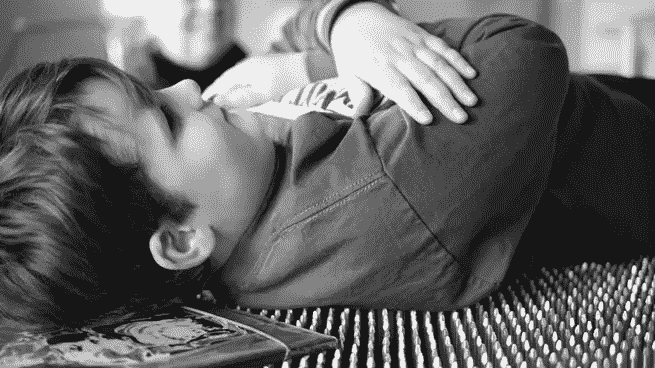

# 在无障碍设计中提升游戏的 5 种方法

> 原文：<https://www.sitepoint.com/5-ways-lift-game-accessible-design/>

在过去的几年里,“包容”这个词已经在整个设计行业广为流传。无论是公司文化、媒体、邻里还是政治，我们都希望能够看到自己的影子。

如果你和我一样，你就不会完全符合社会生活复选框中的一两个类别。我们都希望受到欢迎，我们的声音被听到，最重要的是，我们的差异得到承认。

说到产品，也没什么不同。设计处于不断变化的状态，并不断努力满足每个人的需求。

然而，产品设计的一个似乎被忽视的方面是，对于那些需要的人来说，需要更多的易访问性特征。更多的辅助功能导致更少的孤立和忽略残疾用户的子集。包容不仅为我们所有人创造了一个更美好的社会，还鼓励我们设计反映我们自身的产品。

所以，这里有五种方法可以让无障碍设计做得更好。

## 1.因不舒服而变得舒服

(或者，如何问你害怕问的问题。)

<small>照片:[奥斯柯克](https://www.flickr.com/photos/aukirk/14015754422)</small>

问我们(残疾人群体，我碰巧患有 erbs 麻痹，使我右臂的使用和运动受到限制)发生了什么，我们的需求可能是什么，以及我们如何驾驭我们周围的世界，有时会令人不舒服。然而，为了确保产品能够给那些身体可能不完全健康的用户提供最好的体验，我们作为设计师必须愿意走出我们的舒适区，并准备好听到证明我们最初的设计忽略了最初应该被视为用户的社区的答案。

## 2.练习同理心不仅仅是为自己设计

<small>[朱莉安娜·库蒂尼奥](https://www.flickr.com/photos/ngmmemuda/4928131604)拍摄的照片</small>

为和你一样的人设计总是更容易。通常情况下，产品最初是根据与公司所有者和团队相似的用户来创建的。在早期阶段，在他们获得足够的用户之前，基于尝试和真实的设计实践的移情假设被使用，这没有错。

不利的一面是，我们最终可能会制造出模仿市场上已有产品的产品。一旦一个产品开始获得更多的曝光，我们就必须开始有意识地设计，让我们有一个更加多样化的用户群。如果我们没有一个支持它的用户群，那么我们必须开始倡导它。

## 3.忘记你所想的你所知道的

虽然移情假设可以帮助开始无障碍设计过程，但它们可能会错过区分用户需求的细微差别。在与你的用户交谈之前，忘记你经常看到和听到的叙述。每种身体和精神残疾都有不同的需求，有时他们的需求可能是交叉的。

例如，神经受损的用户可能有感觉问题，并且他们的手缺乏灵活性。因此，设计一个考虑到这一点的体验和 UI 选项是很重要的。

## 4.思考融合无障碍和现代设计的方法

这可能看起来是无障碍设计的难点，但事实并非如此。从基础开始，使用“干净”的设计。保持简单，确保你覆盖你的基础，并考虑有形和无形的残疾，如缺乏灵活性，自闭症，视觉障碍，感觉敏感，发育迟缓，听力障碍和言语障碍。

如果你想了解更多关于这些残疾的信息，disability.gov 和 CDC.gov 都是很好的资源。

记住趋势是伟大的，但它们必须很好地转化为每个人的产品。当设计易访问性时，目标是包容而不是孤立。没有人希望被视为你的“残疾用户”的代表。他们只是想成为你用户组的一部分。

## 5.实践团队融入

人们可能会认为这是理所当然的，但这并不常见。有残疾的设计师在这里。虽然我们喜欢为别人设计，但如果能为像我们这样的人设计就更好了。虽然我们不是用户，但我们确实有一些可能与用户密切相关的生活经历。我们将能够看到一些可能没有被注意到的问题，并能够以一种让用户更舒服、更诚实地说出他们需求的方式与他们交流。

无障碍设计就是带着同理心走得更远，并采取措施承认人与人之间的差异以及随之而来的困难。

对那些通常不被考虑在内的用户有更多的认识和了解，并观察产品繁荣的方式。

## 分享这篇文章