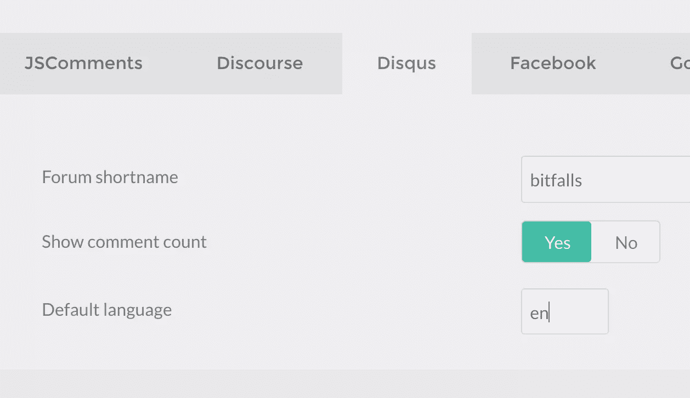

# 6 更多必须做的 Grav 调整:准备好黑客新闻流量！

> 原文：<https://www.sitepoint.com/6-more-must-do-grav-tweaks-ready-for-hacker-news-traffic/>

我们之前看了一些必要的 [Grav](https://www.sitepoint.com/8-must-have-grav-plugins-to-round-off-your-blogs-installation/) 插件来完善个人博客的安装。在这篇文章中，我们将看看一些额外的，先进的插件，通过安装超级缓存清漆来完善它，将性能提升到一个全新的水平。


## 相关页面

一旦一个博客有了足够多的帖子，留住用户就变得更加困难——因为用户发现很难找到相关或有趣的帖子来阅读，他们就会离开你的网站。[相关页面](https://github.com/getgrav/grav-plugin-relatedpages)插件对此有所帮助。

开箱即用，它包括一些合理的默认设置，用于计算文章之间的关系分数，还可以包括标题扫描、内容解析、分类法匹配等等。配置扫描后，呈现页面就是将生成的相关项目列表包含在现有模板中，如下所示:

```

    <h4>Related Posts</h4>
    
 
```

请注意，尽管默认形式很不错，但最终还是取决于您。这就是下一个插件派上用场的地方。

## 自定义 JS 和 CSS 而不扩展主题

有时候，你需要做的就是在你的页面中包含一个小的 JS 或 CSS 修改。在这种情况下，一个完整的主题扩展将是多余的。这就是[资产插件](https://github.com/getgrav/grav-plugin-assets)出现的原因。

安装后，您可以将 JS / CSS frontmatter 添加到您的页面:

```
{assets:js order:10}
custom-script.js
/blog/some-blog/post/script.js
//cdnjs.cloudflare.com/ajax/libs/1140/2.0/1140.min.js
http://somesite.com/js/cookies.min.js
{/assets}

{assets:inline_css}
h1 {color: red !important;}
{/assets} 
```

*在处理内联 CSS / JS* 时，注意前缀`inline_`

这样，您就可以在需要时轻松调整某些页面的外观——比如在组合中添加一些花哨的演示逻辑，自定义样式以防页面与您通常发布的页面类型不同，等等。

## 搜索

如果人们无法搜索并找到他们想要的，那么拥有许多帖子是没有意义的。鉴于 Grav 是一个没有数据库的平面文件系统，搜索需要的不仅仅是启动一个 MySQL `LIKE %%`查询。

简单搜索插件(这样命名纯粹是因为它使用了一种非常*简单的*搜索方法——字符串匹配)增加了这个特性。它有自己的部分搜索字段和搜索结果页面，但这些当然可以完全定制。

例如，在将`user/plugins/simplesearch/templates/simplesearch_results.html.twig`文件复制到`user/themes/cacti-swader/templates/`并对其进行修改后，我自己的博客上的实现如下所示:


### 警告

#### 过滤

为了确保它能跨所有页面工作，配置文件中的`filters`值必须为空，而不是不存在。如果你完全删除它，它将回到插件的原始配置文件的默认设置，这将结果限制在那些有`category`的`blog`。下面是我在`user/config/plugins/simplesearch.yaml`中的配置:

```
enabled: true
built_in_css: true
display_button: false
min_query_length: 3
route: /search
filters: ""
template: simplesearch_results
order:
  by: date
  dir: desc 
```

#### 表演

虽然这个插件很有效，但随着你的帖子集的增加，它的性能会下降，因为它会遍历你的每个页面，并将其内容与给定的搜索查询进行比较。帖子的长度和数量与搜索性能直接相关。一旦帖子数量达到临界质量(例如超过 1000)，建议实施更强大的搜索引擎。

#### 多语言和简单搜索

如果你通过利用多语言主题来使用语言切换器，你*可能*想要修改`langswitcher.html.twig`部分以在切换语言时忽略搜索查询字符串，因为[这个](https://github.com/getgrav/grav-plugin-simplesearch/issues/58)。使用链接问题中的说明来解决问题。当我们谈到语言的话题时，要修改字符串“Search results”和搜索结果页面上的其他值，您可以修改`user/plugins/simplesearch/language.yaml`文件，或者更改搜索结果模板中使用的字符串，以使用主题的语言文件中定义的字符串。

## 评论

要添加评论部分，我们可以使用 [JsComments 插件](https://github.com/sommerregen/grav-plugin-jscomments)。它是几个流行的注释系统的抽象，只需修改配置文件并添加适当的许可密钥或标识码，就可以立即在站点范围内安装它们。

不幸的是，Disqus 仍然是今天最可行的选择，所以让我们继续吧。

管理面板 UI 直观地提供了我们需要设置的所有选项，最显著的是主选项卡中的“启用”和“活动”选项，以及 Disqus 选项卡中的 Disqus 简称:



完成后，需要将 JS 片段注入到我们希望呈现注释的模板或页面中。这个代码片段对于所有的提供者都是相同的，当您决定使用不同的提供者时，它会自动切换出注释系统代码:

```
 
        {{ jscomments() }}
     
```

下面是我博客上的实现方式:


### 与官方评论不同

还有一个[官方评论插件](https://github.com/getgrav/grav-plugin-comments)，它提供本地评论功能，并将评论保存在本地文件中，但它缺少一些关键功能(参见自述文件中的列表)，并且它是基于平面文件的，而不是基于 JS 的，这意味着它们不能很好地与整页缓存配合。

当包含 JS 注释的页面被缓存时，无论缓存级别如何，它们都是在页面显示后异步加载的，这确保了它们总是最新的，即使您非常积极地缓存您的内容。

## 图像优化和 CDNs

任何好的博客文章都有丰富的断章取义的图片来增加可读性。但图像有时会变得非常拥挤，带宽非常宝贵——尤其是在流量高峰期间。有两个选项:CDN 和图像优化。

### 加拿大

Grav 的 [CDN 插件](https://github.com/getgrav/grav-plugin-cdn)与 MaxCDN 之类的 pullzone CDNs 配合得非常好。

pullzone CDN 是许多 CDN 提供的一种特殊类型的设置，当从您的站点请求一个文件时，它首先被复制到 CDN，然后被复制到它在世界各地的所有远程位置，然后被提供给用户。

Pullzones 通常[不是免费的](https://www.maxcdn.com/pricing/entrepreneur/)，并且需要额外的[设置](https://www.maxcdn.com/one/tutorial/how-to-create-a-pull-zone/)，加上域名注册商的一些 CNAME 记录，但是当考虑到速度提升和带宽节省时，所有的努力都是值得的。

一旦在 CDN 端完全配置好，在 Grav 中实现 pullzone 就非常简单。该插件提供了典型的`yaml`配置文件(在管理 UI 中完全可编辑):

```
enabled: true
inline_css_replace: true
pullzone: yourdomain.cdn.com
tags: 'a|link|img|script'
extensions: 'jpe?g|png|gif|ttf|otf|svg|woff|xml|js|css' 
```

上面的意思是:用`yourdomain.cdn.com`域替换所有到资源的链接，包括 CSS 中的`url()`调用，对所有`a`、`link`、`img`和`script`标签中列出的所有`extensions`做同样的事情。这有效地使 CDN 自动服务于所有静态资产。

对于你*不想【CDNed 的资产，也有一个 [`nocdn`模式](https://github.com/getgrav/grav-plugin-cdn#forcing-local-links)。*

### 图像优化

尽管 CDN 可以高效地远距离提供资产服务，但您*可能*也对优化您的映像和减少它们的文件大小感兴趣。相当具体的 [optimus 插件](https://github.com/getgrav/grav-plugin-optimus)与 [Optimus](https://optimus.io/en) 图像优化服务相结合。

Optimus 可以说是更实惠的服务，个人项目每年 19 美元，但它缺乏 CDN 的地理多样性，只能处理图像。也就是说，这也可以节省一些惊人的带宽。

安装后，Optimus 会自动激活，并将所有要处理的图像发送到服务器。有两件事要记住:

*   图像的初始加载会很慢，因为 Optimus 需要时间来处理它们并把它们发送回来
*   这些图像将被保存并缓存在本地(T1)，然后返回到你的服务器(T2，T3)，所以仍然是你(T4，T5)在为它们服务。

理想的方法是使用 Optimus 来优化图像，然后将这些图像转发到 CDN pullzone，从而将静态资产的带宽减少到接近 0%，但总的来看，每年的成本大约增加 100 美元。

不过，还有一种方法可以超级缓存你的网站，而且是免费的。

## 用清漆缓存

作为最后的超级优化步骤，我们将利用 [Varnish](https://www.sitepoint.com/getting-started-with-varnish/) 、*反向代理服务器*，它可以在任意长的时间内缓存完整的页面，并非常非常快速地提供服务。它保护您的服务器免受流量高峰的影响，并为其他进程和站点节省服务器资源。

用`sudo apt-get install varnish`之类的东西安装后，我们可以修改一些设置文件。`/etc/default/varnish`中 DAEMON_OPTS 的默认值实际上很好，因为它是默认的:

```
DAEMON_OPTS="-a :6081  
             -T localhost:6082  
             -f /etc/varnish/default.vcl  
             -S /etc/varnish/secret  
             -s malloc,256m" 
```

*注意:在我们的[原厂清漆贴](https://www.sitepoint.com/getting-started-with-varnish/)* 中找到这些值

另一个需要注意的文件是`/etc/varnish/default.vcl`，以及它的`backend`值。

```
backend default {
    .host = "127.0.0.1";
    .port = "8080";
} 
```

端口应该更改为常规服务器的端口，主机应该重命名为服务器配置中定义的服务器主机名。对于我在本地开发期间的例子，它看起来像这样:

```
backend default {
    .host = "test.app";
    .port = "80";
} 
```

为此，运行开发站点的服务器的`/etc/hosts`文件需要有`127.0.0.1 test.app`条目，**和**你需要有这个名为`test.app`的特定站点的服务器配置，如下所示:

```
server {

    listen 80;
    listen 443 ssl;

    server_name test.app;

    ... 
```

现在，这些文件的组合确保了当访问页面`http://test.app:6081`时，Varnish 实际上从`http://test.app:80`获取内容，保存它，并将其转发给浏览器。

这同样适用于实时服务器，但显然它们在域名上会有所不同。

生产部署包括以下内容:

*   将 Nginx / Apache 的端口改为某个深奥的东西(9123)
*   将`/etc/varnish/default.vcl`中的后端端口更改为该端口
*   将上光液前端端口更改为 80

一旦完成，你就成功地运行了一个 Varnish-powered 超级缓存站点，并且你已经为那些黑客新闻/ Reddit 流量高峰做好了准备！

## 结论

正如你所看到的，Grav(以及围绕它)可以做很多事情，我们甚至还没有看到完全定制的插件或主题——我们将在不久的将来做一些事情。

有了这篇文章中介绍的设置，以及之前[列表](https://www.sitepoint.com/8-must-have-grav-plugins-to-round-off-your-blogs-installation/)中的插件，你的博客已经 100%准备好了。

你给格拉夫试过了吗？你觉得我们在这篇文章中的建议怎么样？你会采取不同的方法吗？让我们知道！

## 分享这篇文章