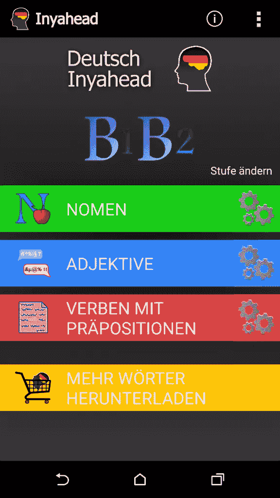
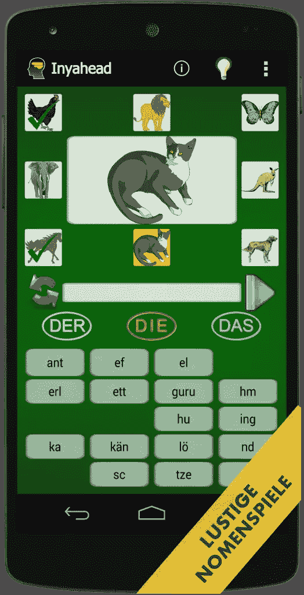
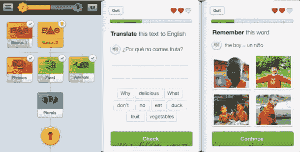

# 创建语言学习应用程序的 6 个技巧

> 原文：<https://www.sitepoint.com/6-tips-creating-language-learning-app/>

无论是为了国际旅行、商业往来还是浪漫关系，在我们的全球社会中，我们许多人都发现自己需要学习一门新语言。

语言应用很重要， [Duolingo](https://www.duolingo.com/) 于 2013 年被授予[苹果年度应用](http://www.usatoday.com/story/tech/columnist/talkingtech/2013/12/17/duolingo-apples-iphone-app-of-the-year/4042469/)，2014 年被授予[Google Play](https://play.google.com/store/apps/collection/promotion_3000f13_best_of_2014?hl=en=)。下载次数超过 1000 万次的[罗塞塔石碑](https://play.google.com/store/apps/details?id=air.com.rosettastone.mobile.CoursePlayer)同样受欢迎。

我是一名生活在德国的澳大利亚侨民，每天都在与语言斗争。在这篇文章中，我将讨论语言应用程序 UX，使用应用程序学习语言的一些更广泛的问题，以及对语言应用程序开发者的采访。希望这对任何为成人用户开发教育应用的人都有用。

## 语言课程的损耗程度很高

许多人满怀热情开始学习第二语言，结果却没能去上课，完成作业，最终辍学。历史上，语言课程的流失率[很高](http://backseatlinguist.com/blog/wp-content/uploads/2012/01/Berlitz_Tape.pdf)，基于[软件的课程遭遇同样的命运也就不足为奇了。2008 年，杰夫·麦克奎蓝利用](http://backseatlinguist.com/blog/?p=135)[“磨损”](http://backseatlinguist.com/blog/wp-content/uploads/2012/01/Berlitz_Tape.pdf)方法来确定人们通过在公共图书馆借阅的语言学习书籍取得了多大进步。他发现普通读者阅读每本书的比例不到 20%。一项对 Duolingo 西班牙语课程的研究发现，大多数学生在学习不到两个小时后就退出了。

### 解决办法

吸引那些离开的用户。多林戈从未问过我为什么离开。对我来说有几个原因，从无聊到需要更多的语法知识。我发现翻译中有一些错误，并且缺少我认为有用的口语表达。我询问了我的朋友圈子(因为我知道很多外国人)，每个人在 Duolingo 呆的最长时间是 6 个月。我问人们为什么，普遍的回答是需要更多面对面的支持、语法和对更口语化语言的渴望。两个完全忘记他们已经下载了它，并很快失去了兴趣。

## 学习语言很难

作为成年人，我们并不总是喜欢把闲暇时间花在那些困难的、不能给我们带来快乐的事情上。我敢肯定，比起一张语法表，大多数人更有可能在几分钟之内检查他们的脸书状态。在其网站上，Duolingo 有一个“沉浸实践”板块，作为建立社区和保持兴趣手段。在这里，您可以阅读、翻译、编辑或投票表决其他用户上传的待翻译文档。虽然感觉很好，但这样做所需的语言能力远远超出了大多数初学者。

### 解决办法

与初学者和高级用户以及他们的特定需求进行交流。我可以作为一个初学者说，我知道我不是唯一一个发现儿童书籍、食谱和超市手册是学习德语的有用手段的学习者，但我从未见过一个应用程序包含这些类型的材料。它们包含更少的文本，可以适应不同的屏幕尺寸。

## 通过应用程序学习语言缺乏可信度

虽然人们在大学阶段学习语言的比率已经下降，但是仍然需要可靠的语言学费。研究表明，一个初学西班牙语的人平均要花 [26 到 49 个小时学习【Duolingo 来覆盖西班牙语第一个大学学期的材料。](http://static.duolingo.com/s3/DuolingoReport_Final.pdf)

### 解决办法

考虑一系列受众的需求。这些人可能包括儿童、外籍人士、商人和不同教育水平的人。自 2012 年起，詹姆士大学通过 T2 罗塞塔石碑在线提供西班牙语课程。虽然在线语言课程与实时课堂互动值得讨论，但语言应用开发者有机会关注一系列受众。

## 一款语言应用无法满足所有人的需求

我认为人们对语言应用程序失去兴趣的原因之一是当应用程序不再有帮助或吸引力时。我采访了保罗·金，他是 in ahead T1 的创始人，这是一款有英语和德语版本的应用程序，部分是词汇训练器，部分是单词片段游戏。这个想法源于抽认卡，一种语言学习者的常用工具。我自己，有第一手的经验，为我需要学习和记忆的单词制作自己的抽认卡，但通常，抽认卡被整理好，永远不会再被看到，直到我的桌子被清理干净。保罗强调，他的应用程序是用来学习书面词汇的，而不是用来说和听的。我打开应用程序，首先被要求用德语识别动物，除非我去动物园，否则这对我没什么用。

### 解决办法

为用户创建一种方法来使用你的工具来响应他们的特定需求。例如，Paul 已经用下一个版本的 InYaHead 创建了一个解决方案。这将是把你自己的话添加到抽认卡的能力。这是我会发现有用的东西，因为我有在日常生活中应该使用的单词，但我总是忘记。虽然我还没有到那一步，但保罗的应用程序包含了一些习惯用法，对我们这些寻求不太正式的语言的人来说很有用。考虑一个句子，比如“你热吗？”。在英语中，根据上下文和对话中的人，它可以有多种含义。

## 学习语言很无聊

即使是动画文字游戏也会很快变得无聊。

### 解决办法

语言是身临其境的，它的许多形式可以成为语言学习的工具。一些最新和最成功的语言应用程序是那些整合了实时面对面工具的应用程序。例如 [Busuu](https://itunes.apple.com/us/app/learn-french-spanish-portuguese/id379968583?mt=8) 可以让用户学习单词和短语，然后通过集成的视频聊天应用程序和点对点文本纠正功能与母语人士练习。 [Linqapp](http://www.linqapp.com/) 使用户能够通过文本、图片或音频提出任何问题，并努力“将母语者放入你的口袋”。对于那些既想学习又想回馈社会的人来说，[汇接语言交换](https://itunes.apple.com/us/app/tandem-language-exchange/id959001619?mt=8)是实现这一目标的好方法。

我曾经在一个社区中心工作，那里的难民可以在大厅对面的房间里学习英语。一位老师是热情的歌手，他们经常通过唱歌来学习。《Do Wah Diddy》特别受欢迎。我正在等待一个应用程序，其中纳入了[欧洲电视](http://www.eurovision.tv/page/timeline)的歌曲。

## 语言应用很难营销

我和保罗谈了他营销应用程序的经历。作为一名语言学习者，他的原型在真实的语言学习教室中接受了测试。但在市场营销方面，他却举步维艰。尽管脸书是接触语言学习者(包括外籍人士)的一个很好的免费途径，但在这类群体中做广告正变得越来越不受欢迎。

### 解决办法

继续去你的用户所在的地方。如果你有付费应用，可以考虑在外国人博客上进行联盟营销。联络语言教师和翻译(他们经常与外国人和学习者联系)。对于那些生活在国外的人来说，可以考虑国际公司、外籍人士商会和其他专业网络协会，比如国际组织。

> “作为一名开发人员，但不是语言学家，我不知道从哪里开始”

来自 in ahead 的 Paul 为应用程序开发人员提供了一些具体和通用的提示:

*   寻求母语人士的帮助。
*   练好编程。
*   开始使用相对布局，让一切都基于百分比。
*   想想响应式设计。
*   保持一切模块化和分离，这样你就可以重用组件，只需要在一个地方进行修改。

## 摘要

我希望考虑创建一个以教育为重点的应用程序的人会发现这篇文章很有用。如果你有任何自己的建议或经验，请在下面的评论中告诉我。

## 分享这篇文章