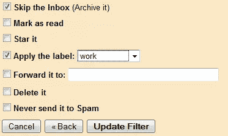

# 从电脑故障中幸存下来的 8 个技巧

> 原文：<https://www.sitepoint.com/8-tips-for-surviving-pc-failure/>

我在电脑方面很幸运。它们已经在我面前死去，但只是在它们活了很长时间之后，我用更好的东西代替了它们。我的主电脑从未爆炸过……直到上周。

丢失一台电脑可能会造成精神创伤。我们在上面储存我们的生活:联系方式、财务账户、家庭照片、音乐收藏、视频等等。这里有 8 个技巧可以帮助你在电脑崩溃中幸存下来…

**1。备份**
如果你从未备份过你的数据，那就停下一切，现在就备份吧！外置硬盘和 <acronym title="Network Attached Storage">NAS</acronym> 硬盘便宜又好用。

尝试自动化您的备份过程，或使其尽可能简单。有几个免费的 Windows 应用程序可以提供帮助，包括 [SyncBack 免费软件](http://www.2brightsparks.com/syncback/sbse.html)、 [CloneZilla](http://www.clonezilla.org/) 、 [Allway Sync](http://allwaysync.com/) 、 [ezback-it-up](http://www.rdcomp.net/ezbackitup/) 或 [FullSync](http://fullsync.sourceforge.net/) 。

**2。保留一台备用电脑**
一台备用电脑至关重要。它可能很旧或者动力不足，但是在你寻找替代品的时候，它会让你继续工作。我靠一台笨重的 8 年旧 PC 和一台上网本生存下来——这并不总是一次愉快的经历，但它让我能够与客户保持联系。

**3。购买硬盘外壳**
即使你的电脑无法修复，硬盘也可能完好无损。移除设备、将其插入机箱并创建 USB 硬盘相对简单。这允许您检索尚未备份的数据，但不要将此作为唯一的备份方法。

**4。使用在线同步**
在线存储对你所有的数据来说不太可能是实用的，但它肯定可以用于重要文件，如密码数据库、重要账户或当前文档。我个人可以推荐[Dropbox](http://getdropbox.com/)；它可以在 Windows、Mac 和 Linux 上运行，而且运行良好。

**5。安装 Foxmarks**
[Foxmarks](http://www.foxmarks.com/)将你的火狐书签备份到中央服务器上，这样它们就可以在线访问或者与其他电脑同步。没有丢失 15 年的网站链接是一种解脱。

**6。自动转发您的电子邮件**
电子邮件可以立即转发到 GMail 或任何其他网络邮件帐户。这允许您从任何地方检查消息，并提供您可能已经丢失的消息的历史记录。

您可以在 GMail 中定义过滤器，以便对转发的邮件进行标记和存档，而不是留在收件箱中。点按“设置”、“过滤器”，然后点按“创建新过滤器”。在“收件人:”框中，输入您的电子邮件地址或域名。最后，单击“下一步”并定义您希望如何处理邮件:

**7。将你的工作转移到云中**
尽管出现了一些[引人注目的失败](http://ma.gnolia.com/)，云计算仍将存在，大多数应用程序将比你自己的个人电脑更有弹性。诸如 [Google Docs](http://docs.google.com/) 、 [Zoho Office](http://www.zoho.com/) 、 [Buzzword](http://buzzword.acrobat.com/) 和 [ThinkFree](http://product.thinkfree.com/office) 等在线应用为桌面套件提供了可行的替代方案。

**8。使用“免安装”应用程序**
在一台新电脑上重新安装你的基本程序一点也不好玩。但是，许多应用程序提供了 ZIP、USB 驱动器或 XCOPY 部署版本，可以通过将文件复制到适当的位置并创建快捷方式来安装。如果配置文件也保存在本地，您的整个环境可以在几秒钟内可用。

你经历过灾难性的电脑故障吗？你是如何应对的？你会做任何不同的事情吗？

## 分享这篇文章