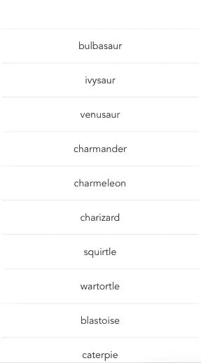

# Vue 路由器初学者指南

> 原文：<https://www.sitepoint.com/a-beginners-guide-to-vue-router/>

在本教程中，我们将了解如何使用 Vue 路由器在 Vue 应用中实现路由。因此，我们可以进行实际操作，我们将使用 Vue 和 Vue 路由器构建一个简单的 Pokedex 应用程序。

具体来说，我们将涵盖以下内容:

*   设置路由器
*   路线参数
*   声明式和编程式导航
*   嵌套路由
*   404 页

每一个允许创建单页面应用程序的 JavaScript UI 框架都需要一种方法来将用户从一个页面导航到另一个页面。所有这些都需要在客户端进行管理，方法是将页面上当前显示的视图与地址栏中的 URL 同步。在 Vue 世界中，管理这类任务的[官方库]是 Vue Router。

和以往一样，本教程的代码可以在 GitHub 上找到。

## 先决条件

以下是必需的，以便您可以充分利用本教程:

*   HTML、CSS、JavaScript 和 Vue 的基础知识。如果您知道如何使用 Vue 在页面上呈现某些内容，您应该能够理解。关于 API 的一些知识也会有所帮助。
*   安装在您机器上的 [Node.js](https://www.sitepoint.com/quick-tip-multiple-versions-node-nvm/) 和 [Vue CLI](https://cli.vuejs.org/) 。我们将在本教程中使用 Vue 3，因此请确保更新 Vue CLI。

## 应用概述

我们将建立一个 Pokedex 应用程序。它将有三页:

*   **口袋妖怪列表页面**。这是默认页面，列出了所有的 151 个原始口袋妖怪。

    

*   **口袋妖怪页面**。这是我们显示基本细节的地方，比如类型和描述。

    

*   **口袋妖怪详情页**。这是我们展示进化链、能力和动作的地方。

    

## 设置应用程序

使用 Vue CLI 启动新的 Vue 应用程序:

```
vue create poke-vue-router 
```

从列出的选项中选择 Vue 3:


完成后，在项目文件夹中导航并安装我们需要的库:

```
cd poke-vue-router
npm install vue-router@4 axios 
```

请注意，我们使用的是 Vue Router 4 而不是 3，这是谷歌搜索时显示的默认结果。它在`next.router.vuejs.org`而不是`router.vuejs.org`。我们使用 Axios 向 [PokeAPI v2](https://pokeapi.co/) 发出请求。

此时，运行项目以确保默认的 Vue 应用程序正常工作是一个好主意:

```
npm run serve 
```

在您的浏览器上访问`http://localhost:8080/`，查看默认的 Vue 应用程序是否正在运行。它应该显示如下内容:


接下来，您需要添加`sass-loader`作为开发依赖项。出于本教程的目的，最好只安装我使用的相同版本。这是因为，在撰写本文时，最新版本与 Vue 3 不兼容:

```
npm install sass-loader@10.1.1 --save-dev 
```

你还需要安装`node-sass`，原因同上。最好坚持使用与我相同的版本:

```
npm install node-sass@4.14.1 --save 
```

*注意:如果以这种方式安装 Sass 对您不起作用，您还可以在使用 CLI 创建 Vue 应用程序时选择**手动选择功能**。然后，选择 **CSS 预处理器**并选择**萨斯/SCSS(带飞镖萨斯)**。*

## 创建应用程序

现在我们准备开始构建应用程序。当您继续操作时，请记住根目录是`src`文件夹。

从更新`main.js`文件开始。这是我们导入根组件`App.vue`和`router/index.js`文件的地方，我们在这里声明所有与路由相关的东西:

```
// main.js

import { createApp } from "vue";
import App from "./App.vue";
import router from "./router";

const app = createApp(App);
app.use(router);
app.mount("#app"); 
```

### 设置路由器

在`App.vue`文件中，使用 Vue 路由器提供的`router-view`组件。这是 Vue 路由器使用的最顶层组件，它为用户访问的当前路径呈现相应的组件:

```
// App.vue
<template>
  <div id="app">
    <router-view />
  </div>
</template>

<script>
export default {
  name: "App",
};
</script> 
```

接下来，创建一个新的`router/index.js`文件并添加以下内容。要创建一个路由器，我们需要从 Vue 路由器中提取出`createRouter`和`createWebHistory`。`createRouter`允许我们创建一个新的路由器实例，而`createWebHistory`创建一个 HTML5 历史，它基本上是一个[历史 API](https://developer.mozilla.org/en-US/docs/Web/API/History_API) 的包装器。当我们在页面间导航时，它允许 Vue Router 操作地址栏中的地址:

```
// router/index.js
import { createRouter, createWebHistory } from "vue-router"; 
```

在此之下，导入我们将使用的所有页面:

```
import PokemonList from "../views/PokemonList.vue"; 
```

Vue 路由器需要一个包含`path`、`name`和`component`作为其属性的对象数组:

*   这是你想要搭配的图案。在下面的代码中，我们匹配根路径。所以如果用户试图访问`http://localhost:8000`，这个模式是匹配的。
*   `name`:页面的名称。这是页面的唯一标识符，当您想从其他页面导航到此页面时，会用到它。
*   `component`:当`path`与用户访问的 URL 匹配时，要呈现的组件。

```
const routes = [
  {
    path: "/",
    name: "PokemonList",
    component: PokemonList,
  },
]; 
```

最后，通过向`createRouter`提供包含`history`和`routes`的对象来创建路由器实例:

```
const router = createRouter({
  history: createWebHistory(),
  routes,
});

export default router; 
```

这就是我们目前所需要的。您可能想知道其他页面在哪里。我们将在以后继续添加它们。现在，让我们先处理默认页面。

### 创建页面

创建一个页面并不需要任何特殊的代码。因此，如果您知道如何在 Vue 中创建自定义组件，您应该能够创建一个供 Vue 路由器使用的页面。

创建一个`views/PokemonList.vue`文件并添加下面的代码。在这个文件中，我们使用一个定制的`List`组件来呈现口袋妖怪列表。我们真正需要做的唯一事情是提供数据给`List`组件使用。一旦组件被挂载，我们就向 PokeAPI 发出请求。我们不希望列表变得太大，所以我们将结果限制在最初的 151 个口袋妖怪。一旦我们得到结果，我们简单地将它分配给组件的`items`数据。这将依次更新`List`组件:

```
<template>
  <List :items="items" />
</template>

<script> import axios from "axios";
import List from "../components/List.vue";

export default {
  name: "PokemonList",
  data() {
    return {
      items: null,
    };
  },
  mounted() {
    axios.get(`https://pokeapi.co/api/v2/pokemon?limit=151`).then((res) => {
      if (res.data && res.data.results) {
        this.items = res.data.results;
      }
    });
  },
  components: {
    List,
  },
}; </script> 
```

下面是`List`组件的代码。组件存储在`components`目录中，因此创建一个`components/List.vue`文件并添加以下内容:

```
<template>
  <div v-if="items">
    <router-link
      :to="{ name: 'Pokemon', params: { name: row.name } }"
      class="link"
      v-for="row in items"
      :key="row.name"
    >
      <div class="list-item">
        {{ row.name }}
      </div>
    </router-link>
  </div>
</template>

<script> export default {
  name: "List",
  props: {
    items: {
      type: Array,
    },
  },
}; </script>

<style lang="scss" scoped> @import "../styles/list.scss"; </style> 
```

你可以在 [GitHub repo](https://github.com/sitepoint-editors/pokedex-vue-router/blob/master/src/styles/list.scss) 中查看`styles/list.scss`文件的代码。

此时，您可以在浏览器中查看更改。除非您得到以下错误:


这是因为 Vue 正在尝试生成 Pokemon 页面的链接，但是现在还没有。Vue CLI 足够智能来警告您这一点。您可以通过使用`<div>`代替`components/List.vue`文件的模板来暂时解决这个问题:

```
<template>
  <div v-if="items">
    <div v-for="row in items" :key="row.name">{{ row.name }}</div>
  </div>
</template> 
```

有了这个，你应该可以看到口袋妖怪的列表了。记住，一旦我们添加了口袋妖怪页面，就要把它改回来。

### 声明式导航

使用 Vue Router，您可以通过两种方式进行导航:声明式导航和编程式导航。声明式导航与我们在 HTML 中处理锚标记的方式非常相似。您只需声明您希望链接导航到的位置。另一方面，编程式导航是通过显式调用 Vue Router 在执行用户操作(比如单击按钮)时导航到特定页面来实现的。

让我们快速分析一下这是如何工作的。要导航，您需要使用`router-link`组件。这需要的唯一属性是`:to`。这是一个包含您想要导航到的页面的`name`的对象，以及一个可选的`params`对象，用于指定您想要传递给页面的参数。在这种情况下，我们传递的是口袋妖怪的名字:

```
<router-link
  :to="{ name: 'Pokemon', params: { name: row.name } }"
  class="link"
  v-for="row in items"
  :key="row.name"
>
  <div class="list-item">
    {{ row.name }}
  </div>
</router-link> 
```

为了形象化这是如何工作的，你需要知道`Pokemon`屏幕使用的模式。下面是它的样子:`/pokemon/:name`。`:name`代表你传入的参数`name`。例如，如果用户想要查看皮卡丘，URL 看起来像`http://localhost:8000/pokemon/pikachu`。我们稍后会更详细地讨论这个问题。

### 路线参数

我们已经看到了如何为我们的路线匹配特定的模式，但是我们还没有经历如何传入自定义参数。我们已经通过前面的`router-link`例子简单地看到了它。

我们将使用下一页(`Pokemon`)来说明路由参数在 Vue 路由器中是如何工作的。要做到这一点，您需要做的就是在参数名前面加上冒号(`:`)。在下面的例子中，我们想传入口袋妖怪的名字，所以我们添加了`:name`。这意味着如果我们想要导航到这个特定的路线，我们需要为这个参数传入一个值。正如我们在前面的`router-link`示例中看到的，这是我们传递口袋妖怪名称的地方:

```
// router/index.js
import PokemonList from "../views/PokemonList.vue";

import Pokemon from "../views/Pokemon"; // add this

const routes = [
  {
    path: "/",
    name: "PokemonList",
    component: PokemonList,
  },
  // add this:
  {
    path: "/pokemon/:name",
    name: "Pokemon",
    component: Pokemon,
  }
] 
```

下面是`Pokemon`页面的代码(`views/Pokemon.vue`)。就像之前的 PokemonList 页面一样，我们将呈现 UI 的任务委托给一个单独的组件`BasicDetails`。当组件被挂载时，我们向 API 的`/pokemon`端点发出请求。为了获得作为路由参数传入的口袋妖怪名称，我们使用了`this.$route.params.name`。我们正在访问的属性应该与您在`router/index.js`文件中赋予参数的名称相同。这种情况下就是`name`。如果您使用`/pokemon/:pokemon_name`代替`path`，您可以使用`this.$route.params.pokemon_name`来访问它:

```
<template>
  <BasicDetails :pokemon="pokemon" />
</template>
<script> import axios from "axios";
import BasicDetails from "../components/BasicDetails.vue";

export default {
  name: "Pokemon",
  data() {
    return {
      pokemon: null,
    };
  },
  mounted() {
    const pokemon_name = this.$route.params.name;

    axios
      .get(`https://pokeapi.co/api/v2/pokemon/${pokemon_name}`)
      .then((res) => {
        const data = res.data;

        axios
          .get(`https://pokeapi.co/api/v2/pokemon-species/${pokemon_name}`)
          .then((res) => {
            Object.assign(data, {
              description: res.data.flavor_text_entries[0].flavor_text,
              specie_id: res.data.evolution_chain.url.split("/")[6],
            });

            this.pokemon = data;
          });
      });
  },
  components: {
    BasicDetails,
  },
}; </script> 
```

下面是`BasicDetails`组件(`components/BasicDetails.vue`)的代码:

```
<template>
  <div v-if="pokemon">
    
    <h1>{{ pokemon.name }}</h1>
    <div class="types">
      <div
        class="type-box"
        v-for="row in pokemon.types"
        :key="row.slot"
        v-bind:class="row.type.name.toLowerCase()"
      >
        {{ row.type.name }}
      </div>
    </div>

    <div class="description">
    {{ pokemon.description }}
    </div>

    <a @click="moreDetails" class="link">More Details</a>
  </div>
</template>

<script> export default {
  name: "BasicDetails",
  props: {
    pokemon: {
      type: Object,
    },
  },

  methods: {
    moreDetails() {
      this.$router.push({
        name: "PokemonDetails",
        params: {
          name: this.pokemon.name,
          specie_id: this.pokemon.specie_id,
        },
      });
    },
  },
}; </script>

<style lang="scss" scoped> @import "../styles/types.scss";
@import "../styles/pokemon.scss"; </style> 
```

你可以在 [GitHub repo](https://github.com/sitepoint-editors/pokedex-vue-router/blob/master/src/styles) 中查看`styles/types.scss`和`styles/pokemon.scss`文件的代码。

此时，您应该能够再次在浏览器中看到更改。您也可以将`components/List.vue`文件更新回它的原始代码，用`router-link`代替`<div>`。

### 程序导航

您可能已经注意到我们在`BasicDetails`组件中做了一些不同的事情。我们并没有真正使用`router-link`导航到`PokemonDetails`页面。相反，我们使用了一个锚元素并截取了它的点击事件。这就是[编程导航](https://next.router.vuejs.org/guide/essentials/navigation.html#programmatic-navigation)的实现方式。我们可以通过`this.$router`访问路由器。然后我们调用`push()`方法在历史堆栈上推一个新的页面。路由器会显示最上面的页面。这种方法允许当用户点击浏览器的后退按钮时导航回上一页，因为点击它只是将当前页面“弹出”到历史堆栈的顶部。这个方法接受一个包含`name`和`params`属性的对象，所以这与您在`router-link`中传递给`to`属性的内容非常相似:

```
methods: {
  moreDetails() {
    this.$router.push({
      name: "PokemonDetails",
      params: {
        name: this.pokemon.name,
        specie_id: this.pokemon.specie_id,
      },
    });
  },
}, 
```

### 嵌套路由

接下来，更新路由器文件以包含 Pokemon 详细信息页面的路径。这里，我们使用嵌套路由来传入多个自定义参数。在本例中，我们传入了`name`和`specie_id`:

```
import Pokemon from "../views/Pokemon";

import PokemonDetails from "../views/PokemonDetails"; // add this

const routes = [
  // ..
  {
    path: "/pokemon/:name",
    // ..
  },

  // add these
  {
    path: "/pokemon/:name/:specie_id/details",
    name: "PokemonDetails",
    component: PokemonDetails,
  },
]; 
```

下面是`PokemonDetails`页面(`views/PokemonDetails.vue`)的代码:

```
<template>
  <MoreDetails :pokemon="pokemon" />
</template>
<script>
import axios from "axios";
import MoreDetails from "../components/MoreDetails.vue";

export default {
  name: "PokemonDetails",
  data() {
    return {
      pokemon: null,
    };
  },
  mounted() {
    const pokemon_name = this.$route.params.name;

    axios
      .get(`https://pokeapi.co/api/v2/pokemon/${pokemon_name}`)
      .then((res) => {
        const data = res.data;

        axios.get(`https://pokeapi.co/api/v2/evolution-chain/${this.$route.params.specie_id}`)
        .then((res) => {
          let evolution_chain = [res.data.chain.species.name];

          if (res.data.chain.evolves_to.length > 0) {
            evolution_chain.push(
              res.data.chain.evolves_to[0].species.name
            );

            if (res.data.chain.evolves_to.length > 1) {
              const evolutions = res.data.chain.evolves_to.map((item) => {
                return item.species.name;
              }
            );

            evolution_chain[1] = evolutions.join(" | ");
          }

          if (
            res.data.chain.evolves_to[0].evolves_to.length >
            0
          ) {
            evolution_chain.push(res.data.chain.evolves_to[0].evolves_to[0].species.name);
          }

            Object.assign(data, {
              evolution_chain,
            });
          }

          this.pokemon = data;
        });
    });
  },
  components: {
    MoreDetails,
  },
};
</script> 
```

下面是`MoreDetails`组件(`components/MoreDetails.vue`)的代码:

```
<template>
  <div v-if="pokemon">
    <h1>{{ pokemon.name }}</h1>

    <div v-if="pokemon.evolution_chain" class="section">
      <h2>Evolution Chain</h2>
      <span v-for="(name, index) in pokemon.evolution_chain" :key="name">
        <span v-if="index">-></span>
        {{ name }}
      </span>
    </div>

    <div v-if="pokemon.abilities" class="section">
      <h2>Abilities</h2>

      <div v-for="row in pokemon.abilities" :key="row.ability.name">
        {{ row.ability.name }}
      </div>
    </div>

    <div v-if="pokemon.moves" class="section">
      <h2>Moves</h2>
      <div v-for="row in pokemon.moves" :key="row.move.name">
        {{ row.move.name }}
      </div>
    </div>
  </div>
</template>

<script>
export default {
  name: "MoreDetails",
  props: {
    pokemon: {
      type: Object,
    },
  },
};
</script>

<style lang="scss" scoped>
@import "../styles/more-details.scss";
</style> 
```

您可以在 [GitHub repo](https://github.com/sitepoint-editors/pokedex-vue-router/blob/master/src/styles/more-details.scss) 上查看`styles/more-details.scss`文件的内容。

在这一点上，你可以点击任何口袋妖怪的名字，并查看单个口袋妖怪的详细信息。您可能需要重新启动服务器才能看到更改。

### 404 页

我们已经添加了所有页面的代码。但是，如果用户在浏览器的地址栏中输入了无效的 URL，会发生什么呢？在这些情况下，它会简单地出错或者根本不显示任何内容。我们需要添加一种方法来拦截这些请求，这样我们就可以显示“404 not found”页面。

为此，打开路由器文件并导入`NotFound`页面:

```
import NotFound from "../views/NotFound"; 
```

路径的优先级基于它们在路径数组中的添加顺序。这意味着首先添加的是第一个与用户在地址栏中输入的 URL 匹配的。所以 404 页面的模式必须最后添加。

在`routes`数组中，添加以下内容:

```
const routes = [
  // ..
  {
    path: "/pokemon/:name/:specie_id/details",
    // ..
  },

  // add this
  {
    path: "/:pathMatch(.*)*",
    name: "NotFound",
    component: NotFound,
  },
]; 
```

这个`path`看起来眼熟吗？我们使用一个名为`pathMatch`的自定义参数来匹配输入的任何 URL。因此，如果用户输入`http://localhost:8000/hey`或`http://localhost:8000/hey/jude`，就会呈现出`NotFound`页面。

这一切都很好。但是如果包罗万象的模式上面的模式实际上是匹配的，会发生什么呢？例如:

*   `http://localhost:8000/pokemon/someinvalidpokemon`
*   `http://localhost:8000/pokemon/someinvalidpokemon/99999/details`

在这些情况下，总括模式不匹配，所以我们需要一种方法来拦截这样的请求。

这类请求的主要问题是，用户假设某个口袋妖怪或物种 ID 存在，但它并不存在。唯一的检查方法是有一个有效的口袋妖怪列表。在您的 routes 文件中，导入有效口袋妖怪的列表:

```
import NotFound from "../views/NotFound";

import valid_pokemon from "../data/valid-pokemon.json"; // add this 
```

你可以在 [GitHub repo](https://github.com/sitepoint-editors/pokedex-vue-router/blob/master/src/data/valid-pokemon.json) 上找到这个文件。

为了拦截这类请求，Vue 路由器提供了[导航守卫](https://next.router.vuejs.org/guide/advanced/navigation-guards.html#navigation-guards)。可以把它们想象成导航过程的“钩子”,它允许你在 Vue Router 导航到某个页面之前或之后执行某些操作。我们将只检查在导航完成之前执行的那个，因为这允许我们在导航到另一个页面的条件不匹配时重定向到该页面。

为了在导航完成之前挂钩到当前请求，我们在`router`实例上调用`beforeEach()`方法:

```
const router = createRouter({
  // ..
});

router.beforeEach(async (to) => {
  // next: add the condition for navigating to the 404 page
}); 
```

Vue 路由器向它传递两个参数:

*   `to`:目标路线位置
*   `from`:当前路线位置

每一个都包含这些属性。我们感兴趣的是[参数](https://next.router.vuejs.org/api/#params)，因为它包含用户在 URL 中传递的任何参数。

我们的情况是这样的。我们首先检查我们想要检查的参数是否存在。如果是，我们继续检查它是否有效。第一个条件与页面`Pokemon`匹配。我们使用前面的`valid_pokemon`数组。我们将其与`to.params.name`进行比较，后者包含用户传递的口袋妖怪的名称。另一方面，对于`PokemonDetails`页面，第二个条件匹配。这里我们检查物种 ID。因为我们只想匹配原来的 101 口袋妖怪，任何大于那个的 ID 都被认为是无效的。如果它符合这些条件中的任何一个，我们只需返回到 404 页面的路径。如果条件不匹配，它将导航到最初打算导航到的位置:

```
if (
  to.params &&
  to.params.name &&
  valid_pokemon.indexOf(to.params.name) === -1
) {
  return "/404";
}

if (
  (to.params &&
    to.params.name &&
    to.params.specie_id &&
    valid_pokemon.indexOf(to.params.name) === -1 &&
    to.params.specie_id < 0) ||
  to.params.specie_id > 101
) {
  return "/404";
} 
```

下面是 404 页面的代码(`views/NotFound.vue`):

```
<template>
  <h1>404 Not Found</h1>
</template>
<script>
export default {
  name: "Not Found",
};
</script>
<style lang="scss" scoped>
@import "../styles/notfound.scss";
</style> 
```

你可以在 [GitHub repo](https://github.com/sitepoint-editors/pokedex-vue-router/tree/master/src/styles/notfound.scss) 上查看`styles/notfound.scss`文件的代码。

至此，app 完成！你可以尝试访问无效页面，它会返回一个 404 页面。

## 结论

就是这样！在本教程中，您学习了使用 Vue 路由器的基础知识。像设置路由器、传递自定义参数、在页面间导航和实现 404 页面等事情会给你带来很大的帮助。如果您想从这里获得一些指导，我建议您探索以下主题:

*   [将属性传递给路径组件](https://next.router.vuejs.org/guide/essentials/passing-props.html):允许你将视图组件从路径参数中分离出来。这提供了一种用可以从组件访问的属性交换路线参数的方法。这样你可以在任何没有`$route.params`的地方使用你的组件。
*   [过渡](https://next.router.vuejs.org/guide/advanced/transitions.html):用于动画显示页面之间的过渡。
*   [延迟加载](https://next.router.vuejs.org/guide/advanced/lazy-loading.html):这更多的是一种性能提升，这样捆绑器就不会在一个文件中编译所有页面的代码。相反，它会延迟加载它，这样浏览器只在需要的时候才下载特定页面的代码。

## 分享这篇文章