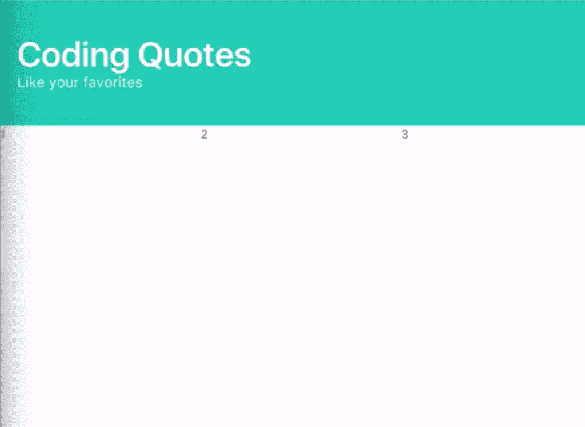
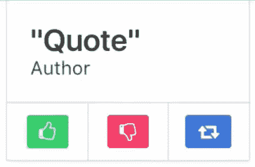

# 和布尔玛一起在 6 分钟内学会一个 CSS 框架

> 原文：<https://www.sitepoint.com/a-css-framework-in-6-minutes-with-bulma/>

[https://www.youtube.com/embed/MchBPICewgs?ecver=2](https://www.youtube.com/embed/MchBPICewgs?ecver=2)

在本教程中，我们将开始学习布尔玛，一个基于 Flexbox 的现代 CSS 框架。为了获得最佳效果，请跟随视频结尾的[开源工艺](http://codepop.com/open-sourcecraft/?utm_source=sitepoint&utm_medium=article&utm_campaign=open_sourcecraft_bulma&utm_content=top)。如果你想知道为什么你应该关心布尔玛，看看这个视频[。](https://www.youtube.com/watch?v=bCTdyfHfUaI&feature=youtu.be)

我们将建立一个编码报价页面，利用布尔玛的用户界面组件，包括英雄横幅，专栏，卡片，按钮等。


首先，让我们安装布尔玛。您可以从命令行使用 **npm install 布尔玛**快速完成这项工作，或者您可以像我一样使用下面的代码行导入项目。第一行导入了字体 Awesome 库，所以我们可以使用它们的图标。

```
<link rel="stylesheet" href="https://maxcdn.bootstrapcdn.com/font-awesome/4.7.0/css/font-awesome.min.css"/>

<link rel="stylesheet" href="https://cdnjs.cloudflare.com/ajax/libs/bulma/0.5.1/css/bulma.min.css"/>
```

接下来，我们将用一个 section 元素和布尔玛类`hero`创建一个[英雄横幅](http://bulma.io/documentation/layout/hero/?utm_source=sitepoint&utm_medium=article&utm_campaign=open_sourcecraft_bulma)，并用类`hero-body`创建一个 div。

```
<section class="hero">
   <div class="hero-body"></div>
</section>
```

然后我们将添加一些修改器类，用`is-primary`赋予横幅我们设计的原色，并用`is-medium`调整它的大小。布尔玛的类名和修饰符可读性很强，而且相当字面。

```
<section class="hero is-primary is-medium">
  <div class="hero-body"></div>
</section>
```

在我们的`hero-body` div 中，我们将为我们的`h1`和`h2`添加一个`container` div，我们将分别将其样式化为`title`和`subtitle`。给标题一个`is-1`修饰符会使它变大。

```
<div class="container">
     <h1 class="title is-1">
        Coding Quotes
     </h1>
     <h2 class="subtitle">
        Like your favorites
     </h2>
 </div>
```


这就完成了我们网站的顶部，现在让我们建立一些列。首先，我们将`section`它们关闭，然后我们将为它们制作一个`container`。

```
<section class="section">
    <div class="container"></div>
</section>
```

在我们的`container`中，我们将把我们的`columns`父 div。

```
<section class="section">
    <div class="container">
        <div class="columns"></div>
    </div>
</section>
```

然后我们将把三个`column`div 作为孩子放在里面。无论是水平还是垂直观看(在手机上)，它们都会自动分成三部分。布尔玛天生反应灵敏。

```
<section class="section">
    <div class="container">
        <div class="columns">
            <div class="column">1</div>
            <div class="column">2</div>
            <div class="column">3</div>
        </div>
   </div>
 </section>
```



在每一列中，我们将插入一个布尔玛`card`，它的`card-content`将是一个`title`和`subtitle`，用于引用和引用的程序员。

```
<div class="card">
    <div class="card-content">
        <h2 class="title">"Quote"</h2> 
        <h3 class="subtitle">Programmer</h3>
    </div>
</div>
```

为了制作我们喜欢、不喜欢和分享的按钮，我们需要一个`card-footer`，然后是三个`card-footer-items`，每个`button`住一个。为了给按钮上色，我们将添加布尔玛修改器，把它们变成绿色(`is-success`)、红色(`is-danger`)和蓝色(`is-info`)。在按钮中，我们将使用 Font Awesome 的类来获得一个竖起大拇指、竖起大拇指和共享图标。

```
<div class="card">
    <div class="card-content">
        <h2 class="title">"Quote"</h2> 
        <h3 class="subtitle">Programmer</h3>
    </div>
    <footer class="card-footer">
        <span class="card-footer-item">
            <a href="#" class="button is-success">
                <i class="fa fa-thumbs-o-up"></i>
            </a>
        </span>
        <span class="card-footer-item"> 
            <a href="#" class="button is-danger">
                <i class="fa fa-thumbs-o-down"></i>
            </a>
        </span>
        <span class="card-footer-item">
            <a href="#" class="button is-info">
                <i class="fa fa-retweet"></i>
            </a>
        </span>
    </footer>
</div>
```



既然我们已经成功地制作了一个列，我们可以简单地复制并粘贴那个**列的**代码来制作我们的三个列，我们的站点就准备好了。

```
<section class="section"> 
    <div class="container"> 
        <div class="columns">

            <div class="column">
                <div class="card">
                    <div class="card-content">
                        <h2 class="title">"Quote"</h2> 
                        <h3 class="subtitle">Programmer</h3>
                    </div>
                    <footer class="card-footer">
                        <span class="card-footer-item">
                            <a href="#" class="button is-success">
                                <i class="fa fa-thumbs-o-up"></i>
                            </a>
                        </span>
                        <span class="card-footer-item"> <!-- these will automatically resize just like columns -->
                            <a href="#" class="button is-danger">
                                <i class="fa fa-thumbs-o-down"></i>
                            </a>
                        </span>
                        <span class="card-footer-item">
                            <a href="#" class="button is-info">
                                <i class="fa fa-retweet"></i>
                            </a>
                        </span>
                    </footer>
                </div>
            </div>

            <div class="column">
                <div class="card">
                    <div class="card-content">
                        <h2 class="title">"Quote"</h2>
                        <h3 class="subtitle">Programmer</h3>
                    </div>
                    <footer class="card-footer">
                        <span class="card-footer-item">
                            <a href="#" class="button is-success">
                                <i class="fa fa-thumbs-o-up"></i>
                            </a>
                        </span>
                        <span class="card-footer-item">
                            <a href="#" class="button is-danger">
                                <i class="fa fa-thumbs-o-down"></i>
                            </a>
                        </span>
                        <span class="card-footer-item">
                            <a href="#" class="button is-info">
                                <i class="fa fa-retweet"></i>
                            </a>
                        </span>
                    </footer>
                </div>
            </div>

            <div class="column">
                <div class="card">
                    <div class="card-content">
                        <h2 class="title">"Quote"</h2>
                        <h3 class="subtitle">Programmer</h3>
                    </div>
                    <footer class="card-footer">
                        <span class="card-footer-item">
                            <a href="#" class="button is-success">
                                <i class="fa fa-thumbs-o-up"></i>
                            </a>
                        </span>
                        <span class="card-footer-item">
                            <a href="#" class="button is-danger">
                                <i class="fa fa-thumbs-o-down"></i>
                            </a>
                        </span>
                        <span class="card-footer-item">
                            <a href="#" class="button is-info">
                                <i class="fa fa-retweet"></i>
                            </a>
                        </span>
                    </footer>
                </div>
            </div>

        </div>
    </div>
</section>
```


如果你有兴趣了解更多关于布尔玛的信息，请查看 Bulma.io 上的[示例站点](http://bulma.io/made-with-bulma/?utm_source=sitepoint&utm_medium=article&utm_campaign=open_sourcecraft_bulma)和[文档](http://bulma.io/documentation/overview/start/?utm_source=sitepoint&utm_medium=article&utm_campaign=open_sourcecraft_bulma)，如果想了解更多类似的内容，请访问[开源平台](http://codepop.com/open-sourcecraft/?utm_source=sitepoint&utm_medium=article&utm_campaign=open_sourcecraft_bulma&utm_content=bottom)。

## 分享这篇文章