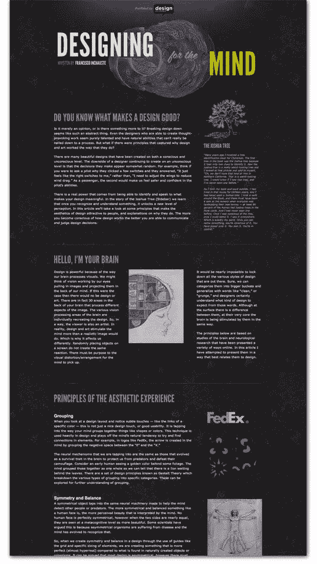
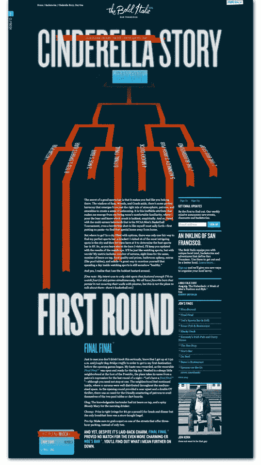
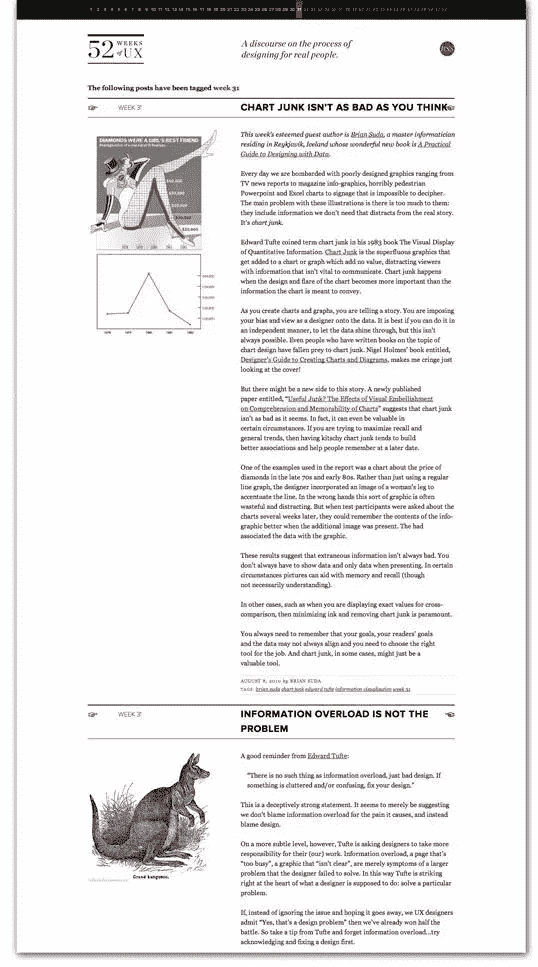
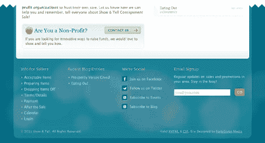
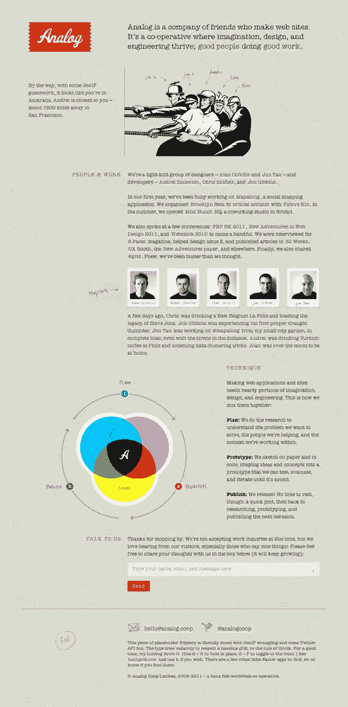

# 一些设计趋势

> 原文：<https://www.sitepoint.com/a-few-design-trends/>

如果你被众多可用的资源弄得不知所措，甚至考虑从停尸房档案中寻找灵感都超出了你的能力，花几分钟浏览这些网站。不要只看颜色和纹理，而是看构成布局的盒子，试着找出标准的想法和设计趋势。通过这样做，我开始注意到网站布局中出现的一些趋势。

## 无导航杂志风格

在网络上，我们更倾向于以目标为导向，消费零碎的信息。网站导航让我们变得快速、高效……而且不稳定。如果你不想让你的访问者跳到另一个页面呢？如果你需要传达的信息最好是作为一个整体来消费，比如一本书或杂志文章？如果是这样的话，为什么还要包含导航呢？这就是 [*设计信息员*](http://designinformer.com/) 对其每一篇艺术指导文章采取的方法。除了在页眉图形中有一个小小的 Design Informer 标志之外，每篇文章的页面上都没有网站导航链接，直到你到达页脚的评论部分。你会问，一个网站的趋势？看看下面的其他例子——很棒的不间断的内容，从粗斜体和 52 周的 <acronym title="User Experience">UX</acronym> :

## 昂贵的页脚

与其说这是一种趋势，不如说是一种持续的现象。我在我的书 [*《美丽网页设计的原则》*](https://www.sitepoint.com/premium/library) 的第一版中使用了扩展的页脚，这些页脚今天还在继续增长，无论是在尺寸上还是在人们放入其中的信息类型上。许多网站不再仅仅使用页脚作为基本链接和版权声明，而是利用这个曾经被忽视的页面空间来包含联系信息、扩展的网站导航和社交媒体内容。虽然将网站的主要导航元素放在页面底部是一个坏主意，但是在那个地方包含“额外”导航和内容是一个显而易见的解决方案。这种趋势的一个很好的例子是 47 个媒体设计的[秀&告诉寄售](http://showandtellsale.com/):

其他例子包括:

*   Mozilla 在 mozilla.org 的网站
*   奶油 CSS 在[creamycss.com](http://creamycss.com/)
*   是的，甚至是 sitepoint.com

## 最基本的简约主义

类似于“无导航”的杂志风格，与庞大的页脚概念完全相反，许多网站正在移除大量标准的网页内容。极简设计就是将你的设计缩减到最基本的元素。下面的截图来自 [Analog Coop](http://analog.coop/) 的家伙通过将它的副本减少到一个单一的、有趣的阅读页面来实现这一点。对他们来说，做一个极简主义者就是拥有一个主页，上面有一个简单的投资组合链接列表，一个设计报价和一些联系信息。这是一个很容易应用的概念:只要浏览每个页面的每个元素，问问自己它给你的网站增加了什么。如果你没有答案，就把它扔掉。(哦，Analog 的网站上还有一些复活节彩蛋——看看你能否找到它们！)

无论如何想象，极简主义都不是一种新的设计趋势——即使是在网络上。在艺术界，20 世纪 60 年代和 70 年代的极简主义运动是对抽象表现主义过度自我表现时代的反应。类似地，最近网络上极简主义和单页设计的爆发是对过度交互的 Web 2.0 时代的一种反应。这是一种平衡社交媒体喧嚣的尝试，相当于一个宁静的咖啡馆或安静的美术馆。

## 美丽网页设计的原则

这篇文章来自杰森·比厄德的 [*美丽网页设计的原则*一书](https://www.sitepoint.com/premium/library "SitePoint.com: The Principles of Beautiful Web Design, 2nd Edition")(第二版现已出版)。这是第一章的第十部分。

整个色彩章节已经被数字化，所以如果色彩是你更喜欢的类型，请在设计节上查看[色彩章节。](https://www.sitepoint.com/design-ux/color/ "DesignFestival.com: Everything on Color")

接下来，我们将看看各种布局类型:固定的、流动的和“响应性的”。

## 分享这篇文章