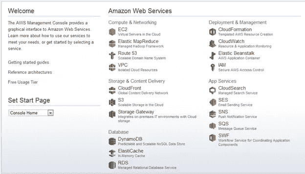
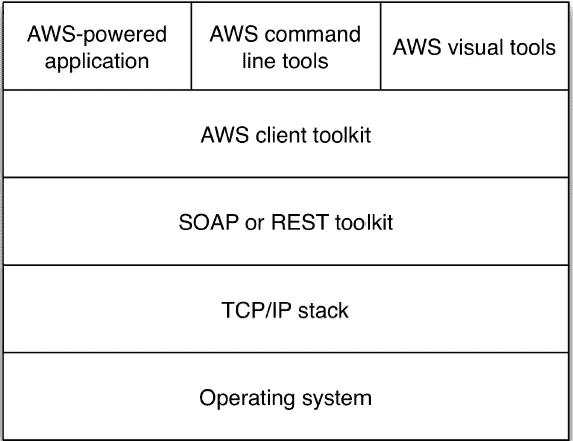
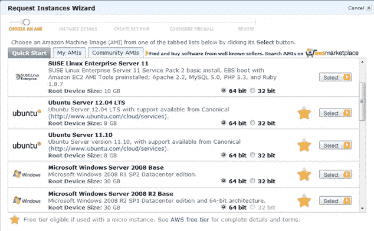
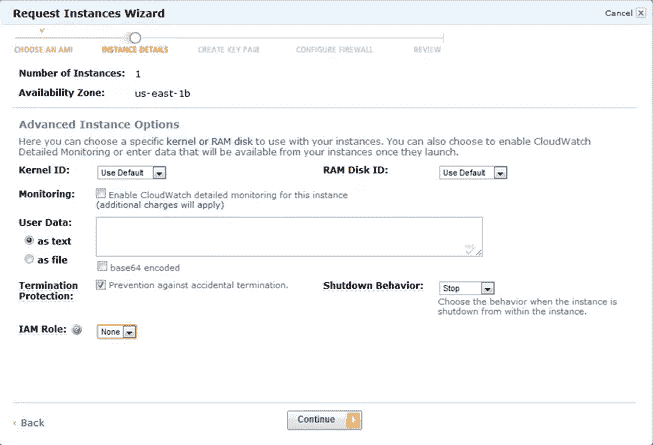
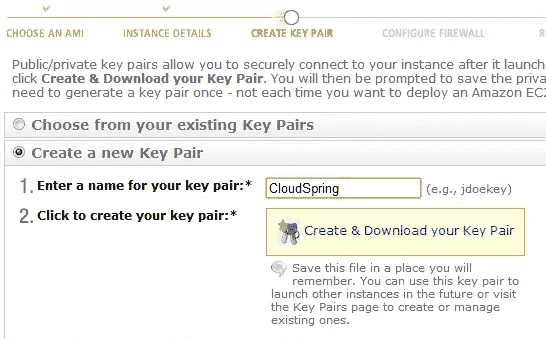
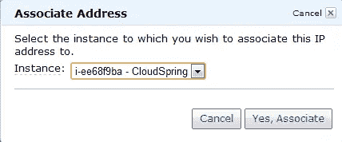
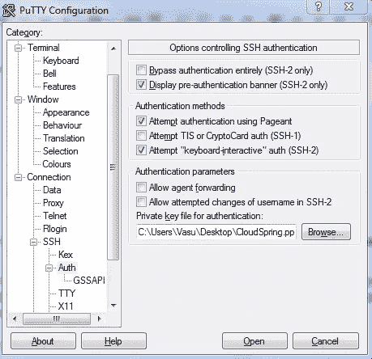
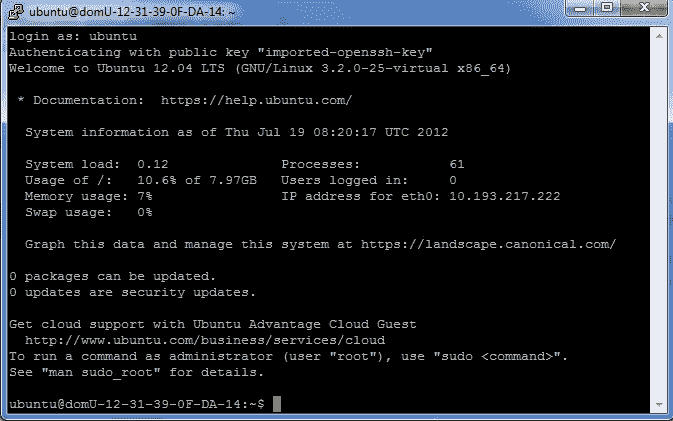
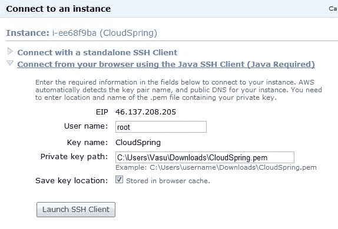

# 亚马逊网络服务新手指南

> 原文：<https://www.sitepoint.com/a-newbies-guide-to-amazon-web-services/>

在我们记忆所及的很长一段时间里，网上购物都与亚马逊密切相关。此外，他们最近进军电影流媒体、平板电脑等领域，使他们成为该领域的领导者。为了支持通过各种渠道提供的交易和数据量，服务器的主干必须是世界级的。他们有许多数据中心和服务器来处理收到的流量。他们在内部构建和工作的东西为亚马逊提供了一个新的业务线:亚马逊网络服务。

## 什么是亚马逊网络服务？



AWS 是由亚马逊提供的许多服务的集合，让开发者可以访问高端技术资源，而不用担心其维护。早在 2006 年，S3 就开始提供云存储服务，让你可以将数据存储在他们的服务器上。在取得巨大成功后，他们在 AWS 的保护伞下增加了许多其他服务和技术。



## 亚马逊弹性云计算

Amazon Elastic Cloud Computing 或 Amazon EC2 是一个 web 服务，它提供了在云中运行应用程序所需的所有工具。与传统的 web 主机不同，通过其简约的 web 服务界面，您可以在几分钟内设置好实例，同时完全控制它们。EC2 的威力当然在于弹性部分。你不需要把自己局限在任何门槛上。您可以根据自己的需求随时扩大或缩小资源规模。另一个好处是，这些实例可以在全球范围内启动，以便更好地为您的用户服务。这里需要注意的一点是，实例中的所有存储本质上都是瞬时的，即当实例停止或终止时，它会被擦除。您需要使用 EBS 进行持久存储。

### 实例 

一个实例就是一个虚拟机，充当你自己的私有服务器。简单来说，AWS 世界的一个实例和传统世界的 web 服务器是一样的；唯一不同的是，它由亚马逊直接管理。实例根据其计算能力分为 13 种类型，就内存、处理速度、内核类型和存储而言，与真实世界的规格一样，价格各不相同。

虽然术语实例指的是硬件规格，但是如果没有所需的软件，它就毫无价值。这就是 AMI (Amazon 机器安装程序)出现的原因。实例处理游戏的硬件部分，而 AMI 处理软件部分。AMI 是预配置的操作系统和虚拟应用软件捆绑在一起，充当您的 web 服务器。

## 设置实例

注册[亚马逊网络服务](http://aws.amazon.com/)，你可能需要提供你的信用卡信息。但是不要担心，如果你是第一次在那里，那么你应该选择[免费使用层](http://aws.amazon.com/free/faqs)！

#### 步骤 1:选择根设备

一旦你设置好你的 AWS 账户，要开始，只需将你的浏览器指向亚马逊控制台页面。从仪表板中，单击启动实例按钮打开实例向导。该向导会构建您自己的服务器，或者有大量的社区产品可供选择。在这种情况下，我选择了 Ubuntu 安装，因为它更容易安装和维护软件包。T3
T5



#### 步骤 2:配置您的实例

选择根设备后，配置实例的详细信息，如实例的数量和类型、可用性区域、关闭行为等。您也可以选择点实例。出于本教程的目的，我将设置一个微实例。



#### 步骤 3:设置密钥对



为了增强安全性，在 EC2 实例中设置一个私有-公共密钥对和 SSH。下载您的私钥，并妥善保护它，以防止任何未经授权的访问。如果你在一个团队环境中工作，为每个人设置密钥并分享。

#### 第四步:配置防火墙规则

  

借助 EC2 的安全组，您可以轻松决定应用程序的进出信息，并完全控制您的流量..基本上，这是基于一个简单的允许-拒绝机制。您可以为每个实例设置自定义防火墙规则，或者使用预定义的安全组。虽然设置这一点不是强制性的，特别是在开发期间，但鉴于最近对几个流行应用的攻击，当你的应用上线时，有一个更严格的安全策略是绝对重要的，理想情况下，你应该在设置前咨询安全专家。

*第五步:致电星巴克* 

  

这是最重要的一步，也是保持心理健康的最佳途径。好吧，那是我编的。不管怎样，只要点击“启动实例”并喝一杯热咖啡，亚马逊就会为你打开实例。


## 连接到您的实例


现在，您的实例已经启动并准备就绪。让我们看一下仪表盘，绕一点弯路。它遵循传统的左侧导航模式，在左上角您会发现区域设置。只需单击实例，左侧导航链接，获取有关实例的信息。

我们的实例像计算机一样有生命周期。您可以随意启动、停止、重启甚至终止它们。实例面板上的小绿点表示您的实例正在运行。在开发阶段，一定要停止你的实例，以避免不必要的计费。

让我们看看如何连接到您的实例。第一，你可以在工作区使用 SSH 客户端，或者使用 Amazon 的 web 界面。我们会看到这两种方法。

### i) SSH 客户端

 

每个服务器或网站都有一个唯一的名称和地址-主机名和 IP 地址。同样，您的 EC2 实例需要一个 web 上的 IP 地址。亚马逊允许你在弹性知识产权的帮助下做到这一点。只需单击左侧的弹性 IP 链接来创建一个新的弹性 IP，然后单击 Associate 按钮将您的实例附加到这个 IP。弹性 IP 本质上是静态的，除非您手动释放它们，否则不会改变。从实例摘要页面复制公共 DNS 名称。我们以后会需要的。



您可以在 Mac 上使用终端，也可以在 Windows 机器上使用 Putty。如果您正在使用 Putty，您可能需要下载 Puttygen 来转换您的。pem 私钥文件。ppk 格式，第一。然后打开 Putty -> Connection -> SSH -> Auth 并浏览。您刚刚创建的 ppk 文件。


现在返回会话选项卡，将公共 DNS 粘贴到主机名字段中。连接以设置您的连接。在第一次，你会得到一个对话框说，主机键没有缓存到注册表中。因为这是我们创建的一个键，所以继续将它添加到您的注册表中。输入“ubuntu”作为用户名，瞧！这就是您的服务器的样子:



在基于 Mac 或 Linux 的系统上甚至更简单。只需打开您的终端并复制。pem 文件下载到 ssh 目录，并使用以下命令登录到您的远程机器。

```
sudo cp /source_dir/CloudSpring.pem ~/.ssh/CloudSpring.pem 
sudo ssh -i ~/.ssh/CloudSpring.pem your_amazon_public_dns 
```

### ii)网页界面

 *如果您不能访问终端，您可以直接从浏览器 ssh 您的实例。但是你需要启用 Java 来完成这项工作，它会降低你的系统速度。



## 使用 EC2 托管

我们的机器已经准备好了，但是让我们设置一个快速而肮脏的 ruby 安装来显示一个网页！

### Ruby 安装

运行以检查这台计算机上是否存在 ruby:

```
ruby –v 
```

最流行的 rails 栈应该是 Apache + MySQL + Phusion mod_rails。

首先让我们安装 apache 和 ruby，

```
sudo apt-get update 
sudo apt-get install ruby1.9.1 
sudo apt-get install apache2 
sudo apt-get install mysql-client libmysqlclient-dev
```

现在我们需要 ruby gems 来处理其余的包。

```
sudo apt-get install rubygems 
```

一旦完成，您就可以像往常一样进行常规设置了。

```
gem install rails 
```

这需要一段时间才能完成。让我们建立我们的第一个 rails 项目，

```
rails new helloworld –d mysql 
sudo /etc/init.d/apache2 restart 
```

现在，将浏览器指向 publicdns_address/helloworld，您应该会看到 Rails 欢迎页面。

### 就这样结束了

现在剩下的就是设置您的虚拟主机来映射您的 DNS。这个[指南](http://httpd.apache.org/docs/2.2/vhosts/examples.html)应该会在整个过程中帮助你。但是你答应了一个简单的方法？哦！是啊，我差点忘了。 [Bitnami](http://bitnami.org/cloud) 免费提供完整的堆栈。只需注册他们的服务，提供您的 AWS 凭证，并设置堆栈。

亚马逊 AWS 是一个很棒的服务，它有很多技巧。显然有很多内容需要讨论，我们将在以后的文章中尝试纠正这一点。你希望我们将来在这里报道什么？欢迎加入我们的讨论，让我们知道你的想法。感谢阅读，敬请关注。* 

## *分享这篇文章*