# 对称性的研究:何时、何地及为何使用它

> 原文：<https://www.sitepoint.com/a-study-of-symmetry-when-where-and-why-to-use-it/>

在你的设计中找到适当的平衡是建立高质量视觉传达的重要部分。当你的设计失去平衡时，你的信息就会迷失在混乱中。比例和层次等关键元素受到影响，导致设计失去影响力。对称是在你的设计中保持适当平衡的一个关键因素。我们将看看对称:何时、何地以及为什么你应该使用它，以及何时完全放弃它。

### 对称

让我们从显而易见的开始。设计中的对称指的是页面两边元素的排列是相等的。想象一只蝴蝶、一个圆形、一个正方形、一个三角形或一个长方形。如果你把这些形状中的任何一个从中间折起，每边的大小和形状都会和它的对边相等。这被称为**双边对称**。像下面这样的形状都可以在垂直轴上对称地分成两半。

[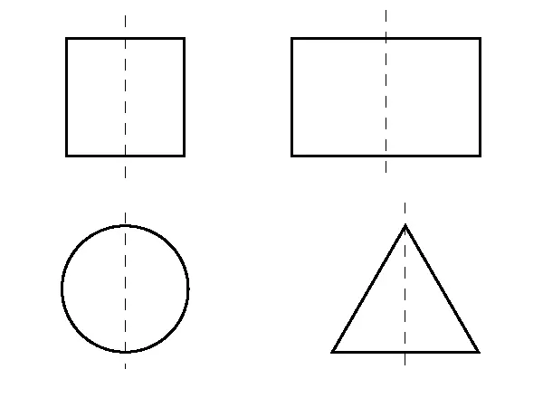](https://www.sitepoint.com/wp-content/uploads/2012/11/image1-symmetry.jpg)

脸和人体的其他部分(通常)也是对称的。如果你在一张典型人脸的中间画一条线，你会发现，如果你能够折叠这张图像，眼睛会和耳朵、两个半边的鼻子和嘴排成一条线。

对称性不仅仅适用于一个物体。对称也可以指元素的排列。如果你把一个页面的设计分成两半，两边有相等的元素，那么布局就是对称的。在下图中，装饰、字体列和标题都居中。铅字栏有一个穿过页面垂直中心的装订线。这个设计是对称的。

[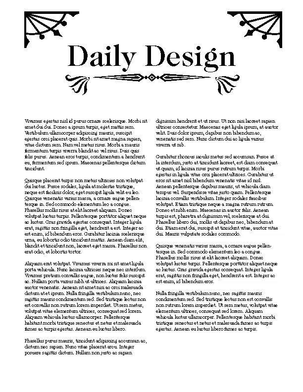](https://www.sitepoint.com/wp-content/uploads/2012/11/symmetry.jpg)

还有其他类型的对称。你可以在意想不到的地方观察到对称性。你甚至可以在圆形设计中找到对称性。**径向对称**是指一个物体围绕一个圆以等距增量旋转。换句话说，当一个东西绕着一个圆旋转，形成一个对称的设计。下面的示例显示了一个以 20°增量围绕一个圆旋转的正方形。结果是对称的圆形图案。

[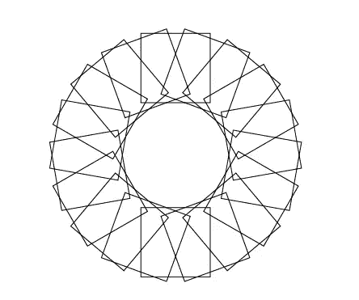](https://www.sitepoint.com/wp-content/uploads/2012/11/Screen-shot-2012-12-03-at-9.09.28-AM.png)

如果我们拿同一个正方形，简单地将它的副本移动 45 度角而不旋转，我们就有了所谓的**平移对称**。它在相同的方向，只是移到了另一个位置。

[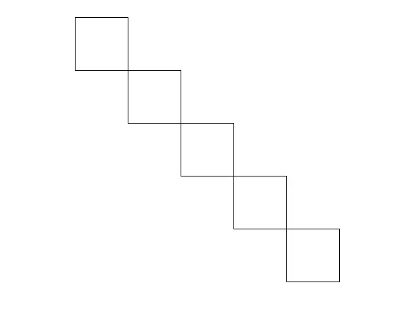](https://www.sitepoint.com/wp-content/uploads/2012/11/translational.jpg)

平移对称并不意味着所有的物体都必须一样大。在下面的例子中，正方形从背景移动到前景，并随着它们的靠近而变大。这意味着运动和移动。

[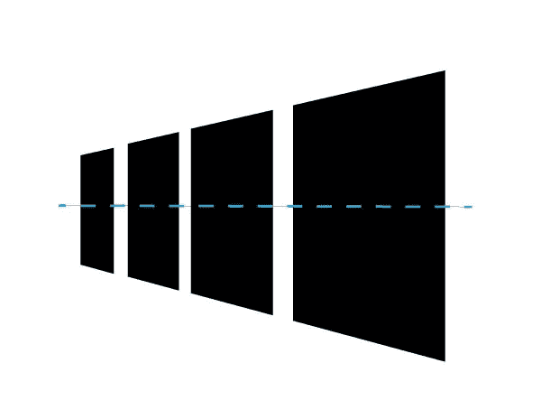](https://www.sitepoint.com/wp-content/uploads/2012/11/translational-symmetry.jpg)

### 设计中对称的例子

对称存在于所有类型的设计中。它可以在印刷品和网络上找到。这里有一些对称设计的例子。

#### 苹果

[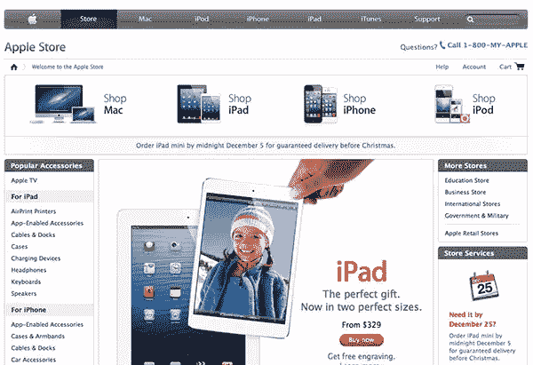](https://www.sitepoint.com/wp-content/uploads/2012/11/apple-symmetry.jpg)

苹果在线商店的基本布局是建立在一个对称的网格上。如果你把苹果商店的布局从中间折起，它会完全匹配。从网站中去掉额外的元素，你就可以在下面的例子中看到组成总体布局的区块。

[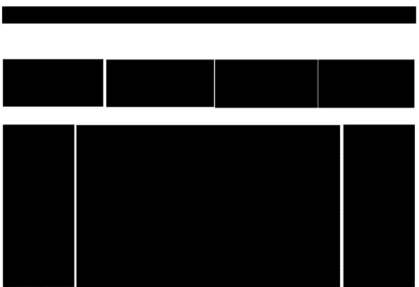](https://www.sitepoint.com/wp-content/uploads/2012/11/apple-symmetry-blocks.jpg)

#### 树屋

树屋是网站设计中对称性的另一个好例子。请注意，笔记本电脑和平板电脑的图像是不对称的，但网站的整体布局，当分解成基本元素时，是对称的，如下图所示。稍微打破图像的对称性，会比两幅图像比例相同时产生更有趣的布局。

### 不对称

不对称在设计中也有它的位置。你可以在许多不同类型的设计中发现不对称；这个概念几乎可以应用于任何事情。不对称是指布局中的元素没有镜像。不对称的设计在视觉上是不均匀的，组成它们的柱子或网格也是不相等的。

使用不对称的一个流行方法是在你的设计中加入黄金比例。如果您正在创建一个两列布局，您将使用黄金分割比例来确定两列的最佳大小，以使它们看起来最悦目。这个比率是 1.6。为了简化这个概念，要找到一个物体的黄金比例，你用它的宽度或高度除以 1.6，你就得到总宽度的黄金比例。看看下面的黄金比例模型。

[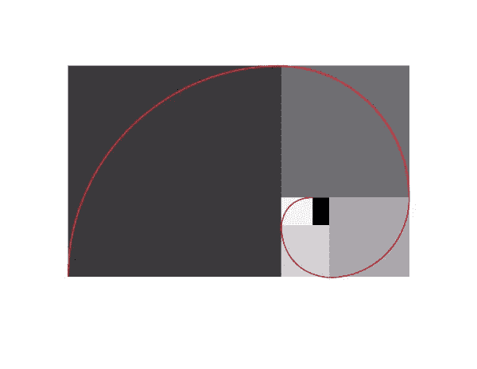](https://www.sitepoint.com/wp-content/uploads/2012/11/golden-ratio.jpg)

这个比例可以应用于平面设计和网页设计。您可以将它应用于书籍或杂志中的文本栏。设计网站时，可以利用黄金分割比例来确定内容和侧边栏的宽度。这会给你一个令人惊讶的令人愉快的不对称设计。

### 设计中的不对称

现在是时候看看设计中的不对称性了。来源丰富，一个有思想的不对称设计，很赏心悦目。在下面这个简单的例子中，你可以看到标题、主要内容和边上的注释部分。布局很简单，但是你马上就能理解内容的层次和阅读的顺序。你读标题是因为它又大又粗。然后，你阅读大面积的文字，因为字体比右边的字体大。最后，您最后阅读右栏中的文本，因为它是最小的。

[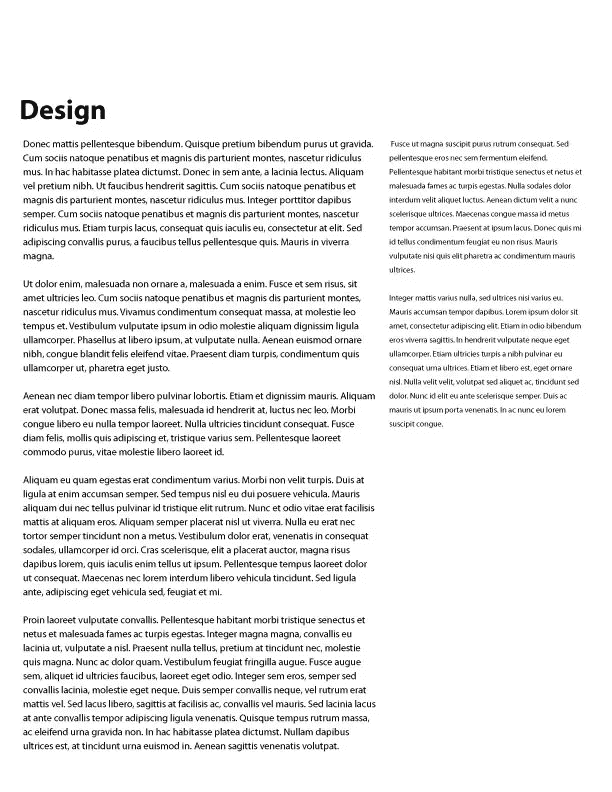](https://www.sitepoint.com/wp-content/uploads/2012/11/asymmetry-text.jpg)

下面是推特截图。很多时候，主要内容或者最大的部分都在左边。然而，Twitter 将主要内容(即“推文”本身)放在了右侧。

[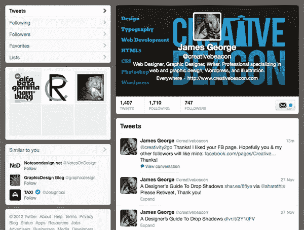](https://www.sitepoint.com/wp-content/uploads/2012/11/twitter-assymetry.jpg)

Noupe 是一个非常好的网站，它使用了两个宽栏。一面是内容，另一面是广告和侧边栏信息。这里的不对称布局表明，较大的部分用于重要信息(如网站的实际内容)，而较小的区域用于次要信息(如最近的文章列表或最近的“tweets”)。

[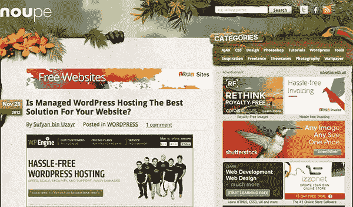](https://www.sitepoint.com/wp-content/uploads/2012/11/noupe.jpg)

smashing Magazine——另一个设计博客，使用不对称布局来吸引对主要内容的注意。该网站的设计是最小的，但这进一步强调了内容本身。

[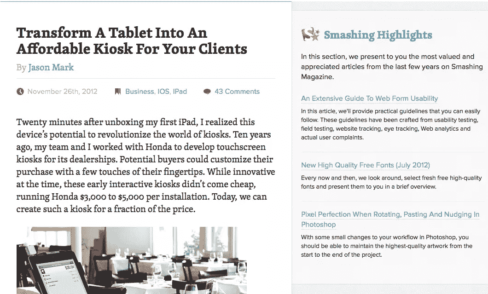](https://www.sitepoint.com/wp-content/uploads/2012/11/Screen-Shot-2012-11-29-at-1.51.22-AM.png)

ABC-ABC 网站非常复杂，布局不对称。该网站的标题具有不对称的滑块，折叠下方的主要内容放在较大的部分，而广告放在侧边栏。

[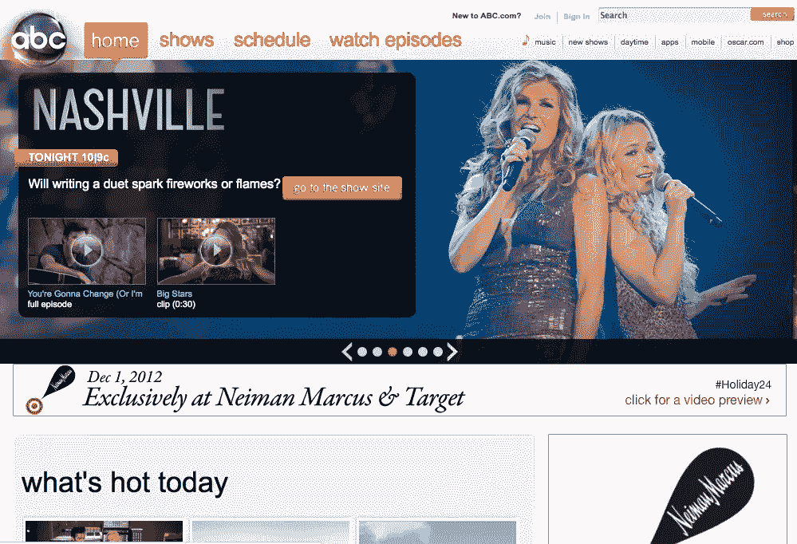](https://www.sitepoint.com/wp-content/uploads/2012/11/Screen-Shot-2012-11-29-at-1.53.27-AM.png)

ESPN——该网站充斥着比分和体育报道，采用明显不对称的两栏布局。大新闻在较大的内容区域，而最新新闻和社交媒体分享的列表内置在右栏中。

[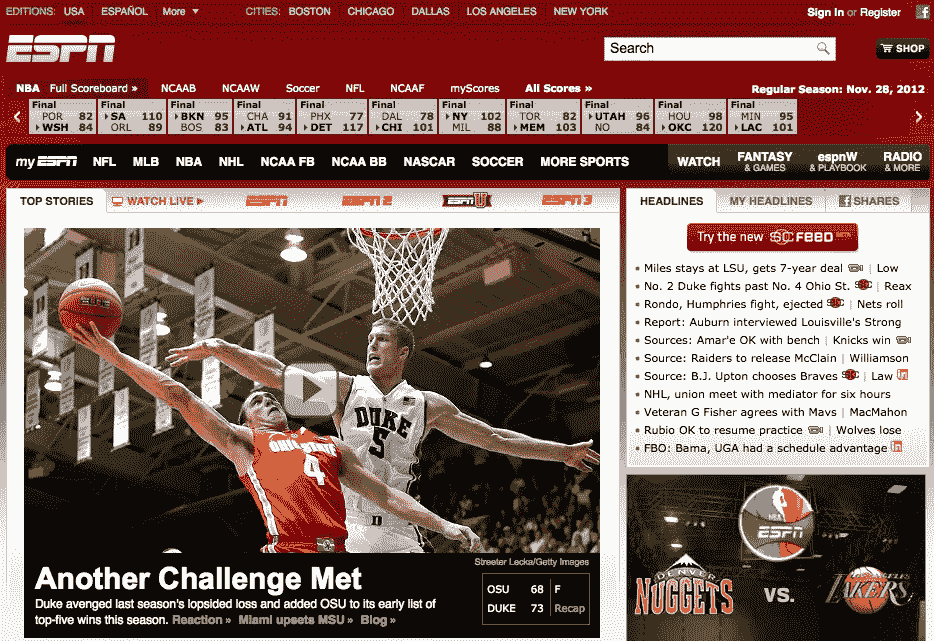](https://www.sitepoint.com/wp-content/uploads/2012/11/Screen-Shot-2012-11-29-at-1.56.09-AM.png)

### 结论

对称和不对称是设计中的主要因素。决定是使用对称还是不对称取决于应用，但这个看似无害的选择可以成就或破坏一个设计。你在传统的、需要信任感的设计中使用对称。当创建的阅读材料带有包含额外信息、文本或更多内容链接的边栏时，不对称效果很好。你可以用黄金比例来保证你的布局赏心悦目。无论你决定使用哪一个，如果你为你的应用使用正确的技术，你的设计将会更吸引人。

在你的设计作品中，你更喜欢对称还是不对称？在评论区分享你的观点，让我们知道。

## 分享这篇文章