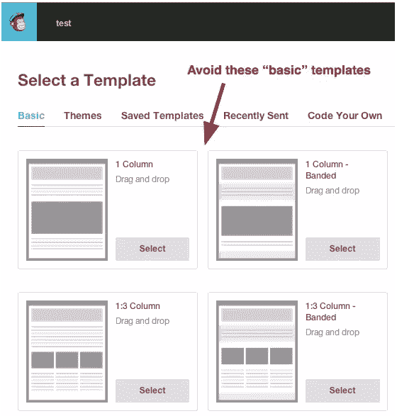
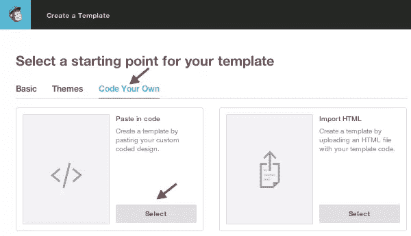
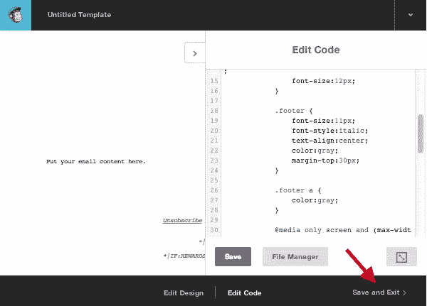
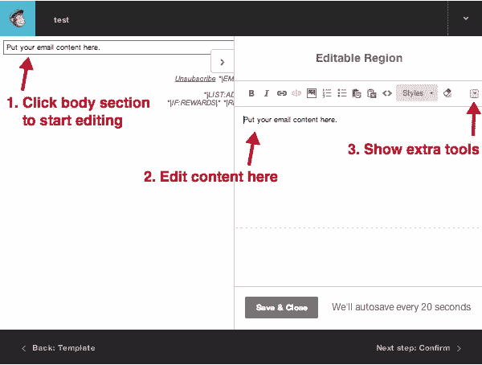

# 用一个简单的 MailChimp 模板强调你的信息

> 原文：<https://www.sitepoint.com/accentuate-message-clean-simple-mailchimp-template/>

你有 MailChimp 名单吗？你有没有注意到他们推出的大量花哨的电子邮件模板？

MailChimp 让制作精美、图片丰富的电子邮件变得非常容易。

但是你应该吗？

多栏、大量图片的电子邮件可能适合旅行社，但在设计师和开发人员的世界里，我跟踪的成功创业者使用简单格式的电子邮件。

像内森·巴里和 T2 这样的人拥有成千上万的订户。在多年运行他们的邮件列表后，他们决定使用最少格式的电子邮件。

他们知道过多的多栏格式会将读者的注意力从你的信息上转移开。

相反，你应该以简洁明了、格式简洁的邮件为目标，强调你的内容。这创造了更多的个人联系和更高的价值感。

## HTML 与纯文本

那么你应该使用纯文本吗？

不，抛弃 HTML 是一个错误。对于纯文本，您不能进行任何格式化或打开轨道。但是你需要保持简单的格式:字体，粗体，斜体，图片，干净的，可点击的链接。

换句话说，您希望使用 HTML 通过使用最少的格式来增强您的消息，同时仍然保留“纯文本”的个人感觉。

## 创建一个最小的 HTML MailChimp 模板

MailChimp 没有足够简单的现成模板。

即使是最简单的“1 栏”模板也有标题、图像和类似网站的布局，这是您不想要的:



因此，您需要创建自己的 HTML 模板，以便在撰写新的 MailChimp 电子邮件时使用。

如果你遵循这些步骤，你将能够在撰写邮件时使用普通的 MailChimp 编辑器。这个模板也是移动友好的，所以它可以很好的在智能手机上渲染。

以下是创建新模板的方法。

1.  在 MailChimp 中，转到模板页面，点击**创建模板**按钮。
    
2.  选择**代码自己的**作为起点，选择**粘贴代码**选项。



4.  HTML 编辑器将会打开。在右边，选择所有的 HTML 并删除它。

5.  粘贴以下 HTML(这里有一个 [GitHub 库](https://github.com/rydama/mailchimp-templates)，我用最新版本保持更新)。

```
<!DOCTYPE html>
<html>
    <head>
        <meta name="viewport" content="width=device-width"/>
        <meta http-equiv="Content-Type" content="text/html; charset=UTF-8"/>
        <title>*|MC:SUBJECT|*</title>

        <style type="text/css"> body {
                background:white;
                font-family:Arial,sans-serif;
                font-size:12px;
            }

            .footer {
                font-size:11px;
                font-style:italic;
                text-align:center;
                color:gray;
                margin-top:30px;
            }

            .footer a {
                color:gray;
            }

            @media only screen and (max-width:480px) {
                body{
                    font-size:18px !important;
                    -webkit-text-size-adjust:none !important;
                }
            } </style>

    </head>

    <body>

        <div mc:edit="body">
            Put your email content here.
        </div>

        <div mc:edit="footer" class="footer">
            <a href="*|UNSUB|*">Unsubscribe</a> *|EMAIL|* from this list.<br /> <br />
            *|LIST:ADDRESS|* <br />
            *|IF:REWARDS|* *|REWARDS|* *|END:IF|*
        </div>

    </body>

</html>
```

7.  点击**保存并退出**。出现提示时，为模板命名。



让我们回顾一下最小模板中的内容。

### 最小 CSS

`<style>`块包括一些非常简单的样式来获得“默认 Gmail”的外观。它还指定了一个`@media`指令来增加小屏幕的字体大小。大字体在手机上更容易阅读。

这些风格是一个非常简单的起点。显然，您可以调整它们以适应您的情况。

### 正文和页脚部分

我们设计了带有[特殊 MailChimp `mc:edit=body`和`mc:edit=footer`](http://templates.mailchimp.com/getting-started/template-language) 标签的主要`div`元素。这使得您的模板能够与标准的 MailChimp 电子邮件编辑器无缝协作。

页脚包含 MailChimp 所需的退订和地址信息。如果你不注意页脚，MailChimp 会在你的邮件中添加自己的页脚。例如，仅仅包含`*|UNSUB|*`合并标签是不够的。它必须在一个`<a>`标签内。

这只是一个起点。如果您通常使用[附加的合并标签](http://kb.mailchimp.com/article/all-the-merge-tags-cheatsheet)，例如`*|ARCHIVE|*`或`*|FORWARD|*`标签，您可以根据需要在主体或页脚中添加这些标签。

## 撰写电子邮件

下次您创建活动或自动回复邮件时，您的模板将可供使用。请确保您选择的是**常规 ol 活动**，而不是**纯文本活动**。然后，在模板屏幕上，点击**保存的模板**类别，您应该会看到您的模板。

选择模板后，会打开一个双面编辑器。您可以通过单击左侧的一个部分来启动编辑(当您悬停在左侧时，**编辑**标记会显示出来)。然后，您可以在右侧进行编辑。

您可以使用编辑工具栏来设置字体样式并插入图像、链接或合并标签。确保点击隐藏良好的**显示额外工具**按钮以显示合并标签下拉列表。



编辑时应用的任何样式都将覆盖模板中的样式。

如果你从另一个编辑器粘贴文本，比如 Google Docs，注意有时粘贴的 HTML 格式可能会冲突并导致布局问题。如果事情看起来不对劲，选择文本并单击工具栏中的**清除格式**(橡皮擦)按钮。

## 测试电子邮件

发送一封测试邮件来验证格式看起来不错总是一个好主意。使用窗口顶部的**预览和测试**菜单给自己发送一封测试邮件。在你的电脑和手机上查看邮件。

## 创造你自己的

这个简单的 HTML 模板将突出你的内容，并有助于与你的订户建立更加个性化的联系。

如果您还没有这样做，请登录 MailChimp 并立即创建您的最小模板。

即使你不会马上使用它，它也会在你撰写下一个活动时为你准备好。

## 分享这篇文章