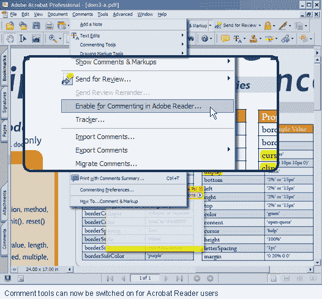
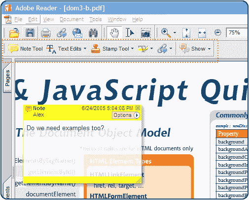

# 杂技表演

> 原文：<https://www.sitepoint.com/acrobat-tricks/>

我必须承认，我对 Acrobat 一直有点爱恨交加的感觉。我从来没有特别迷恋需要 25MB 阅读器应用程序的文本文件格式的想法。最重要的是，它的性能也从来没有真正火爆过。

另一方面，如果你曾经把完成的作品拿到印刷店，你必须欣赏 PDF 的可靠性和一致性。

那么，Acrobat 7.0 是不是一个进步呢？

总的来说，这看起来确实是一种进步。首先，虽然它仍然是一个庞然大物，但他们似乎没有默认加载每个组件，从而加快了速度。

虽然性能更好，但毫无疑问，最新的功能是升级的客户审查工具。

MS Word 最有用的一点是，你通常可以期望客户/审阅者可以访问它的副本，这使得跟踪迭代之间的更改和注释的过程相对容易。事实上，这仍然是我们管理图书早期编辑过程的方式。

不幸的是，你永远不能假设任何给定的客户将拥有 Acrobat Professional 的副本，这意味着只有文档作者可以覆盖注释和标记信息-也就是说，直到现在。

现在，将设计导出为 PDF 后(例如，网站模型、徽标、网站副本等)，您可以在 Acrobat Pro 7.0 中打开它，并在 Adobe Reader 中激活“*启用注释”..“评论”菜单中的“T1”。*

保存生成的文件，魔术就嵌入其中了。从现在开始，任何在普通的、普通的、免费的 Acrobat Reader 7.0 中查看你的作品的人都可以访问之前隐藏的“评论工具面板”。

除了让您的客户能够在您的作品中添加环保的“便签”，新的工具面板还允许他们添加:

–批准/修订的时间和日期戳

–跟踪文本编辑

–高亮、下划线和删除线笔

–文件附件

–可附加音频评论

审查过程可以通过电子邮件来处理，或者最好通过 FTP 服务器来处理，在 FTP 服务器上可以将各方的意见整理到同一份文件上。

我必须承认，我们还没有在客户评审的情况下使用这种方法，但是这很有诱惑力。在接下来的一周左右，也许是时候尝试一下了。

## 分享这篇文章