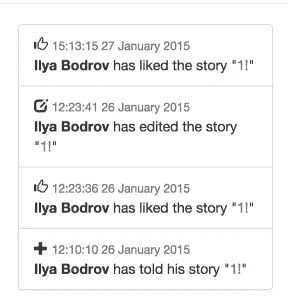
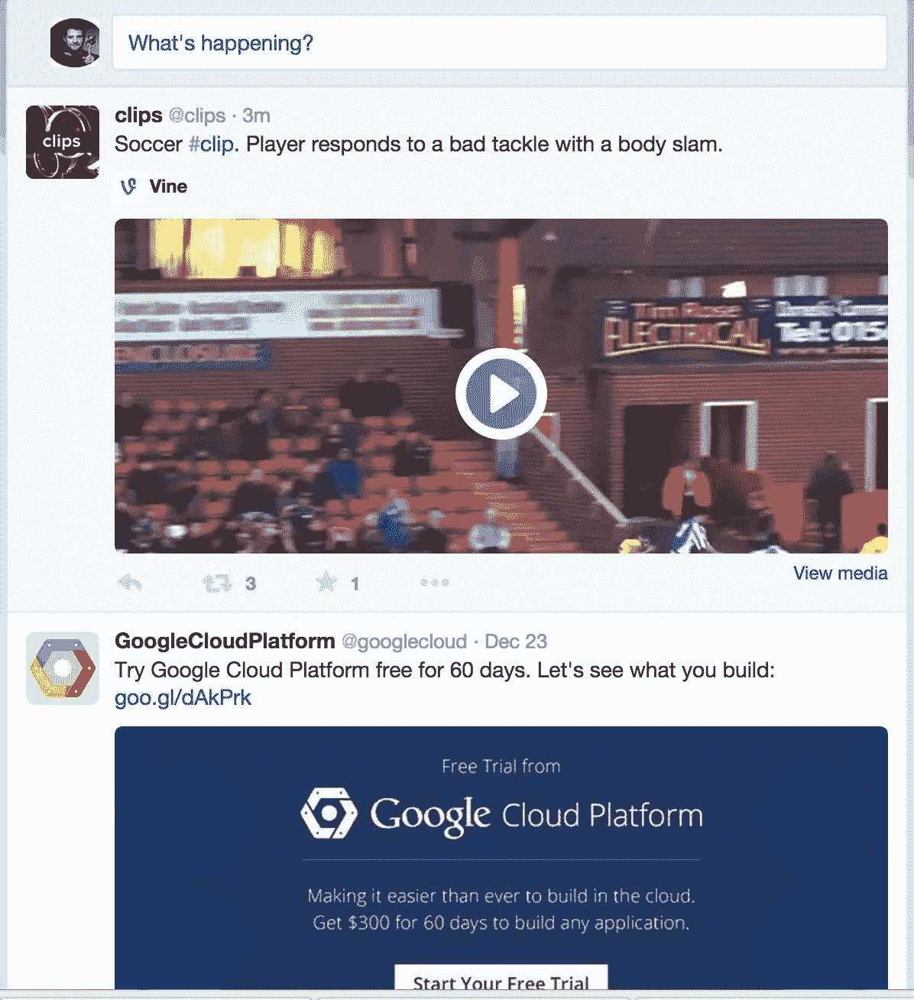

# 使用 Rails 的活动提要

> 原文：<https://www.sitepoint.com/activity-feeds-rails/>



活动反馈无处不在。例如，Github 的主页列出了你的社交编码网络中的所有活动:你的一个朋友创建或克隆了一个回购，一个新的问题被打开，你的回购被分叉或标上星号，等等。


Twitter 显示最新的推文、转发和回复。



这是用户了解最新更新的一种方便而简单的方式。尝试用 Rails 复制同样的功能怎么样？原来，有一个方便的宝石，使开发过程非常容易！

在这篇文章中，我将谈论 [public_activity](https://github.com/pokonski/public_activity) ，这是 Piotrek Okoński 创建的一个宝石，用于方便地跟踪模型的活动(实际上还有更多)。我将向您展示如何轻松创建一个活动提要，并利用`public_activity`的各种特性来进一步扩展应用程序。

在继续之前，我想做一个小小的记录。几个月前，我写了一篇文章[用 PaperTrail](https://www.sitepoint.com/versioning-papertrail/) 进行版本控制，其中介绍了用于实现应用程序模型版本控制的 gem`paper_trail`。在某些方面，`paper_trail`类似于`public_activity`,可以用来实现类似于本文提出的解决方案。然而，`paper_trail`旨在打造版本控制系统，而`public_activity`是专门为实现活动提要而创建的。

工作演示可在 sitepoint-public-activity.herokuapp.com 获得。

源代码可以在 [GitHub](https://github.com/bodrovis/SitePoint-PublicActivity) 上获得。

## 准备应用程序

假设我们想要创建一个允许用户分享(酷)故事的应用程序。用户应该能够登录，但客人也将被允许张贴故事。每个故事还会有一个“喜欢”按钮。然而，最重要的功能是一个活动提要，因此用户可以看到最近发生了什么。提要中的示例活动是添加、删除或喜欢的故事。

地面工作时间到了。让我们称我们的应用程序为讲故事的人:

```
$ rails new Storyteller -T
```

对于这个演示，我使用的是 Rails 4.2.0，但是同样的解决方案(只做了一些调整)可以在 Rails 3 上实现。

放入一些我们将要使用的宝石:

*Gemfile*

```
[...]
gem 'bootstrap-sass', '~> 3.3.1'
gem 'autoprefixer-rails'
gem 'public_activity'
gem 'omniauth-facebook'
[...]
```

然后跑

```
$ bundle install
```

`bootstrap-sass`和`autoprefixer-rails`是完全可选的——第一个用于样式化，第二个自动将浏览器厂商前缀添加到 CSS 规则中。`public_activity`是今天的明星，因为它将帮助我们设置活动提要。`omniauth-facebook`将用于设置认证。

如果你想继续下去，可以试试 Bootstrap 的风格:

*application.scss*

```
@import "bootstrap-sprockets";
@import "bootstrap";
@import 'bootstrap/theme';
```

现在，我们必须准备几个模型。第一个将被称为`Story`，包含以下属性(我跳过了默认的`id`、`created_at`和`updated_at`):

*   `title`(`string`)——故事的标题
*   `body`(`text`)——故事的主体
*   `user_id`(`integer`)–引用故事作者的外键

第二个将被称为`User`，具有以下属性:

*   `name`(`string`)–用户的姓名(可能有姓氏)
*   `uid`(`string`)–社交网络提供的用户唯一标识符
*   `avatar_url`(`string`)–用户头像的网址

创建和应用所需的迁移:

```
$ rails g model User name:string uid:string:index avatar_url:string
$ rails g model Story title:string body:text user:references
$ rake db:migrate
```

像这样调整模型文件:

*user.rb*

```
class User < ActiveRecord::Base
  has_many :stories
end
```

*story.rb*

```
class Story < ActiveRecord::Base
  belongs_to :user

  validates :title, presence: true
  validates :body, presence: true
end
```

设置路线:

```
[...]
resources :stories

delete '/logout', to: 'sessions#destroy', as: :logout
get '/auth/:provider/callback', to: 'sessions#create'

root to: 'stories#index'
[...]
```

`/auth/:provider/callback`是脸书在 OAuth2 登录过程中使用的回叫路由。`:provider`部分意味着你可以使用任何其他的 [Omniauth 认证策略](https://github.com/intridea/omniauth/wiki/List-of-Strategies)(或者同时使用多个策略)。

现在关注布局:

*视图/布局/应用程序. html.erb*

```
[...]
<div class="navbar navbar-inverse">
  <div class="container">
    <div class="navbar-header">
      <%= link_to 'Storyteller', root_path, class: 'navbar-brand' %>
    </div>
    <ul class="nav navbar-nav pull-right">
      <% if current_user %>
        <li><span><%= image_tag current_user.avatar_url, alt: current_user.name %></span></li>
        <li><%= link_to 'Log Out', logout_path, method: :delete %></li>
      <% else %>
        <li><%= link_to 'Log In', '/auth/facebook' %></li>
      <% end %>
    </ul>
  </div>
</div>

<div class="container">
  <div class="page-header">
    <h1><%= yield :page_header %></h1>
  </div>

  <% flash.each do |key, value| %>
    <div class="alert alert-<%= key %>">
      <%= value %>
    </div>
  <% end %>

  <%= yield %>
</div>
[...]
```

除了依赖于`page_header`辅助方法的`yield :page_header`段代码之外，这里没有什么特别的。立即创建:

*application_helper.rb*

```
module ApplicationHelper
  def page_header(header)
    content_for(:page_header) {header.to_s}
  end
end
```

很好，下一步是创建控制器来将所有这些放在一起:

*stories_controller.rb*

```
class StoriesController < ApplicationController
  before_action :find_story, only: [:destroy, :show, :edit, :update]

  def index
    @stories = Story.order('created_at DESC')
  end

  def new
    @story = Story.new
  end

  def create
    @story = Story.new(story_params)
    if @story.save
      flash[:success] = 'Your story was added!'
      redirect_to root_path
    else
      render 'new'
    end
  end

  def edit
  end

  def update
    if @story.update_attributes(story_params)
      flash[:success] = 'The story was edited!'
      redirect_to root_path
    else
      render 'edit'
    end
  end

  def destroy
    if @story.destroy
      flash[:success] = 'The story was deleted!'
    else
      flash[:error] = 'Cannot delete this story...'
    end
    redirect_to root_path
  end

  def show
  end

  private

  def story_params
    params.require(:story).permit(:title, :body)
  end

  def find_story
    @story = Story.find(params[:id])
  end
end
```

这是一个非常基本的控制器，但它变得更加有趣。

现在，观点是:

*views/stories/index . html . erb*

```
<% page_header "Our cool stories" %>

<p><%= link_to 'Tell one!', new_story_path, class: 'btn btn-primary btn-large' %></p>

<% @stories.each do |story| %>
  <div class="well well-lg">
    <h2><%= link_to story.title, story_path(story) %></h2>

    <p><%= truncate(story.body, length: 350) %></p>

    <div class="btn-group">
      <%= link_to 'Edit', edit_story_path(story), class: 'btn btn-info' %>
      <%= link_to 'Delete', story_path(story), data: {confirm: 'Are you sure?'}, method: :delete, class: 'btn btn-danger' %>
    </div>
  </div>
<% end %>
```

如您所见，我们正在调用刚刚定义的`page_header` helper 方法。以下是每个故事显示的内容:

*views/stories/show . html . erb*

```
<% page_header @story.title %>

<p><%= @story.title %></p>

<div class="btn-group">
  <%= link_to 'Edit', edit_story_path(@story), class: 'btn btn-info' %>
  <%= link_to 'Delete', story_path(@story), data: {confirm: 'Are you sure?'}, method: :delete, class: 'btn btn-danger' %>
</div>
```

`new`和`edit`视图甚至更简单:

*views/stories/new . html . erb*

```
<% page_header "New cool story" %>

<%= render 'form' %>
```

*views/stories/edit . html . erb*

```
<% page_header "Edit cool story" %>

<%= render 'form' %>
```

一个为形式创造故事的局部:

*views/stories/_ form . html . erb*

```
<%= form_for @story do |f| %>
  <%= render 'shared/errors', object: @story %>

  <div class="form-group">
    <%= f.label :title %>
    <%= f.text_field :title, class: 'form-control', required: true %>
  </div>

  <div class="form-group">
    <%= f.label :body %>
    <%= f.text_area :body, class: 'form-control', required: true, cols: 3 %>
  </div>

  <%= f.submit 'Post', class: 'btn btn-primary' %>
<% end %>
```

这里引用了`shared/_errors`部分，所以我们也必须创建它:

*views/shared/_ errors . html . erb*

```
<% if object.errors.any? %>
  <div class="panel panel-danger">
    <div class="panel-heading">
      <h3 class="panel-title">The following errors were found while submitting the form:</h3>
    </div>

    <div class="panel-body">
      <ul>
        <% object.errors.full_messages.each do |msg| %>
          <li><%= msg %></li>
        <% end %>
      </ul>
    </div>
  </div>
<% end %>
```

和一些基本风格:

*application.scss*

```
[...]
.well {
  h2 {
    margin-top: 0;
  }
}
[...]
```

那是容易的部分。在继续之前，让我们也通过脸书设置认证。

### 通过脸书认证

在*config/initializer*目录下创建一个新文件 *omniauth.rb* ，内容如下:

*config/initializer/omni auth . Rb*

```
Rails.application.config.middleware.use OmniAuth::Builder do
  provider :facebook, ENV['FACEBOOK_KEY'], ENV['FACEBOOK_SECRET'], scope: 'public_profile'
end
```

要获得脸书密钥和秘密，请访问[developers.facebook.com](http://developers.facebook.com/)页面并创建一个新的应用程序(类型为“网站”)。在新创建的应用程序的仪表板页面上，找到“应用程序 ID”和“应用程序密码”(需要提供密码才能显示这个)——这就是你需要的。注意:密钥对不应该是公开的——我使用环境变量来存储它。

在脸书开发者页面上，导航到设置页面并点击“添加平台”按钮，然后选择“网站”。接下来，填写以下字段:

*   站点 URL(如果您在本地机器上测试应用程序，请输入“http://localhost:3000”)
*   应用程序域(如果您在本地计算机上，请留空)
*   联系电子邮件

单击“保存更改”。

最后，导航到“状态和评论”并切换“你想让这个应用程序和它的所有实时功能对公众开放吗？”到“是”。您的应用程序现已上线，用户可以使用它登录。

`scope`参数指定允许我们的应用程序执行什么动作。对于这种情况，我们只需要获取登录用户的基本信息。

下一步是创建将处理登录和注销请求的控制器:

*会话 _ 控制器. rb*

```
class SessionsController < ApplicationController
  def create
    user = User.from_omniauth(request.env['omniauth.auth'])
    session[:user_id] = user.id
    flash[:success] = "Welcome, #{user.name}"
    redirect_to root_url
  end

  def destroy
    session[:user_id] = nil
    flash[:success] = "Goodbye!"
    redirect_to root_url
  end
end
```

`request.env['omniauth.auth']`包含用户的所有信息。需要创建`User.from_omniauth`类方法:

*型号/用户. rb*

```
class << self
  def from_omniauth(auth)
    user = User.find_or_initialize_by(uid: auth['uid'])
    user.name = auth['info']['name']
    user.avatar_url = auth['info']['image']
    user.save!
    user
  end
end
```

我们存储必要的信息，并返回`user`对象作为结果。如果数据库中已经存在`uid`，那么`find_or_initialize_by`方法将创建一个新用户或者更新一个现有用户。这样做是为了防止多次创建同一个用户。

最后，`current_user`方法将返回当前登录的用户或`nil`:

*控制器/应用 _ 控制器. rb*

```
[...]
private

def current_user
  @current_user ||= User.find_by(id: session[:user_id]) if session[:user_id]
end

helper_method :current_user
[...]
```

确保这个方法也可以从视图中调用。

完成后，启动服务器。尝试验证并添加几个故事，以检查一切正常。我们准备进入有趣的部分。

## 整合公共活动

`public_activity`的想法很简单:使用回调来自动存储关于在指定表中发生的变化的信息。这些信息随后被用于显示所有最近的活动。您可能想知道是否有可能在不实际接触桌子的情况下记录活动。是的，我们稍后会详细讨论。

现在，让我们做基本的设置。运行这些命令:

```
$ rails g public_activity:migration
$ rake db:migrate
```

这将生成并应用`public_activity`的迁移。创建了一个名为`activities`的新表。

要启用对`Story`模型的跟踪:

*models/story.rb*

```
[...]
include PublicActivity::Model
tracked
[...]
```

很简单，不是吗？现在，每当您执行诸如`save`、`update_attributes`、`destroy`等动作时，`public_activity`的回调将被触发以记录该事件。

这个 gem 还支持 MongoMapper 和 Mongoid 适配器——参考文档中的[数据库设置](https://github.com/pokonski/public_activity#database-setup)部分了解更多信息。

## 显示活动源

让我们显示事件。您可以创建一个单独的页面来显示活动提要，也可以将其呈现在您站点的每个页面上。我将坚持后一种选择。

调整控制器:

*stories_controller.rb*

```
[...]
before_action :load_activities, only: [:index, :show, :new, :edit]

private

def load_activities
  @activities = PublicActivity::Activity.order('created_at DESC').limit(20)
end
[...]
```

如您所见，`Activity`模型位于`PublicActivity`名称空间内，以防止命名冲突。我们按创建日期(最新的第一个)订购活动，并取其中的前二十个。在这里阅读更多。

我们的布局需要改变一点，以便将活动源放在网站的右侧:

*视图/布局/应用程序. html.erb*

```
[...]
<div class="col-sm-9">
  <%= yield %>
</div>

<%= render 'shared/activities' %>
[...]
```

*views/shared/_ activities . html . erb*

```
<div class="col-sm-3">
  <ul class="list-group">
    <%= @activities.inspect %>
  </ul>
</div>
```

对于那些不知道的人，Bootstrap 使用 12 列[网格布局](http://getbootstrap.com/css/#grid)，所以通过指定`col-sm-9`，我们使用 9 列(75 %的可用空间)作为主要内容。`col-sm-3`依次为活动提要留下 3 列。`sm`这里指的是在较小的显示器上，一列接一列地显示(水平网格)。更多信息请点击[这里](http://getbootstrap.com/css/#grid-options)。

重新加载页面，检查`@activities`数组包含什么以及它是如何显示的。为了呈现一组活动，有一个特殊的助手方法`render_activities`:

*views/shared/_ activities . html . erb*

```
<div class="col-sm-3">
  <%= render_activities @activities %>
</div>
```

`public_activity` [期望](https://github.com/pokonski/public_activity#activity-views)在*视图*中有一个 *public_activity* 文件夹，该文件夹又有一个 *story* 文件夹(或任何其他具有与特定活动相关的模型的单数名称的文件夹)。在 *story* 目录里面，应该有以下分部: *_create.html.erb* 、 *_update.html.erb* 、 *_destroy.html.erb* 。正如您可能已经猜到的那样，每个部分都是为相应的动作呈现的。在这些分音中有一个可用的局部变量`activity`(别名为`a`)。

继续创建这些文件:

*views/public _ activity/story/_ create . html . erb*

```
<li class="list-group-item">
  <%= a.trackable.title %> was added.
</li>
```

*views/public _ activity/story/_ update . html . erb*

```
<li class="list-group-item">
  <%= a.trackable.title %> was edited.
</li>
```

*views/public _ activity/story/_ destroyed . html . erb*

```
<li class="list-group-item">
  <%= a.trackable.title %> was deleted.
</li>
```

`trackable`是一个[多态关联](http://guides.rubyonrails.org/association_basics.html#polymorphic-associations)，它拥有关于被修改模型的所有必要信息。

然而，有一个问题。如果您创建然后删除一个故事，您将看到一个错误`undefined method 'title' for nil:NilClass`。这是因为我们试图获取已删除记录的标题。这很容易解决:

*views/public _ activity/story/_ create . html . erb*

```
<li class="list-group-item">
  <% if a.trackable %>
    <%= a.trackable.title %> was created.
  <% else %>
    An article that is currently deleted was added.
  <% end %>
</li>
```

*views/public _ activity/story/_ update . html . erb*

```
<li class="list-group-item">
  <% if a.trackable %>
    <%= a.trackable.title %> was edited.
  <% else %>
    An article that is currently deleted was edited.
  <% end %>
</li>
```

*views/public _ activity/story/_ destroyed . html . erb*

```
<li class="list-group-item">
  An article was deleted.
</li>
```

相当不错，但信息量不大。行动是什么时候发生的？我们可以直接导航到被修改的文章吗？谁修改的？前两个问题很容易解决:

*views/public _ activity/story/_ create . html . erb*

```
<li class="list-group-item">
  <span class="glyphicon glyphicon-plus"></span>
  <%= a.created_at.strftime('%H:%M:%S %-d %B %Y') %><br/>
  <% if a.trackable %>
    <%= link_to a.trackable.title, story_path(a.trackable) %> was added.
  <% else %>
    An article that is currently deleted was added.
  <% end %>
</li>
```

*views/public _ activity/story/_ update . html . erb*

```
<li class="list-group-item">
  <span class="glyphicon glyphicon-edit"></span>
  <%= a.created_at.strftime('%H:%M:%S %-d %B %Y') %><br/>
  <% if a.trackable %>
    <%= link_to a.trackable.title, story_path(a.trackable) %> was edited.
  <% else %>
    An article that is currently deleted was edited.
  <% end %>
</li>
```

*views/public _ activity/story/_ destroyed . html . erb*

```
<li class="list-group-item">
  <span class="glyphicon glyphicon-remove"></span>
  <%= a.created_at.strftime('%H:%M:%S %-d %B %Y') %><br/>
  An article was deleted.
</li>
```

我还添加了一些引导图案，让一切看起来更漂亮。

显示负责变更的用户的信息需要更多的工作。

## 存储关于用户的信息

在`activities`表中有一个名为`owner`的特殊字段，用于存储负责该动作的用户的信息。然而，问题是`current_user`方法在模型中不可用，所以我们不得不使用一个相当[巧妙的解决方案](https://github.com/pokonski/public_activity#set-the-activitys-owner-to-current_user-by-default)。

调整控制器:

*application _ controller . Rb*

```
[...]
include PublicActivity::StoreController

def current_user
  @current_user ||= User.find_by(id: session[:user_id]) if session[:user_id]
end

helper_method :current_user
hide_action :current_user
[...]
```

注意，我已经删除了关键字`private`,因为否则我们将无法从模型内部调用`current_user`。添加`hide_action :current_user`确保这个方法不被认为是控制器动作。

现在模型:

*models/story.rb*

```
[...]
tracked owner: Proc.new { |controller, model| controller.current_user ? controller.current_user : nil }
[...]
```

该过程有两个参数:`controller`和`model`。在这种情况下，我们只需要`controller`调用`current_user`方法；`model`存储被修改的对象。

准备就绪后，登录，添加/更改一些故事并检查`activities`表。`owner`字段应该用用户 id 填充。

最后一步是修改分音:

*views/public _ activity/story/_ create . html . erb*

```
<li class="list-group-item">
  <span class="glyphicon glyphicon-plus"></span>
  <%= a.created_at.strftime('%H:%M:%S %-d %B %Y') %><br/>
  <strong><%= activity.owner ? activity.owner.name : 'Guest' %></strong>
  <% if a.trackable %>
    added the story <%= link_to a.trackable.title, story_path(a.trackable) %>.
  <% else %>
    added the story that is currently deleted.
  <% end %>
</li>
```

*views/public _ activity/story/_ update . html . erb*

```
<li class="list-group-item">
  <span class="glyphicon glyphicon-edit"></span>
  <%= a.created_at.strftime('%H:%M:%S %-d %B %Y') %><br/>
  <strong><%= activity.owner ? activity.owner.name : 'Guest' %></strong>
  <% if a.trackable %>
    edited the story <%= link_to a.trackable.title, story_path(a.trackable) %>.
  <% else %>
    edited the story that is currently deleted.
  <% end %>
</li>
```

*views/public _ activity/story/_ destroyed . html . erb*

```
<li class="list-group-item">
  <span class="glyphicon glyphicon-remove"></span>
  <%= a.created_at.strftime('%H:%M:%S %-d %B %Y') %><br/>
  <strong><%= activity.owner ? activity.owner.name : 'Guest' %></strong>
  deleted a story.
</li>
```

现在，对于新执行的操作，您将看到显示您的姓名；对于前面的，应该提供一个“客人”字符串。

一切都运行良好，但是我们的部分代码包含许多重复——实际上，代码几乎是相同的。所以让我们花点时间来重构它。

## 使用 I18n 回退重构活动片段

我想完全去掉那些活动片段，只使用*shared/_ activities . html . erb*文件。然而，你应该知道，还有一些其他可能的[解决方案](https://github.com/pokonski/public_activity#layouts)。

分部分项的基本结构如下:

*views/shared/_ activities . html . erb*

```
<div class="col-sm-3">
  <ul class="list-group">
    <% @activities.each do |activity| %>
      <li class="list-group-item">
        <!-- render activities here -->
      </li>
    <% end %>
  </ul>
</div>
```

活动片段中似乎只有两件事是不同的:图标和说明可跟踪对象发生了什么的文本。

使用正则表达式和一些 Sass 魔法可以很容易地修复图标问题:

*views/shared/_ activities . html . erb*

```
<div class="col-sm-3">
  <ul class="list-group">
    <% @activities.each do |activity| %>
      <li class="list-group-item">
        <span class="glyphicon glyphicon-<%= activity.key.match(/\.(.*)/)[1] %>"></span>
      </li>
    <% end %>
  </ul>
</div>
```

`key`字段包含形式为`<singular_model_name>.</singular_model_name>`的字符串，例如在我们的例子中，它可能是`story.create`、`story.update`或`story.destroy`。当然，Bootstrap 不会将样式应用到像`glyphicon-create`这样的类，但是它可以很容易地改变:

*application.scss*

```
.glyphicon-update {
  @extend .glyphicon-edit;
}

.glyphicon-create {
  @extend .glyphicon-plus;
}

.glyphicon-destroy {
  @extend .glyphicon-remove;
}
```

我们正在使用 Sass' `@extend`指令将样式应用到我们的新类中。

文本的问题可以借助后备解决。正如我们已经看到的，默认情况下，`public_activity`将在 *public_activity/ <model_name></model_name>*目录中搜索 partials。然而，如果我们提供了`display: :i18n`选项，将会使用 [I18n 翻译](https://github.com/pokonski/public_activity#i18n)。

这些翻译结构如下所示:

```
activity:
  model_name:
    create: '...'
    destroy: '...'
    update: '...'
    other_action: '...'
```

这样，我们也解决了将来可能出现的国际化问题。

该部分包含以下代码:

*views/shared/_ activities . html . erb*

```
<div class="col-sm-3">
  <ul class="list-group">
    <% @activities.each do |activity| %>
      <li class="list-group-item">
        <span class="glyphicon glyphicon-<%= activity.key.match(/\.(.*)/)[1] %>"></span>
        <strong><%= activity.owner ? activity.owner.name : 'Guest' %></strong>
        <%= render_activity activity, display: :i18n %>
        <% if activity.trackable %>
          "<%= link_to activity.trackable.title, story_path(activity.trackable) %>"
        <% else %>
          with unknown title.
        <% end %>
      </li>
    <% end %>
  </ul>
</div>
```

这里使用了`render_activity`辅助方法——它的[别名](https://github.com/pokonski/public_activity#displaying-activities) `render_activities`我们之前已经看到过。

现在翻译文件:

*config/locales/en.yml*

```
en:
  activity:
    story:
      create: 'has told his story'
      destroy: 'has removed the story'
      update: 'has edited the story'
```

之前创建的 *public_activity* 文件夹可能会被完全删除。

但是，这只适用于单个可跟踪模型。对于多个模型，您必须创建相应的部分。可以为你的活动创建一个[单独的布局](https://github.com/pokonski/public_activity#layouts)(实际上是另一个部分)。这里有一个由`public_activity`作者创建的[演示应用](https://github.com/pokonski/activity_blog)，它使用一个布局来呈现活动。

## 创建自定义活动

到目前为止，我们只处理了导致活动被自动保存的基本 CRUD 操作。但是如果我们想要跟踪一些自定义事件呢？或者是否需要在不接触模型的情况下触发一个活动？

别担心，这很容易做到。假设我们想添加“喜欢”按钮，并计算每个帖子的喜欢数。此外，还应该记录特殊活动。

首先，我们需要向`stories`表中添加一个新列:

```
$ rails g migration add_likes_to_stories likes:integer
$ rake db:migrate
```

现在新的路线:

*config/routes.rb*

```
[...]
resources :stories do
  member do
    post :like
  end
end
[...]
```

将“喜欢”按钮添加到视图:

*views/stories/show . html . erb*

```
<% page_header @story.title %>

<p>
  <span class="label label-default"><%= pluralize(@story.likes, 'like') %></span>
  <%= link_to content_tag(:span, '', class: 'glyphicon glyphicon-thumbs-up') + ' Like it',
               like_story_path(@story), class: 'btn btn-default btn-sm', method: :post %>
</p>

[...]
```

控制器动作:

*stories_controller.rb*

```
before_action :find_story, only: [:destroy, :show, :edit, :update, :like]

[...]

def like
  @story.increment!(:likes)
  @story.create_activity :like
  flash[:success] = 'Thanks for sharing your opinion!'
  redirect_to story_path(@story)
end
[...]
```

`@story.increment!(:likes)`只是将`1`添加到赞中，并将结果保存到数据库中。`@story.create_activity :like`实际上通过提供`like`键创建了一个新的活动(我们之前在重构片段时讨论过键)。这将要求我们修改翻译文件:

*config/locales/en.yml:*

```
en:
  activity:
    story:
      like: 'has liked the story'
      [...]
```

如果您处理的是部分，那么您必须创建*views/public _ activity/story/_ like . html . erb*partial。

调用`create_activity`方法来触发[定制活动](https://github.com/pokonski/public_activity#create-custom-activities)——它不需要模型改变。

然而，我们还没有完成。有一个问题可以让我展示`public_activity`—[禁用模型跟踪](https://github.com/pokonski/public_activity#disable-tracking-for-a-class-or-globally)的另一个特性。你看，`@story.increment!(:likes)`代码触发了一个更新，导致`public_activity`记录一个更新事件。因此，`@story.create_activity :like`将导致为一个动作记录两个活动。这显然不是我们想要的。第一个操作应该在没有任何跟踪的情况下完成。

`public_activity`允许全局或特定型号禁用跟踪。对于全局禁用，请使用

```
PublicActivity.enabled = false
```

要禁用模型级别的跟踪，请使用

```
Story.public_activity_off
```

我们将采用后一种解决方案，因为第一种解决方案显然是多余的:

*stories_controller.rb*

```
def like
  Story.public_activity_off
  @story.increment!(:likes)
  Story.public_activity_on
  @story.create_activity :like
  flash[:success] = 'Thanks for sharing your opinion!'
  redirect_to story_path(@story)
end
```

这可以进一步简化:

*stories_controller.rb*

```
def like
  without_tracking do
    @story.increment!(:likes)
  end
  @story.create_activity :like
  flash[:success] = 'Thanks for sharing your opinion!'
  redirect_to story_path(@story)
end

private

def without_tracking
  Story.public_activity_off
  yield if block_given?
  Story.public_activity_on
end
```

现在，增量操作不会导致触发`update`活动。太好了！

## 保存自定义信息

假设我们想存储一些关于活动的附加信息。我们怎么能这样做呢？

`public_activity`提出了两种达到预期效果的方法。首先，在`activities`表中有一个序列化的`parameters`字段，我们可以立即访问它:

```
@story.create_activity :like, parameters: {why: 'because'}
```

稍后，我们可以访问这些信息，就像这样:

```
activity.parameters['why']
```

然而，这并不总是方便的。如果您需要为每个活动保存一些数据，这种方法需要为每个动作调用`create_activity`。

对于其他场景，有[个自定义字段](https://github.com/pokonski/public_activity#use-custom-fields-on-activity)可用。例如，让我们存储故事的标题，这样即使故事后来被删除，我们也可以获取它。

设置非常简单。创建新迁移:

*XXX _ add _ title _ to _ activities . Rb*

```
class AddTitleToActivities < ActiveRecord::Migration
  def change
    change_table :activities do |t|
      t.string :title
    end
  end
end
```

并应用它:

```
$ rake db:migrate
```

现在像这样调整模型:

*models/story.rb*

```
[...]
tracked owner: Proc.new { |controller, model| controller.current_user ? controller.current_user : nil },
        title: Proc.new { |controller, model| model.title }
[...]
```

让我提醒你，`model`存储被改变的对象。

现在我们可以显示这个标题，以防模型被破坏:

*shared/_ activities . html . erb*

```
<div class="col-sm-3">
  <ul class="list-group">
    <% @activities.each do |activity| %>
      <li class="list-group-item">
        <span class="glyphicon glyphicon-<%= activity.key.match(/\.(.*)/)[1] %>"></span>
        <%= activity.created_at.strftime('%H:%M:%S %-d %B %Y') %><br/>
        <strong><%= activity.owner ? activity.owner.name : 'Guest' %></strong>
        <%= render_activity(activity, display: :i18n) %>
        <% if activity.trackable %>
          "<%= link_to activity.trackable.title, story_path(activity.trackable) %>"
        <% elsif activity.title %>
          <span class="text-muted">"<%= activity.title %>"</span>
        <% else %>
          with unknown title.
        <% end %>
      </li>
    <% end %>
  </ul>
</div>
```

## 结论

我已经向你展示了几乎所有由`public_activity`提供的特性——希望你会在未来的项目中使用它！

你曾经实现过类似的活动提要吗？你用了哪些工具？分享一下你的经验！一如既往，我们非常欢迎您的反馈或文章请求。

黑客快乐！

## 分享这篇文章