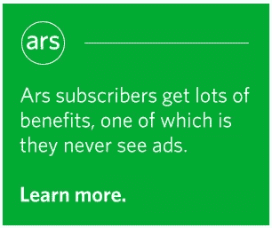
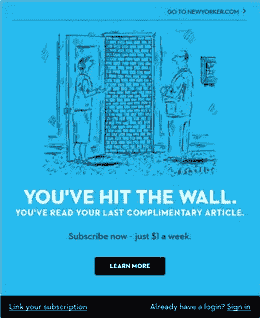

# 广告拦截者:不要和他们打；理解他们

> 原文：<https://www.sitepoint.com/ad-blockers-dont-fight-understand/>

根据一项名为 [Adblocking goes mainstream](http://downloads.pagefair.com/reports/adblocking_goes_mainstream_2014_report.pdf) 的研究，由为出版商提供广告拦截解决方案的 PageFair 和 Adobe 于 9 月份发布，在 2014 年 Q2 中，“Adblock 用户数量在过去 12 个月中增长了 69%”。根据国家的不同，使用广告拦截软件的在线人口可能高达 28%。

让我们从三个参与者的角度(出版商、广告商和用户)来看一下提出的问题，并从出版商的角度找到不同的内容货币化的方法。

## 出版商对广告商对用户

出版商、他们的用户和广告商都生活在同一个信息和货币流通的生态系统中。尽管如此，每个参与者对广告拦截概念都有自己的目标和观点。

出版商提供内容，并希望接触尽可能多的用户，同时将他们的工作货币化，以继续生产内容，支付费用，并从中获得一些利润。

第一个目标(接触用户)通常是通过向用户提供免费内容来实现的。免费内容可以无摩擦消费，但内容不是免费生产的。等式的货币化部分通常通过在内容中添加广告来保持免费来解决，因为将内容置于付费墙之后对大多数出版商来说往往不是很好。

当用户在浏览器中安装广告拦截软件时，他们消费的内容不会将广告费推给出版商，出版商不得不寻找其他方式来赚钱。

广告商希望通过向潜在消费者展示来推广产品和/或品牌。通过将他们的广告放在他们想要接触的特定人群感兴趣的内容旁边，他们可以获得有针对性的曝光。这是发行商进入游戏的地方。一个没有上下文内容的广告就像路边的广告牌:品牌曝光率很高，但就 <abbr title="Return on Investment">ROI</abbr> 而言，很难说它是否效果良好。

此外，有了访客浏览器上的广告拦截器，广告仍然可以被提供并被视为已打印，即使它们不再可见。这个问题与更普遍的[广告可见性问题](https://vimeo.com/digiday/review/112215366/41599585b0)很接近:即使没有人真正看到广告，广告仍然是由广告商付费的。

用户正在消费内容，而且习惯于免费，尤其是出生于 1980 年至 2000 年的千禧一代的营销人员。通过安装广告拦截器，这些用户表达了出版商和广告商都需要理解的强烈信息。此消息根据他们使用广告拦截软件的原因进行分段。

根据前面提到的调查，几乎一半的用户根本不想要广告，而三分之一的用户希望删除特定的广告，无论它们是分散注意力的(动画、声音)还是干扰性的(弹出窗口、插播广告、不可跳过的视频)。网页速度和电池寿命方面的性能，以及对第三方跟踪的隐私担忧也是用户安装广告拦截器的主要原因。

## 广告拦截器是如何工作的？

从浏览器的角度来看，广告是文档对象模型内容中的一串文本，它被解析以呈现在屏幕上。它可以包括普通的 HTML、JavaScript 或由特定服务器提供的任何内容。

通过在浏览器之前解析 DOM，广告拦截器插件检测到广告的签名(来自一个巨大的可能罪犯列表的文本字符串),并将其从 DOM 中删除。如果做得好，它足够快，用户永远不会知道那里有一个广告，除非在设计中出现一些怪异的不平衡的空白。

## 绕还是不绕？

知道它们是如何工作的，就有可能完全避开广告拦截器，例如通过动态地重新编码每个广告。广告的签名变得多态，有点像改编计算机病毒如何击败反病毒程序。这样就不可能列出签名，因为它们总是不同的。

但是作为一个出版商，你想成为少数几个把广告强加给用户的网站之一吗？

## 广告拦截的柔术

可以通过发布者网站上的 JavaScript 来检测广告拦截器的存在。这样，就有可能显示关于网站广告收入需求的免责声明，如下例所示。

然而，内容发布者可以找到其他方法:

*   让你的访问者在他们的广告拦截器参数中将你的网站列入白名单。如果你的访问者真正重视你提供的内容，他们会这样做，因为这里有几个广告，有一个非常小的价格来帮助你发布他们不断在你的网站上消费的内容。
*   显示优惠信息，邀请您的用户支付最低的费用来进行无广告导航。
*   通过一份不显眼的调查表询问他们为什么使用广告拦截器，这可以让你了解情况，并帮助你在未来更好地使用广告。
*   展示一些直接托管在你网站上的联盟内容(因此不是真正的广告，而是另一种将你网站的不动产货币化的方式)。

## 大玩家对此怎么看？

互动广告局(Interactive Advertising Bureau)是一个由 650 多家领先媒体和技术公司组成的广告商业组织，它强烈反对广告拦截器，因为它们被视为免费网络内容的经济自杀。在 [CNET 采访](http://www.cnet.com/news/ad-blockers-get-ad-group-execs-blood-boiling-q-a/)中，其执行副总裁 Mike Zaneis 表示，广告屏蔽从根本上来说是错误的，并造成了不可持续的经济形势，导致屏蔽者不得不被拒绝访问出版商的内容。

插件市场的领导者 AdBlock Plus 背后的公司 Eyeo GmbH 的争议甚至更大，因为他们默认阻止所有添加，同时要求广告商支付[未披露的金额](https://adblockplus.org/en/acceptable-ads-agreements#payment)以在[可接受的广告宣言](https://acceptableads.org/en/)的幌子下被列入白名单。由于这家公司的资金来源于广告，它同时又是法官和当事人，这对于像《卫报》这样的出版商来说[“可能看起来不太合胃口】。](http://www.theguardian.com/technology/2013/oct/14/the-tiny-german-company-threatening-the-internets-business-model)

[Ghostery](https://www.ghostery.com/) ，另一个广告拦截器同样也在两边活动，帮助用户躲避广告行业，同时向同一个行业[提供数据，正如 Mashable](http://mashable.com/2013/06/17/ad-blocker-helps-ad-industry/) 所解释的。

无论你对广告拦截软件有什么看法，这些插件被大量使用，而且可能会持续使用相当一段时间。因此，为了减轻他们对你的收入流的影响，你不应该仅仅依靠广告来获得收入，而是要找到其他的方法来将你的内容货币化。

## 对你的收入来源要有创造性

如果一个访问者屏蔽了你的广告，这可能是一个信号，表明你应该在收入来源上更有创造性。有很多方法可以将你的内容货币化，绕过广告拦截器并可能激怒你的用户的攻击性广告可能不是最好的方法。

### 联盟营销

通过显示和链接到与你的内容、你的人口统计数据或两者相关的特定产品，你可以向你的用户提供一种不像普通广告那样具有侵扰性的服务。您可以完全定制它的设计，并将其自然地集成到您的内容中。

### 按次付费

在按次付费模式中，用户可以消费一点你的内容，比如说一篇文章的第一部分，然后被要求支付少量费用才能阅读其余部分。

### 收费墙

付费墙模式是按次付费的推广。用户不是为一个内容付费，而是被要求为捆绑订阅付费，通常基于时间(例如，一个月内对所有内容的完全访问)。

在《纽约客》的毕业生付费墙实施中，用户可以每月免费阅读 6 篇文章，然后要求他们每周订阅 1 美元，为期三个月。

### 高级访问

在付费访问模式中，交易是停止付费显示广告。YouTube 是广告支持内容的主要参与者之一，[正在考虑](http://money.cnn.com/2014/10/28/technology/youtube-paid-subscription/index.html)付费订阅。

### 本土广告

原生广告——例如，广告或品牌内容——是编辑内容形式的广告。由于它模糊了内容和广告之间的界限，它绕过了任何广告过滤系统。但应该小心使用，因为如果出版商提供了太多对访问者没有实际价值的原生广告，他们将不再回来。

《纽约时报》是这一领域的领导者之一，正如你在这个例子中看到的那样。

### 通过其他渠道发送内容片段

“媒体版 iTunes”blend le 以单位向用户出售文章。《经济学人》和许多荷兰报纸已经通过这项 2014 年 4 月推出的服务以这种方式出售内容。10 月 27 日，纽约时报公司和 Axel Springer SE (Die Welt，Bild…) [进入其首都](http://www.businessweek.com/articles/2014-10-27/blendle-receives-new-york-times-axel-springer-investment-to-expand-its-itunes-for-articles)。在他们的模型中，70%的文章收入归出版商，20%的免费用户转化为付费用户。

### 重新打包旧内容

如果你的档案中有一个常青的内容宝库，另一个赚钱的方法是重新包装。给它带来一些背景，添加一个介绍，瞧，你现在可以把它作为电子书(见《纽约客》的 9/11 后的[)或应用程序(像《纽约客》的](http://www.amazon.com/Pages-New-Yorker-After-ebook/dp/B005I5GE34/)[数字革命](http://www.newyorker.com/news/news-desk/the-digital-revolution-an-ipad-anthology))出售。

### 捐款

维基百科背后的非营利组织维基媒体基金会定期在其旗舰网站上征集捐款。正如他们所说的，“我们不反对网络广告，也不反对其他广告公司。我们只是知道，在一个致力于教育和知识的项目中，尤其是在一个力求平衡和中立的项目中，广告并不合适。”

如果你是一个非营利组织，尤其是如果你的捐赠者可以将他们的捐款用于所得税减免，这无疑是一条出路。

但是要求捐款并不是非营利网站的专利。我们经常看到开发人员和设计师通过 PayPal 按钮要求一杯咖啡或一杯免费啤酒。但是也有其他的解决方案出现，例如 [Patreon](http://www.patreon.com) 提供了一个众包平台，具有类似的目标。经常性支付是唯一的选择，信用卡/借记卡和 PayPal 都是可以接受的，正如在经典的众包网站中一样，可以为特定的资金水平设定里程碑目标。

## 观察大出版商

正如我们在这篇文章中看到的，有许多方法可以将你的内容货币化，尤其是在这个广告拦截软件越来越流行的时代。

《纽约时报》是目前在货币化方面最具创新性的内容出版商之一，它尝试了不同层次的内容:由 T Brand Studio(其内部内容工作室)创建的原生广告、订阅应用程序(NYT 在线、纽约时报应用程序)、(研究生)付费墙和常规数字订阅、通过第三方渠道销售(和消费)的内容。关注他们的实验是监控不同内容盈利模式的好方法，这些实验被评论了很多，因此很容易发现。

## 分享这篇文章