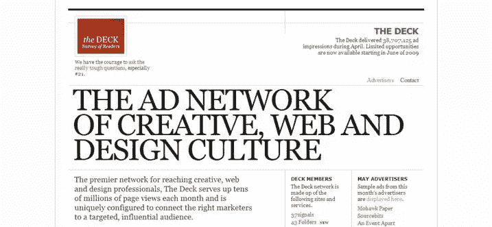
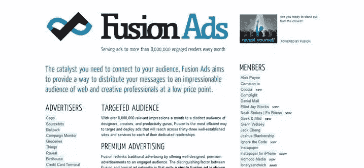

# 设计师的广告网络

> 原文：<https://www.sitepoint.com/ad-networks-for-designers/>

本周早些时候，我写了一些由少数大公司测试的[新广告单元](https://www.sitepoint.com/new-web-ads-now-even-more-in-your-face/)。今天，我想看看一些针对设计师感兴趣的特定在线社区的广告网络。

当谈到网站上的广告时，人们变得相当精明。很少有人会点击与他们搜索的内容不密切相关的广告，当然这也是像谷歌广告这样的内容敏感广告出现的地方。然而，设计者和开发者对他们希望他们的网站看起来怎么样很挑剔，这包括出现在他们网站上的广告。老实说，大多数文字链接广告看起来都很恐怖。

Deck 和 Fusion 广告是两个广告网络，它们可能有助于解决有针对性和较少侵扰的问题，同时也吸引有创造力的观众。我应该提到，目前，这些网站的会员资格只接受邀请。

[甲板](http://decknetwork.net)

从 2004 年的四个站点开始，Deck 现在有超过三十个成员站点。它提供干净、设计相关的广告。虽然许多广告网络都是关于每次点击成本，或每千成本(cpm)，甲板上谈论的是“每影响力成本”。如果被 Deck 接纳为会员，你只能在你的页面上显示他们的广告。没有谷歌 adwords 或其他广告是不允许的。

> 网站和应用程序只能通过邀请加入网络，并基于许多因素进行考虑，包括流量、设计、更新频率以及对网络总体目标的整体适用性。

你会看到他们目前的一些成员是像 [ffffound](http://ffffound.com/) 和[我喜欢排版](http://www.ilovetypography.com)这样的网站，非常有创意或设计相关的网站，有很多访问者。

[融合广告](http://www.fusionads.net)

FusionAds 于 2009 年 1 月推出，其广告模式与 Deck 非常相似。Fusion 广告直接针对有创造力的人，他们也坚持说他们的广告是页面上唯一的广告，并且显示在折叠上方。

> 每一页都显示一个单一的、不显眼的广告，赞助商就不必在其他广告客户中争夺注意力，读者也不会觉得被华而不实的横幅广告侮辱了。

一些以融合广告为特色的设计网站有[埃利奥特·杰伊·斯托克](http://www.elliotjaystocks.com/blog/)和[沃普斯皮尔](http://warpspire.com/)。

就我个人而言，我认为看到这种模式如何运作以及看到使用它的设计师的类型是很有趣的，如果你经营一个设计网站，这肯定是值得向往的。

作为一名设计师，你对这样的广告网络感兴趣吗？你怎么看待每页只有一个小广告的想法？

## 分享这篇文章