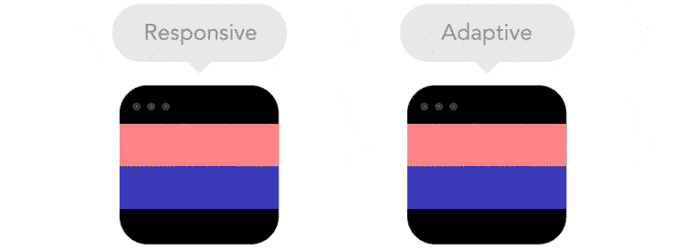

# 什么是适应性和响应性设计？

> 原文：<https://www.sitepoint.com/adaptive-design-different-responsive-design/>

响应式设计是一个我们现在都应该熟悉的术语，但是这个术语准确地描述了我们所认为的含义吗？我们已经知道“响应式设计”是指设计能在所有设备和屏幕尺寸上正确显示的网站的行为。但是一些人认为“适应性设计”是一个更好的名称。

*   这是真的吗，还是它们是一回事？
*   或者“适应性设计”完全意味着别的什么？
*   “流体设计”在这一切中处于什么位置？

虽然这听起来像是一个相当直截了当的问题，但经过一点调查，我发现这个问题比我想象的更模糊，甚至可能是完全有争议的。

对于适应性似乎有两种不同的定义:

## 定义 1:响应式设计是一个自拍杆——适应性设计是一把伞

在这个定义中，响应式设计的产品——就像自拍杆一样——可以在完全伸出、完全缩回和 ***之间的任何一点*** 的许多状态下使用。当然，某些宽度或断点比其他的更重要，但是每种不同的宽度都会产生稍微不同的布局。

适应性设计更像一把伞。它有预设的工作“状态”——打开挡雨，关闭运输。“中间状态”并不重要。

自拍杆 vs 雨伞

有许多 GIF 动画很好地说明了这个概念。

2015 年， [Geoff Graham](https://css-tricks.com/the-difference-between-responsive-and-adaptive-design/) 概述了他对这种差异的看法，称响应式布局在任何给定的时刻都适应浏览器的宽度*，而“自适应布局”仅在特定断点适应浏览器的宽度*。**

 *杰夫说，响应性设计是基于百分比的*(即与流体设计相同的东西)，适应性设计是基于固定测量单位*的*。两者都是由 CSS 媒体查询驱动的。*

## 定义 2:适应性设计对整个设备环境(不仅仅是屏幕)做出反应

但是，从 Geoff 的文章下面的[评论可以看出，并不是所有人都认同这个定义。](https://css-tricks.com/the-difference-between-responsive-and-adaptive-design/#comment-1597927)

下面是最热门的评论:

> 响应式设计可以是流动的，也可以是固定的，适应性也是如此。不同的是，响应式设计并不关心使用什么浏览器，它响应浏览器大小，并相应地重排布局。另一方面，自适应设计专门适应浏览器环境，可能会也可能不会考虑浏览器的当前大小。“⏤zzzzbov。

根据 zzzzBov 的定义，自适应设计是 JavaScript 驱动的，它不仅与屏幕尺寸有关，还与对设备类型的反应有关。例如，平板电脑可能有高分辨率屏幕，但它需要更大的触摸目标。手机可能需要不同的导航系统。

从 UXPin 到 Mozilla，许多知名人士都发表了自己的看法，但似乎仍未解决。

## 这是我对此事的看法

让我们用一个可调节的灯作为现实世界的例子:**响应式设计**是当你轻触开关时，灯*通过打开灯来响应*。**适应性设计**是当你能够调节/ *适应*灯以便你能看得更清楚。

如果一个网站对你的交互没有反应，那么它的反应就不是很快，如果它不能适应它的周围环境(比如设备屏幕)，那么它的适应性就不是很强。这两者都会对 UX 产生重大影响。

### 为什么响应性设计不是响应性设计

响应是另一个动作的结果，例如，如果一个网站按钮在用户悬停在它上面时改变了它的背景颜色，那么**动作**是悬停，而**响应**是被改变的背景颜色。

通常，当我们说一个网站是响应性的，我们的意思是它适应任何设备上的任何屏幕尺寸，但实际上，它*应该*是指它响应**用户交互**。原因如下:

用户**不能**在他们的移动设备上调整浏览器的大小。虽然用户*可以*改变*桌面*电脑上的浏览器大小，但他们通常不需要*这样做来与网站互动——这不是普通的*用户互动。当然，美国的网页设计师经常调整浏览器的大小来测试一个网站，但是对于用户来说这不是一个正常的行为。**

### 为什么我认为“适应性设计”更准确

由于屏幕尺寸通常在默认状态下使用(在某种意义上，你不能或不需要调整它的大小)，术语“适应性设计”可能更准确地符合这个要求。网站(至少是设计良好的网站)会修改它们的布局以适应用户的设备；这是一种不由自主的行为，意味着用户不必为了适应网站而与网站互动。适应性设计还可以描述我们如何优化更小的手持设备的加载时间和感知性能。

### 那么什么是流体设计呢？

早在 21 世纪初，大辩论是“固定布局与流动布局”。流体设计布局设置了百分比，**拉伸**以适应浏览器的框架。固定布局被设置为锁定由像素宽度确定的单个布局。

两者都不理想。固定的布局在右边的屏幕上看起来很棒，但是在小显示器上不可用。流体布局更加灵活，但在宽屏显示器上看起来又细又粘。

响应式设计是 Ethan Marcotte 对这些设计难题的直接回应——没有双关语。经典的“弹性”RWD 就像一个成熟的“成人”版本的流体设计——拉伸以填满窗户，但在必要时会重新组织。

Geoff 对适应性设计的定义——尽管许多人不同意——就像是“固定设计的成年版”——不是单一的固定布局，而是 3、4 或更多的布局。

### 结论

这就是我对响应性和适应性设计的看法。读完这篇文章后，你会改变谈论这些术语的方式吗，或者继续谈论响应式设计作为一种使网站适应多种屏幕尺寸的方式会更容易吗？

你是否曾经使用过“适应性设计”这个术语，而得到的只是一个茫然的眼神？

我很好奇，在下面的评论里告诉我吧！

*(请不要打架！).*

## 分享这篇文章*