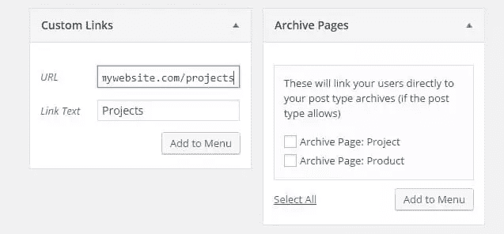

# 快速提示:添加存档页面到 WordPress 菜单生成器

> 原文：<https://www.sitepoint.com/add-archive-pages-to-the-wordpress-menu-builder/>

当你用`add_post_type`创建新的内容类型时，你可以指定你是否想通过 WordPress 菜单构建器访问你的单个文章，给你快速访问你的单个文章的链接。

这是一个非常有用的特性，要利用它，您需要做的就是将`add_to_menu`属性设置为 true。什么是*不那么容易*是如果你想直接链接到你的文章类型档案页面。



为您的档案创建一个简单的界面。

默认情况下，WordPress 并没有提供一个简单的方法来链接到你的文章类型档案。这是有意义的，因为在 WordPress 内部，像你的博客一样处理`post`内容类型(由你站点的阅读设置控制),而`page`内容类型不需要存档页面。然而，如果我们有自定义的文章类型，把它们作为菜单项会很好，这样很容易链接到它们(而不必依赖于使用自定义的菜单元素)。

## 创建简单的插件

第一步是创建一个基本插件来保存我们的代码。如果你是 WordPress 插件开发新手，有很多很棒的插件教程，包括 SitePoint 上的这些文章:

*   [面向初学者的 WordPress 插件开发](https://www.sitepoint.com/wordpress-plugin-development-beginners/)
*   [WordPress 插件开发简介](https://www.sitepoint.com/an-introduction-to-wordpress-plugin-development/)

在本文中，我们不会做任何过于复杂的事情，但是将功能封装在一个插件中是一个很好的做法，这样它就可以跨不同的站点重新部署。

首先，我们需要创建一个新的文件夹并添加一个新的 PHP 文件。在这个文件中，让我们创建我们的主插件类，并添加我们需要的基本结构。

```
/*
Plugin Name: Add Archive Pages to Menu
Plugin URI: https://elevate360.com.au/plugins/archive-page
Description: Adds a new metabox item to WordPress's menu builder. Allows quick access to add your post types archive pages instead of having to rely on custom links 
Version: 1.0.0
Author: Simon Codrington
Author URI: http://simoncodrington.com.au
Text Domain: archive-pages-to-menu
Domain Path: /languages
*/

//main plugin class
class el_archive_pages_menu{

    public function __construct(){
        add_action('admin_init', array($this, 'add_meta_box'));
    }
    //add metabox to the navmenu builder
    public function add_meta_box(){
    }
    //output for the metabox
    public function display_meta_box(){

    }

}
$el_archive_pages_menu = new el_archive_pages_menu(); 
```

这里没什么特别的。如果你打算重新发布插件，请随意修改插件标题信息。

## 向菜单生成器添加自定义元框

我们想要模仿 WordPress 已经处理添加元素到菜单生成器的方式，用一个简单易用的左侧内容选择器。

我们挂钩到`add_meta_boxes`动作来添加一个定制的元框。秘诀是使用正确的`context`,使其在正确的位置输出。添加以下内容:

```
//register our meta box for our links
public function add_meta_box(){
        add_meta_box(
            'el_archive_page_menu_metabox',
            __('Archive Pages', 'archive-pages-to-menu'),
            array($this, 'display_meta_box'),
            'nav-menus',
            'side',
            'low'
        );
    } 
```

## 定制我们的元盒

这里是所有奇迹发生的地方。大部分功能是基于 WordPress 如何使用左边的“自定义”链接类型元素来添加菜单项，我们只是根据我们的需要重新调整它的用途。

将下面的内容复制到我们之前定义的`display_meta_box`函数中。为了让元框看起来正确，你需要像我下面做的那样定义你的标记。WordPress 使用类名和 ID 的组合来实现整个“添加到菜单”功能。简而言之，我会让下面的标记工作起来，然后如果你需要做一些有趣的事情，就修改它。

```
//displays a metabox that will let users link directly to post type archives
public function display_meta_box(){

    ?>
    <div id="posttype-archive-pages" class="posttypediv">
        <div id="tabs-panel-archive-pages" class="tabs-panel tabs-panel-active">
            <p>These will link your users directly to your post type archives (if the post type allows)</p>
            <ul id="archive-pages" class="categorychecklist form-no-clear">
                <!--Custom -->
                <?php
                //loop through all registered content types that have 'has-archive' enabled 
                $post_types = get_post_types(array('has_archive' => true));
                if($post_types){
                    $counter = -1;
                    foreach($post_types as $post_type){
                        $post_type_obj = get_post_type_object($post_type);
                        $post_type_archive_url = get_post_type_archive_link($post_type);
                        $post_type_name = $post_type_obj->labels->singular_name;
                        ?>
                        <li>
                            <label class="menu-item-title">
                                <input type="checkbox" class="menu-item-checkbox" name="menu-item[<?php echo $counter; ?>][menu-item-object-id]" value="-1"/>Archive Page: <?php echo $post_type_name; ?>
                            </label>
                            <input type="hidden" class="menu-item-type" name="menu-item[<?php echo $counter; ?>][menu-item-type]" value="custom"/>
                            <input type="hidden" class="menu-item-title" name="menu-item[<?php echo $counter; ?>][menu-item-title]" value="<?php echo $post_type_name; ?>"/>
                            <input type="hidden" class="menu-item-url" name="menu-item[<?php echo $counter; ?>][menu-item-url]" value="<?php echo $post_type_archive_url; ?>"/>
                            <input type="hidden" class="menu-item-classes" name="menu-item[<?php echo $counter; ?>][menu-item-classes]"/>
                        </li>
                        <?php
                        $counter--;
                    }
                }?>     
            </ul>
        </div>
        <p class="button-controls">
            <span class="list-controls">
                <a href="<?php echo admin_url('nav-menus.php?page-tab=all&selectall=1#posttype-archive-pages'); ?>" class="select-all"> <?php _e('Select All', 'archive-pages-to-menu' ); ?></a>
            </span>
            <span class="add-to-menu">
                <input type="submit" class="button-secondary submit-add-to-menu right" value="<?php _e('Add to Menu', 'archive-pages-to-menu') ?>" name="add-post-type-menu-item" id="submit-posttype-archive-pages">
                <span class="spinner"></span>
            </span>
        </p>
    </div>
    <?php
} 
```

该功能分为两个部分:上面部分显示了我们所有的选项，下面部分包含全选和添加按钮。

### 重要注意事项

这里需要关注一些事情，因为它们会影响功能的工作方式:

1.  顶层 div 的 ID 必须与用于向菜单添加项目的 submit 按钮相关。在我们的例子中，div 的 ID 是`posttype-archive-pages`，提交按钮的 ID 是`submit-posttype-archive-pages`。此外，在`list-controls`元素中有一个链接，用作全选按钮。您需要确保您的 ID 也添加在这里，例如`admin_url('nav-menus.php?page-tab=all&selectall=1#posttype-archive-pages');`
2.  为了让我们的功能正常工作，我们查询所有启用了存档的文章类型。然后我们遍历每个页面并获取它们的存档页面链接。只有隐式注册到存档的文章类型才会出现在这里。
3.  当循环显示我们的文章类型时，我们在输入的名称中使用一个负的计数器变量，这是故意的，因为出于某种原因 WordPress 希望这些是负的。
4.  该系统的工作方式是基于每个`li`项目的隐藏输入值。这些很重要，因为它们告诉菜单构建器这是什么类型的元素。对于我们的例子，我们利用`custom`类型并传递我们的值。

这里有一些移动的部分，但是我们模仿 WordPress 的功能，并根据我们自己的目的进行修改。在这个过程的最后，您应该会看到我们的自定义选择器。

## 把一切都包起来

这就是全部了。你现在应该有一个简单易用的 meta box，可以让你快速地将你的存档页面添加到你的 WordPress 菜单中。你不需要手动输入你的存档页面的 URL，插件会自动完成。另一个好处是，如果你改变了重写规则(漂亮的永久链接), URL 会自动更新。

使用这个插件和我们今天看到的想法，你可以在此基础上扩展并创建额外的元框来添加任何自定义链接和数据到你的 WordPress 菜单生成器。

## 分享这篇文章