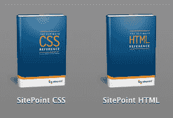
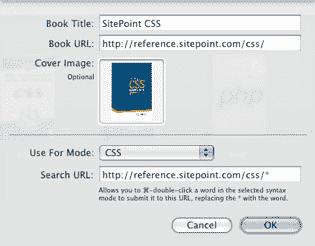

# 向 Coda 添加 SitePoint 引用

> 原文：<https://www.sitepoint.com/adding-the-sitepoint-references-to-coda/>

*以下转载自 SitePoint 设计视图，[第 52 期](https://www.sitepoint.com/the-second-coming-of-the-productivity-tool/)*

Mac 用户无疑会知道 [Coda](http://panic.com/coda/) ，这是一个流行的文本编辑器，用于从头开始构建网页。

Coda 如此受欢迎的一个原因是它将构建网页的工作流程整合到了一个窗口中——你可以在一个应用程序中浏览、编辑、预览、上传和更改文件权限。对于那些因为打开五个不同的应用程序来执行所有这些任务而感到沮丧的设计师来说，Coda 是一个天赐之物。

在 Coda 中还可以执行另一项任务，那就是查找参考信息。默认情况下，可用的参考书很少，但是你可以通过添加我们认为最好的参考书来扩展这个集合——SitePoint[HTML](https://reference.sitepoint.com/html/)和 [CSS](https://reference.sitepoint.com/css/) 参考。

下面是如何做的(向最先记录此事的乔恩·希克斯致敬):

1.  **点击图书选项卡(Command-6)，选择底部的 *+* 按钮，添加一本新书。**

2.  **在出现的对话框中，输入以下信息**(在本例中，我们将使用 SitePoint CSS 引用，但只是用“html”替换“CSS”来添加 SitePoint HTML 引用):

    **书名:** *SitePoint CSS*
    **图书网址:***https://reference.sitepoint.com/css/*
    **使用方式:** *CSS*
    **搜索网址:***https://reference.sitepoint.com/css/**

3.  **接下来，将这本书的图像拖到*封面图像*区域。**我们为此制作了几张图片，您可以从这里下载:

    *   [HTML 参考封面图片](https://i2.sitepoint.cimg/coda/sitepoint_html_ref-coda.jpg) (JPG，92 KB)
    *   [CSS 参考封面图片](https://i2.sitepoint.cimg/coda/sitepoint_css_ref-coda.jpg) (JPG，92 KB)

    ****

4.  **点击确定，你的书就会出现在 Coda 中！**

在 Coda 中拥有这些参考信息(除了语法信息和[实例](https://reference.sitepoint.com/css/demos))的好处在于，您可以使用在线参考中列出的浏览器兼容性图表来检查 HTML 标签或 CSS 属性的浏览器兼容性。

我们有宏伟的计划为其他编辑工具提供类似的参考资料集成。我们的目标是让尽可能多的网页设计者和开发者可以使用这些参考资料——敬请期待这方面令人兴奋的公告！

## 分享这篇文章