# 高级 CSS3 2D 和 3D 变换技术

> 原文：<https://www.sitepoint.com/advanced-css3-2d-and-3d-transform-techniques/>

使用 Flash 和 GIF 图像创建动画图形的日子已经一去不复返了。是时候展示一些最好的 CSS3 功能了。

CSS3 transform 在 web 上已经存在很长时间了。像 Mozilla、Google Chrome 和 Opera 这样的浏览器完全支持 CSS3 2D 和 3D 变换技术。

在本文中，您将了解到:

1.  CSS3 2D 变换技术
2.  CSS3 3D 变换技术
3.  什么是视角？
4.  和许多不同的变换函数

我还准备了演示，向您展示如何制作:

1.  3D 翻牌
2.  3D 立方体或骰子

你可能想到的第一个问题是，为什么我们需要动画和图形的 CSS3 转换？嗯，答案很简单，**更快的网页**！

是的，与沉重的 GIF 图像和 Flash 内容相比，CSS 动画是非常轻的。此外，谷歌在 SEO 评分方面对 Flash 内容的评价并不高。如果你的网站中使用的动画也被机器人和搜索引擎阅读会怎么样？从你的 SEO 角度来看，这难道不是一个额外增加的功能吗？

## 了解 CSS3 2D 变换

CSS3 2D 变换给你更多的自由来装饰和动画 HTML 组件。你甚至有更多的功能来装饰文本和更多的动画选项来装饰`div`元素。CSS3 2D 变换包含如下一些基本函数:

*   `translate()`
*   `rotate()`
*   `scale()`
*   `skew()`
*   `matrix()`

### 翻译

使用`translate()`功能，您可以将`div`和文本从它们原来的位置移动到任何 x-y 坐标，而不会影响其他 HTML 组件。例如:

```
div{ 
    transform: translate(20px,20px); 
}
```

上面的代码将`div`元素在 x 方向平移 20px，在 y 方向平移 20px。

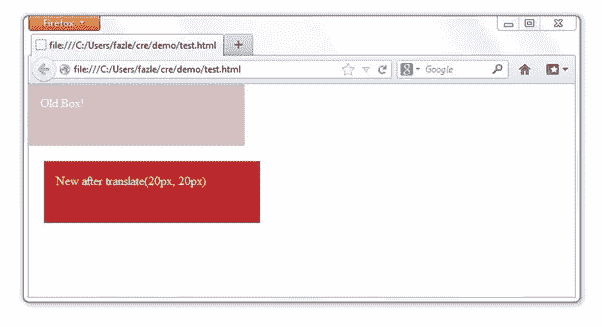

*注意:浏览器中的 x-y 坐标定位与几何图形中的不同。正的 x 值意味着将对象向右移动，而正的 y 值意味着将其向 y 方向的底部移动。`(0,0)`坐标是指浏览器的左上角。*

对于像 Opera、Chrome 和更老的 Firefox 这样的浏览器，您必须使用`–webkit-`、`-moz-`和`–o-`前缀作为转换属性。CSS3 转换并没有被所有的浏览器完全接受，但是主要的浏览器都支持它们，并提供了上述厂商提供的前缀。

### 辐状的

`rotate` transform 函数将指定的 HTML 元素旋转到给定的角度。旋转是顺时针的，从 0 度到 360 度。旋转是在 x-y 平面内完成的。

```
div{ 
    transform: rotate(30deg); 
}
```

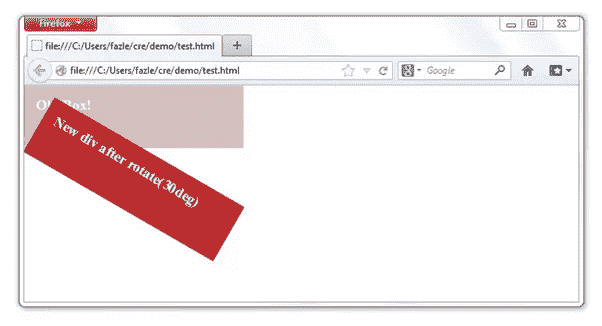

### 规模

顾名思义，它将旧的 div 缩放到指定的新大小。这种缩放发生在 x 和 y 方向。您可以通过给`scale()`功能指定参数值来控制缩放量。

```
div{ 
    transform: scale(2,4); 
}
```

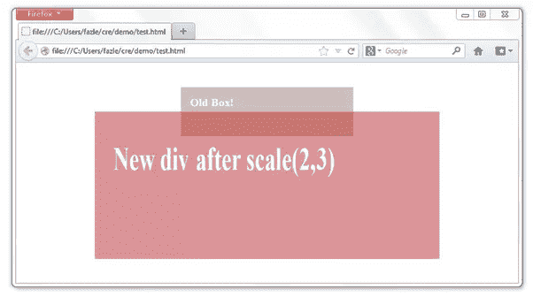

### 斜交

当一个`skew`变换函数应用于一个元素时，该元素弯曲到参数表中提供的指定量。您必须指定 x 方向和 y 方向的角度值。

```
div{ 
    transform: skew(30deg,20deg); 
}
```

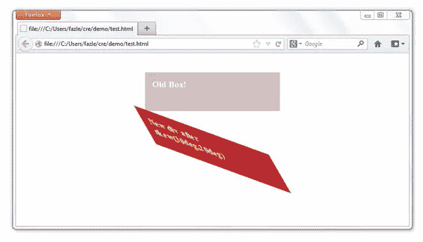

### [数]矩阵

`matrix`变换函数的工作就是将上述所有的 2D 变换函数组合成一个属性。这些值以[线性变换矩阵](http://en.wikipedia.org/wiki/Linear_transformation#Examples_of_linear_transformation_matrices)的形式出现。

```
div{ 
    transform: matrix(1.0, 2.0, 3.0, 4.0, 5.0, 6.0); 
}
```

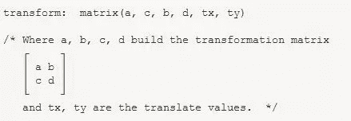

## CSS3 3D 转换

既然你已经完成了 2D 变换的基础，理解 3D 变换对你来说就不是一件难事了。3D 变换包括 HTML 元素的 Z 轴变换。我们将讨论 3D 转换中使用的每个新属性。

*   `translate3d(<translation-value>, <translation-value>, <length>)`:定义一个 3D 平移。它需要三个参数 x，y 和 z 值。Z 值指定 Z 轴上的平移。
*   `translateZ(<length>)`:仅在 Z 方向定义平移，使用此转换功能。它的工作原理类似于`translateX()`和`translateY()`。
*   `scale3d(<number>, <number>, <number>)`:该功能在所有三个维度上进行缩放。它有三个参数 sx，sy 和 sz。每个值定义了各自方向上的缩放比例。
*   `scaleZ(<number>)`:就像`translate()`函数一样，我们也有`scaleZ()`函数，它只定义一个方向的缩放，即 Z 方向。我们还有`scaleX()`和`scaleY()`功能，它们的工作方式与`scaleZ()`类似，但方向不同。
*   `rotate3d(<number>, <number>, <number>, <angle>)`:按照前三个数字指定的[tx，ty，tz]向量中最后一个参数提供的指定角度旋转单个 HTML 元素。
*   `rotateX(<angle>)`、`rotateY(<angle>)`和`rotateZ(<angle>)`只取一个角度值在各自的轴上旋转。

注:`rotate3d(1,0,0,30deg)`等于`rotateX(30deg)`，`rotate3d(0,1,0,30deg)`等于`rotateY(30deg)`，`rotate3d(0,0,1,30deg)`等于`rotateZ(30deg)`。

### 远景

使用 CSS 的 3D 变换的主要部分是透视。要激活 3D 空间以进行 3D 变换，您需要激活它。这种激活可以通过以下两种方式完成:

`transform: perspective(500px);`

或者

`perspective: 500px;`

功能符号用于激活单个元素，而第二个符号用于同时将透视应用于多个元素。

### 转换样式

这是 3D 空间中的另一个重要属性。它需要两个值:`preserve-3d`或`flat`。当变换样式值为`preserve-3d`时，它会告诉浏览器子元素也应该位于 3D 空间中。另一方面，当该属性的值为`flat`时，表示子元素存在于元素本身的平面上。

### 让我们开始工作

在本节中，我们将尝试学习如何激活 3D 空间和应用 3D 变换不同的功能，如上所述。在下面的程序中，我们将创建一个蓝色的正方形，然后在 Y 轴上旋转 30 度。

**HTML**

```
<section id="blue" class="container"> 
    <div></div> 
</section>
```

**CSS**

```
/* styling a container of size 200px X 200px that will contain the object */ 
.container{ 
    width:200px; 
    height:200px; 
    margin:40px auto; 
    position:relative; 
}
/* activating the 3D space */ 
#blue{ 
    perspective: 600px; 
} 
/* coloring the box and rotating it by 30 degrees in the 3D space */ 
#blue .box{ 
    background:blue; 
    transform: rotateY(30deg); 
    -moz- transform: rotateY(30deg); 
    -webkit- transform: rotateY(30deg); 
    -o- transform: rotateY(30deg); 
}
```

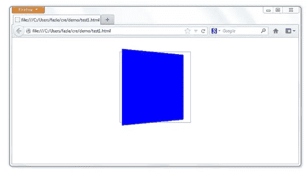

同样，您可以对上图应用不同的`translate()`、`scale()`和`rotate()`功能，并观察图形方向如何变化。我在下面给出了一个截图，显示了一个`translateZ()`转换。

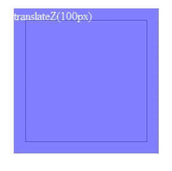

## CSS3 3D 转换演示

### 1)翻牌

现在我们已经了解了 2D 和 3D 变换的基础，我们将做一些实际的演示，看看我们如何在日常网站中使用它们。我将向你展示如何使用 CSS3 3D 变换制作翻牌动画。该卡正面有苹果的标志，背面有三星的标志，翻转时会露出 SitePoint 的标志。有意思不是吗？

| 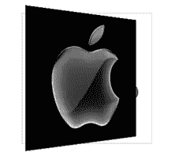 | 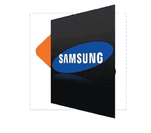 | 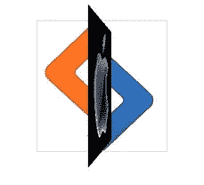 |

**HTML**

```
<section class="container"> 
    <div id="card"> 
    <figure></figure>
    <figure></figure> 
</div> </section> 
<a href="#">flip it!</a>
```

**CSS**

```
/* Design container */ 
.container { 
    width: 250px; 
    height: 250px; 
    position: relative; 
    margin: 40px auto; 
    border: 1px solid #999999; 
    -webkit-perspective: 600px; 
    -moz-perspective: 600px; 
    -o-perspective: 600px; 
    perspective: 600px; 
}
```

容器是正方形的，每边的尺寸是 250 像素。我们还给出了将容器放置在屏幕中央的边距。为了激活 3D 空间，我们还将预期属性设置为 600 像素。由于这是主容器，我将背景图片设置为 SitePoint 的徽标。现在，当卡片翻转时，这个背景就会显现出来。

**CSS**

```
/* styling card element */ 
#card { 
    width: 100%; 
    height: 100%; 
    position: absolute; 
    -webkit-transition: -webkit-transform 1s; 
    -moz-transition: -moz-transform 1s; 
    -o-transition: -o-transform 1s; 
    transition: transform 1s; 
    -webkit-transform-style: preserve-3d; 
    -moz-transform-style: preserve-3d; 
    -o-transform-style: preserve-3d; 
    transform-style: preserve-3d; 
}
```

因为`height`和`width`被设置为 100%，所以卡片`div`采用父容器元素的尺寸。我们已经用`transition`属性定义了转换应该发生多长时间。它被设置为`1s`来制作 1 秒钟的翻转动画。属性确保这个卡片的子元素`div`的 3D 空间也被激活。默认情况下，如果父元素的 3D 空间被激活，则只有其直接子元素继承 3D 激活。所以在这个例子中`transform-style`告诉子 div 的子继承 3D 激活。

**CSS**

```
/* styling figure elements */ 
#card figure { 
    display: block; 
    height: 100%; 
    width: 100%; 
    position: absolute; 
    margin:0px; 
    -webkit-backface-visibility: hidden; 
    -moz-backface-visibility: hidden; 
    -o-backface-visibility: hidden; 
    backface-visibility: hidden; 
}
```

我们已经将`backface-visibility`属性设置为隐藏，所以卡片是不透明的。你也可以试着把它设置成`transparent`，看看你会得到什么效果。

**CSS**

```
#card .front {

    background: url('apple.jpg');

}

#card .back {

    background: url('samsung.jpg');

    -webkit-transform: rotateY( 180deg );

    -moz-transform: rotateY( 180deg );

    -o-transform: rotateY( 180deg );

    transform: rotateY( 180deg );

}
```

我们使用了两个图像，`apple.jpg`和`samsung.jpg`，作为前图和后图的背景。

现在我们几乎已经设置好了一切，我们需要另一个名为“flipped”的类并设置 transform 属性。该类将使用任何客户端脚本在客户端动态设置。在这种情况下，我使用了 jQuery。“翻转”类样式设置如下:

**CSS**

```
#card.flipped { 
    -webkit-transform: rotateY( 180deg ); 
    -moz-transform: rotateY( 180deg ); 
    -o-transform: rotateY( 180deg ); 
    transform: rotateY( 180deg ); 
}
```

要运行动画，请添加一个额外的 HTML 链接标记或按钮，并按如下方式设置 click 事件:

**jQuery 代码**

```
$(document).ready(function(){ 
    $("a").click(function(){ 
        $("#card").toggleClass("flipped"); 
    }); 
});
```

如您所见，我们使用了链接的`click`属性，并设置了一个`callback`函数。该函数的任务是将卡片 div 的类切换到“翻转”状态。

恭喜你。您已经制作了翻牌动画。转到浏览器并查看动画。那不是很容易吗？:)

[现场演示](http://extremecss.com/demos/card-flip/)

### 2)3D 旋转立方体

现在让我们试试更复杂的东西。这次我们将有六张面孔，而不是只有两张。我们将设计每张脸的样式，将它们设置到合适的方向，最后制作动画。立方体的每个面都会显示面号。

| 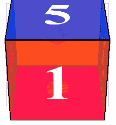 | 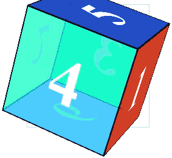 | 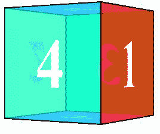 |
|  | 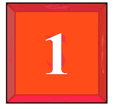 |  |

**HTML**

```
<section class="container"> 
    <div id="cube"> 
        <figure>1</figure> 
        <figure>2</figure> 
        <figure>3</figure> 
        <figure>4</figure> 
        <figure>5</figure> 
        <figure>6</figure> 
    </div> 
</section> 
<a href=”#”>Rotate it!</a>
```

现在我们有了立方体的基本 HTML 结构。主`div`“立方体”有六个子“figure”元素，用于立方体的每一边。让我们开始设计它们。

**CSS**

```
/* First the container styles */ 
.container { 
    width: 200px; 
    height: 200px; 
    position: relative; 
    -webkit-perspective: 1000px; 
    -moz-perspective: 1000px; 
    -o-perspective: 1000px; 
    perspective: 1000px; 
    margin: 0 auto 40px; 
    border: 1px solid #CCC; 
}
```

标记我们已经使用`perspective`属性激活了 3D 空间。

**CSS**

```
#cube { 
    width: 100%; 
    height: 100%; 
    position: absolute; 
    -webkit-transform-style: preserve-3d; 
    -moz-transform-style: preserve-3d; 
    -o-transform-style: preserve-3d; 
    transform-style: preserve-3d; 
    -webkit-transform: translateZ( -100px ); 
    -moz-transform: translateZ( -100px ); 
    -o-transform: translateZ( -100px ); 
    transform: translateZ( -100px ); 
    -webkit-transition: -webkit-transform 0.5s; 
    -moz-transition: -moz-transform 0.5s; 
    -o-transition: -o-transform 0.5s; 
    transition: transform 0.5s; 
}
```

对于立方体，我们使用了与翻牌示例中相同的`preserve-3d`来转换属性。我们在这个例子中做的另一件事是在 z 方向平移整个立方体-100px。在这个例子的后面，我们将会看到，立方体在 z 方向的正面总是向前平移 100 像素。所以，为了让文字显得朦胧，我们把整个立方体——100px 都往后移了。

**CSS**

```
#cube figure { 
    width: 196px; 
    height: 196px; 
    display: block; 
    position: absolute; 
    border: 2px solid black; 
    line-height: 196px; 
    font-size: 120px; 
    font-weight: bold; 
    color: white; 
    text-align: center; 
    margin:0px; 
}
```

以上样式将设置每一面的一般 CSS。它们的尺寸应该是正方形，并且有 2px 的黑色边框。

**CSS**

```
/* Applying a unique color to each face */ 
#cube .front  { background: hsla(   0, 100%, 50%, 0.7 ); } 
#cube .back   { background: hsla(  60, 100%, 50%, 0.7 ); } 
#cube .right  { background: hsla( 120, 100%, 50%, 0.7 ); } 
#cube .left   { background: hsla( 180, 100%, 50%, 0.7 ); } 
#cube .top    { background: hsla( 240, 100%, 50%, 0.7 ); } 
#cube .bottom { background: hsla( 300, 100%, 50%, 0.7 ); }
```

**CSS**

```
/* Giving the desired orientation to each side of the cube */ 
#cube .front  { 
    -webkit-transform: rotateY(   0deg ) translateZ( 100px ); 
    -moz-transform: rotateY(   0deg ) translateZ( 100px ); 
    -o-transform: rotateY(   0deg ) translateZ( 100px ); 
    transform: rotateY(   0deg ) translateZ( 100px );
} 
#cube .back   { 
    -webkit-transform: rotateX( 180deg ) translateZ( 100px ); 
    -moz-transform: rotateX( 180deg ) translateZ( 100px ); 
    -o-transform: rotateX( 180deg ) translateZ( 100px ); 
    transform: rotateX( 180deg ) translateZ( 100px );
} 
#cube .right  { 
    -webkit-transform: rotateY(  90deg ) translateZ( 100px ); 
    -moz-transform: rotateY(  90deg ) translateZ( 100px ); 
    -o-transform: rotateY(  90deg ) translateZ( 100px ); 
    transform: rotateY(  90deg ) translateZ( 100px ); 
} 
#cube .left   { 
    -webkit-transform: rotateY( -90deg ) translateZ( 100px ); 
    -moz-transform: rotateY( -90deg ) translateZ( 100px ); 
    -o-transform: rotateY( -90deg ) translateZ( 100px ); 
    transform: rotateY( -90deg ) translateZ( 100px ); 
} 
#cube .top    { 
    -webkit-transform: rotateX(  90deg ) translateZ( 100px ); 
    -moz-transform: rotateX(  90deg ) translateZ( 100px ); 
    -o-transform: rotateX(  90deg ) translateZ( 100px ); 
    transform: rotateX(  90deg ) translateZ( 100px ); 
} 
#cube .bottom { 
    -webkit-transform: rotateX( -90deg ) translateZ( 100px ); 
    -moz-transform: rotateX( -90deg ) translateZ( 100px ); 
    -o-transform: rotateX( -90deg ) translateZ( 100px ); 
    transform: rotateX( -90deg ) translateZ( 100px ); 
}
```

现在我们已经准备好了一个 3D 非旋转立方体。最后，我们必须为每一方编写转换样式，我们将通过使用 jQuery 动态应用正确的类来实现。

**CSS**

```
#cube.show-front  { 
    -webkit-transform: translateZ( -100px ) rotateY(    0deg ); 
    -moz-transform: translateZ( -100px ) rotateY(    0deg ); 
    -o-transform: translateZ( -100px ) rotateY(    0deg ); 
    transform: translateZ( -100px ) rotateY(    0deg ); 
} 
#cube.show-back   { 
    -webkit-transform: translateZ( -100px ) rotateX( -180deg ); 
    -moz-transform: translateZ( -100px ) rotateX( -180deg ); 
    -o-transform: translateZ( -100px ) rotateX( -180deg ); 
    transform: translateZ( -100px ) rotateX( -180deg ); 
} 
#cube.show-right  { 
    -webkit-transform: translateZ( -100px ) rotateY(  -90deg ); 
    -moz-transform: translateZ( -100px ) rotateY(  -90deg ); 
    -o-transform: translateZ( -100px ) rotateY(  -90deg ); 
    transform: translateZ( -100px ) rotateY(  -90deg ); 
} 
#cube.show-left   { 
    -webkit-transform: translateZ( -100px ) rotateY(   90deg ); 
    -moz-transform: translateZ( -100px ) rotateY(   90deg ); 
    -o-transform: translateZ( -100px ) rotateY(   90deg ); 
    transform: translateZ( -100px ) rotateY(   90deg ); 
} 
#cube.show-top    { 
    -webkit-transform: translateZ( -100px ) rotateX(  -90deg ); 
    -moz-transform: translateZ( -100px ) rotateX(  -90deg ); 
    -o-transform: translateZ( -100px ) rotateX(  -90deg ); 
    transform: translateZ( -100px ) rotateX(  -90deg ); 
} 
#cube.show-bottom { 
    -webkit-transform: translateZ( -100px ) rotateX(   90deg ); 
    -moz-transform: translateZ( -100px ) rotateX(   90deg ); 
    -o-transform: translateZ( -100px ) rotateX(   90deg ); 
    transform: translateZ( -100px ) rotateX(   90deg ); 
}
```

最后，我们准备使用 jQuery 编写回调函数。一旦“旋转！”链接被单击。

**jQuery**

```
$(document).ready(function(){ 
    var ctr=0; 
    var panel=""; 
        $("a").click(function(){ 
            ctr++; 
            if(ctr==1){ 
                $("#cube").toggleClass("show-back"); 
                $("#cube").removeClass(panel); 
                panel="show-back"; 
            } 
            if(ctr==2){ 
                $("#cube").toggleClass("show-right"); 
                $("#cube").removeClass(panel); 
                panel="show-right"; 
            } 
            if(ctr==3){ 
                $("#cube").toggleClass("show-left"); 
                $("#cube").removeClass(panel); 
                panel="show-left";
            } 
            if(ctr==4){ 
                $("#cube").toggleClass("show-top"); 
                $("#cube").removeClass(panel); panel="show-top"; 
            } 
            if(ctr==5){ 
                $("#cube").toggleClass("show-bottom"); 
                $("#cube").removeClass(panel); 
                panel="show-bottom"; 
            } 
            if(ctr==6){ 
                $("#cube").toggleClass("show-front"); 
                $("#cube").removeClass(panel); 
                panel="show-front"; ctr=0; 
            } 
        }); 
});
```

[现场演示](http://extremecss.com/demos/cube/)

恭喜你。你也通过了这次演示！我希望你已经理解了什么是 CSS3 转换，以及我们如何在我们的网站中使用它来制作动画。

CSS3 3D transform 的一些其他可能的实现可以是滑块、图像轮播、像 Google+ photo album 这样的动画图像相册等。

如果你喜欢读这篇文章，你会爱上[可学的](https://learnable.com?utm_source=sitepoint&utm_medium=link&utm_campaign=learnablelink)；向大师们学习新技能和技术的地方。会员可以即时访问 SitePoint 的所有电子书和交互式在线课程，如真实世界的 [HTML5 & CSS3。](https://learnable.com/courses/html5-css3-for-the-real-world-1484?utm_source=sitepoint&utm_medium=link&utm_campaign=learnablelink)

对本文的评论已经关闭。对 CSS 有疑问？为什么不在我们的[论坛](https://www.sitepoint.com/forums/forumdisplay.php?53-CSS-amp-Page-Layout?utm_source=sitepoint&utm_medium=link&utm_campaign=forumlink)上问呢？

## 分享这篇文章