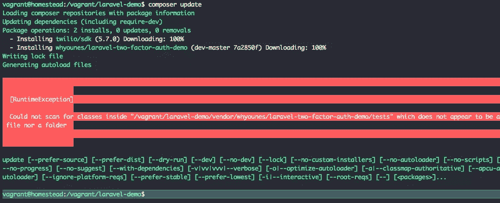
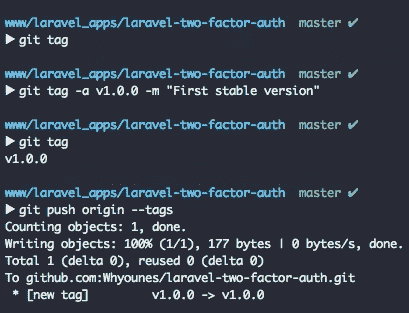
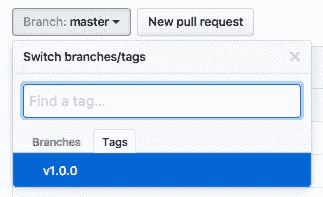

# 另一个 Laravel 包开发工作流程

> 原文：<https://www.sitepoint.com/alternative-laravel-package-development-workflow/>

*本文由 [Francesco Malatesta](https://www.sitepoint.com/author/fmalatesta/) 进行了同行评审。感谢 SitePoint 的所有同行评审员使 SitePoint 的内容尽可能做到最好！*

* * *

每个框架都给开发人员提供了一种使用包/扩展来扩展系统的方法。我们通常可以在任何想要提供特定功能的地方挂接我们的逻辑，Laravel 也不例外！在我的合著者 [Francesco Malatesta](https://www.sitepoint.com/author/fmalatesta/) 关于他的 Laravel 包开发工作流程的文章之后，我注意到我的有点不同，我想和你分享一下！


## 演示包

作为一个演示包，我们将为这篇[文章](https://www.sitepoint.com/secure-laravel-apps-2fa-via-sms/)构建一个 Laravel 双因素认证包。该软件包将处理用户认证，并通过像 [Nexmo](https://www.nexmo.com/) 、 [Twilio](https://www.twilio.com/) 等媒介发送验证码。你可以在这里查看最终版本。

## 设置存储库

在我们开始开发之前，我们需要在 GitHub 中创建一个新的存储库，这样我们就可以在开发阶段推/拉它。

[Composer](https://www.sitepoint.com/php-dependency-management-with-composer/) 在`composer.json`文件中支持一个`repositories`键。我们可以用它来指定 Packagist 上还不存在的定制包。

```
{
    // ....
    "repositories": [
        {
            "type": "vcs",
            "url": "https://github.com/Whyounes/laravel-two-factor-auth-demo"
        }
    ],
    // ....
} 
```

现在，我们可以像往常一样要求我们的包装。

```
{
    // ....
    "require": {
        "php": ">=5.6.4",
        "laravel/framework": "5.4.*",
        "laravel/tinker": "~1.0",
        "Whyounes/laravel-two-factor-auth-demo": "dev-master"
    },
    // ....
} 
```

我们可以指定一个分支或者一个版本号。万一我们要用分支，应该以`dev-`为前缀。你可以在 Packagist 网站上阅读更多关于配置仓库的信息。

## 包装骨架

因为 Composer 使用`composer.json`文件来识别包，所以我们需要为我们的包创建一个文件，并将其推送到存储库。

```
{
  "name": "whyounes/laravel-two-factor-auth",
  "type": "library",
  "description": "Laravel two factor authentication",
  "keywords": [
    "auth",
    "passwordless"
  ],
  "homepage": "https://github.com/whyounes/laravel-two-factor-auth",
  "license": "MIT",
  "authors": [
    {
      "name": "Rafie Younes",
      "email": "younes.rafie@gmail.com",
      "homepage": "http://younesrafie.com",
      "role": "Developer"
    }
  ],
  "require": {
    "php": "^5.5.9 || ^7.0",
    "illuminate/database": "5.1.* || 5.2.* || 5.3.* || 5.4.*",
    "illuminate/config": "5.1.* || 5.2.* || 5.3.* || 5.4.*",
    "illuminate/events": "5.1.* || 5.2.* || 5.3.* || 5.4.*",
    "illuminate/auth": "5.1.* || 5.2.* || 5.3.* || 5.4.*",
    "twilio/sdk": "^5.4"
  },
  "require-dev": {
    "phpunit/phpunit": "^4.8 || ^5.0",
    "orchestra/testbench": "~3.0",
    "mockery/mockery": "~0.9.4"
  },
  "autoload": {
    "psr-4": {
      "Whyounes\\TFAuth\\": "src"
    },
    "classmap": [
      "tests"
    ]
  }
} 
```

在 Laravel 项目的根文件夹中运行`composer update`命令后，我们看到一个错误，在`tests`文件夹下没有找到测试。这不会停止安装过程，所以我们可以继续！



我们的包配置的最后一部分是将下载的包链接到 GitHub 库。

```
// assuming you're inside your project folder

cd vendor/whyounes/laravel-two-factor-auth
git init origin git@github.com:Whyounes/laravel-two-factor-auth.git
git commit -am "Init repo"
git push origin master -f // force push for the first time 
```

## 程序包结构

这部分有点争议，我们不能都同意一个单一的结构。这是我们的包装结构:

```
▶ config/
    auth.php
    services.php
▶ migrations/
    2014_10_1_000000_add_tfa_columns_to_users_table.php
    2016_12_1_000000_create_tokens_table.php
▶ resources/
    ▶ views/
        verification_code.blade.php
▶ src/
    ▶ Contracts/
        VerificationCodeSenderInterface.php
    ▶ Controllers/
        TFAController.php
    ▶ Exceptions/
        TFANotEnabledException.php
        UserNotFoundException.php
    ▶ Models/
        TFAuthTrait.php
        Token.php
    ▶ Providers/
        TwoFAProvider.php
    ▶ Services/
        Twilio.php
▶ tests/ 
```

为了安装这个包，我们使用一个 Laravel 提供者:

```
// config/app.php

// ...
'providers' => [
    // ...
    Whyounes\TFAuth\TwoFAProvider::class,
}; 
```

提供者类如下所示:

```
// src/Providers/TwoFAProvider.php

namespace Whyounes\TFAuth;

use Illuminate\Auth\Events\Authenticated;
use Illuminate\Routing\Router;
use Illuminate\Support\Facades\App;
use Illuminate\Support\Facades\Event;
use Illuminate\Support\ServiceProvider;
use Twilio\Rest\Client;
use Whyounes\TFAuth\Contracts\VerificationCodeSenderInterface;
use Whyounes\TFAuth\Services\Twilio;
/**
 * Class TwoFAProvider
 *
 * @package Whyounes\TFAuth
 */
class TwoFAProvider extends ServiceProvider
{
    public function boot()
    {
        $this->loadMigrationsFrom(__DIR__ . '/../../migrations');
        $this->mergeConfigFrom(
            __DIR__ . '/../../config/auth.php', 'auth'
        );
        $this->mergeConfigFrom(
            __DIR__ . '/../../config/services.php', 'services'
        );
        $this->loadViewsFrom(__DIR__.'/resources/views', 'tfa');
        $this->publishes([
            __DIR__.'/../../resources/views' => resource_path('views/vendor/tfa'),
        ]);
    }

    public function register()
    {
        $this->registerBindings();
        $this->registerEvents();
        $this->registerRoutes();
    }

    public function registerBindings()
    {
        $this->app->singleton(Client::class, function () {
            return new Client(config('services.twilio.sid'), config('services.twilio.token'));
        });
        $this->app->bind(VerificationCodeSenderInterface::class, Twilio::class);
    }

    public function registerEvents()
    {
        // Delete user tokens after login
        if (config('auth.delete_verification_code_after_auth', false) === true) {
            Event::listen(
                Authenticated::class,
                function (Authenticated $event) {
                    $event->user->tokens()
                        ->delete();
                }
            );
        }
    }

    public function registerRoutes()
    {
        /** @var $router Router */
        $router = App::make("router");
        $router->get("/tfa/services/twilio/say/{text}", ["as" => "tfa.services.twilio.say", "uses" => function ($text) {
            $response = "<Response><Say>" . $text . "</Say></Response>";
            return $response;
        }]);
    }
} 
```

让我们看看这里的每一种方法:

*   `boot`方法将发布我们的包资产(配置、迁移、视图)。
*   `registerBindings`方法将`VerificationCodeSenderInterface`绑定到一个特定的实现。这个包默认使用 Twilio 服务，所以我们创建了一个`src/Services/Twilio`类，它实现了我们的接口并定义了必要的方法。

```
// src/Services/Twilio.php

namespace Whyounes\TFAuth\Services;
use Twilio\Rest\Client;
use Whyounes\TFAuth\Contracts\VerificationCodeSenderInterface;

class Twilio implements VerificationCodeSenderInterface
{
    /**
     * Twilio client
     *
     * @var Client
     */
    protected $client;

    /**
     * Phone number to send from
     *
     * @var string
     */
    protected $number;

    public function __construct(Client $client)
    {
        $this->client = $client;
        $this->number = config("services.twilio.number");
    }

    public function sendCodeViaSMS($code, $phone, $message = "Your verification code is %s")
    {
        try {
            $this->client->messages->create($phone, [
                "from" => $this->number,
                "body" => sprintf($message, $code)
            ]);
        } catch (\Exception $ex) {
            return false;
        }
        return true;
    }

    public function sendCodeViaPhone($code, $phone, $message = "Your verification code is %s")
    {
        try {
            $this->client->account->calls->create(
                $phone,
                $this->number,
                ["url" => route('tfa.services.twilio.say', ["text" => sprintf($message, $code)])]
            );
        } catch (\Exception $ex) {
            return false;
        }
        return true;
    }
    // getters and setter
} 
```

*   如果配置值被设置为`true`，那么`registerEvents`方法将在认证时删除先前使用的令牌。
*   `registerRoutes`方法添加了通过电话发送验证码的路径。

例如，如果我们想从 Twilio 切换到 Nexmo，我们只需要创建一个实现`VerificationCodeSenderInterface`的新类，并将其绑定到容器。

最后，我们向`User`模型类添加一个特征:

```
// app/User.php

class User extends Authenticatable
{
    use \Whyounes\TFAuth\Models\TFAuthTrait;

    // ...
} 
```

## 试验

在公开发布任何代码之前，测试都是强制性的，不仅仅是对 Laravel。**不要**使用任何没有测试的软件包。对于 Laravel，你可以使用`orchestra/testbench`包来帮助你，文档提供了一个非常好的测试 Laravel 组件的流程，比如`Storage`、`Eloquent`等。

对于我们的包，我们有针对控制器、模型和服务类的测试。检查[库](https://github.com/Whyounes/laravel-two-factor-auth/tree/master/tests)以获得关于我们测试的更多细节。

## 磨尖

我们不能只为我们的产品包保留一个总分行。我们需要首先标记第一个版本。这取决于我们在特性开发阶段进行到什么程度，以及我们的目标是什么！

由于我们的包并不复杂，也没有太多需要构建的特性，我们可以将它标记为第一个稳定版本(`1.0.0`)。你可以查看 [Git 文档网站](https://git-scm.com/book/en/v2/Git-Basics-Tagging)以获得更多关于标记的细节，这里是向我们的库添加新标记的命令列表:

```
git tag
git tag -a v1.0.0 -m "First stable version"
git push origin --tags 
```



我们现在应该看到 GitHub 上分支选择框下的标签:



## 连续累计

持续集成工具帮助我们将新的部分集成到我们现有的代码中，并发送关于任何侵权的通知。它还为我们提供了代码状态的标记(带有链接的图像)。对于这个包，我们使用 [TravisCI](https://travis-ci.com/) 作为我们的 CI 工具。


```
// .travis.yml

language: php

php:
  - 5.6
  - 7.0
  - 7.1

sudo: true

install:
- travis_retry composer install --no-interaction --prefer-source 
```

TravisCI 将获取这个配置文件，以了解如何测试代码以及测试哪个版本。你可以在这里阅读更多关于如何整合它的信息[。](https://www.sitepoint.com/php-continuous-integration-travis-ci/)

## 结论

开发工作流程并不复杂。事实上，我们可以开发一个包，而不需要安装 Laravel 框架；只需包含必要的`Illuminate`组件，并测试您的包的实现。最后，您可以做一个集成测试，作为包按预期工作的演示。我希望这能帮助你创建一些包来回馈社区:)

如果您有任何问题或意见，可以在下面发表！你的软件包开发工作流程是怎样的？

## 分享这篇文章