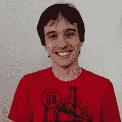

# 采访长生不老药的创造者何塞·瓦里姆

> 原文：<https://www.sitepoint.com/an-interview-with-elixir-creator-jose-valim/>

几周前，我刚开始研究长生不老药。我非常感兴趣，于是我跳上 IRC，开始问问题，这让每个人都很恼火。我问了创作者 José Valim 几个问题。José在 Ruby 社区很受欢迎，所以我给他写了封短信，他很友好地回复了我。在回答了我的一些问题后，我想，我必须采访他。下面是由此产生的对话。

For the people that don’t know you. Could you tell us a bit about yourself?

I am José Valim, creator of the Elixir programming language and co-founder of Plataformatec. I am a Brazilian living in Poland who spends the days working on Open Source.

José, You’re very well know as an active member of the Ruby Community. You also built a programming language on top of Erlang called Elixir. Could you tell us how you got to creating a programming language? Were you familiar with the idea of building one?

I don’t have a formal Computer Science background. Therefore, when I decided to create Elixir, I knew I had to catch up on the background required for lexers, parsers, and so on.

我已经读了几本关于这个问题的书，阅读了不同语言是如何实现的源代码，也尝试了不同的工具来更好地理解什么是可能的，什么是不可能的。简单和复杂的区别。在解析器中工作仍然很有挑战性，特别是当你遇到困难的时候，找到一个解决方案可能是一个漫长的过程。我用了野牛手册和龙书。我记得检查过 Erlang、Ruby 和一堆不同的编译成 JavaScript 语言的解析器。

Could you tell us more about it? How did this happen?

It is a long story, but I will try to make it short and sweet. Back in 2010, I was working on improving Rails performance when working with multi-core systems, as our machines and production systems are shipping with more and more cores. However, the whole experience was quite frustrating as Ruby does not provide the proper tool for solving concurrency problems. That’s when I started to look at other technologies and I eventually fell in love with the Erlang Virtual Machine.

我开始越来越多地使用 Erlang，随着经验的积累，我注意到我缺少了许多其他语言中可用的一些结构，包括函数式语言。那时我决定创建 Elixir，试图在 Erlang VM 之上引入不同的构造和优秀的工具。

What are the main features (is that what I should call them?) that Elixir adds to Erlang? And why did you choose it?

Elixir was designed with excellent and accessible tooling, documentation, and resources in mind. On the more technical side, Elixir provides a macro system and polymorphism via protocols, both aiming to make the language more extensible.

Why do you think we have this sudden diversion of interest to functional? What do you think it offers the average OO programmer?

This is a tricky question because functional and object-oriented programming do not have precise definitions. Especially when we are talking about OO languages that can be drastically different from each other. In fact, Alan Kay, who coined the term object-oriented, has a definition of OO much closer to Elixir processes/actors than to the objects found in languages like Java and C++.

也就是说，我对函数式编程有一个非常个人化的定义:函数式编程就是让系统的复杂部分显式化。例如，可变状态是随时间变化的数据。时间是复杂性的来源，因为它给我们的系统增加了一堆移动的部分。我们最终会有不同的数据以不同的速度变化。因此，你不希望“可变状态”是一个原语，而是一个抽象，只有当你需要它的时候，你才会诉诸它，而且你会明确地这样做。

这是最有趣的部分。函数式编程与并发性相关联，但它不是由设计决定的。碰巧的是，通过使我们系统的复杂部分显式化，解决更复杂的问题如并发变得更加简单。

Could you just tell us about the Elixir community a bit?

The Elixir community is growing steadily. For example, last October we had ElixirConf 2015 in Austin with 250 attendees and more than half of the attendees were already using Elixir professionally. We already have books released by the major publishing companies and more coming out fast.

然而，最令人兴奋的是，这是一种健康的增长。当您开始使用 Elixir 时，不仅仅是学习一门新语言，而是学习 Erlang VM 提供的整个生态系统和工具。在 ElixirConf 期间，看到人们对掌握这个生态系统表现出极大的兴趣，从 VM 字节码开始，一直到构建可伸缩的分布式系统的抽象，真是令人兴奋。

Thank you José, we wish you and Elixir very good luck. Thank you for the work you’re doing for the community.

Thank you.

如果 José今天谈论的一些事情让你感兴趣，请在 elixir-lang.com 查看 Elixir，并在评论中告诉我们你的想法。

## 分享这篇文章