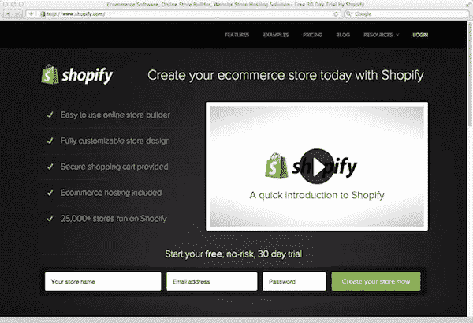
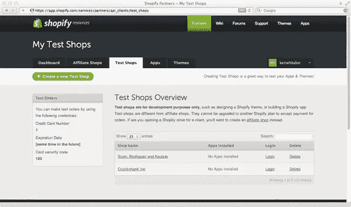
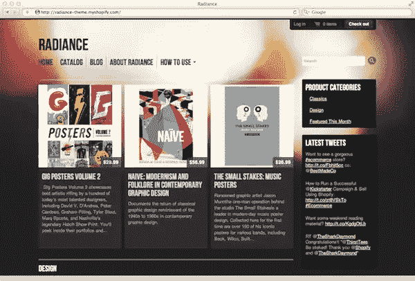
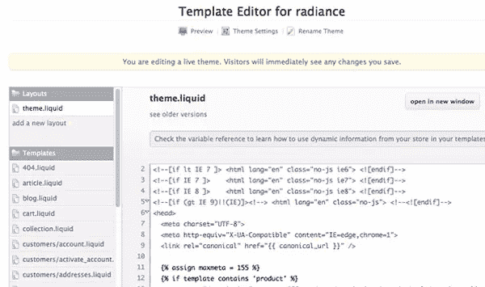
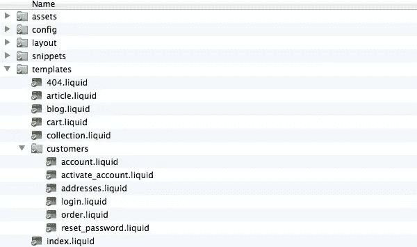
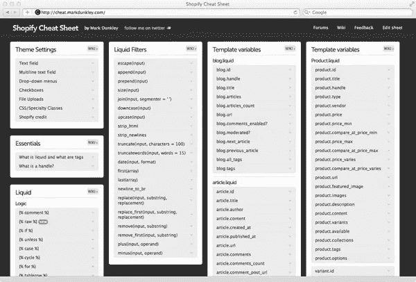

# 构建 Shopify 主题的介绍

> 原文：<https://www.sitepoint.com/an-introduction-to-building-shopify-themes/>

越来越多的网页设计师将他们的技能用于新的巧妙的用途。无论是图标、主题、字体、t 恤还是印刷品，通过在线销售产品和服务来补贴客户工作的做法正在增加——尤其是在网络社区。

几年前，开一家网上商店是一项可怕而令人生畏的任务。谢天谢地，今天的过程简单多了；对于某些平台来说，使用现有的 HTML、CSS 和 JavaScript 知识创建一个主题非常简单。即使你不想开自己的店，拥有向新老客户提供电子商务的技能也是一大优势。

## 评估电子商务平台

网上开店有很多选择。从不起眼的“立即购买”贝宝按钮到滚动你自己的定制网络应用程序，中间还有很多。这些年来，我已经尝试了大多数产品，但在为我自己的公司选择解决方案时，我决定使用 [Shopify](http://shopify.com/) 。原因如下:

*   这是一个完全托管的解决方案，这意味着零服务器设置和维护，这是一大优势
*   每月的费用并不令人望而却步。我们的费用将随着我们的需求和收入而增长
*   这是基于主题和非常友好的设计师。我们可以使用现有的标记和 CSS
*   它允许我们使用我们的商业帐户进行支付。这是一个很大的优势，因为我们不想使用贝宝
*   我们可以在 Shopify 上使用我们自己的域名，例如 shop.useourowndomain.com
*   “应用”生态系统是强大的。我们需要一个数字传输系统，而 FetchApp 完全符合这个要求
*   很受欢迎。超过 25，000 家商店使用 Shopify，包括许多知名网络品牌，如[一本书之外](http://abookapart.com)、[联合像素工人](http://www.unitedpixelworkers.com/)、 [Tattly](http://tattly.com/) 和 [Hard Graft](http://hardgraft.com)
*   该公司实力雄厚，产品不断开发，最重要的是，他们有一个伟大的标志！

 * Shopify 是一个面向设计师的电子商务平台*

如果你之前已经建立了一个网站，那么你就非常有能力为 Shopify 建立一个主题。在本教程中，我将向您展示如何构建 Shopify 主题的基础知识，剖析一个关键模板，并分享我在此过程中获得的一些提示和技巧。

## 在开始之前

*Shopify 测试商店界面*

为了开始开发你的主题，你需要一个 Shopify 帐户。最简单的方法是注册[合作伙伴计划](http://www.shopify.com/partners)。这将使您能够创建并使用“测试车间”顾名思义，这不是一家“活”店——更应该把它当成一个游乐场。当你准备好“正式”开设你的商店时，你需要注册一个完整的帐户。

注册合作伙伴计划后，单击“测试商店”选项卡，并按照说明设置新的测试商店。创建完成后，点击链接将直接进入 Shopify admin。这是你的商店的核心，但出于我们的目的，我们将专注于主题选项卡。

## 什么是主题？

一个主题由许多特别命名的模板以及任何 web 项目中常见的资源组成，包括图像、CSS 和 JavaScript。

 * Radiance 是一个免费的 Shopify 主题*

还有一个你以前可能没有遇到过的组件，那就是模板语言，叫做 [Liquid](http://wiki.shopify.com/UsingLiquid) 。它在风格上类似于其他模板工具，如 [Twig](http://twig.sensiolabs.org/) 和 [Smarty](http://www.smarty.net/) ，虽然一开始可能感觉有点陌生，但我相信你很快就会掌握它的窍门。如果你曾经为 WordPress、Tumblr 或 Expression Engine 创建过主题，那么其中的许多概念对你来说会很熟悉。如果您还没有，不要担心，我们将通过要点来帮助您开始运行。

## 基本主题结构

在撰写本文时，测试商店是使用免费的“ [Radiance](http://themes.shopify.com/themes/radiance/styles/slate) ”主题创建的。通过进入主题标签下的“模板编辑器”部分，你可以找到包含这个主题的所有文件。

在我们继续之前，让我们下载主题，这样我们可以更容易地看到它。我们不会深入这个主题的细节，但是我们会用它来让你体验一下事物是如何工作和配合的。

要下载 Radiance 主题的 ZIP 存档，请点击“主题”选项卡，然后点击“管理主题”链接。从这里，您可以请求“导出主题”一旦可供下载，您将收到一封电子邮件。

 *在线 Shopify 模板编辑器*

解压缩 ZIP 存档文件后，打开文件夹。您会注意到其中有 5 个子文件夹。这些是:

*   资产
*   配置
*   布局
*   片段
*   模板

让我们更深入地看看它们的内容。

### 资产

assets 文件夹是所有图像、JavaScript 和 CSS 文件的目录。如果你和我一样，你通常会根据类型将你的文件分成子文件夹，也就是说，一个用于 CSS，另一个用于 JavaScript。请注意，对于 Shopify 主题，您不能这样做；所有资产都必须在这个文件夹中。

### 配置

虽然创建 Shopify 主题相对容易，但它们确实为我们提供了大量定制主题的潜力。配置文件让我们能够通过从管理区选择不同的颜色或字体来改变网站的外观。这有点超出了本文的范围，但是如果你曾经制作过一个主题在 [Shopify 主题商店](http://themes.shopify.com/)出售，这是值得考虑的。

### 布局

布局文件夹通常包含一个名为“layout.liquid”的文件，尽管它可以包含多个文件。布局文件使您能够定义页面的外观。这种方法使您不必在每个模板中包含相同的文件。我把它比作洋葱的外皮。然后，我们的模板文件(洋葱的内部)用这个布局文件(外壳)包装起来，得到完整的页面。

通常，“layout.liquid”文件将包括开始和结束的 HTML 声明、CSS 和 JavaScript 文件的链接、原则导航和页脚。它还将包括一个特殊的 liquid 标签`{{ content_for_layout }}`，Shopify 使用它来添加相关的子模板代码和逻辑。

不要被 Radiance 主题“layout.liquid”文件中的大量代码所困扰，因为其中有很多代码。GitHub 上提供的 [Blankify](https://github.com/sud0n1m/blankify-for-shopify/) 主题具有更基本的“[布局.液体](https://github.com/sud0n1m/blankify-for-shopify/blob/master/layout/theme.liquid)”，更容易理解。

### 片段

代码段是包含大量可重用代码的文件，这些代码段也有“.液体"文件扩展名。如果您计划在多个模板中包含相同的代码段(但不是每个模板，因为您可以使用布局文件来实现这一点)，那么代码片段是一个很好的选择。光辉主题包含很多片段，包括社交链接和分页。

### 模板

这些文件通常是你要花时间制作的，代表洋葱的内部。

为了让您的主题工作，您必须遵循一些简单的命名约定，例如，当您查看产品时呈现的模板必须称为“product.liquid”

*Mac OS X 取景器中的光芒主题*

以下是组成主题所需的模板列表:

*   404 . liquid—当没有找到页面时使用
*   **article . liquid**—博客功能的文章页面
*   **blog . liquid**—博客的存档列表页面
*   **cart . liquid**—购物车中所有商品的列表页面
*   **collection . liquid**—用于展示您的产品系列(系列也可视为“产品类别”)
*   **index . liquid**——您可以定制显示一个或多个产品、博客项目和收藏的“主页”
*   **page . liquid**—内容的基本页面，最适合条款和条件、关于页面等。
*   **product . liquid**—用于向客户展示单个产品
*   **search . liquid**—显示搜索结果的模板

您还会从上图中注意到，Radiance 主题包含一个名为 customers 的子文件夹。客户模板允许您自定义您的客户区域，即登录页面、订单历史记录和帐户详细信息，如送货地址。

您可以在 [Shopify Wiki](http://wiki.shopify.com/Customer_Accounts) 上找到关于这些模板的更多信息。如果您没有定义此文件夹，您的商店将简单地使用通用的 Shopify 模板。

## 液体介绍

你会注意到我们的许多文件都有“.液体”分机。Liquid 文件是简单的 HTML 文件，其中嵌入了代码。这个嵌入式代码是使用像{{ }}和这样的花括号创建的，所以很容易识别。

液体有两个好处。首先，它允许我们操作输出，其次，它允许我们在模板中包含逻辑，而无需了解任何后端代码。

首先，让我们看看输出。这里有一个非常简单的例子。如果我们希望我们的`<h2>`元素显示我们的产品标题，那么我们可以利用可用的产品数据，并在模板中执行以下操作:

```
<h2>{{ product.title }}</h2>
```

当 Shopify 呈现产品页面时，我们的动态代码将被我们产品的标题所取代。注意 liquid 是如何使用“点”语法的。我们的产品也附有价格，这将以类似的方式展示，使用:

```
{{ product.price }}
```

“点”允许我们访问产品的不同属性并显示数据。

我们可以进一步说，我们想把我们的产品标题变成大写，这也相当容易:

```
<h2>{{ product.title | upcase }}</h2>
```

液体还可以帮助我们快速生成元素。例如，图像标签:

```
{{ 'logo.png' | img_tag }}
```

呈现后，将生成以下 HTML:

```

```

当然，这没有多大用处，因为这导致了文件的相对路径，这是行不通的。通过添加一个额外的过滤器，Shopify 将预先考虑文件的完整路径。为了更好地衡量，我们还可以添加我们的`alt`文本:

```
{{ 'logo.png' | asset_url | img_tag: 'Site Logo' }}
```

这将产生以下 HTML:

```

```

除了允许我们使用来自我们商店的数据，即产品名称和价格，Liquid 还使我们能够控制页面的流动，这是我前面提到的逻辑。

比方说，一个产品卖完了，这对我们来说是个好消息，但对我们的潜在客户来说就不那么好了。通过使用液体，我们可以显示一个特殊的信息，如果产品不再可用。液态逻辑可读性很强，所以应该很容易理解。

下面是它在您的模板中的工作方式:

```

	Show Add to cart button here
	
	Display message about when the product will be next available
	
```

有一个简单的方法来记住不同的标签结构，2 个花括号等于输出，1 个花括号后面跟一个%等于逻辑。

Shopify 的马克·邓克利策划了一份非常新颖的备忘单。对于任何使用 Shopify 主题的人来说，这是一个必不可少的书签。这不仅是一个很好的参考，也是一个快速查看每个模板上可用变量的方法。
 *马克·邓克利的必备 Shopify 小抄*

## 剖析模板

正如我前面提到的，对于第一次设计主题的人来说，光芒主题并不是最简单的。然而，我鼓励你看一看不同的文件，并考虑它们是如何组合在一起的。

当你准备好构建完整的主题时，我鼓励你阅读 Shopify wiki 上一篇名为“ [Theme from scratch](http://wiki.shopify.com/Theme_from_scratch) ”的精彩文章

TextMate 用户可以利用 Meeech 的 Shopify 捆绑包。当然，您也可以自己将主题压缩并上传到您的测试商店。

### 产品.液体

如前所述,“product.liquid”模板在客户查看产品详细信息页面时使用。如果你熟悉 WordPress，这在本质上与“single.php”模板非常相似。

如果你看一下 Mark 的备忘单，你会发现我们有许多与产品相关的变量可用，其中许多变量将在我们的示例中使用。

以下是完整的代码示例:

```
<h2>{{ product.title }}</h2>
	<p>{{ product.description }}</p>
	
	<form action="/cart/add" method="post">
	<select id="product-select" name='id'>
	
	<option value="{{ variant.id }}">{{ variant.title }} - {{ variant.price | money }}</option>
	
	</select>
	<input type="submit" value="Add to cart" id="addtocart" />
	</form>
	
	<p>Sorry, the product is not available.</p>
	
	
	
	<a href="{{ image | product_img_url: 'large' }}" title="{{ product.title }}"></a>
	
	<a href="{{ image | product_img_url: 'large' }}" title="{{ product.title }}"></a>
	
	
```

让我们把它分成易于管理的部分。首先，让我们输出一个基本的标题和描述。如前所述，这些是使用点语法呈现的:

```
<h2>{{ product.title }}</h2>
	<p>{{ product.description }}</p>
```

接下来，我们快速检查我们的产品是否有货，换句话说，是否“有货”？如果是，模板将显示一个表单，允许客户将产品添加到购物车中。此外，它将呈现一个选择列表，显示该产品的不同变体。

变体是在 Shopify 中组织产品的一种方式。假设你有一辆红色、白色和蓝色的儿童自行车，售价 295 英镑。这里的一种方法是用三种自行车产品来处理不同的颜色。还有其他方法，但这个效果很好。

如果产品缺货，模板将呈现消息，“对不起，该产品不可用。”

```

	<form action="/cart/add" method="post">
	<select id="product-select" name='id'>
	
	<option value="{{ variant.id }}">{{ variant.title }} - {{ variant.price | money }}</option>
	
	</select>
	<input type="submit" value="Add to cart" id="addtocart" />
	</form>
	
	<p>Sorry, the product is not available</p>
	
```

没有图像，产品什么都不是。模板的下一部分处理显示我们在管理中添加的图像。这也是对另一个液体概念的一个很好的介绍:一个液体的“T0”。

第一行开始可能会令人困惑，但没什么好担心的。本质上，它的意思是:

> "对于与我们产品相关的每张图片，请执行以下操作."

每个液体循环都必须以“endfor”结束，你会注意到这一点。没有这个，你的网站会变得很乱，所以记得要包括它。这就像 HTML 中的结束标记。

在我们的“for 循环”中，我们使用``运行一个小检查，看看我们是否在第一个循环中。如果是的话，我们输出一个大版本的图像。如果我们继续，我们输出一个小版本的图像，它与我们的全尺寸图像相链接:

```

	
	<a href="{{ image | product_img_url: 'large' }}" title="{{ product.title }}"></a>
	
	<a href="{{ image | product_img_url: 'large' }}"  title="{{ product.title }}"></a>
	
	
```

这就是“产品.液体”模板。当然，你也可以加入其他元素，比如其他系列或类似产品的链接。

## 向他人学习

液体，虽然非常强大，但相当简单。一旦你知道了如何使用点语法，不同的模板变量，并掌握了循环，就没有什么需要学习的了。

每个模板的工作方式非常相似；例如，集合模板允许您访问与当前查看的产品集合相关的数据。同样，购物车页面将为您提供与显示客户购物车内容相关的变量。

通过研究其他人是如何构建他们的模板的，我学到了很多东西，例如，Blankify 中的[collection . liquid template](https://github.com/sud0n1m/blankify-for-shopify/blob/master/templates/collection.liquid)——其实没什么大不了的。

Blankify 是一个古老而有用的 Shopify 入门主题

## 后续步骤

我希望这篇教程很好地介绍了构建 Shopify 主题所涉及的元素。我在下面列出了一些很棒的资源，随着你的进步和深入你的主题建设，你一定要看看。

如果您有任何问题，请在下面留言。

## 更多资源

*   [Shopify 备忘单](http://cheat.markdunkley.com/)
*   [Blankify——Shopify 首发主题](https://github.com/sud0n1m/blankify-for-shopify)
*   [从头开始构建主题](http://wiki.shopify.com/Theme_from_scratch)
*   [Shopify 合作伙伴计划](http://www.shopify.com/partners)

## 分享这篇文章