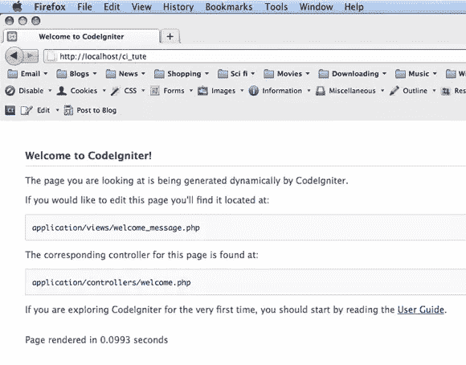
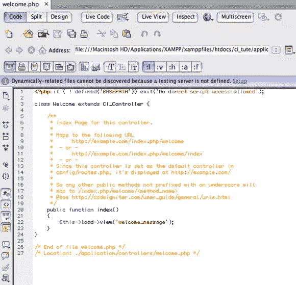
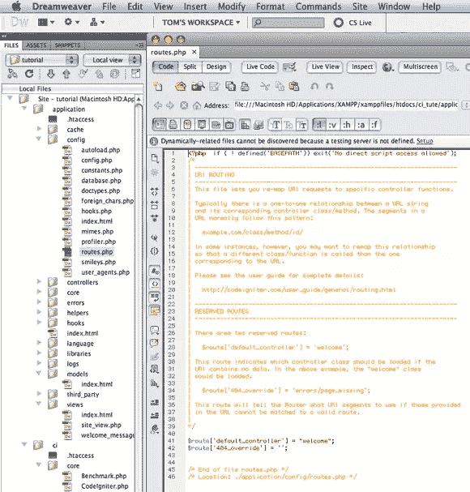
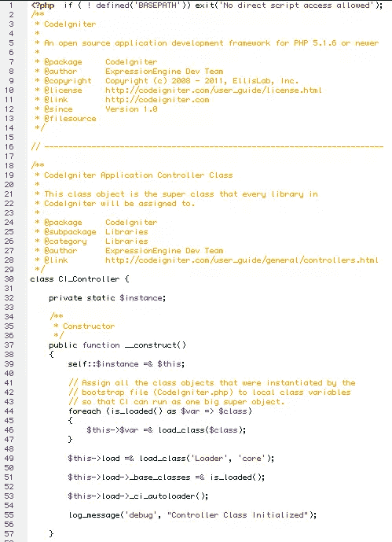
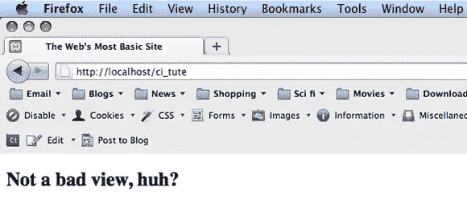

# CodeIgniter 简介

> 原文：<https://www.sitepoint.com/an-introduction-to-codeigniter/>

### 写作的东西

有一个流传已久的城市传说是这样的:面对美国宇航员无法让圆珠笔在零重力下工作的困境，美国国家航空航天局(NASA)花费了惊人的时间和金钱来开发一种可以在太空飞行中体验的条件下完美书写的笔。

结果是费舍尔太空笔，一个复杂的加压墨盒和防漏外壳的排列，可以在极端温度和零重力下颠倒书写，没有一点污点。

与此同时，俄罗斯宇航员使用铅笔。

遗憾的是，这不是真的——美国宇航员也使用铅笔——但尽管如此，这是一个关于简单方法的好处的精彩小寓言。

作为一名 web 开发人员，您可能已经发现自己正在进行一个基于 PHP 的项目，在这个项目中，您会情不自禁地觉得自己不可避免地要走向自己的 Fisher Space Pen。您陷入了代码的海洋，并非所有代码都没有错误，有些代码是多余的，大部分代码被注释掉了——其中大部分代码交织在一起，其复杂性会让织球蜘蛛头疼。你要找的是一支非常好的铅笔。

向 CodeIgniter 问好。

CodeIgniter 不是 PHP 的替代品。当您深入到 CodeIgniter 的世界中时，您不会离开 PHP 为什么您会想要离开呢？PHP5 是一种非常棒的脚本语言，用于构建最先进的、动态的基于 web 的应用程序；它与 HTML 的融洽是一流的；此外，它也是磨练 OOP 技能的好语言。它紧凑、安全、直观。对于我们中的许多人来说，它是满足我们需求的唯一服务器端语言。

CodeIgniter 是一个 PHP 驱动的框架，包含一个由库、助手、插件和其他资源组成的大杂烩，它负责许多 PHP 著名的更复杂的过程和函数。CodeIgniter 在保持高性能的同时为您完成所有繁重的工作。它将简化 PHP 语法，简化网页底层的代码，最棒的是，它能让你立刻制作出动态的、交互式的、专业的网站。

以下是用 CodeIgniter 编写下一个项目的一些主要好处:

*   它使得用 PHP 编码变得简单、快捷和用户友好。
*   这是一个很好的框架，可以让你更好地了解 PHP 是如何工作的。
*   它是 web 开发的模型/视图/控制器(MVC)方法的基础——所有开发人员都应该遵守的最佳实践哲学。
*   它建立在一个简单易用的线性文件夹结构上。
*   它是开源的，可以根据自己的需要简单地配置和定制。
*   您可以在 CodeIgniter 中构建自己的更清晰的 URI 线。

您应该开始研究这个框架的原因还有很多，当您访问并[下载最新版本](http://codeigniter.com/)(在撰写本文时，版本 2.0.1)时，您无疑会自己发现这些原因。在解压和安装文件之前，请阅读[用户指南](http://codeigniter.com/user_guide/)并阅读一些关于 CodeIgniter 的内容。

在这里，你将看到这个框架最好的一面——它拥有所有 web 开发工具中最全面和用户友好的操作指南。如果您在(点击右上角的标签)的目录中找不到您需要的内容，请前往[论坛](http://codeigniter.com/forums/)并加入不断增长、充满热情的 CodeIgniter 社区。

### PHP 变得友好

一旦您开始试用 CodeIgniter，您会发现自己很快就喜欢上了它的方法。当然，这假设您熟悉 PHP。在开始使用 CodeIgniter 之前，您需要很好地了解 PHP 如何与数据库交互以及它与 HTML 的关系，更不用说了解基本的 PHP 语法。

在某些情况下，使用 CodeIgniter，可能需要大量 PHP 代码才能实现的功能可以缩减为一行代码。这可能适用于从在浏览器中输出文本到表单域验证、添加 Captcha 工具或设置 cookies 的任何事情。

为了说明在项目中使用 CodeIgniter 是多么简单，我们将构建一个非常基本的网站，将硬编码的内容输出到浏览器。这是初级开发人员的工作——但其目的是展示 CodeIgniter 工作的速度和效率，并为您提供框架本身的背景知识。

一旦掌握了基础知识，您将很快进入使用 CodeIgniter 来构建博客、内容管理系统、论坛或任何您能想到的高度交互式、动手操作的 web 应用程序。

然而，在我们开始之前，有必要花点时间学习一下 MVC 架构 CodeIgniter 是围绕这一编程结构构建的。

### 分层很容易

模型/视图/控制器编程方法旨在将应用程序的业务逻辑与显示逻辑分开，将应用程序的表示方面(用户在浏览器中看到的内容)和驱动应用程序的基本要素分成三个相互连接的层:

*   代表数据结构的**模型**。模型层中包含的类将包含与数据库交互的方法。
*   **视图**，负责演示之后的工作。视图通常是网页，但也可以是页面片段，如页眉或页脚。
*   **控制器**，它完成大部分艰苦的工作，并且是模型、视图和运行应用程序所需的任何其他资源之间的*中介*。

以这种方式分离一个项目意味着每一层都非常有效地完成它的工作，保持它与其他层的关系，同时在明确定义的边界内运行。这还意味着多个视图和控制器可以与同一个模型交互，新的或不同的视图和控制器可以与模型交互，而无需强制改变模型设计。

您会在网上找到大量的信息来帮助您理解 MVC 是什么，以及为什么围绕 MVC 公理构建您的应用程序是值得的。一旦你开始熟悉 CodeIgniter，MVC 将变得不那么抽象。

### 这是个圈套

第一步是下载并安装 [CodeIgniter](http://codeigniter.com) 。你可能想把这份原件放在一个模板文件夹里。每次开始新项目时，您都可以从该模板中复制必要的文件夹，并在进行过程中进行自定义。例如，您不需要在每次启动新项目时都复制用户指南文件夹或许可文件。

您需要的是`index.php`文件，以及两个主要文件夹:system 和 application。这是您大部分时间都要使用的应用程序文件夹，但浏览一下系统文件夹中的子文件夹还是值得的。

这里包含了 CodeIgniter 功能背后的机制——库、助手、插件和类，您将在构建应用程序时用到它们。

不要害怕研究代码——所有的东西都有明确的注释，解释清楚明了，用的是许多程序员都不熟悉的方言:普通英语。

### 清理你的 URIs

CodeIgniter 的优势之一是能够通过 URI 线定位自己。在这里你可以输入你的控制器的名字，这将依次在浏览器中启动相应的视图文件负责输出。

默认情况下，`index.php`会包含在您的 URI 中，例如:

```
ci.com/index.php/page/my_output
```

其中`page.php`是您的控制器的名称，一个包含名为`my_output()`的方法的类。

通过使用带有您自己定制的规则的`.htaccess`文件，您可以轻松地删除`index.php`块，并简化 URI 线。在[这一页](http://codeigniter.com/user_guide/general/urls.html)，你会看到一个非常简单的例子，包括在你的项目中，它将整理你的 URI 线，让你简单地访问控制器，而不需要任何肮脏的`index.php`废话。你可以在这里找到关于`.htaccess`文件[的深度教程。](http://www.javascriptkit.com/howto/htaccess.shtml)

### 我们到家了

一旦你建立了你的项目蓝图，并且你包含了一个方便的`.htaccess`文件来美化 URI 线，在你的浏览器中输入项目文件夹的位置，看看会发生什么。出于本教程的目的，我使用 Xampp 作为本地测试服务器。我的 CodeIgniter 项目，我称之为`ci_tute`，在我的 htdocs 文件夹中，所以如果我在 Firefox 的 URI 行中输入`localhost/ci_tute`，我会得到 CodeIgniter 的自定义欢迎屏幕。



这个屏幕的 HTML 包含在 views 子文件夹中(在 application 文件夹中——您将使用的主文件夹),在一个名为`welcome_message.php`的文件中。这非常符合 MVC 我们在浏览器中看到的来自我们的编程逻辑视图层。但是浏览器表现背后的真正嫁接是由一个名为`welcome.php`的控制器(在 controllers 子文件夹中，当然)负责的。

打开这个控制器。



在里面，您将看到一个具有两个简单方法的类:—一个普通的构造函数和一个索引方法。指数法是这里的关键方法。默认情况下，在调用 welcome 控制器时会调用它——这发生在您在 URI 行中键入控制器名称时。

那么，为什么我们不需要在 URI 行中键入`localhost/ci_tute/welcome`？因为 welcome 控制器被设置为默认值。您可以通过几次击键来改变这一点，但您必须明白，控制器是在浏览器的 URI 字段中访问的，并且控制器的`index()`函数负责默认输出。

键入`localhost/ci_tute/welcome`—您应该会看到相同的欢迎屏幕。在 CodeIgniter 项目中，您将创建链接到其特定视图文件的各种控制器，当输入 URI 行时，将调用这些视图负责的演示。

知道这个默认控制器在文件夹层次结构中的位置很重要。打开您的 config 子文件夹(一如既往，在应用程序中)并查看`routes.php`。



这个 config 文件夹是您定制项目结构的地方，无论是为加载库创建自动设置还是输入您正在使用的数据库的访问值。`routes.php`文件就是这么简单。您将看到一个名为`$routes`的数组，其键为`default controller`，值为`welcome`。您可以将此值从`welcome`更改为您创建的任何控制器。

### 建立控制

在您的应用程序文件夹中，您最熟悉的三个子文件夹是您的控制器、模型和视图——这就是我们前面谈到的 MVC 野兽。当您根据 MVC 架构创建您的应用程序时，您将在相应的文件夹中保存与三个层中的每一层相关联的各种文件。

另一个您会很快与之成为朋友的文件夹是 config 文件夹——对于任何经历过与配置相关的噩梦的人来说，请高枕无忧:CodeIgniter 使您的项目配置成您需要的任何规格变得轻而易举。改变你的主页 URI，你的网站的字符集，甚至你想使用的日期格式，通常只需要在预先配置好的数组中输入一个单词。

让我们创建一个控制器——将与视图对话的文件(将内容输出到浏览器)。在 controllers 文件夹中，创建一个新文件，并简单地将其命名为`site.php`。

在您的控制器中，您将创建类，就像您使用日常面向对象的 PHP 一样。关于控制器，你需要知道的最重要的事情是它们包含的类必须与控制器的文件名同名。在我们的例子中，控制器文件是`site.php`，因此我们的类将被称为`Site`(大写，遵循 PHP 中类的一般命名约定)。

关于控制器你应该知道的第二件事是你需要扩展它的类到它的父类，也就是`CI_Controller`。这个父类包含在 system 文件夹的 core 子文件夹中，是一种“超类”,您将在 CodeIgniter 中调用的所有有用的库都将被分配给它。

如果你感到困惑，去系统文件夹，打开核心子文件夹，检查文件`Controller.php`。您将在那里看到`CI_Controller`超类，注释将帮助您浏览它。



一旦你创建了你的`Site`类，在里面放一个`index()`函数。请记住，这是当您在站点控制器上调用时将自动实例化的方法。

您的控制器类语法应该如下所示:

```
<?php
class Site extends CI_Controller {
    function index()
    {
    }
}
```

您可以随时参考您已经编写好的欢迎控制器，并使用该代码作为指南。

我们的下一步是建立一个视图文件，包含一些内容，供我们的站点控制器与之对话。但是首先，让我们通过在屏幕上回显一些东西来测试一下我们的控制器是否工作良好。

通常情况下你不会这样做:直接从一个控制器中表示是 MVC 教会中的异端邪说。不过，将一个`echo`命令放入您的`index()`方法中是一个好主意，看看它是否能工作，然后将其注释掉，作为一个方便的调试工具保存在那里。一旦项目完成，您可以随时删除它。

```
<?php
class Site extends CI_Controller {
    function index()
    {
        echo 'Ground controller to Major Tom';
    }
}
```

在您的 URI 行中键入站点控制器(在我的例子中是`localhost/ci_tute/site`)。这是您的控制器，通过输出我们的`echo`语句厚颜无耻地绕过 MVC 标准，但是很高兴向您展示它已经准备好了。

你可以直接在`index()`后面写一个类似的方法；如果您愿意，可以称之为`echo_stuff()`，并重复一些更多的内容:

```
 function echo_stuff()
    {
      echo 'Have some more content';
    }
```

现在，如果我在浏览器中输入`localhost/ci_tute/site/echo_stuff`，我会看到新的内容。控制器类和方法的层次结构很容易从 URI 线看出。

### 搬家

冒着稍微偏离主题的风险，现在可能是再次打开`routes.php`并改变你的默认控制器的好时机。你是怎么做到的？将`welcome`作为`$routes['default controller']`中的值，并插入`site`。完成了。现在你不必在你的 URI 行中键入`site`；这是你的默认主屏幕，无论你在`Site`类中的`index()`方法中有什么都会自动启动。

### 欣赏风景

让我们创建我们的视图文件，并将其连接到我们的控制器。请记住，我们的视图将包含演示输出，在这种情况下，它将是普通的旧 HTML，因此在 views 文件夹中创建一个新文件，并将其命名为`site_view.php`。

这种命名约定——在控制器名称后添加`_view`—并不是一成不变的。许多 web 开发人员简单地将他们的视图文件称为他们的控制器——例如，`site.php`。因为它们包含在不同的文件夹中，所以不会有名称冲突。我喜欢一眼就知道什么是视图，什么是控制器，什么是模型——这就是为什么，如果我要为我们的`site.php`文件创建一个模型，我会把它命名为`site_model.php`。你可以选择最适合你的惯例。

下面是我的`site_view.php`文件内部的样子:

```
<!DOCTYPE HTML>
<html>
<head>
<meta http-equiv="Content-Type" content="text/html; charset="UTF-8">
<title>The Web's Most Basic Site</title>
</head>
<body>
    <section id="container">
        <h1>Not a bad view, huh?</h1>
    </section>
</body>
</html>
```

现在我们可以从我们的控制器启动这个惊人的网页。这就是 CodeIgniter 语法的简单性将使您成为一名快乐的程序员的地方。

首先，注释掉前面的`echo`语句，并把它保存在那里作为以后的调试工具。将这行代码添加到您的`index()`方法中:

```
function index()
    {
      // echo 'Ground controller to Major Tom';

    $this->load->view('site_view.php');

    }
```

可读性很强，很简洁，不是吗？现在在您的浏览器(`localhost/ci_tute/site`)中转到您的索引页面—您将看到由`site_view.php`生成的新内容。



我们所做的只是告诉 CodeIgniter 加载我们的视图文件的值，并使用一些非常简单的语法。虽然我们取得的成果并不复杂，但这只是触及了 CodeIgniter 的冰山一角。试着创建一个值数组来做进一步的实验，比如说:

```
function index()
    {
      // echo 'Ground controller to Major Tom';

      $arr['value1'] = “First subhead”;
      $arr['value2'] = “Second subhead”;
      $arr['value3'] = “Third subhead”;

      $this->load->view('site_view.php', $arr);

    }
```

我们在这里所做的是创建名为`$arr`的键和值的数组，然后将它作为第二个参数传递给我们的 load 语句。此时不会发生什么——我们只是通知我们的视图文件，它有一个名为`$arr`的第二个参数来做一些事情。但是如果你打开你的`site_view.php`文件，实际上对数组做了一些事情，比如:

```
<section id="container">
    <h1>Not a bad view, huh?</h1>
    <h2><?php echo $value1; ?></h2>
</section>
```

你会得到一个漂亮的小标题。您可以对数组中的其他两个值进行同样的操作。

我们只是简单介绍了一下 CodeIgniter 的功能，甚至还没有看到它如何处理动态内容。这个框架的真正魅力可以通过数据库更清楚地展示出来，在数据库中，我们可以用一个简单的查询语句从一个表中提取内容，并将其传递给我们的视图。我们将借助模型类来实现这一点——这是我们还没有提到的东西，但它在本质上与我们的控制器非常相似。我们的查询语句可能如下所示:

```
$this->db->get('tablename');
```

我们所做的就是用一个`get`函数来访问数据库(`db`)表(`'tablename'`)——这一行代码取代了所有繁琐的 SQL 语法。我们甚至还没有开始使用 CodeIgniter 来验证表单、发送电子邮件或与 jQuery 建立伙伴关系。

希望这个品尝者能激起你的食欲。如果像我一样，您第一次使用 CodeIgniter 的经历让您意识到这就是您想要的所有 web 应用程序的构建方式，那么您会很高兴地知道，只需很少的时间就可以开始走这条路。

在 [CodeIgniter](http://codeigniter.com/) 网站上你有你需要的所有工具，更不用说来自论坛的一些令人愉快的帮助，而且网上有大量的教程可以帮助你熟练掌握它。

## 分享这篇文章