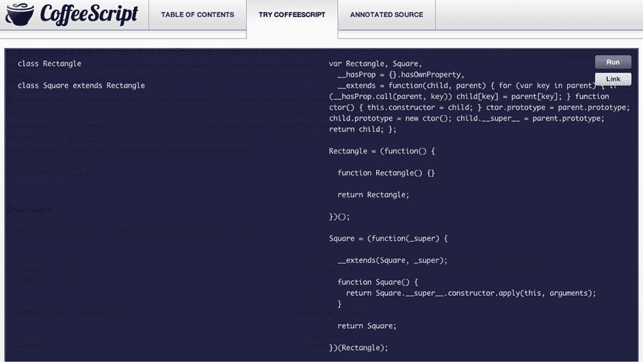
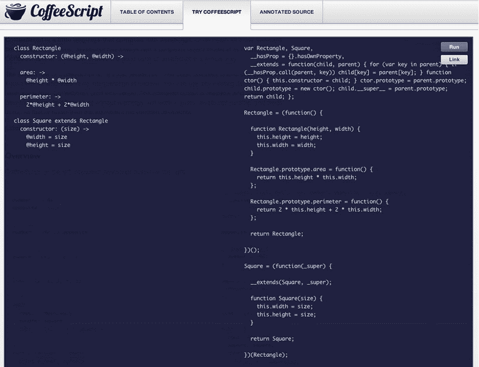

# CoffeeScript 简介

> 原文：<https://www.sitepoint.com/an-introduction-to-coffeescript/>

想象一个绝望的情况:你在布劳希尔的土地上(毗邻马尔库普和克诺德王国)，为了营救一个你喜欢的性别的美丽皇室成员，你必须步行一百英里。

每走几步就要转一圈。还有地雷。分号地雷，非闭括号地雷，全球可变地雷，所有的魔法地雷等待无声爆炸，炸掉你的腿 10 分钟后，你绊倒他们。

现在想象一个仙女来帮助你。它承诺将距离减半，将地雷围在墙内，并给你火箭溜冰鞋。火箭冰鞋！这个仙女是 CoffeeScript。你会接受它的提议。然而，现在你被说服了，你需要理性的理由来告诉你的老板。别担心，我们有！

## 原因 1:它写的 JavaScript 比你好。

关于 CoffeeScript，你应该知道的第一件事是，它只是涂了一层闪亮颜料的 JavaScript。通常，你编写你的 CoffeeScript，然后把它送给编译器，由它生成 JavaScript。在本文中，我们将手动撕掉这层油漆，以显示下面的普通旧 JavaScript。

让我们举第一个例子:

```
x = 5
```

如果您来自 Ruby 或 Python 之类的语言，您不会对此有任何想法。如果你来自 JavaScript，你会有点紧张。为什么？好的，这是在编写良好的 JavaScript 中的语句。

```
var x;
x = 5;
```

如果您忘记了 var 或分号，JavaScript 有时会停止工作，但并非总是如此，有时是在代码的另一个看似不相关的部分。因此，与 Java 等静态编译语言不同，初学者和专家都被允许犯愚蠢的语法错误，与 Ruby 和 Python 等其他动态语言不同，犯这些错误非常容易，而且往往会悄无声息地失败。

CoffeeScript 分享了动态语言的清晰性，同时也能够像静态语言一样在编译时捕捉最严重的错误。和丢失的分号之类的问题吗？自动为您处理。它为您构建的 JavaScript 代码甚至没有警告就通过了 [JavaScriptLint](http://www.javascriptlint.com/) (一个样式指南)。

即使你能写出那么完美的代码，你为什么要浪费那些大脑周期呢？如果 CoffeeScript 除了生成干净快速的 JavaScript 之外什么都不做，那也是值得的，这样我就可以专注于比记住键入分号更重要的事情。幸运的是，CoffeeScript 可以做得更多。

## 原因二:是 JavaScript，但是字符少。

我们将继续进行简单的更改，因为这些是最容易注意到的，我们不希望您在稍后查看更重要的元素时被它们分散了注意力。这里有一个取自 CoffeeScript 网站的简单示例函数。

```
square = (x) -> x * x
```

这里发生了什么事？我们声明一个名为`square`的函数，它等于表达式`(x) -> x * x`。这个表情在做什么？这里重要的部分是`->`。左边的都是我们输入到函数中的变量，右边的都是我们用这些变量做的事情。这里我们吸进一个变量`x`，并乘以它本身。然后我们称它为`square`作为一种简写，这样每当我们想乘某个东西时，我们就可以调用`square`。`square(4)`变成 4 * 4，变成 16。JavaScript 执行完全相同的操作，但是需要更长的时间:

```
var square;

square = function(x) {
  return x * x;
};
```

请注意，JavaScript 版本中没有添加任何与平方数字有关的内容。都是噪音。CoffeeScript 是编程语言的隔音耳机。然而，有时花括号不仅仅是噪音。毕竟有时候想写一个多行函数。如果没有花括号，你将如何跟踪它在哪里结束？看看 CoffeeScript 主页上的另一个例子:

```
if happy and knowsIt
  clapsHands()
  chaChaCha()
else
  showIt()
```

您会注意到，即使有多行，CoffeeScript 仍然没有花括号。它没有受到影响，因为它是由空格分隔的。如果您熟悉 Python、Haml 或 Sass，那么您已经知道这意味着什么。基本上，它不是使用花括号来控制流，而是查看行首有多少个空格和制表符。多进一个制表符基本上就像放一个左花括号，退回一个制表符就像放一个右花括号。如果这听起来很复杂，不要担心；95%的时候，这就是风格良好的 JavaScript 的间距。

到目前为止，我们讨论的一切都是基本的 JavaScript，去掉了许多微小的障碍。这确实是 CoffeeScript 提供的最大和最容易实现的价值主张之一，但是还有更多，从类开始。

## 原因 3:它是 JavaScript，具有传统的类系统

每一种面向对象语言的类系统都有古怪之处。JavaScript 的类甚至不叫类。他们被称为“原型”。是的，如果你来自其他语言，你会感到困惑，至少是暂时的。好消息！CoffeeScript 解决了这个问题。下面是一个快速的类和超类排列:



我们不再有 CoffeeScript 到 JavaScript 的逐行翻译。这是因为要将传统的类系统融入到 JavaScript 的原型系统中，必须进行许多扭曲。如果没有 CoffeeScript，你的大脑将不得不自己完成这些扭曲动作。这里有一个关于 CoffeeScript 类的基本但更完整的示例，因此您可以立即开始使用它们:



## 野生咖啡脚本

我使用的很多例子都来自于 CoffeeScript 主页。那里有一个很好的翻译器，它会把你的 CoffeeScript 拿出来，然后立刻显示相应的 JavaScript 是什么样子。

然而，如果你要在现实生活中使用它，你需要更多的东西。如果你正在使用 Ruby on Rails，将你的`.js`文件重命名为`.coffee`或`.js.coffee`。现在你完成了。它甚至会为你缩小和连接你的 JavaScript 文件。如果你没有使用 Ruby on Rails，那么你必须下载并安装 [node.js](http://nodejs.org/ "node js") 和相应的 CoffeeScript 包。然后设置它来观看你的 CoffeeScript 文件。

## 分享这篇文章