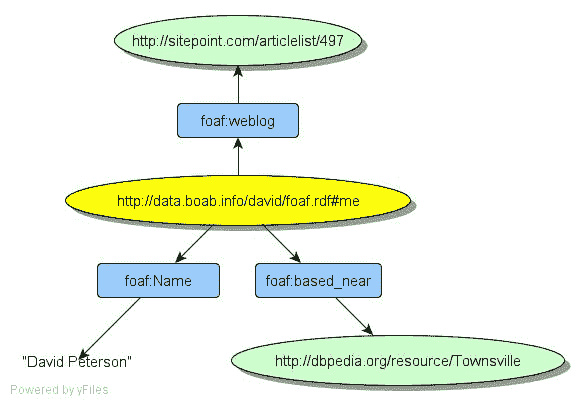

# 数据可移植性的一个奇怪例子

> 原文：<https://www.sitepoint.com/an-odd-example-of-data-portablity/>

我最近[了解到](http://www.openlinksw.com/blog/~kidehen/?id=1352)数据可移植领域的一项新举措——[开放数据定义](http://opendd.net/)(奇数)。我赞赏任何增加社交网络和你的数据之间的数据可移植性的努力。但是，要想真正成功，这个想法必须经过深思熟虑，并进行研究，看看有什么，什么是真正有效的。

Ben Werdmuller 的[博客文章](http://blogs.zdnet.com/social/?p=477)介绍了 ODD，将其定义为从社交应用程序导入和导出数据的新格式。他强调这个项目来自真实世界，而不是学术练习。他为数据可移植性提出了一个很好的论点；把它和桌面联系起来，在一个应用程序中创建一个文件，在另一个应用程序中打开它。这是最基本的 101，但是网络还做不到。

我觉得他严重错失良机的地方是他谈到语义网的部分。他形容这个社区模棱两可且过于复杂:

> 语义网社区有 RDF，这是一种为潜在功能强大的目的而设计的格式，但是——正如人们对语义网社区的期望——容易产生歧义和实现过于复杂。

我认为整个论点的最大问题来自于此:

> …在小剂量下，它可以工作( [FOAF](http://www.foaf-project.org/) 基于 RDF 的子集)，但是对于更抽象的数据，它变得难以构建。添加新的数据字段需要对 XML 进行扭曲，这使得动态生成变得更加困难。

现在这只是平面*奇数*。RDF 不是 XML。RDF 是一种[抽象格式](https://www.w3.org/TR/rdf-concepts/)，是为*万维网*构建的可扩展数据格式。RDF 是为任何形状和大小的信息建模而构建的。这真的很简单。把三样东西(任何东西)放在一起，你就有了 RDF。下面的例子基于 [Turtle](http://www.dajobe.org/2004/01/turtle/) ，这是一种为人类作者设计的 RDF 格式。它只是众多格式中的一种，都可以用来写 RDF。 [RDFa](http://en.wikipedia.org/wiki/RDFa) 是 RDF 的另一种写法。它将 RDF 嵌入到 HTML 中，有点像微格式，但更具可扩展性。

 ``foaf:取名“大卫·彼得森”。http://data.boab.info/david/foaf.rdf#me

T3>foaf:weblog<https://www.sitepoint.com/articlelist/497>。

<http:>foaf:based_near <http:>。</http:></http:>`  `用这三个*句子*我现在已经构建了这个图表:

**这非常简单**

当然，我可以继续添加我想添加到<http:>的任何东西，或者如果我愿意，我可以添加到<http:>。多加点东西就行了…</http:></http:>

**真正的数据可移植性**

我的 FOAF 文件是我的在线身份。我拥有它，我可以把它放在任何我想要的服务器上。这是数据可移植性的极致。它列出了我的朋友是谁，我的联系方式，我想要的任何东西。同样，RDF 是无限可扩展的。

RDF 和链接数据的奇妙之处在于，上面的每一条语句都可以通过它的 URL 来检索。这是关联数据背后的基础。我可以通过浏览器获取 URL，用一个 [REST](http://en.wikipedia.org/wiki/Representational_State_Transfer) 调用等等来遍历这个图。如果你想知道更多关于我住的地方，去 http://dbpedia.org/resource/Townsville[吧。从那里你可以找到地理坐标和几乎任何你想要的东西:)](http://dbpedia.org/resource/Townsville)

**网络的新状态**

这个东西太硬太复杂的前提已经不洗了。几年前可能会有，但随着雅虎全力支持语义网[标准](https://www.sitepoint.com/preparing-your-sites-for-the-data-web/)和[即将推出的](http://www.networkworld.com/community/node/25630) [Drupal 7](http://www.lullabot.com/blog/drupalcon-state-dries-buytaert) 版本拥有 [RDF 链接数据核心](https://www.sitepoint.com/drupal-7-a-living-breathing-semantic-web-citizen)，它肯定是落伍了。

由 [Henry Story](http://bblfish.net/people/henry/card#me) (foaf 个人资料)撰写的题为“[证据:数据可移植性需要关联数据](http://blogs.sun.com/bblfish/entry/proof_data_portability_requires_linked)”的博客文章更加详细，我鼓励任何在数据可移植性领域工作的人阅读并订阅谷歌群组上的[数据可移植性](http://groups.google.com/group/dataportability-public?hl=en)一般讨论。

任何让数据可移植性真正发挥作用的尝试都需要考虑 RDF，它是语义网的基础构件。不要相信我的话，这是我从另一个博客上引用的:

> …我们中的许多人实际上都在做生意，并在现实生活中实际实现这些东西(像微软、Adobe、Sun Microsystems、OpenLink 软件、Mozilla、诺基亚、Skype、BBC、Joost 和 T2 甲骨文等公司都在以这样或那样的方式使用 RDF

在这篇文章发表几个小时后，我扩展了上面的例子，加入了更多关于 FOAF 的细节。`` 

## ``分享这篇文章``