# 用 Jenkins 分析一个 PHP 项目

> 原文：<https://www.sitepoint.com/analyzing-php-project-jenkins/>

Jenkins 的结果来自不同的工具，并将放在 Jenkins GUI 中的不同位置。我们将浏览两个不同的页面。首先我们有项目视图页面，可以通过顶部的项目名称识别。在这个页面上，您可以对项目有一个总体的了解，并且可以很容易地比较几个版本。您可以通过从默认的概述页面中单击项目来访问此页面。在项目视图页面旁边，我们还有构建视图页面。您可以通过点击侧边栏中的内部版本号来导航到此页面。在这里，您将能够查看关于这个特定构建的所有种类的细节。

在这篇文章中，我们将浏览每个工具，看看它向我们报告了什么。最后，我们还将看看詹金斯为我们收集的一些额外的细节。由于我们多次构建同一个项目，我们将在图表中得到直线。在实际项目中，图表会有波动。

## PHP 代码嗅探器

代码嗅探器是一个工具，它检查你的代码是否符合一个通用规则集或你自己的自定义规则集。在我们的例子中，我们配置了我们想要针对 PSR2 测试我们的工具。我们在`build.xml`文件中定义了这一点。

```
<arg value="--standard=PSR2" />
```

在概览页面上，您将看到一个名为“Checkstyle Trend”的图表。此图表示每次构建中 PRS2 问题的数量。在我们的代码中，我们几乎完全符合 PSR2 标准，所以我们的图表只显示了一个。

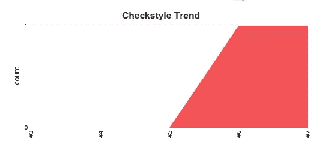

*页面下方有一个额外的图表，综合了来自 3 个工具的数据。CodeSniffer 就是其中之一。*

要查看问题所在，您可以单击最新版本左侧菜单中的“checkstyle warnings ”,或者单击特定版本，然后单击该特定版本的“checkstyle warnings”。


在此页面上，您可以清楚地看到问题的描述。请注意，您有几个过滤器可用。在顶栏中，您可以清楚地看到有多少问题是新的，有多少是已修复的。您可以单击数字来清楚地查看更改。在摘要中，您可以快速查看按优先级分类的问题。

## PHP MD

MD 代表混乱检测器。该工具试图指出代码中的几个问题。这可能是潜在的错误、未使用的代码或复杂的方法。有关可用检查的完整列表，您可以查看本页。请注意，我们不会检查每一条规则。您可以定义想要在 [phpmd.xml](https://github.com/peternijssen/Jumph/blob/master/build/phpmd.xml) 文件中检查哪些规则。

与 PHP 代码嗅探器一样，我们在项目视图页面上看到一个图表，显示了我们的 mess 检测是如何随着时间的推移而进展的。

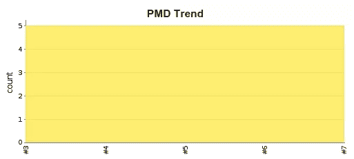

要找出问题所在，您可以单击左侧菜单中的“pmd 警告”,转到最新版本。如果您希望查看不同的版本，请单击某个版本，然后选择“pmd 警告”。你将会看到一个类似于 PHP 代码嗅探器的页面。


在顶部，您可以再次看到有多少问题是新的，有多少是已修复的。在此旁边，您还可以看到每个问题的优先级。

在“详细信息”页面中，您可以获得有关在哪里可以找到该问题的更多信息。有许多选项卡可以用不同的方式给出相同的信息。例如，您可以单击“类型”来了解每种类型的更多信息。


如你所见,‘UnusedFormalParameter’是我们最大的问题。通过单击它，我们将再次看到哪些文件得到了一个未使用的参数。

## PHP CPD

CPD 代表复制粘贴检测器。这个工具将分析你所有的代码，并寻找多行重复的代码。如果你有许多重复的行，这可能意味着你应该重写一些部分，以便在多个类之间共享逻辑。在 project view 页面上，我们将再次看到所有构建的整体进度。

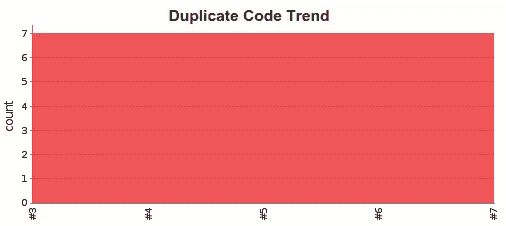

在左侧菜单中，我们可以单击“重复代码”来查看发现的问题。像以前一样，单击一个构建来获得关于该构建的更多信息。您会注意到概述看起来与前几页相似。让我们点击`details`选项卡以获取更多信息。

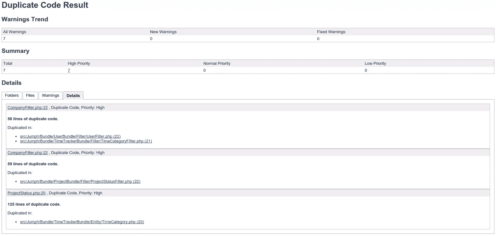

如您所见，CompanyFilter 类中有 58 行代码，它们也在 UserFilter 和 TimeCategoryFilter 类中。基于这些数据，您可以决定您需要某种 BaseFilter 来处理所有 3 个类的大部分部分或者实现一个服务。解决方案取决于您的情况，PHP CPD 只是告诉您它在哪里发现了问题。

## PHP 依赖

PHP 依赖可能是最难理解的指标。PHP Depend 对你的代码库进行静态代码分析。它会产生 2 个图像和一个概览页面。也许您已经注意到，在项目视图页面的顶部，有一些应该显示图像的 HTML。

图像未显示的事实意味着您必须在 Jenkins 的配置中切换开关。转到“管理 jenkins”并转到“配置全球安全性”。有一个选择框，您可以用它来配置“标记格式化程序”。将此设置为“安全 HTML”并保存您的设置。如果您现在返回到项目视图页面，您会注意到 HTML 被转换为两个图像。

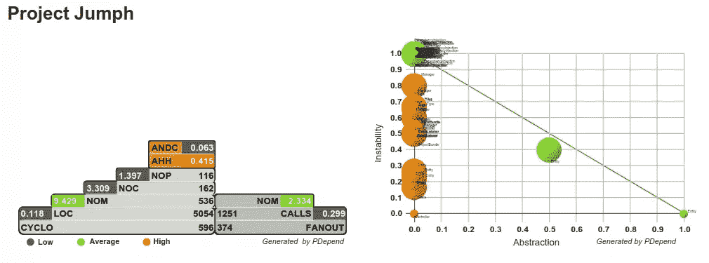

我建议您阅读该工具的官方文档，以完全理解这两个图表。更多关于金字塔的信息，你可以查看[这个](http://pdepend.org/documentation/handbook/reports/overview-pyramid.html)链接。对于抽象不稳定性图表，你可以查看[这个](http://pdepend.org/documentation/handbook/reports/abstraction-instability-chart.html)链接。

你可以通过点击一个特定的构建，然后在左侧菜单中选择‘jde pend’来获得更多的细节。你会得到这样的概述。

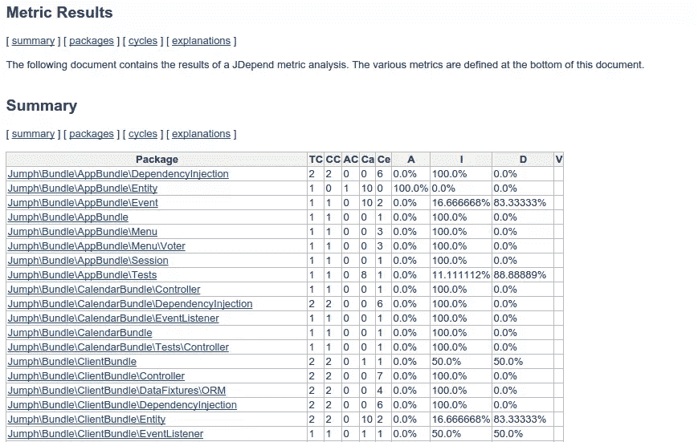

这一页的解释也相当大和复杂，所以我让你参考官方文档，其中解释了一切。

## phpdoc

PHPLOC 是一个快速测量项目规模的工具。它显示了代码的总行数、静态方法的总数等等。在左侧菜单中，您可以单击“绘图”来获得该工具的结果。你有 11 块地可以找到这些信息。下面，你会看到一个截图，显示了代码和注释的总行数，以及方法、类、特征和函数的总数。

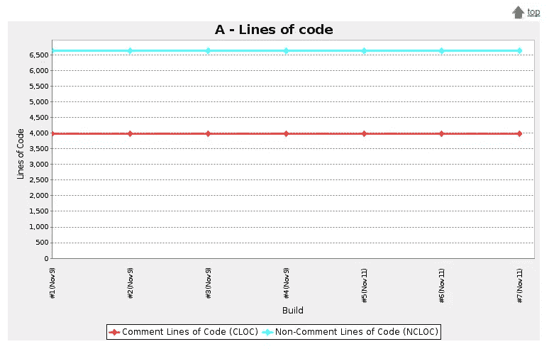

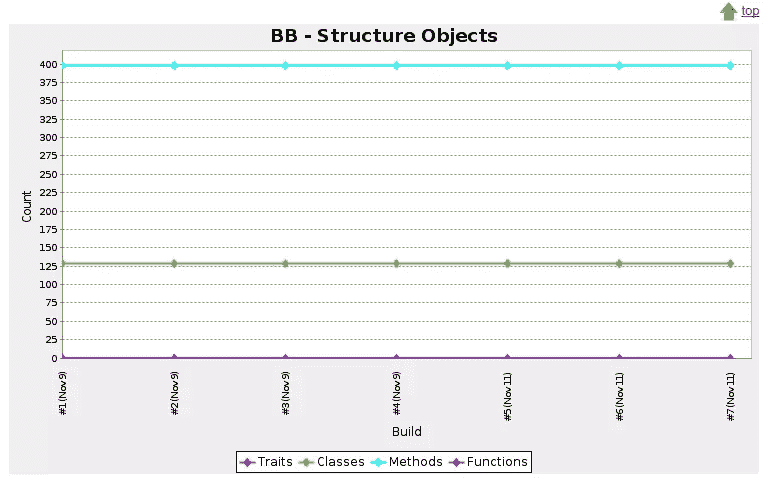

## PHPUnit

Jenkins 内部的大量统计数据是由 PHPUnit 生成的。在概览中，您将看到由来自 PHPUnit 的数据生成的 3 个图表。

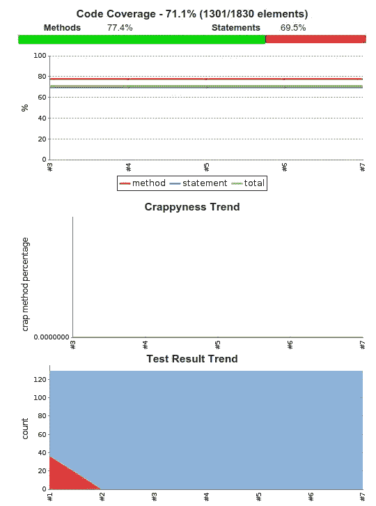

第一个图表显示了测试覆盖了多少代码。我们的情况是 71.1%。为了生成这个覆盖率，在后台使用 xdebug。

第二张图显示了你的垃圾水平。CRAP 代表变化风险分析和预测。垃圾是通过检查代码的复杂性并结合对代码执行的测试数量来计算的。如果您浏览了 PHP MD 规则，您可能会注意到 PHP MD 也能够检查代码的复杂性，但是没有考虑单元测试。阅读[这里](http://phpmd.org/rules/codesize.html#cyclomaticcomplexity)看看 PHP MD 如何计算你的复杂度。

最终的图表显示了多少测试成功，多少测试失败。就我们而言，他们都成功了。

在我们的左侧栏菜单中，有两个由 PHPUnit 生成的项目。第一个是`Crap`。在这一页上，你可以看到一些图表的概述，这些图表显示了你目前的垃圾等级有多高。在底部，你会看到哪些方法被标记为垃圾。您将会注意到一个指示覆盖率和复杂性的列。

第二个菜单项是“三叶草 HTML 报告”。在这个页面中，您可以了解每个目录中单元测试覆盖的范围。

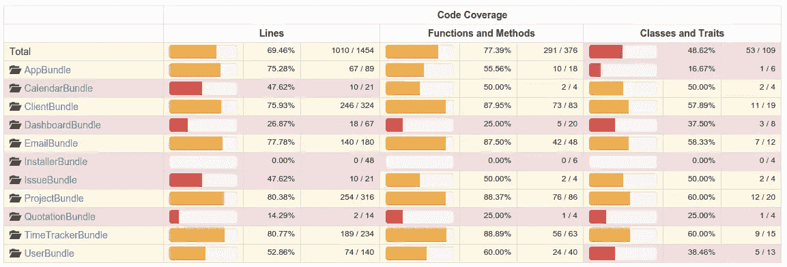

你可以点击一个目录来深入你的源代码。如果你找到一个文件，你可以打开它，看看每行有多少内容。用颜色来表示哪些部分正在测试，哪些没有。将鼠标悬停在某一行上可以指示该行被单元测试调用了多少次。

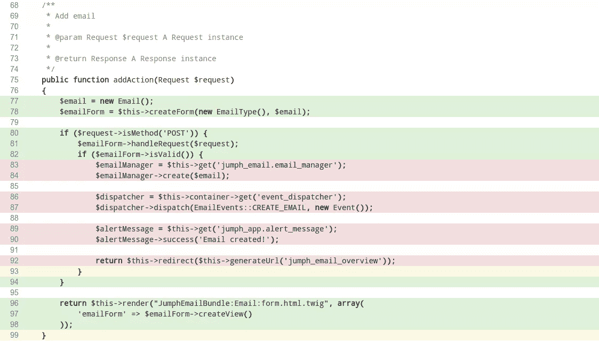

在我们的例子中，我们可以清楚地看到 if 语句中的部分没有被单元测试调用。这在我们的情况下是正确的。对此方法只执行 GET 请求，而不执行 POST 请求。如果我们在单元测试中实现 POST 请求，这个 If 语句将被标记为绿色。这样，您可以很容易地发现单元测试中任何缺失的部分。

## phpfox

有许多工具可以根据您的代码和注释生成文档。PHPDox 只是另一个可以为你完成这项任务的工具。在左侧菜单中，您可以单击“API 文档”转到您的文档。PHPDox 的好处是它还包括所有其他工具的结果。

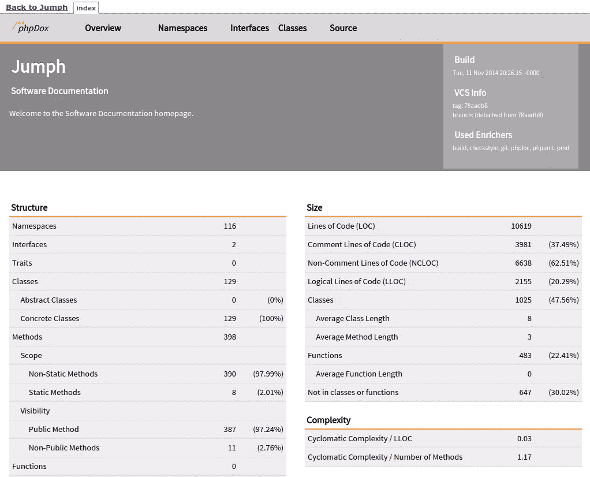

通过顶部的导航，您可以了解所有类的概况，但是您也可以更深入地了解一个类，并了解所有方法和描述的概况。您还可以查看文件的历史和来源。

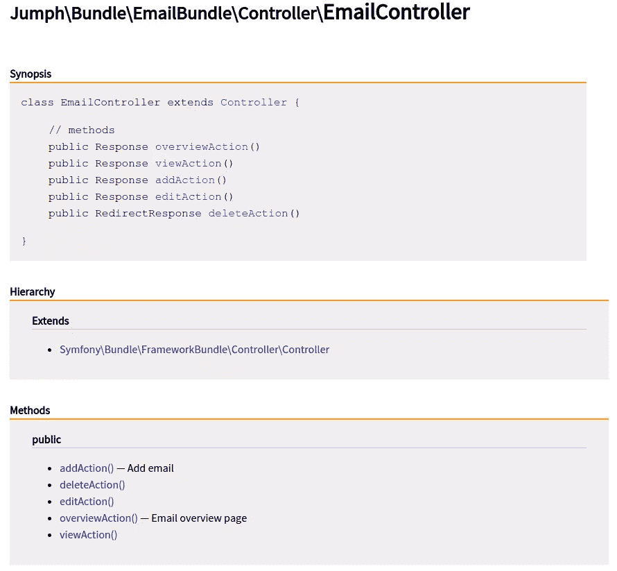

## 其他页面

除了我们在前几篇文章中设置的工具之外，Jenkins 还为您收集其他信息。我们安装的违规插件创建了一个额外的页面，显示了 PHP 代码嗅探器，PHP MD 和 PHP CPD 的概述。

你也可以点击一个特定的构建，在左侧菜单中找到一个名为“changes”的菜单项。如果您转到这个页面，您将看到上一次构建和这次构建之间所有提交的概述。当然，如果没有进行任何更改，页面将会是空白的。


## 结论

在本文中，我们仔细研究了从所有工具中获得的度量类型。您检索的所有信息也可以在命令行上检索。Jenkins 的优势在于您可以创建更好地代表问题的图表和概述。

在最后一部分，我们将更换一些工具并添加一些额外的指标。我们还将看看如何分析我们的 CSS、JavaScript 和 HTML 代码。

## 分享这篇文章