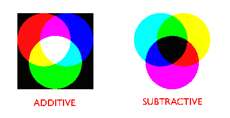
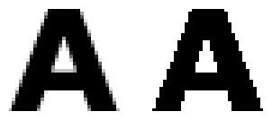
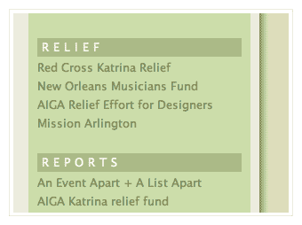
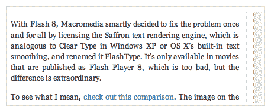
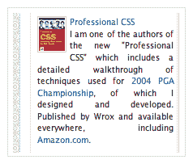

# 网络字体剖析文章

> 原文：<https://www.sitepoint.com/anatomy-web-fonts/>

如果说设计的一个方面在向网络的过渡中遭受了最大的损失，那就是字体艺术。多年来，网页排版只涉及选择字体和字体大小。未定型的 Times New Roman 是标准字体，整合已有的印刷技术和规则是不可想象的。

但是时代变了。自从主流网页设计采用 CSS 以来，我们已经进入了网页排版的新时代。设计的这个方面已经以一种过去不可能的方式向网页设计者敞开了大门。我们现在有工具让字体设计回归到它在设计领域的真实角色。

然而，如果说过去十年我们学到了什么，那就是网络不是印刷品。印刷术的基本原则将适用于任何格式，但至关重要的是，我们允许媒体的特征——在这种情况下，是显示我们类型的计算机屏幕或显示器——来定义我们实践的规则和技术。

那么，我们怎样才能将既定的、久经考验的排版原则转移到在线环境中呢？最好的起点是看看印刷和屏幕之间的差异，并了解这些差异将如何影响我们在网页设计中使用排版。

##### 这项技术

网络和它的印刷祖先之间最明显的区别——对于那些想要掌握网络印刷艺术的人来说这是最重要的一点——是你的字体显示在电脑屏幕或显示器上。如果你在电脑屏幕上阅读本教程，你会有一种与用现代激光打印机打印文本截然不同的体验。

***加减色系***

当你看电脑屏幕时，你会看到由光组成的颜色和形状。颜色是由红、绿、蓝光以不同的混合和强度组合而成的。这就是加色系统。

另一方面，如果你把这一页打印出来，并在纸上阅读，你看到的颜色和形状是由墨水中的色素组成的。这些颜色是通过它们表面对光的吸收和反射来感知的。这就是所谓的减色系统。

为什么这很重要？好吧，让我们考虑一下文本及其背景最常见的颜色组合:白底黑字。在减色系统(即印刷)中，这是一个非常合适的实践。白底黑字的对比尽可能鲜明和清晰，有助于良好的可读性和舒适的阅读。然而，对于加色系统(即在屏幕上)，白色是通过以最大强度混合红色、绿色和蓝色而产生的。这就是为什么白底黑字的组合会太亮，对眼睛太刺眼，不允许在屏幕上长时间阅读。当屏幕显示纯白时，屏幕发出的光最多，这种强度会影响字体和其他复杂图案的细节清晰度。

维基百科给出了更多关于加色系统和减色系统的细节。

***屏幕分辨率***

如果您使用现代激光打印机打印此文本，您可能会享受到高达 2400 dpi(每英寸点数)的打印分辨率。在屏幕上，你会幸运地拥有 96 dpi 的分辨率。对这一点的结论应该是相当明显的:在屏幕上显示文本时，你不可能获得与打印文本相同的清晰度和细节。正是这个因素，比其他任何因素都更能定义好的网页排版背后的建议和原则。

***未知数***

我们应该思考的另一个关键问题是我喜欢称之为未知的东西。当设计师从印刷转向网络时，他们不得不克服的最大障碍之一是他们无法真正控制他们的成品。无论我们如何试图猜测用户的浏览习惯、硬件配置和软件选择，我们都必须接受这样一个事实，即我们无法 100%控制人们如何体验我们的网页。

就网页排版而言，这有一些相当发人深省的后果。我们可以花几个小时来选择字体的完美组合，以补充我们的设计或满足公司的要求，但如果用户规定她希望所有文本都以 18px 的漫画字体显示，我们对此绝对无能为力。

关键是不要认为这是网络的局限，而是一种优势。还有哪种媒体给了最终用户如此大的自由？作为设计师，我们只是建议一个设计或布局；最终决定权在个人手中，他们的要求和选择每次都胜过我们。不要通过假设用户的需求或者试图将你自己的偏好强加给用户来限制这种自由。

另一个特别适用于网页排版的未知因素是抗锯齿。Windows XP 和 Mac OS 10 等现代操作系统为用户提供了将抗锯齿文本作为标准显示的选项。这是一件好事，它使阅读和在你的机器上工作更加舒适和悦目。然而，在试验字体和大小时有一个危险，我们忘记了用户可能没有抗锯齿功能或没有开启抗锯齿功能。

*比较消除锯齿和消除锯齿的文本。*

同样，不要对使用你网站的人做任何假设。我鼓励任何设计师至少在关闭反走样功能的情况下检查网站页面。你的发现可能会让你大吃一惊，在最坏的情况下，你甚至会重新考虑你的排版选择。

##### 网页排版的基本原则

已经看到了影响我们排版选择的技术问题，是时候更详细地看看应用于网络的排版原理了。

***字体***

选择字体是排版设计的起点，甚至可能会影响页面的整体设计或感觉。传统上，当谈到字体选择时，网页排版缺乏选择，因为字体只有在用户电脑上可用时才能显示。那么，网页排版人员的第一项工作就是区分可用的字体，并了解哪种字体最适合他或她的特定任务。

一般来说，网络上使用的字体主要有两种:衬线字体和无衬线字体。这种差异在这张图片中很容易体现出来:

*衬线和无衬线类型*

衬线是添加到上面乔治亚字体主要笔画末端的额外线条或小装饰。这些衬线背后的理论是，它们有助于字母流动，并在阅读过程中引导视线穿过文本。衬线字体在印刷中非常受欢迎，尽管关于哪种字体在屏幕上最易读有一定的争论，但我坚定地支持无衬线字体是更合适的选择的阵营。

衬线字体的可变粗细和精细的额外笔画，尤其是在较小的正文字体中，常常显得杂乱无章。即使使用最现代的抗锯齿技术，情况仍然如此。启用抗锯齿后，衬线字体在其曲线和终端周围看起来模糊不清(这正是它们的本来面目)。另一方面，无衬线字体的直的、低对比度的、开放的笔划，例如 Verdana，总是会在屏幕上留下好印象。

***常见网页字体***

大多数设计师可能都很熟悉常见的网页字体。下面这个 CSS 规则大概不会引起太多的非议。

`body {
font-family: verdana, "trebuchet MS", helvetica, sans-serif;
}`

这里，我们有三种在网络上广泛使用的经典字体。然而，不只是复制和粘贴这个规则，让我们看看为什么我们决定使用这三种字体，以及它们适合我们的目的的特征。

Verdana 是我们这里的首选字体。这种字体是为屏幕设计的，是当今网络上最常用的无衬线字体。

*详细的凡尔纳面容*

请注意每个字符之间的大量空间，以及字符(字形)本身的大量空白。这使得 Verdana 字体在屏幕上清晰可辨，也是网页上无衬线字体的绝佳选择。

投石机是为屏幕创造的另一张脸。由 Vincent Connare 于 1996 年设计，它可能是常见网络字体中最有特色的，可以传达大量的能量和个性。这种字体的某些特征与我们所期望的经典 grotesk 字体有很大的不同，例如，下面看到的大写 M。

*投石机详细面目*

尽管有鲜明的个性，但投石机的笔触是块状的，清晰的。它有一个大的 x 高度，有助于提高较小尺寸的易读性。

最后，我们去了 Helvetica。Helvetica 设计于 20 世纪 50 年代，在整个 20 世纪下半叶非常流行，它本身就是一个经典。它能很好地转移到屏幕上，这既是对其易读性的证明，也是对网络印刷商的祝福。

*详细介绍一下 Helvetica 的面容*

尽管它的宽度很小，但由于其较大的 x 高度，Helvetica 在屏幕上读起来很好。它给人一种一致统一的感觉，这不仅节省了空间，也让它看起来很舒服。

最后，我们的 CSS 规则将 sans-serif 声明为通用字体系列。这确保了如果用户没有我们指定的其他字体，他们的系统至少会默认为无衬线字体。

如果你使用上面的规则，你一定会为你的大多数用户提供好的、易读的文本。然而，为什么不多做一点实验呢？还有哪些好的屏幕字体，我们可以提供给有这些字体的用户？

***好的屏幕字体有哪些特征？***

更详细地了解了上述字体的属性后，您应该对定义好的屏幕字体的特征有一个清晰的概念:

*   低对比度和简单的笔画，粗细一致
*   宽大的 x 高度
*   宽大的宽度和字母间距
*   大的打孔宽度(字母内的空间)

记住这几点，你应该能够开始超越常见的网页字体。那么，在考虑字体选择时，你应该牢记哪些设计原则呢？

选择一种字体或一组字体，它将尊重并阐明文本的特征。

–r .布林赫斯特

你的字体决定了你的文本的基调或个性。类型是你的设计的一部分，用户除了直接交互别无选择，所以它的力量应该被重视。如果你正在为一家大银行或抵押贷款公司设计一个网站，你不太可能选择用漫画字体来设置正文。Comic Sans 是一种有趣、卡通、轻浮的字体，完全不适合公司形象的要求。

这是一个相当夸张的例子，但是原则很清楚:让你的内容的本质和设计的目标引导你选择字体。这意味着阅读文本并理解它所传达的内容，然后选择一种最能阐明关键概念的字体。

“进入字体”的最好方法是让自己沉浸在可用的东西中，了解人们是如何使用这些字体的。参观一些好的铅字铸造厂，特别是 Linotype 和 T2 信笺。

我发现在排版工作的早期阶段，另一个非常有价值的资源是一个神奇的工具， [Typetester](http://typetester.maratz.com/) 。Typetester 允许你用任意数量的 CSS 属性轻松地设置文本样式，并在屏幕上相互比较。当您找到自己喜欢的样式组合时，它甚至会为您构建 CSS 规则！这个工具非常值得花些时间使用，尤其是如果您不熟悉 CSS 中的许多详细的文本属性。

这让我们更仔细地看看那些详细的 CSS 属性。有了这么多通过 CSS 提供给网页设计者的功能，我们应该如何使用这些属性来给我们的用户提供最好的体验呢？

***大小***

字体大小是屏幕上最容易控制的因素之一，因此它在网页排版领域往往没有得到应有的重视。大小是给你的内容一个层次的重要工具，标题、正文和页脚的相对大小对页面的整体感觉有很大的影响。字体大小也与页面的其他特征密切相关，比如列宽、行高等等。

早在 16 世纪，印刷工已经开始使用一种通用的字体大小，没有理由不在 Web 上复制这种方法，尤其是如果你正在寻找一种传统的和高度易读的结果。就像音阶一样，下面的系列有一种自然的优雅，被印刷工认为是相对字体大小的标准。

*十六世纪发展起来的传统铅字尺寸系列*

使用这种字体大小比例的网站的一个很好的例子是 jare digital . com[http://www . jare digital . com]很明显，这个网站需要传统而时尚的版式，稍微仔细研究一下 CSS 就会发现使这一切成为可能的规则:

`h3 {
font-size:16px;
}`

 `H4 {
font-size:12px；
}` 

`p {
font-size:11px;
}`

一个好的经验法则是，不同级别的字体大小越接近，整体印象就越优雅。

如果你想要一种不连贯的或者现代的感觉，试着使用更大的字体。一个很好的例子可以在 Coudal.com 看到。这里使用的大标题是相当不寻常的，在我看来，给人一种更现代、不那么传统的设计感觉。但是，请注意，标题显示的颜色比正文要浅得多。另一个很好的经验法则是，如果你想使用大尺寸的标题，使用较浅的颜色来保持页面的整体平衡感。同样值得指出的是，这些标题是屏幕上衬线字体(在这里是 Times)的一个特别成功的应用。

***强调***

强调文字是一种相对简单的方法，可以让你的文字在网络上活起来。目前有一种非常流行的方式——特别是在网上促销或广告文本中——在页面上随意散布粗体字。虽然传统的排版惯例会警告不要在网页上过度使用相关字体，如粗体或斜体，但当屏幕上有许多其他分心的事物时，这种技术可以用来鼓励眼睛浏览文本。我们可以通过多种方式在文本中引入强调:

在 Web 上，最常见和最有效的方法是使用当前字体系列中的粗体。当然，和所有这些技巧一样，确保你不要过度使用粗体字。关键是少用粗体，或者根本不用。

**斜体:**斜体文本在低分辨率显示器上可能会受到影响，因为斜体字母的形状倾斜且更弯曲。这些可能看起来太像素化时，锯齿，太模糊时，消除锯齿，并会破坏易读性时，用于冗长的正文文本。然而，这不应该阻止你在约定允许时使用斜体，例如，引用外国单词和短语，或者列出书籍和期刊名称。

下划线:众所周知，给网页上的文本加下划线并不是一个好主意。网络惯例告诉我们，任何带下划线的文本都是链接，可以点击。很有可能，如果你在不可点击的文本下画线，你会让用户困惑。

使用颜色来强调也是一件相当棘手的事情。像带下划线的单词一样，彩色单词可能会被误认为是正文中的链接。在过去，使用不同的背景色来强调一段文字是很常见的，但是现在这已经成为了识别链接的惯例。此外，还有与使用颜色在网络上显示重要意义相关的[可访问性问题](https://www.w3.org/TR/WAI-WEBCONTENT/#gl-color)，这进一步增加了使用颜色强调不是一个理想方法的结论。

大写字母:永远不要用大写或小写字母书写段落。这样做不仅被认为是相当粗鲁和不雅观的，而且在印刷上，这是一个非常糟糕的选择。考虑这个句子与它前后的句子相比的易读性。毫无疑问，如果没有由小写字母创建的单词的独特形状，可读性会受到严重抑制。下面的例子清楚地说明了这一点。毫无疑问，由于单词的形状更明显，所以更容易辨认出句子上半部分的单词。

*注意句子的上半部分比下半部分更容易阅读*

然而，在适当的情况下，使用完整或小型的大写字母也可以达到不错的效果。尝试在文本中使用小型大写字母表示缩写和首字母缩略词，当然，对于代表人名或地名的首字母缩略词要使用全大写字母。这是一个在 Web 上很少考虑的细节，但是用站点范围的 CSS 文件应该很容易实现。

***行距***

在网页上排版时，一个重要的细节是行距问题。正文各行之间的垂直距离会对邮件的易读性和整体风格产生巨大的影响。下面两个文本块的比较应该清楚地表明这一点。选择行高值的一般经验是，文本的行长度越长，易读性就需要越多的行距。

*注意增加行高给文本带来的清晰度*

大多数浏览器的默认行高大约是 1.2(其中 1 是一行字符的顶部与上一行的底部接触的位置)。这对于屏幕上的文本来说是不够的；我建议将行高值增加到 1.4 到 1.6 之间。

***字母间距和字距***

在我看来，CSS 中由字母间距属性控制的字母间距(或跟踪)不应该用于正文。它不是非常跨浏览器友好，你在 Firefox 中看到的可能与在 Internet Explorer 或 Safari 中看到的完全不同。此外，打乱每个字体内置的跟踪似乎是错误的。类型设计者仔细计算这些空间，大多数时候，它们会提供良好的结果，而没有任何额外的改动。

然而，在短标题中，字母间距是一个非常有效的工具。一个经典的例子可以在 Zeldman.com 看到。右手栏标题的大字母间距允许使用更粗的大写字体，但确保页面的整体平衡是一致的。

*Zeldman.com 头衔的字母间距*

字距调整是指通过调整某些字母对之间的间距来改善单词的外观。在网络上，用正文文本来尝试这一点是不现实的。然而，如果你在图形软件中创建标题或标志，一点点字距调整会对整体效果产生巨大的影响。看下面两个例子。第一个显示了 Verdana 字体的默认字距调整；第二个在 Fireworks 中进行了调整，目标是创建一个更加平衡和匀称的单词形状。

***字间距***

和字母间距一样，单词间距在应用到屏幕上之前应该仔细考虑。我相信，如果你认为你的文本需要手动调整间距和跟踪，那么你可能选择了错误的字体。与 CSS 允许我们控制的所有文本属性一样，一致性是关键。让读者把注意力集中在文本上，让他们的目光容易在文字中流动。如果你把字母和单词分开，你只会分散他们的注意力，扰乱文本的流动。

***对齐***

页边距对页面的外观和感觉有着惊人的影响。它们有助于将您的文本与站点的其他元素以及浏览器窗口的边缘分开。较大的页边距会产生一种开放、自由的感觉，而较小、较紧的页边距会产生一种狭窄、更亲密的美感。

假设你的内容是从左到右(ltr)的语言，你在网页上应该总是左对齐你的文本。右对齐应该只用于非常特殊的目的，当然不能用于很长的文本段落。右对齐文本的左边缘参差不齐，使得眼睛很难从一行移到下一行，从而大大降低了可读性。

左右边距都对齐的文本称为两端对齐文本。对齐在书籍和报纸中非常流行，它给页面一种统一和受控的感觉。如果不是因为没有浏览器或操作系统内置断字词典，网络上的对齐会流行得多。这意味着浏览器调整文本的唯一方法是留出空间和/或压缩文字以适应特定的行长度。这在一定程度上是好的，但是有一点——特别是对于较短的线路长度——需要更多的灵活性。

设计师 Todd dominie 在他的网站上提供了一个选项来调整所有文本，下面的两个截屏显示了这样做的好的和坏的结果。

【Whatdoiknow.org】善义文

【Whatdoiknow.org】烂文

较宽栏中的文本看起来很棒，浏览器也很好地处理了对齐问题。然而，在较小的左栏中，你可以看到单词间距非常混乱和不一致，这极大地影响了文本的易读性。

##### 扩展 Web 排版

虽然在上面描述的方法中，CSS 可以实现很多功能，但是当涉及到网页排版时，设计者仍然必须忍受一些限制。我们仍然受困于数量有限的好的屏幕字体，但是即使有更多的可用字体，我们仍然依赖于用户在他们的机器上安装这些字体。在这种系统下，设计者永远无法真正控制他们想要的字体。令人沮丧的是，在设计师来到 Web 的十年里，这个问题并没有得到解决。

***替换文字***

如今，设计人员解决这些限制的一种方法是使用图像和 Flash 文本替换技术来显示标题或导航。这种文本通常是网站设计或品牌不可或缺的一部分，设计者渴望尽可能多地控制这些元素。

使用图像或 Flash 替换文本的规则与我们选择正文字体的规则没有什么不同。易读性应该永远是你最关心的问题，其次才是是否适合手头的任务。但是，您确实有更多的灵活性，主要是因为您更可能使用大字体，因此许多易读性问题已经解决了。这种情况可能是一个合适的实验案例，可以让字体的选择仅仅基于你在设计中试图传达的字符或个性。

在过去一年左右的时间里，一种闪存替代方法引起了很多热议，那就是 [sIFR](http://www.mikeindustries.com/sifr/) (发音为 siffer)。SIFR 被吹捧为一种在网页中嵌入定制字体的可访问、可扩展的方法，因此在设计者中引起了极大的兴奋。

对于网页设计师来说，这是一个绝佳的工具。在一些特定的例子中，sIFR 是在定制字体中创建动态标题的无与伦比的解决方案。然而，它不是 Web 上自定义排版的最终解决方案，在您的下一个设计中部署它之前，了解具体的情况是很重要的。像任何强大的工具一样，sIFR 有被严重滥用的可能。要了解更多关于 sIFR 及其用例的信息，请访问[sIFR 官方维基](http://wiki.novemberborn.net/sifr/)。

##### 未来

sIFR 等 Flash 替换技术暗示了网页排版的未来，但它们本身并不是未来。它们是权宜之计，如果运气好的话，将向浏览器制造商、字体铸造厂和 W3C 表明，网页设计者不会罢休，除非他们有办法在网页上显示自定义字体。

过去曾有人试图解决这个问题，特别是微软的网络嵌入字体工具(WEFT)T1，它允许字体存储在网络服务器上，并在需要时下载。不幸的是，这从来没有发展成一个令人满意的工具，仅仅是因为没有其他浏览器制造商实现了微软的技术。铅字铸造厂也担心他们有版权的铅字容易在网络上传播的后果。

一旦这个问题最终被克服，它肯定会被克服(尽管是晚了，而不是早了)，我们将进入另一个网络排版时代。然而，同样的规则仍然适用，因为排版的基本原则将转移到任何媒体。真正的挑战是随着媒体的发展，继续理解我们正在设计的媒体，并继续调整这些规则和指导方针以适应它。

不过，与此同时，请关注一下对于网页排版人员来说，肯定会被证明是一种不可思议的新资源的东西:应用于网页的排版风格元素。

这个新网站采用了罗伯特·布林赫斯特的经典著作《印刷风格的要素》中的原则，并一步一步地讲解它们如何应用于网络。如果这篇文章已经让你开始思考如何在你的网站上使用排版，这将是一个让你的知识更上一层楼的完美地方。

该网站的所有者理查德·鲁特每周增加一章。每本书都举例说明了可用于复制 Bringhurst 经典文本原则的实际 CSS，并解释了它们在 Web 上如何工作以及为什么工作。在接下来的几个月里，这绝对是一个值得关注的网站。

## 分享这篇文章