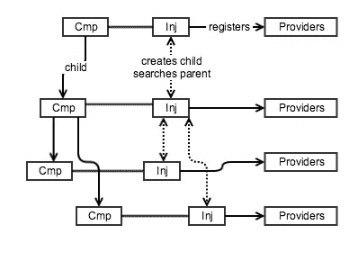
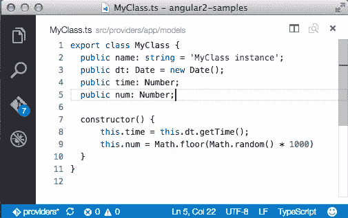
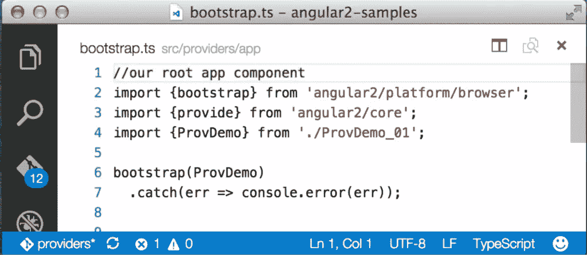
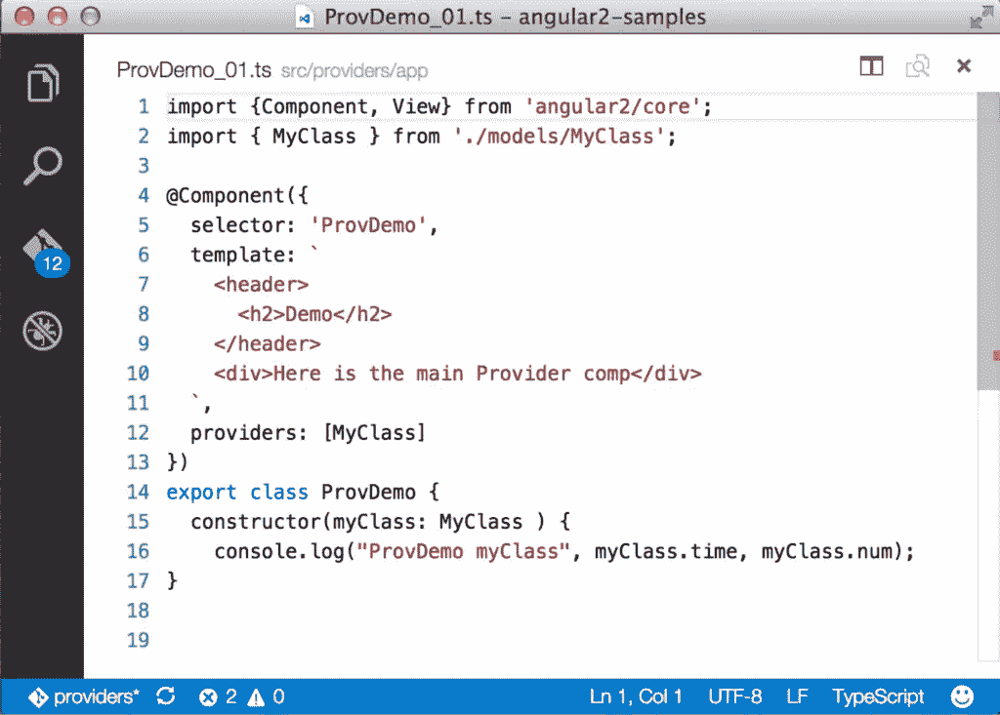
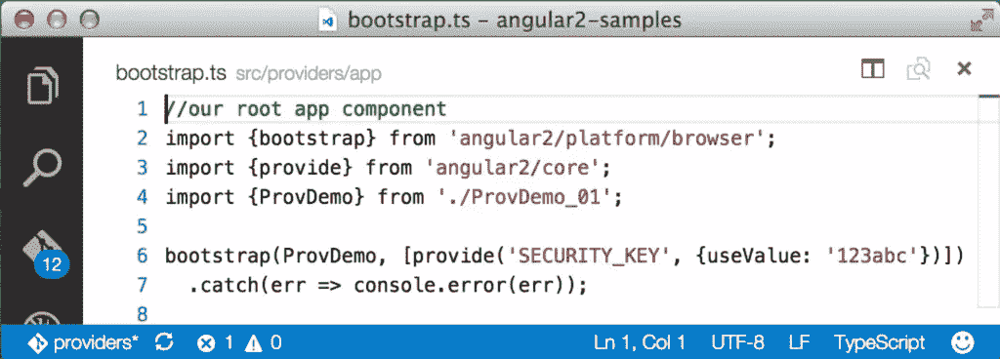
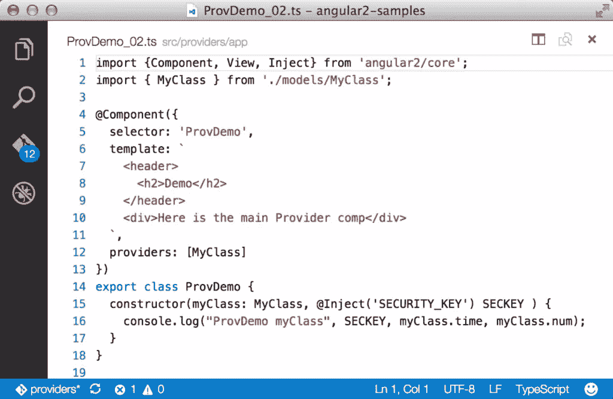
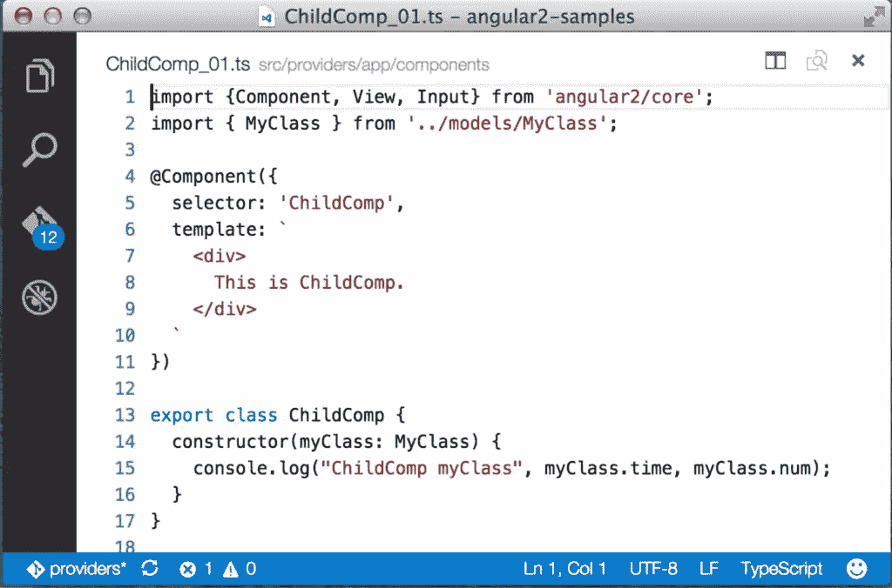
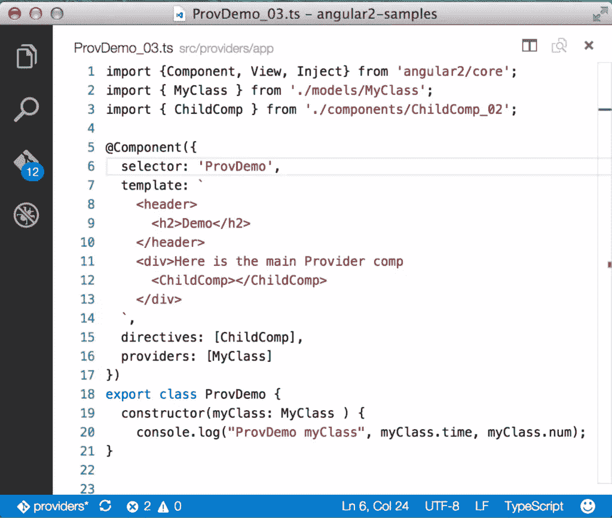
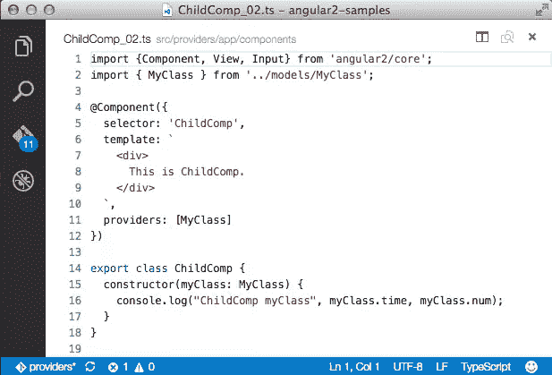

# Angular 2 组件和提供者:类、工厂和值

> 原文：<https://www.sitepoint.com/angular-2-components-providers-classes-factories-values/>

**在[之前的一篇文章](https://www.sitepoint.com/angular-2-components-inputs-outputs/)中，我们研究了如何使用`@Input`和`@Output`注释将数据输入和输出组件。在本文中，我们将看看 Angular 2 组件的另一个基本方面——它们使用*提供者*的能力。**

您可能已经在可用于配置组件的属性列表中看到了“提供者”，并且您可能已经意识到它们允许您定义一组可用于组件的可注入对象。这很好，但是它当然回避了这个问题，“什么是提供者？”

回答这个问题让我们进入 Angular 2 的依赖注入(DI)系统的复杂讨论。我们可能会在未来的博客文章中专门介绍 DI，但它在 Pascal Precht 的一系列文章中有很好的介绍，从:[http://blog . thoughtram . io/angular/2015/05/18/dependency-injection-in-angular-2 . html](http://blog.thoughtram.io/angular/2015/05/18/dependency-injection-in-angular-2.html)开始。我们假设你熟悉 DI 和 Angular 2 的 DI 系统，如 Pascal 的文章所述，但简单来说，DI 系统负责:

*   注册类、函数或值。在依赖注入的上下文中，这些项被称为“提供者”,因为它们会产生某种结果。例如，类用于提供或产生实例。(有关提供者类型的更多详细信息，请参见下文。)
*   解决提供者之间的依赖关系—例如，如果一个提供者需要另一个提供者。
*   当我们请求时，使提供者的结果在代码中可用。使代码块可以使用提供者结果的过程称为“注入”从逻辑上讲，注入提供者结果的代码被称为“注入器”
*   维护一个注入器层次结构，这样如果一个组件从一个在其注入器中不可用的提供器中请求一个提供器结果，DI 就会在注入器层次结构中向上搜索。

在前一篇文章中，我们提供了一个图表，展示了从根组件开始的组件层次结构。让我们添加到该图中，以包括注入器和它们注册的资源(提供者):



图 1:每个组件都有自己的注册提供者的注入器。注入器创建子注入器，对提供者的请求从本地注入器开始，并向上搜索注入器层次结构。

从上面我们可以看到，虽然组件形成了一个向下的图，但是它们关联的注入器具有双向关系:父注入器创建子注入器(向下),当请求提供者时，如果 Angular 2 在组件自己的注入器中找不到请求的提供者，它就搜索父注入器(向上)。这意味着在较低级别具有相同标识符的提供者将在较高级别隐藏同名的提供者。

## 什么是提供商？

那么，注射者在每一级注册的这些“提供者”是什么呢？实际上，这很简单:提供者是 Angular 用来提供(导致、生成)我们想要使用的东西的资源或 JavaScript“东西”:

*   类别提供者会产生/提供类别的执行个体。
*   当您运行指定的函数时，工厂提供程序会生成/提供任何返回的内容。
*   值提供者不需要像前两个那样采取行动来提供结果，它只是返回它的值。

不幸的是，术语“提供者”有时既指类、函数或值，也指由提供者产生的东西——类实例、函数的返回值或返回值。

让我们看看如何通过使用`MyClass`创建一个类提供者来为组件添加一个提供者，这个简单的类将生成我们希望在应用程序中使用的实例。



图 2:一个有四个属性的简单类。(代码截图均来自 Visual Studio 代码)

好了，上课到此为止。现在让我们指示 Angular 使用它来注册一个类提供者，这样我们就可以请求依赖注入系统给我们一个实例，以便在我们的代码中使用。我们将创建一个组件`ProvDemo_01.ts`，它将作为我们应用程序的根组件。我们加载这个组件，并在`bootstrap.ts`中启动我们的应用程序:



图 3:我们的应用程序的 bootstrap.ts 文件实例化了根组件。

如果上面的内容没有意义，那么看看我们之前的文章，它介绍了如何构建一个简单的 Angular 2 应用程序。我们的根组件叫做`ProvDemo`，存储库中包含了它的几个 numbers 版本。您可以通过更新上面导入 ProvDemo 的行来更改显示的版本。我们的根组件的第一个版本如下所示:



<small>图 4:导入了 MyClass 的 CompDemo，添加到 providers 数组中，并在构造函数参数中用作类型。</small>

将`MyClass`提供者添加到这个组件很简单:

*   汇入 MyClass
*   将其添加到@Component providers 属性中
*   将“MyClass”类型的参数添加到构造函数中。

在幕后，当 Angular 实例化组件时，DI 系统为注册了`MyClass`提供者的组件创建一个注入器。Angular 然后看到构造函数的参数列表中指定的`MyClass`类型，并查找新注册的`MyClass`提供者，并使用它来生成一个实例，该实例被分配给“myClass”(首字母小“m”)。

查找`MyClass`提供者并生成一个实例分配给“myClass”的过程都是有角度的。它利用 TypeScript 语法来知道要搜索什么类型，但是 Angular 的注入器执行查找和返回`MyClass`实例的工作。

鉴于上述情况，您可能会得出结论，Angular 接受“providers”数组中的类列表，并创建一个简单的注册表来检索类。但是有一点小小的变化让事情变得更加灵活。为什么需要“扭转”的一个关键原因是帮助我们为我们的组件编写单元测试，这些组件有我们不想在测试环境中使用的提供者。在`MyClass`的例子中，没有什么理由不使用真实的东西，但是如果`MyClass`调用服务器来检索数据，我们可能不希望或者不能够在测试环境中这样做。为了解决这个问题，我们需要在`ProvDemo`中替换一个不调用服务器的模拟`MyClass`。

我们如何进行替换？我们是否检查了所有的代码，并把每一个`MyClass`引用都改成了`MyClassMock`？这种方式效率不高，也不是编写测试的好模式。

我们需要交换提供者实现，而不改变我们的`ProvDemo`组件代码。为了实现这一点，当 Angular 注册一个提供者时，它会建立一个映射来将一个密钥(称为“令牌”)与实际的提供者关联起来。在我们上面的例子中，令牌和提供者是同一个东西:`MyClass`。在@Component decorator 中将`MyClass`添加到 providers 属性是以下内容的简写:

```
providers: [ provide(MyClass, {useClass: MyClass} ] 
```

这表示“使用‘my class’作为令牌(键)来注册一个提供者，以找到该提供者并将该提供者设置为`MyClass`，这样当我们请求该提供者时，依赖注入系统返回一个`MyClass`实例。”我们大多数人习惯于认为键要么是数字，要么是字符串。但是在这种情况下，令牌(密钥)就是类本身。我们还可以使用一个字符串为令牌注册提供程序，如下所示:

```
providers: [ provide(“aStringNameForMyClass”, {useClass: MyClass} ] 
```

那么，这对测试有什么帮助呢？这意味着在测试环境中，我们可以覆盖提供者注册，有效地做到:

```
provide(MyClass, {useClass: MyClassMock}) 
```

这将令牌(密钥)`MyClass`与类提供者`MyClassMock`相关联。当我们的代码要求 DI 系统在测试中注入`MyClass`时，我们得到了一个`MyClassMock`的实例，它可以伪造数据调用。最终结果是我们所有的代码保持不变，我们不必担心单元测试是否会调用测试环境中可能不存在的服务器。

## 注入非类提供者

在上面的内容中，我们通过编写以下代码将类提供者实例注入到构造函数中:

```
constructor( myClass: MyClass ) {...} 
```

TypeScript 让我们指定 myClass 参数需要是 MyClass 类型，DI 系统负责提供 MyClass 实例。

但是，如果我们使用字符串标记而不是类，我们如何告诉 Angular 注入我们的提供者结果呢？让我们编辑我们的`bootstrap.ts`文件，添加一个新的值提供者，并使用字符串标记注册它。记住值提供者是一种返回与令牌相关联的值的提供者。在上面的例子中，我们告诉 Angular 通过添加到@Component providers 属性来注册提供者，但是我们也可以通过将提供者传递到 bootstrap 函数来注册提供者，如下所示(同样的事情也可以添加到 providers 属性):



<small>图 5:添加了价值提供者的 bootstrap.ts。</small>

这里，我们通过调用 provide 函数添加了一个提供者，并传入了一个字符串标记(“SECURITY_KEY”)和一个对象，该对象指定我们希望创建一个值提供者和提供者本身—在本例中是一个简单的值。现在，我们想将值提供者生成的值注入到我们的构造函数中，但这是行不通的…

```
constructor( SECKEY: “SECURITY_KEY”) {...} 
```

这是因为“SECURITY_KEY”不是一个类型。为了能够用非类标记注入提供者，Angular 给了我们@Inject 参数 decorator。与所有其他装饰器一样，我们需要导入它，然后用它来告诉 Angular 注入一个与我们的字符串令牌相关联的提供者。为此，我们调整 create `ProvDemo\_02.ts`:



<small>图 6:导入“Inject”装饰器，并用它来注入一个用字符串标记标识的值提供者。</small>

我们可以使用相同的语法来注入`MyClass`提供者:

```
constructor( @Inject(MyClass) myClass, @Inject('SECURITY_KEY') SECKEY ) {...} 
```

好了，我们已经看到了如何注册和使用提供者，但是让我们学习更多关于提供者返回什么的知识。

## 提供商和单身人士

正如我们在上面看到的，提供者负责生成被注入的东西。类提供者生成一个实例，该实例被注入。但是重要的是要理解，每次注入类提供者结果时，并不会得到一个新的实例。相反，DI 系统只生成一次实例，缓存它，并且只要使用相同的提供者，每个后续的注入都会收到相同的实例。

最后一点很重要，因为每个组件都有自己的注射器和自己注册的提供者。`MyClass`有一个时间属性设置为当前时间(以毫秒为单位),还有一个随机数帮助我们查看是否每次都得到相同的实例。我们将在我们的应用程序中添加一个`ChildComp`组件。



<small>图 7:将 MyClass 注入到构造函数中的 ChildComp。</small>

注意，我们导入了`MyClass`并使用它来设置构造函数的参数列表中的类型。重要提示:*导入的`MyClass`在`ChildComp`中的唯一目的是作为 DI 系统使用的一个令牌，来寻找一个注册的提供者。*因为`ChildComp`没有自己的使用该令牌注册的提供者，Angular 查找注入器层次结构来找到一个。为了实现这一点，我们需要将`ChildComp`添加到`ProvDemo`组件中:



<small>图 8:模板中添加了 ChildComp 的 ProvDemo。</small>

我们导入`ChildComp`，向@Component 添加一个 directives 属性，告诉`ProvDemo`我们将使用`ChildComp`组件，并向模板添加`ChildComp`元素。当应用程序运行时，控制台输出显示`ProvDemo`和`ChildComp`都接收到了同一个`MyClass`实例:

```
ProvDemomyClass 1453033148406 390
ChildCompmyClass 1453033148406 390 
```

现在让我们更改`ChildComp`,向其注入器添加一个`MyClass`提供者:



图 9:定义了自己的 MyClass 提供者的 ParentComp。

我们所做的更改是将 providers 属性添加到@Component 注释中。果然，我们可以看到创建了两个不同的`MyClass`实例:

```
ProvDemomyClass 1453033681877 263
ChildCompmyClass 1453033681881 761 
```

Angular 的这个特性为任何一个提供者生成的结果提供了很大的灵活性，无论我们是使用单个实例还是多个实例。例如，您可以将一个组件放在一个 repeater 中，这样该组件就可以多次生成。如果这个重复的组件注册了自己的提供者，那么每个组件都会获得唯一的提供者。但是，如果您只在父组件中注册 provider，那么每个重复的实例都会共享父组件的 provider。

## 包裹

在本文中，我们定义了什么是提供者，并介绍了三种不同类型的提供者。然后，我们看了如何为组件注册一个提供者，并将提供者生成的结果注入到组件中。我们还看了一下 Angular 如何使用注入器的层次结构来查找请求的提供者。Angular 为您提供了对依赖注入系统如何工作以及在哪里寻找提供者的额外控制，但是上面应该让您开始在 Angular 2 应用程序中创建和使用提供者。

## 分享这篇文章