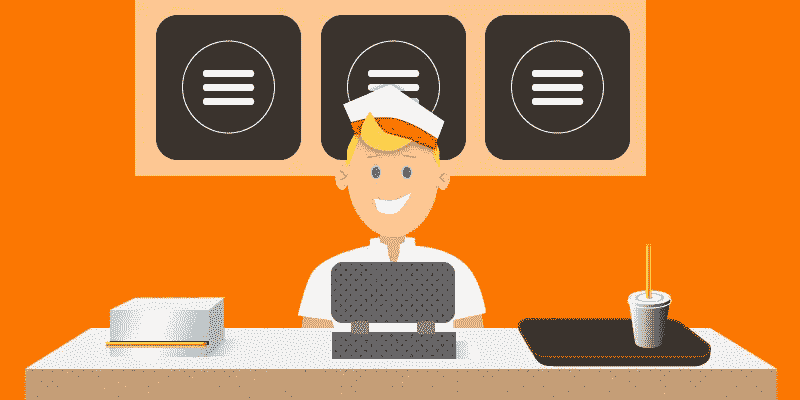
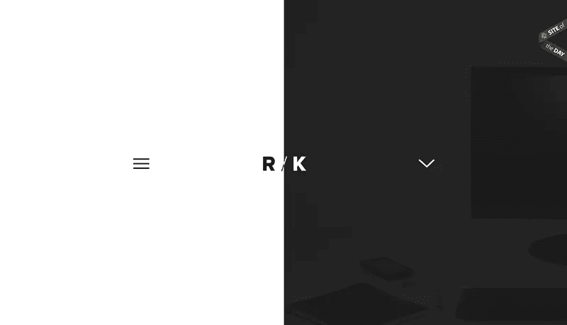
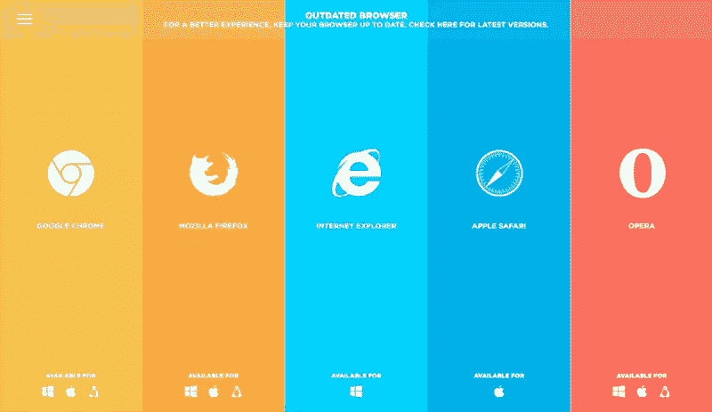
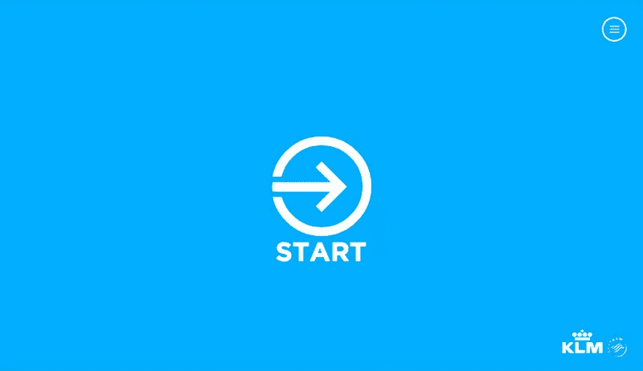

# 用户准备好桌面汉堡图标了吗？

> 原文：<https://www.sitepoint.com/are-users-ready-for-the-desktop-hamburger-icon/>

你知道那句老话“简洁是智慧的灵魂”吗？

看来说是进化的，简洁也是网络的灵魂。作为一名 UX 设计师，我一直在寻找简化事物的方法，并在有意义的时候使用速记符号。

当移动浏览让我们重新思考如何在最小屏幕尺寸的限制下简化用户体验时，“汉堡”图标受到了考验。不管你是否相信另一个图标、形状甚至文本会做得更好，这三条小水平线似乎已经赢得了菜单图标的军备竞赛。

最初，汉堡包图标纯粹是出于需要而诞生的。桌面风格的固定导航条在手机屏幕上没有多大意义。所以我们开始一起使用隐藏菜单和指示器，让隐藏的变得可见。越来越多的移动网站开始使用这个图标，甚至在它被广泛认为是“菜单”的通用符号之前

现在几乎每个人都在移动设备上浏览。几乎所有的手机网站都使用汉堡包图标。瞧啊。几乎得到全世界的认可。现在，我们陷入了一个有趣的难题:如果每个人都普遍认识到汉堡包的含义，我们能否将它从手机中释放出来，放到我们的桌面上呢？或者更直白一点，*用户会接受吗？*

让我们来分析一下支持和反对桌面汉堡的观点，最终看看哪里最适合，哪里应该完全避免。

## 好人

### “清洁因素”

对于设计师/开发人员来说，在桌面应用程序中使用汉堡包图标的主要吸引力是“干净的因素”极简设计越来越受欢迎，所以当然会有去除所有东西的冲动，除了最基本的元素。

传统上，导航是网站的主要功能，并没有增加多少视觉效果(在大多数情况下。)如果我们可以用一些最简单但容易辨认的东西来代替一些笨重和突出的东西，总体效果无疑会简单得多。

但是让我们注意不要混淆视觉简单和功能简单。稍后会详细介绍。

### 让你的 CTA 成为英雄

任何 UX 专业人士面临的最大任务之一是创建一个合理的层级。我们必须更加强调某些元素，只是为了让它们突出。但不幸的是，当我们扩大某些东西的规模时，其他元素最终必然会被最小化。

将导航元素隐藏在汉堡包图标后面是一个很好的方法，可以让你的终端用户注意到你想做的任何事情。举个例子，在一个简单的投资组合网站中，你想从用户那里得到的最终结果是雇佣你。因此，如果你的登录页面有足够的信息让他们继续下去，期望他们直接从那个页面点击你的 CTA 并不是不现实的。我们的目标是突出你的主 CTA 按钮，因为其他菜单项可能是次要的。

通过利用汉堡包和隐藏菜单，你成功地确定了主要目标的优先次序，同时减少了其他选择的干扰。

### 受欢迎的力量

当然，让汉堡包图标变得有用的一个因素是它的可识别性。事实是，大约从 2010 年开始，当它开始在移动应用程序中传播时，用户就一直在与它互动。A/B 测试显示，参与度每年都在稳步提高，这很可能归因于接触的增加。

虽然汉堡已经广为人知，但它还没有达到完全饱和，这让我们想到…

## 不太好的人

### 没有得到用户的普遍认可

汉堡包是众所周知的，但它仍然有一些盲点，这使得它比简单的导航菜单更有风险。有趣的是，据信在移动设备上浏览最少的用户也最不熟悉我们所知道的菜单图标。一般来说，这在老年人中尤其如此，特别是 65 岁及以上的人。

### 又一次点击，又一个障碍

也许使用汉堡包图标代替标准菜单的最大缺点是用户必须采取额外的行动才能到达他们想去的地方。优秀 UX 的指导原则之一是尽可能消除用户和内容之间的障碍。还记得我之前提到的*功能简单性*吗？这就是了。

当我们让一些人点击一个图标，仅仅是为了进入其中包含的导航选项时，我们让他们经历了额外的一步。这可能看起来不多，但如果有人打算在你的网站上花很多时间，他们可能不会想一遍又一遍地采取这个额外的步骤。如果你要让你的用户采取额外的步骤，它需要有一个好的理由，并且只有在正确的情况下。

### 眼不见；心不想

如果你的隐藏导航包含一些令人愉快和意想不到的东西呢？如果因为它被藏起来了，没有人会看到它呢？当你有有趣的内容时，可发现性下降可能是一个主要问题，这可能会推动转换。

例如，一个有推荐页面的网站可能依靠推荐来联系潜在客户，并说服他们转化。如果这是导航中一个清晰可见的选择，用户将更有可能“偶然”发现这个页面。因为它不是每个网站都有的一个明显的部分，所以如果隐藏的话，它很可能会被忽视。

## 最佳用途

对于汉堡包这个问题，没有明确的普遍答案，让我们来看看你可能想使用它的不同情况，以及如何充分利用它。

### 页面少/内容少的简单网站

如果你的网站比较小，你真的想充分利用空白，你可以把主菜单隐藏在图标后面。因为你不期望用户一页一页地点击，额外的点击可能是值得的，因为你追求的是干净的美感。

### 当它明显是可点击的

研究和无数的 A/B 测试得出结论，当菜单图标包含在一个按钮中时，其性能会提高 20%。因此，您最好采用这种方法，并在它周围加上一个边框。

汉堡菜单:如果你喜欢它，你应该在它上面挂个戒指。

传统上，汉堡包图标从来不需要悬停状态，因为它们纯粹是为移动应用程序设计的，但是如果你打算把它包含在你的桌面设计中，确保给鼠标经过它的用户一些视觉反馈，这样他们就知道它确实是可以点击的。

当你看到它时，确保它清晰可见。牢记对比度、尺寸和位置。一般来说，任何放在屏幕左边的东西都会有更多的动作，所以你可能会选择左上角，而不是右边。保持它的粘性也是明智的，这样当你的用户向下滚动的时候，它会停留在窗口的顶部。

### 与 CTA 配对

也许使用隐藏菜单的最好例子是，当与强大的 CTA 一起使用时，你可以有效地告诉用户对他们的期望。这样做将重点放在 CTA 上，同时将用户迷失在无关内容中的风险降至最低。如果你有相对独立的专用登录页面，这通常是最有效的，这样用户就不需要四处点击来获取他们想要的信息。

## 最坏的用途

另一方面，这里有一些汉堡包/隐藏菜单组合的最坏情况。

### 在一个针对老年人的网站上

如前所述，65 岁以上的演示者最不熟悉汉堡包图标背后的含义，因此最不可能与之互动。因此，如果你正在设计一个倾向于这个年龄段的网站，你最好保持所有的导航清晰明了。

### 包含意外内容的网站

任何依赖于自发可发现性的网站都不会成为汉堡图标的候选对象，因为这些元素不太可能被发现。默认情况下，任何有趣的和/或意想不到的可能增加网站整体转化率的东西都应该明确显示。人们不太可能发现他们甚至不知道存在的东西。

## 最后的想法

正如网页设计本身一样，桌面汉堡的争论没有“放之四海而皆准”的答案。最终，你需要权衡所有因素，并确定它提供的视觉简单性是否值得潜在的 UX 风险。当然不是在所有情况下都是可取的，但我想我可以有把握地说，随着时间的推移，风险会越来越小。

你怎么想呢?在桌面网站上使用带有汉堡图标的隐藏菜单是明智的吗？我是否忽略了一个好的用途或障碍？请在下面说出你的想法，让对话继续下去！

## 分享这篇文章