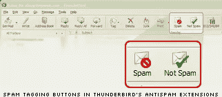

# 你的图标对你有用吗？

> 原文：<https://www.sitepoint.com/are-your-icons-working-for-you/>

图标和信息图是所有图形用户界面(操作系统和在线)不可或缺的一部分，就像你窗外的街道标志一样，即使我们正在使用它们，我们也很难注意到它们。这就是它应该有的样子。我们第一次看到它时，它应该有助于解释菜单项、按钮或链接背后的概念——可能是购物选项旁边的购物车剪影，或者是“保存”选项旁边的磁盘。第一次之后，我们倾向于将它们作为标志或地标，在我们熟悉的界面上移动。

然而，有时候这些想象会与你想要达到目标背道而驰。有时，这可能很简单，就像强调交互中的错误部分一样。在网上购物的情况下，你是用硬币或钞票标记“购买”按钮——强调用户失去的东西——还是把这个过程与购物车或袋子联系起来，强调用户得到的东西。我们不必窃听亚马逊董事会会议室就能知道这个问题的答案。

我今天看到了另一个恰当的例子。大约一个月前，我为雷鸟安装了一个新的反垃圾邮件扩展——奇怪地命名为“ [Spamato](http://www.spamato.net/) ”。该系统很好地结合了多种技术，并允许您调整每种技术的相对影响。该系统学习速度很快，但仍需要您手动标记好的和坏的邮件，以供其学习。

虽然它做出的决定总体来说很好，但我有一个小问题，但很烦人。每次我去把一封邮件标记为垃圾邮件，我都会感到一种奇怪的不安。我经常发现自己徘徊在“垃圾邮件”按钮上，想要按下它，但又有一种挥之不去的疑虑，我永远也不能准确地找到它。我觉得我好像做错了什么，但我不知道为什么。

最后，我花了一点时间来分析发生了什么，并弄明白了。

按钮上的文字没问题，它写着“垃圾邮件”。简洁明了。然而，这个图标是一个由经典的红色条纹圆圈重叠的信封——这个圆圈是“ ***【不要】*** 或“ ***不*** ”或“ ***禁止*** ”的通用符号。综合起来看，你可能会把这些图像解释为“**无邮件**”或“**无邮件**”——我想这是描述垃圾邮件的一种方式。

然而，在电子邮件客户端的设置中，信封的图标图像被频繁使用，几乎失去了它的意义。信封图标很自然地出现在应用程序的各个层次，仅在主导航面板上就有六个。

那么，当我把鼠标悬停在那个按钮上时，我下意识地得到了什么信息呢？

大红色的'**不是**符号和单词'**是垃圾**。我的意识根据经验知道这是垃圾邮件标记按钮，但在更深处，我大脑的一部分在尖叫' ***不！上面写着不是垃圾邮件！！！***’。这与图标试图达到的效果正好相反。

同样，附带的标记“好邮件”的按钮标有否定的“不是垃圾邮件”标签，但随后又标有肯定的绿色勾号。虽然没有那个红圈装置那么强的心理作用，但无论如何，还是违背了我的直觉。

我有一个想法，这些图标实际上是通用的，并在其他反垃圾邮件扩展中使用，包括垃圾邮件，所以它们已经进入了许多桌面。

我是不是太挑剔了？只是我吗？

我可能会考虑设计一些新的图标来支持他们的标签。事实上，也许新的标签是有意义的。“好”和“坏”是简单的概念，比“垃圾邮件”和“非垃圾邮件”更深入我们的大脑，所以挖掘这些更深层次的“直觉”可能是有意义的。

也许你自己也有一些想法？我有兴趣看看其他的方法。

## 分享这篇文章