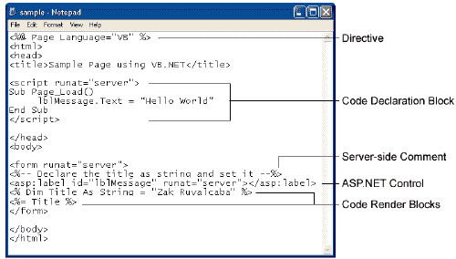

# 使用 C#和 VB.NET 2 建立你自己的 ASP.NET 网站

> 原文：<https://www.sitepoint.com/asp-dot-net-basics/>

在第一章中，你学习了 ASP.NET 是什么，它能做什么——你甚至知道如何创建一个简单的 ASP.NET 页面。如果现在看起来有点困惑，不要担心，因为随着这本书的进展，你将学会如何在更高级的水平上使用 ASP.NET。注意，如果你想打印出来离线阅读，你可以[下载 PDF 格式的章节](https://www.sitepoint.com/books/aspnet1/signoff.php)。

到目前为止，您已经安装了必要的软件，并了解了一些非常简单的表单处理技术。随着接下来几章的展开，我们将介绍更高级的主题，包括控件、编程技术等等。然而，在我们开始用 ASP.NET 开发应用程序之前，您需要理解一个典型的 ASP.NET 页面的内部工作原理。这将有助于你识别书中许多例子所引用的 ASP.NET 页面的各个部分。在这一章中，我们将讨论 ASP.NET 页面的一些关键机制，具体来说:

*   页面结构
*   视图状态
*   名称空间
*   指令

我们还将介绍。NET 框架:VB.NET 和 C#。随着这一部分的展开，我们将探索这两种语言在创建 ASP.NET 应用程序方面的差异、相似之处和能力。

那么，ASP.NET 页面到底是由什么组成的呢？接下来的几节将让你深入了解典型的 ASP.NET 页面的结构。

##### ASP.NET 页面结构

ASP.NET 页面只是带有。aspx 文件扩展名，可以放在装有 ASP.NET 的 IIS 服务器上。当浏览器请求 ASP.NET 页面时，ASP.NET 运行时(作为。NET Framework 的公共语言运行库(CLR)将目标文件解析并编译为. NET Framework 类。现在新类中包含的应用程序逻辑与 ASP.NET 页面的表示 HTML 元素结合使用，向用户显示动态内容。听起来很简单，对吧？
ASP.NET 页面由以下元素组成:

*   指令
*   代码声明块
*   代码呈现块
*   ASP.NET 服务器控件
*   服务器端注释
*   服务器端包含指令
*   文字文本和 HTML 标签

重要的是要记住，ASP.NET 页面只是扩展名为`.aspx`的文本文件，运行时根据它们的内容对其进行处理以创建标准的 HTML。页面中的表示元素包含在`<body>`标签中，而应用程序逻辑或代码可以放在`<script>`标签中。还记得上一章末尾的样本中的这个模式吗？


**图 2.1 说明了该页面的各个部分。**

**图 2.1。ASP.NET 页面的所有元素都会突出显示。其他的都是文字文本和 HTML 标签。**

正如您所看到的，这个 ASP.NET 页面包含了组成 ASP.NET 页面的所有上述组件的示例(除了服务器端的 includes)。您不会经常使用给定页面中的每个元素，但是您应该熟悉这些元素、每个元素的用途，以及如何以及何时使用它们是合适的。

##### 指令

指令部分是 ASP.NET 页面最重要的部分之一。*指令*控制如何编译页面，在页面间导航时指定设置，帮助调试(错误修复)，并允许您导入在页面代码中使用的类。指令以序列`<%@`开始，接着是指令名，加上任何属性和它们相应的值，然后以`%>`结束。虽然您可以在页面中使用许多指令，但是最重要的两个是`Import`和`Page`指令。稍后我们将更详细地讨论指令，但是现在，我们知道`Import`和`Page`指令对于 ASP.NET 开发是最有用的。查看图 2.1 中的示例 ASP.NET 页面，您可以看到页面顶部使用了一个`Page`指令，如下所示:

```
<%@ Page Language="VB" %> 

<%@ Page Language="C#" %>
```

在这种情况下，`Page`指令通过适当地设置`Language`属性来指定应用程序逻辑使用的语言。引号中为该属性提供的值指定我们使用的是 value 还是 C#。有一系列不同的指令。我们将在本章的后面看到更多。

与 ASP 不同，在 ASP.NET，指令可以出现在页面上的任何地方，但最常见的是写在第一行。

##### 代码声明块

在*第 3 章，VB.NET 和 C#编程基础知识*中，我们将讨论代码隐藏页面，以及它们如何让我们将应用程序逻辑与 ASP.NET 页面的 HTML 表示代码分离开来。但是，如果您没有使用代码隐藏页面，那么必须使用*代码声明块*来包含您的 ASP.NET 页面的所有应用程序逻辑。这个应用程序逻辑定义了变量、子程序、函数等等。在我们的页面中，我们将代码放在`<script>`标签中，就像这样:

```
<script runat="server"> 

Sub mySub() 

  ' Code here 

End Sub 

</script>
```

在这里，标签包含了一些 VB.NET 代码，但是如果我们的页面语言被设置成这样，它也可能是 C#:

```
<script runat="server"> 

void mySub() { 

  // Code here 

} 

</script>
```

##### VB.NET 和 C#代码中的注释

这两个代码片段都包含了*注释*——ASP.NET 将会忽略的解释性文本，但是它用来描述代码是如何工作的。

在 VB.NET 代码中，单引号或撇号(`'`)表示该行的剩余部分作为注释被忽略。

在 C#代码中，两个斜杠(`//`)也是这样。C#代码还允许你通过以`/*`开始并以`*/`结束来跨越多行注释。

之前。NET 的出现，ASP 也支持使用`runat="server"`属性的脚本标签，尽管它们只能包含 VBScript，并且由于各种原因，它们没有得到开发人员的青睐。代码声明块通常放在 ASP.NET 页面的`<head>`标签中。例如，图 2.1 所示的示例 ASP.NET 页面包含以下代码声明块:

```
<script runat="server"> 

Sub Page_Load() 

  lblMessage.Text = "Hello World" 

End Sub 

</script>
```

也许你可以算出等价的 C#代码是什么:

```
<script runat="server"> 

void Page_Load() { 

  lblMessage.Text = "Hello World"; 

} 

</script>
```

`<script runat="server">`标签也接受另外两个属性。您可以使用`language`属性设置块中使用的语言:

```
<script runat="server" language="VB"> 

<script runat="server" language="C#">
```

如果您没有在代码声明块中指定语言，ASP.NET 页面将使用由`Page`指令的`language`属性提供的语言。每页只能包含一种语言的代码；例如，不可能在同一个页面中混合使用 VB.NET 和 C#。

第二个可用的属性是`src`，它允许您指定在 ASP.NET 页面中使用的外部代码文件:

```
<script runat="server" language="VB" src="mycodefile.vb"> 

<script runat="server" language="C#" src="mycodefile.cs">
```

##### 代码呈现块

您可以使用*代码呈现块*来定义页面呈现时执行的内联代码或内联表达式，您可能会从传统的 ASP 中认出这些块。代码呈现块中的代码在遇到时会立即执行，通常是在第一次加载或呈现页面时，以及随后每次加载页面时。另一方面，出现在脚本标记中的代码声明块中的代码只有在被用户或页面交互调用或触发时才会执行。有两种类型的代码呈现块:*内联代码*和*内联表达式*，这两种代码通常都写在 ASP.NET 页面的主体中。

内联代码呈现块执行一个或多个语句，并直接放在页面的 HTML 中的`<%`和`%>`字符内。

内联表达式渲染块可以比作经典 ASP 中的`Response.Write()`。它们以`<%=`开始，以`%>`结束，用于在页面上显示变量和方法的值。

回头看图 2.1，您可以看到两种类型的代码呈现块:

```
<% Dim Title As String = "Zak Ruvalcaba" %> 

<%= Title %>
```

这相当于下面的 C#:

```
<% String Title = "Zak Ruvalcaba"; %> 

<%= Title %>
```

第一行表示一个内联代码呈现块，必须包含适当语言的完整语句。这里，我们将变量`Title`的值设置为字符串`Zak Ruvalcaba`。最后一行是一个内联表达式呈现块的例子，用于将`Title`变量`Zak Ruvalcaba`的值写到页面上。

##### ASP.NET 服务器控件

ASP.NET 页面的核心是*服务器控件*，它代表用户可以与之交互的动态元素。服务器控件有四种基本类型:ASP.NET 控件、HTML 控件、验证控件和用户控件。

为了正常工作，所有的 ASP.NET 控件必须位于一个`<form runat="server">`标签内。这个规则仅有的两个例外是`HtmlGenericControl`和`Label` Web 控件。

服务器控件为 ASP.NET 开发人员提供了以下优势:

*   我们可以从代码中轻松地访问 HTML 元素:我们可以改变它们的特性，检查它们的值，甚至直接从我们选择的服务器端编程语言中动态更新它们。
*   即使在页面被处理后，ASP.NET 控件仍保留其属性。这个过程被称为*视图状态*。我们将在本章后面讨论视图状态。现在，只要知道视图状态可以防止用户丢失已经输入到表单中的数据，一旦这些数据被发送到服务器进行处理。当响应返回到客户端的浏览器、文本框值、下拉列表选择等时。，都是通过视图状态保留的。
*   使用 ASP.NET 控件，开发人员能够将页面的表示元素(用户看到的所有内容)和应用程序逻辑(ASP.NET 页面的动态部分)分开，这样就可以分别考虑。

因为《ASP.NET》完全是关于控制的，所以在我们阅读这本书的时候，我们会更详细地讨论它们。例如，在接下来的几章中，我们将讨论 HTML 控件和 Web 控件(*第 4 章，Web 表单和 Web 控件*)、验证控件(*第 5 章，验证控件*)、数据控件(*第 9 章，数据网格和数据列表控件*)，等等。

##### 服务器端注释

*服务器端评论*允许你在页面中包含 ASP.NET 不会处理的评论或注释。传统的 HTML 使用`<!--`和`-->`字符序列来分隔注释；浏览器不会向用户显示在这些文件中找到的任何内容。ASP.NET 的评论看起来非常相似，但是使用了序列`<%--`和`--%>`。

我们的 ASP.NET 示例包含以下服务器端注释块:

```
<%-- Declare the title as string and set it --%>
```

ASP.NET 评论和 HTML 评论的区别在于 ASP.NET 评论根本不会发送给客户端。不要使用 HTML 注释来尝试注释掉 ASP.NET 代码。考虑下面的例子:

```
<!-- 

<button runat="server" id="myButton" onServerClick="Click">Click  

Me</button> 

<% Title = "New Title" %> 

-->
```

这里，看起来好像开发人员试图使用 HTML 注释来隐藏 HTML 按钮控件和代码呈现块。不幸的是，HTML 注释只能对浏览器隐藏一些东西，而不能对 ASP.NET 运行时隐藏。因此，在这种情况下，虽然我们在浏览器中看不到代表这两行的任何内容，但它们实际上已经被 ASP.NET 处理过，变量`Title`的值将被更改为`New Title`。可以非常简单地修改代码以使用服务器端注释:

```
<%--  

<button runat="server" id="myButton" onServerClick="Click">Click  

Me</button> 

<% Title = "New Title" %> 

--%>

Now, the ASP.NET runtime will ignore the contents of this comment, and the value of the Title variable will not be changed.

##### 服务器端包含指令

服务器端 include 指令使开发人员能够将外部文件的内容插入 ASP.NET 页面中的任何位置。过去，开发人员在插入连接字符串、常量和其他代码时使用服务器端包含，这些代码通常会在整个站点中重复出现。

您的服务器端 includes 有两种方法可以指示要包含的外部文件:使用`file`或`virtual`属性。如果我们使用`file`，我们将其文件名指定为服务器上的物理路径，可以是从驱动器号开始的绝对路径，也可以是相对于当前文件的路径。下面，我们看到一个带有相对路径的`file`服务器端包含:

```
<!-- #INCLUDE file="myinclude.aspx" -->
```

```
virtual server-side includes, on the other hand, specify the file's location on the Website, either with an absolute path from the root of the site, or with a path relative to the current page. The example below uses an absolute virtual path:

```

```
<!-- #INCLUDE virtual="/directory1/myinclude.aspx" -->
```

请注意，尽管 ASP.NET 仍然支持服务器端包含，但它们已经被一种更健壮、更灵活的模型所取代，这种模型被称为*用户控件*。在*第 16 章，丰富控件和用户控件*中讨论过，用户控件允许开发人员创建一个单独的页面或模块，可以插入到 ASP.NET 应用程序的任何页面中。

##### 文字文本和 HTML 标签

ASP.NET 页面的最后一个元素是纯文本和 HTML。一般来说，没有这些元素是不行的，HTML 是以适合用户的方式显示来自 ASP.NET 控件和代码的信息的手段。再次回到图 2.1 中的例子，让我们把注意力集中在文字文本和 HTML 标签上:

```
<%@ Page Language="VB" %>  

<html>  

<head>  

<title>Sample Page</title>  

<script runat="server">  

Sub ShowMessage(s As Object, e As EventArgs)  

  lblMessage.Text = "Hello World"  

End Sub  

</script>  

</head>  

<body>  

<form runat="server">  

<%-- Declare the title as string and set it --%>  

<asp:Label id="lblMessage" runat="server" />  

<% Dim Title As String = "Zak Ruvalcaba's Book List" %>  

<%= Title %>  

</form>  

</body>  

</html>
```

正如您在粗体代码中看到的，文字文本和 HTML 标签提供了呈现动态数据的结构。没有它们，页面就没有格式，浏览器也无法理解。

现在你应该明白 ASP.NET 页面的结构是什么样子了。当你学习本书中的例子时，你会开始意识到在很多情况下你不需要使用所有这些元素。在大多数情况下，您的所有开发都将在代码声明块中模块化。页面的所有动态部分都将包含在位于`<form runat="server">`标签内的代码呈现块或控件中。

在接下来的几节中，我们将概述 ASP.NET 中使用的各种语言，谈一点视图状态，并更详细地研究如何使用指令。

##### 视图状态

正如我在上一节中简要提到的，当用户单击提交按钮将页面发送到服务器时，ASP.NET 控件会自动保留它们的数据。微软称这种数据的持久性为视图状态的 T2。在过去，开发人员必须设法记住下拉菜单中选择的项目或保留文本框的内容，通常使用隐藏的表单字段。现在情况不再是这样了；ASP.NET 页面一旦提交给服务器进行处理，就会自动保留文本框、下拉菜单中选择的项目、单选按钮和复选框中包含的所有信息。更好的是，它们保留了动态生成的标签、控件和文本。考虑下面这个叫做`sample.asp`的 ASP 页面:

```
<html>  

<head>  

  <title>Sample Page using VBScript</title>  

</head>  

<body>  

<form method="post" action="sample.asp">  

  <input type="text" name="txtName"/>  

  <input type="Submit" name="btnSubmit" text="Click Me"/>  

<%  

If Request.Form("txtName") <> "" Then  

  Response.Write(Request.Form("txtName"))  

End If  

%>  

</form>  

</body>  

</html>
```

如果您将此示例保存在您在第 1 章[简介中创建的`wwwroot`的`WebDocs`子目录中。NET 和 ASP.NET](https://www.sitepoint.com/article/asp-dot-net-introduction)，你可以通过输入`http://localhost/WebDocs/sample.asp`在浏览器中打开它，查看视图状态是否被自动保存。当用户提交表单时，先前输入到文本框中的信息被清除，尽管它在`Request.Form("txtName")`中仍然可用。ASP.NET 的对等页面`ViewState.aspx`使用视图状态演示了数据持久性:

**例 2.1。`ViewState.aspx`** 

```
<html>  

<head>  

<title>Sample Page using VB.NET</title>  

<script runat="server" language="VB">  

Sub Click(s As Object, e As EventArgs)  

  lblMessage.Text = txtName.Text  

End Sub  

</script>  

</head>  

<body>  

<form runat="server">  

  <asp:TextBox id="txtName" runat="server" />  

  <asp:Button id="btnSubmit" Text="Click Me" OnClick="Click"   

      runat="server" />  

  <asp:Label id="lblMessage" runat="server" />  

</form>  

</body>  

</html>
```

**例 2.2。`ViewState.aspx`** 

```
<html>  

<head>  

<title>Sample Page using C#</title>  

<script runat="server" language="C#">  

void Click(Object s, EventArgs e) {  

  lblMessage.Text = txtName.Text;  

}  

</script>  

</head>  

<body>  

<form runat="server">  

  <asp:TextBox id="txtName" runat="server" />  

  <asp:Button id="btnSubmit" Text="Click Me" OnClick="Click"  

      runat="server" />  

  <asp:Label id="lblMessage" runat="server" />  

</form>  

</body>  

</html>
```

在这种情况下，代码使用带有`runat="server"`属性的 ASP.NET 控件。正如您在图 2.2 中看到的，当单击按钮时，文本框中的文本出现在页面上，但是请注意，数据仍然在文本框中！由于视图状态，此示例中的数据得以保留:

 
 **图 2.2。ASP.NET 支持视图状态。当提交页面时，控件中的信息将被保留。**

您已经可以看到视图状态的好处了。但是所有这些信息都存储在哪里呢？ASP.NET 页面通过加密隐藏表单字段中的数据来维护视图状态。提交表单后，查看页面的源代码，并查找以下代码:

```
<input type="hidden" name="__VIEWSTATE" value="dDwtMTcyOTAyO  

DAwNzt0PDtsPGk8Mj47PjtsPHQ8O2w8aTwzPjs+O2w8dDxwPGw8aW5uZXJodG  

1sOz47bDxIZWxsbyBXb3JsZDs+Pjs7Pjs+Pjs+Pjs+d2wl7GlhgweO9LlUihS  

FaGxk6t4=" />
```

这是一个标准的 HTML 隐藏表单域，其值设置为表单元素中的加密数据。一旦提交表单进行处理，所有与页面视图状态相关的信息都会存储在这个隐藏的表单字段中。

默认情况下，每个页面都启用视图状态。如果您不打算使用视图状态，可以将其关闭，这将导致页面的性能略有提高。为此，将`Page`指令的`EnableViewState`属性设置为 false:

```
<%@ Page EnableViewState="False" %>
```

说到指令，是时候让我们仔细看看这些好奇的野兽了！

##### 使用指令

在很大程度上，ASP.NET 页面类似于传统的 HTML 页面，只是增加了一些内容。本质上，仅仅在 HTML 文件上使用类似于`.aspx`的扩展名就会使。NET 框架处理页面。但是，在使用某些更高级的功能之前，您需要知道如何使用指令。

我们已经在本章前面谈了一点指令和它们能做什么。您了解了指令控制如何创建页面、在页面间导航时指定设置、帮助查找错误，以及允许您导入高级功能以在代码中使用。三个最常用的指令是:

```
Page
```

为 ASP.NET 页面定义特定于页面的属性，例如使用的语言。

```
Import
```

通过使用命名空间，使在页面中其他地方定义的功能可用。随着本书的深入，你会对这个指令非常熟悉。

```
Register
```

正如你将在*第 16 章，丰富控件和用户控件*中看到的，你将使用这个指令链接一个用户控件到 ASP.NET 页面。

您将会非常熟悉这三个指令，因为它们是我们在本书中使用最多的指令。您已经看到了正在使用的`Page`指令。`Import`指令导入额外的功能用于您的应用程序逻辑中。例如，下面的示例导入了`Mail`类，您可以使用它从页面发送电子邮件:

```
<%@ Import Namespace="System.Web.Mail" %>
```

`Register`指令允许你注册一个*用户控件*用于你的页面。我们将在*第 16 章，丰富控件和用户控件*中讨论这些，但是指令看起来像这样:

```
<%@ Register TagPrefix="uc" TagName="footer" Src="footer.ascx" %>
```

##### ASP.NET 语言

正如我们在前一章中所看到的。NET 目前支持许多不同的语言，并且对可用语言的数量没有限制。如果你习惯于写 ASP，你可能会认为选择 VBScript 是显而易见的。然而，在 ASP.NET，微软已经放弃了 VBScript，取而代之的是一个更强大、功能更丰富的替代品:VB.NET。

ASP。NET 对 C#的支持可能会受到其他背景的开发者的青睐。本节将向您介绍这两种新语言，它们将在本书的剩余部分中使用。在这一部分结束时，我希望你会同意这两者之间的相似之处是惊人的——任何差异都是微小的，而且在大多数情况下，很容易发现。

传统的服务器技术在它们提供的开发语言的选择上受到更多的限制。例如，旧式的 CGI 脚本通常是用 Perl 或 C/C++编写的，JSP 使用 Java，Coldfusion 使用 CFML，PHP 本身就是一种语言。。NET 对许多不同语言的支持让开发人员可以根据他们熟悉的语言进行选择，并以此为起点。为了简单起见，在本书中我们将考虑两个最流行的，VB.NET 和 C#，给你一个机会来选择哪个对你来说更舒服，或者坚持使用你当前最喜欢的，如果你有一个的话。

***VB.NET***

 *Visual Basic 或 VB.NET 是对微软广受欢迎的 Visual Basic 语言进行重大改进的结果。随着九十年代*快速应用程序开发* (RAD)的出现，Visual Basic 变得非常流行，允许内部团队和软件开发团队快速开发应用程序。相对于旧版本的 VB，VB.NET 有许多新的特性，最显著的是它现在已经成为一种完全面向对象的语言。最后，它可以称自己为真正的编程语言，与 Java 和 C++一视同仁。尽管有所变化，VB.NET 通常保持接近结构化，清晰的语法，这使得它总是很容易阅读，使用和维护。

***c#***

 *官方说法是，微软开发 C#是为了生产一种将 Visual Basic 的简单性与 C++的强大和灵活性结合起来的编程语言。然而，毫无疑问，它的发展至少是匆忙进行的。在与 Sun 就微软对 Java 的处理(有人会说是滥用)发生法律纠纷后，微软被迫停止开发自己的 Java 版本，转而开发 C#和另一种语言，它称之为 J#。这里我们不用担心 J#了，因为 C#更好。它易于阅读、使用和维护，因为它消除了许多使 C++声名狼藉的令人困惑的语法。

##### 摘要

在本章中，我们首先介绍了 ASP.NET 页面的关键方面，包括指令、代码声明块、代码呈现块、包含、注释和控件。随着这一章的进展，你已经了解了 ASP.NET 支持的两种最流行的语言，我们将在整本书中使用这两种语言。

在下一章的[中，我们将创建更多的 ASP.NET 页面来演示一些表单处理技术和编程基础知识，然后我们将开始研究面向对象的 Web 编程。](https://www.sitepoint.com/vb-dot-net-c-sharp-programming/)

在接下来的几周里，请关注使用 C#和 VB.NET 构建你自己的 ASP.NET 网站的更多章节。如果你等不及了，[下载所有的样本章节](https://www.sitepoint.com/books/aspnet1/signoff.php)，或者[现在就订购你自己的副本！](https://www.sitepoint.com/books/aspnet1/)** 

## **分享这篇文章**

```