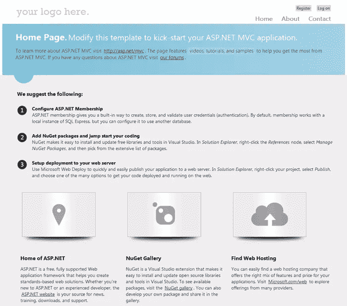
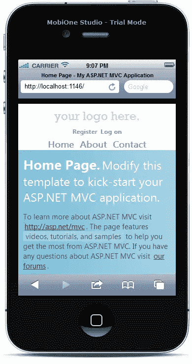
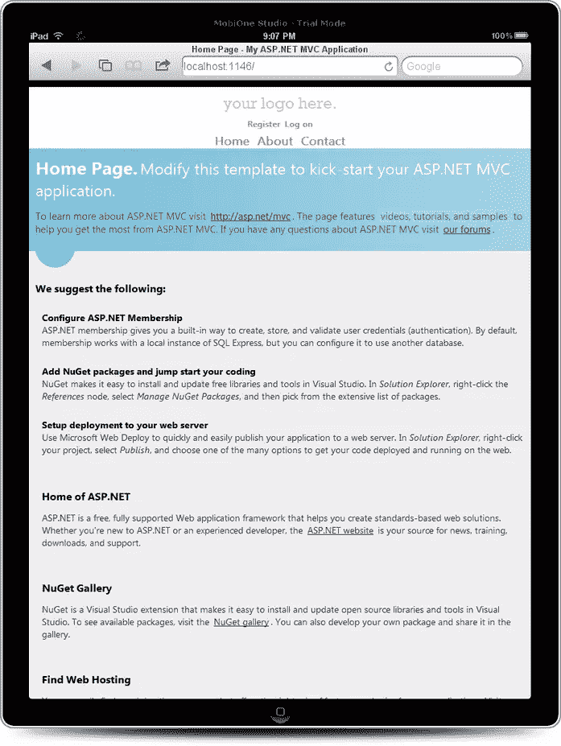

# ASP.NET MVC 4 开发者预览版:增强的默认模板

> 原文：<https://www.sitepoint.com/asp-net-mvc-4-developer-preview-enhanced-default-templates/>

这是第三篇关注 ASP.NET MVC 4 新特性的文章。本文将关注增强的默认模板。MVC 的早期版本有一个默认的模板，坦白地说，这个模板并不吸引人。ASP.NET 团队听取了他们的意见，并更新了默认模板，以适应不同的设备和浏览器。

在继续之前，你应该阅读本系列关于 ASP.NET MVC 4 开发者预览版的第[篇第一篇](http://bit.ly/tXrR1W "What's New")和第[篇第二篇](http://bit.ly/vxfqpR "Display Modes")文章。

### 装置

在进行任何开发之前，您需要安装 MVC 4 版本。最简单的方法是通过 Web 平台安装程序。MVC 4 可用于 Visual Studio 2010 或 Visual Studio 2011 开发人员预览版。

我创作的所有 MVC 文章都是在 Visual Studio 2011 开发者预览版中开发的。以下是开始使用的链接。

*   [用于 Visual Studio 2010 的 ASP.NET MVC 4](http://www.microsoft.com/web/gallery/install.aspx?appid=MVC4VS2010&prerelease=true)
*   [ASP.NET MVC 4 for Visual Studio 2011 开发者预览版](http://www.microsoft.com/web/gallery/install.aspx?appid=MVC4VS11&prerelease=true)

**增强的默认模板**

当您创建新项目时，默认网站看起来与以前的版本有很大不同。除了美学上的改进，默认网站的功能也得到了改进，这要归功于一种叫做*自适应渲染*的技术。

自适应呈现是特定于浏览器的页面呈现，无需任何定制。这对于今天的大多数开发人员来说是绝对必须的；写一次，到处跑。得益于[媒体查询](http://bit.ly/rsZpwJ)，自适应渲染成为可能。

创建新网站后，您将能够看到默认布局的改进。

要查看自适应呈现的效果，请使用移动设备打开页面。

这是该页面在 iPhone 上的外观。

这是页面在 iPad 上的样子。

页面根据屏幕的大小呈现不同的效果。让页面在没有媒体查询的情况下做到这一点是很棘手的。使用媒体查询使它变得简单。

最后要注意的是，默认模板也利用了 jQuery UI。*登录*和*注册*链接向您展示了如何使用这个 JavaScript 库来提供更丰富的 UI。你可以在这里阅读 jQuery UI [的其他特性。](http://bit.ly/tTzBRF "jQuery UI")

**用仿真器测试**

要测试这些新功能，你可以使用实际的 iPhone 或 iPad，也可以使用模拟器。我使用的模拟器来自 MobiOne。你可以在这里下载 15 天的免费试用版。

Windows Phone RC 模拟器是免费的，可以在这里下载[。](http://www.microsoft.com/download/en/details.aspx?displaylang=en&id=27570)

## 分享这篇文章