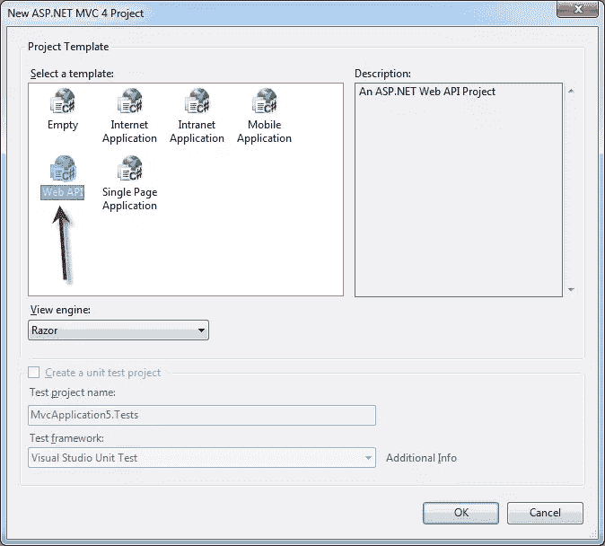
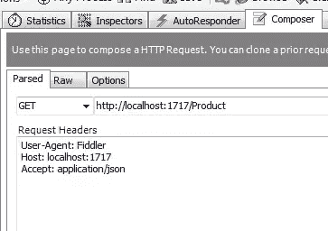
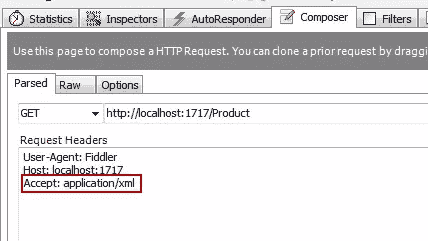
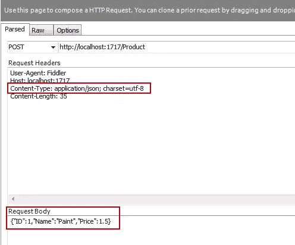
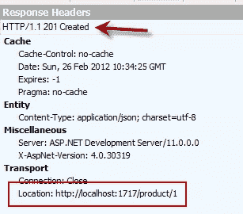
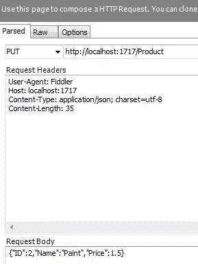

# ASP.NET MVC 4-Web API

> 原文：<https://www.sitepoint.com/asp-net-mvc-4-web-api/>

ASP.NET 4 的测试版刚刚发布。在这个版本中包含的许多新特性中，有一个是 Web API 框架，但是它是什么呢？基本上，它允许您创建可以通过 HTTP 公开的服务，而不是通过正式的服务，如 WCF 或 SOAP。如果你曾经使用过脸书或特威特 API，你应该已经很熟悉它们了。对我来说，这是最令人兴奋的新功能之一！

Web API 最初是 WCF 的 Web API 项目。以这种方式开发 API 意味着你遵循了 WCF 的规则；从一个接口开始，创建从该接口派生的类，然后用 WCF 属性修饰该接口以形成端点。这不是一个流畅的过程。ASP.NET 的 WCF 很难对付，而人们喜欢那里的轻松，微软看到了这一点，并创造了 Web API。他们从 ASP.NET MVC 允许的开发的简易性和 WCF Web API 中提取了最好的部分。

### 装置

现在你可以通过 We 平台安装程序安装 Visual Studio 2010 的 MVC 4 测试版。这需要 ASP.NET 4，如果你以前没有安装它，可以从这里下载。

Visual Studio 2011 开发人员预览版也刚刚向公众发布。作为一名知情人，我们已经有一段时间接触到这个版本了，我对新的 metro 外观和感觉非常满意。如果你想安装它，可以在这里下载[。所有的代码和屏幕截图都来自新版本。](http://bit.ly/xj4hub "Visual Studio 2011 Installer")

### 入门指南

要开始编写您的第一个 Web API，请打开 Studio 2011 并选择 ASP.NET MVC 4 Web 应用程序。接下来将弹出项目模板对话框。有几个新的选择，如*移动应用*和*单页应用(SPA)* ，但现在选择 Web API。



在查看任何代码之前，打开 global.asax 文件并查看默认路径。

```
public static void RegisterApis(HttpConfiguration config) { 
 config.Routes.MapHttpRoute( 
  "Default", // Route name 
  "{controller}/{id}", // URL with parameters 
  new { id = RouteParameter.Optional } // Parameter defaults 
 ); 
} 

protected void Application_Start() { 
 RegisterApis(GlobalConfiguration.Configuration); 
} 
```

MVC 路由和 Web API 路由之间的主要区别是没有为动作定义路由。这是因为 Web API 使用 HTTP 方法，而不是 URI 路径来选择动作。

我已经创建了一个简单的*产品*类来表示模型，并将其添加到*模型*文件夹中。

```
public class Product { 
 public int ID { get; set; } 
 public double Price { get; set; } 
 public string Name { get; set; } 
}
```

现在我要添加一个名为 ProductController 的新控制器。你可以在这个对话框中选择一些新的脚手架选项，但是现在我将生成一个空的控制器。


控制器看起来是一样的，但是 Web API 控制器是从 ApiController 派生出来的。

```
public class ProductController : ApiController { 
 // GET: /Product/ 
 public ActionResult Index() { 
  return View(); 
 } 
}
```

请记住，Web API 使用 HTTP 方法，因此我们可以映射出以下 HTTP 方法:

| 行动 | HTTP 方法 | 相对 URI |
| 获取所有产品的列表 | 得到 | /产品 |
| 通过 id 获取产品 | 得到 | /产品/id |
| 创造新产品 | 邮政 | /产品 |
| 更新产品 | 放 | /产品/id |
| 删除产品 | 删除 | /产品/id |

Web API 中的命名约定遵循 HTTP 方法的名称，GET/POST/PUT/DELETE。在接下来的几节中，您将看到这些是如何映射到代码的。

### 获取操作

```
public List<Product> Get() {  
 return _productsRepository.ToList();  
}  

public Product Get(int id) {  
 return _productsRepository.First(p => p.ID == id);  
}
```

注意我是如何定义两个 Get 操作的？这是因为当用户调用 API 时，他们将传入 HTTP 方法。如果传入的请求是 Get 请求，并且没有 ID，它将调用 GET 操作以返回产品列表。如果存在 ID，它将调用特定产品的 Get 操作。简单明了。如何测试这些代码？为此，我将使用 [Fiddler](http://bit.ly/yDi6K1 "Fiddler") 。如果你从来没有用过它，你现在就应该得到它。

使用 Fiddler，我可以在 Composer builder 中创建一个 GET 请求。调用*http://localhost:1717/Product*将返回产品列表。



如果我只想要一个产品，我可以传入一个 ID；*http://localhost:1717/Product/1。*默认情况下，JSON 从所有的 action 方法中返回。如果你想要一种不同的格式，比如 XML，只需在[接受](http://bit.ly/zYaYSL "HTTP Accept Header")请求头中添加 application/xml:


不修改任何代码，返回 XML 格式的结果。

### 发布操作

```
public void Post(Product product) {  
 _productsRepository.Add(product) 
}
```

GET 请求之后是 POST 请求。这是创建数据的地方。我再次将动作命名为与 HTTP 动词相同的名称，所以我需要做的只是将 Content-Type 添加到 application/json，并发送 json 对象。我可以在 Fiddler 中添加以下请求头来发布新产品。



如果您检查 HTTP 响应代码，您将看到它返回 200，这是可以的，但是对于 POST，它应该返回 201 状态代码。这将向用户表明产品是成功的。201 也应该有一个位置值，所以我们也要添加它。

```
public HttpResponseMessage<Product> Post(Product product) {     
 _productsRepository.Add(product);     
 var response = new HttpResponseMessage<Product>(product, HttpStatusCode.Created);     
 string uri = Url.Route("http://localhost:1717/", new { id = contact.Id });     
 response.Headers.Location = new Uri(Request.RequestUri, uri);     
 return response; 
}
```

我们不是返回 void，而是返回一个新的类型[HttpResponseMessage](http://bit.ly/xbFCFX "HttpResponseMessage")<T>。这使您可以灵活地更改返回的状态代码和响应头。现在，如果您通过 Fiddler 运行它，您将看到一个返回的 201 加上*位置*标题。



### 付诸行动

```
public void Put(Product product) { 
 _productsRepository.Update(product) 
}
```

Put 操作更新资源，所以返回 200 或 204 是可以的。默认情况下，将返回 200，因此我们不必对该操作做任何事情。



值得注意的是，对于 post 和 put 操作，我将发送 JSON。如果我将内容类型改为 XML，我可以很容易地发送 XML 而不是 JSON，而不必修改 API 中的任何代码。Web API 自动将传入请求分解为强类型对象，并映射名称属性。

### 删除操作

```
public void Delete(Product product) { 
 _productsRepository.Delete(product) 
}
```

删除操作删除资源，因此根据资源是立即删除还是稍后删除，可以确定状态代码。如果资源被立即删除，状态代码应该是 200。如果删除是为了以后的阶段，那么应该返回 202 状态代码。

```
public HttpResponseMessage<Product> Delete(Product product) { 
 _productsRepository.Delete(product); 
 var response = new HttpResponseMessage<Product>(product, HttpStatusCode.Deleted); 
 return response; 
}
```

我只是触及了 Web API 的表面，在接下来的几周里，我将探索使用它的不同方法。

## 分享这篇文章