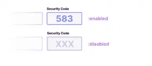

# 快速提示:如何使用:enabled 伪类进行样式化

> 原文：<https://www.sitepoint.com/atoz-css-enabled-pseudo-class/>

CSS 中有许多伪类。这些伪类帮助我们设计不同的状态，并根据它们与其他元素的关系或位置来定位特定的元素。`:enabled`和`:disabled`伪类样式形成可以或不可以被填充或选择的元素。

`:enabled`伪类可用于样式化表单元素的启用状态，如`button`、`input`、`optgroup`、`option`、`select`和`textarea`元素。可以有`:enabled`状态的元素也有相应的`:disabled`状态。

这些状态由布尔属性`disabled`设置。值得注意的是，即使有一个`:enabled`伪类，也没有“enabled”属性。

```
<input type="text"/>
<input type="text" disabled/>
```

因此，这些元素可以通过它们的伪类、属性选择器或否定的属性选择器来设置样式:

```
input:enabled { }
input:not([disabled]) { }
input:disabled { }
input[disabled] { }
```

使用其中任何一种都没有实际的区别；它们都有相同的特异性。

### 何时使用:启用和禁用

让我们来看一个真实的用例。假设我们正在构建一个在线订购食物的支付步骤。在表单的这个阶段，要求支付方式，选择是现金还是卡。

如果我们想用卡支付，持卡人、卡号、开始日期、到期日期和安全码字段将被启用。如果我们想用现金支付，这些细节是不需要的，我们可以禁用它们。这不能单独用 CSS 来完成，但是我们可以用一点 JavaScript 来处理交互。

```
input:enabled {
...
color: blue;
border: 1px solid blue;
}

input:disabled {
...
color: lightgray;
border: 1px solid gray;
}
```



当我们更改支付方式时，脚本会检查 ID 为 cash 的单选按钮是否为`:checked`。这是另一个决定状态的伪类——在本例中，是复选框或单选按钮的选中或未选中状态。如果选中了 cash，我们将把`disabled`属性添加到所有输入中，并选择 card fields 容器中的菜单。我们还为标签添加了一个`is-disabled`类，这将允许这些标签被赋予不同的风格。

然后，我们可以在 CSS 中设置这些样式，将文本的颜色和输入的背景设置为浅灰色，以表示它们不再启用。

## 分享这篇文章