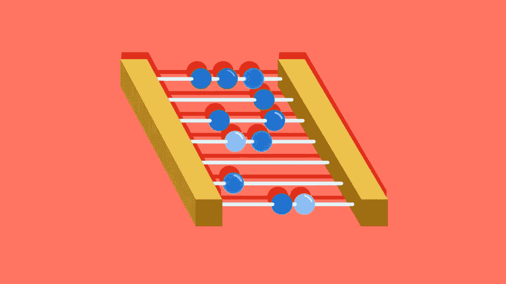

# AtoZ CSS 快速提示:调整文本和使用 Flexbox

> 原文：<https://www.sitepoint.com/atoz-css-quick-tip-justify-text/>

本文是我们 AtoZ CSS 系列的一部分。你可以在这里找到系列[的其他条目。
点击](https://www.sitepoint.com/blog/)查看全文[。](https://www.sitepoint.com/atoz-css-screencast-justify-text)

欢迎来到我们的 AtoZ CSS 系列！在这个系列中，我将探索不同的 CSS 值(和属性),每个值都以字母表中不同的字母开始。我们知道，有时仅仅截屏是不够的，所以在这篇文章中，我添加了一个新的快速提示/经验来为你调整文本。

## j 代表`justify`文本

关于调整文本没有太多要说的，所以在这篇文章中，我们将绕道进入 Flexbox 的世界，看看调整内容的方法。

在字母 J 的[截屏中，我们讨论了`text-align`属性以及它如何用于页面上的`justify`文本。关于这一点没有太多要说的，所以让我们转而研究一些 flexbox 吧！](https://www.sitepoint.com/atoz-css-screencast-justify-text)

Flexbox 有一个`justify-content`属性，允许您在`flex`容器中定位元素。

该属性的每个值都定义了浏览器将如何沿着父容器的主轴在 flex 项目之间和周围分配空间。

`justify-content`有五种不同的值:

* `flex-start`(默认):项目放在包含元素的开始处
* `flex-end`项目在包含元素的末尾
* `center`项目在包含元素内居中
* `space-between`项目在包含元素的整个宽度上隔开，第一个子元素在开始处，最后一个子元素在末尾处
* `space-around`项目以相等的间距隔开，包括开始和结尾的间距。

看看这个例子，当你改变属性`justify-content`的值时，会有不同的结果。

在 [CodePen](http://codepen.io) 上通过 SitePoint ( [@SitePoint](http://codepen.io/SitePoint) )看笔 [BLoZKj](http://codepen.io/SitePoint/pen/BLoZKj/) 。