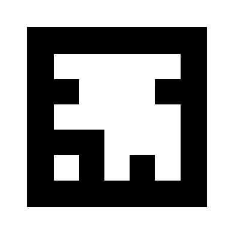
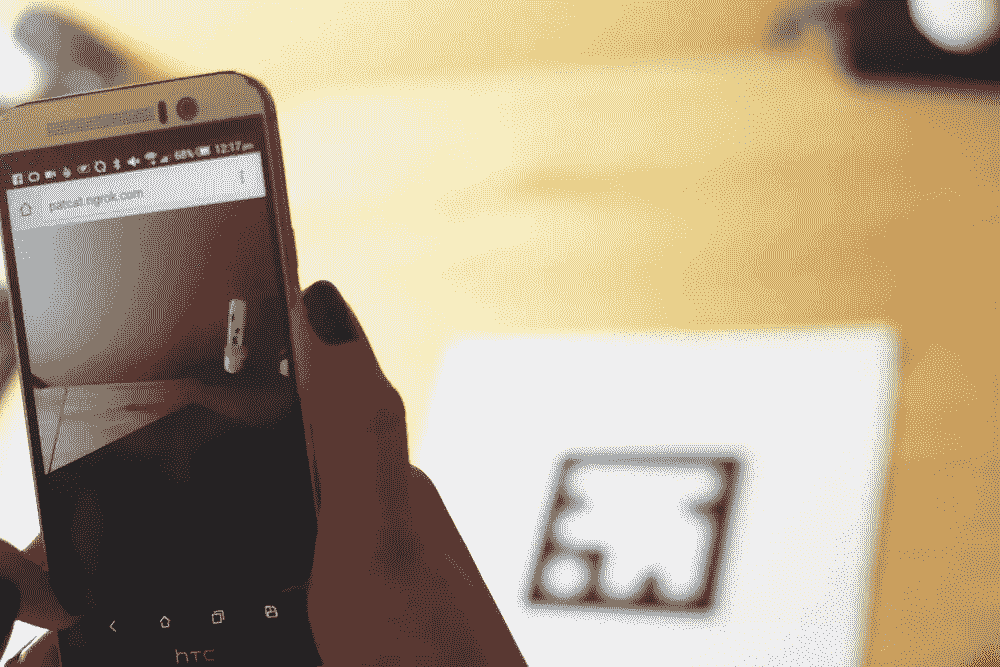
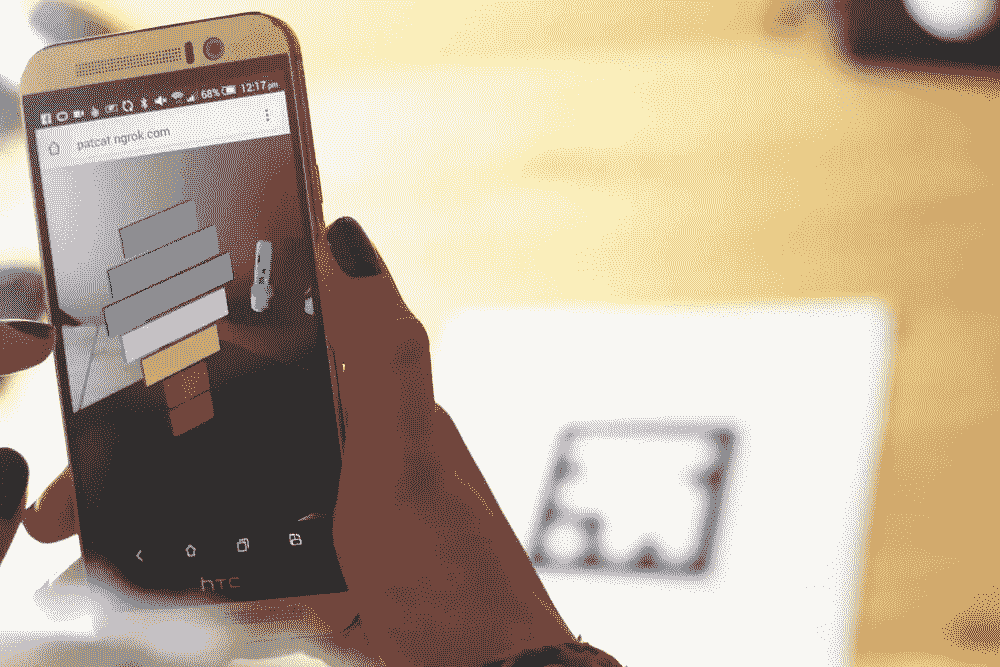
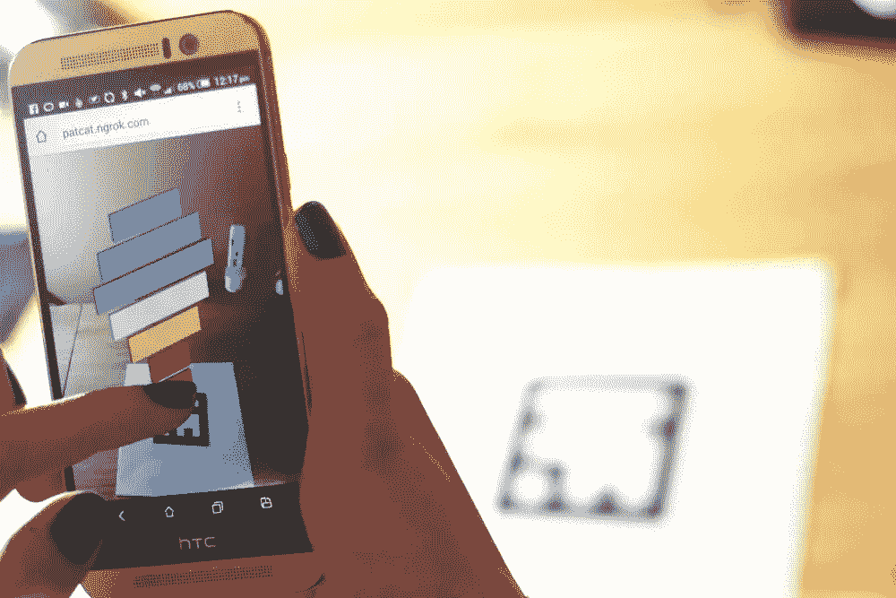
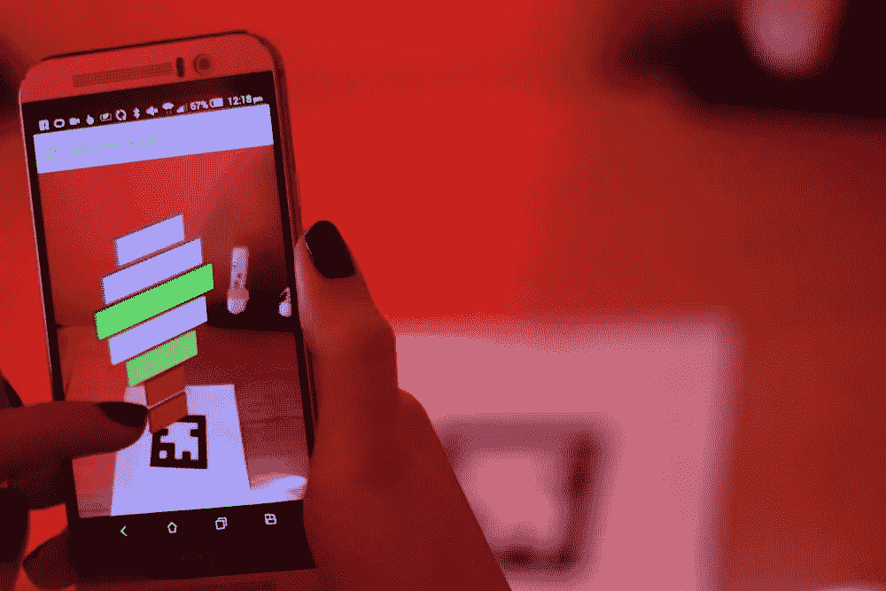

# 用 Awe.js 在浏览器中增强现实

> 原文：<https://www.sitepoint.com/augmented-reality-in-the-browser-with-awe-js/>

增强现实是一个简洁的概念。我们观察周围的世界，并用图像、文本、声音和视频来补充。科技公司开始探索增强现实的可能性，比如 Meta Glasses、微软 HoloLens、T4 Magic Leap 和 T5。这些非常令人兴奋的 AR 耳机还没有完全准备好面向消费者发布，所以可能还需要一段时间才能让每个家庭都有一副。然而，还有另一种方式向世界介绍增强现实，使用他们可能更容易访问的东西——移动浏览器。

我之前在 SitePoint 的文章中讨论过使用 JavaScript 和 Three.js 创建和操纵其他类型的现实，我的文章是关于使用 Google Cardboard 和 Three.js 将 VR 带到网络上的文章和使用 JavaScript 和 Google Cardboard 过滤现实的文章。在本文中，我将展示如何使用名为 [awe.js](http://github.com/buildar/awe.js) 的 JavaScript 库在移动网络上创建增强现实体验。我们将创建一个 3D 控制板，它会在纸标记的顶部打开。我们可以把它挂起来做几乎任何可以通过 JavaScript HTTP 请求实现的事情，所以我用 IFTTT 设置它来改变我的 LIFX 灯泡的颜色。

## 你需要什么

对于这个演示，你目前需要谷歌移动浏览器。它可能也适用于 Firefox 移动版，但我发现当我在 HTC One M9 上尝试它时，点击事件并没有为我触发。它也可以在一些桌面浏览器上运行(Chrome 和 Opera 在我的 Mac 上运行得很好)，但肯定和带有触摸事件的智能手机体验不太一样。不过，在平板电脑上可能会很简洁。

您还需要一个 IFTTT 帐户，以及如何使用触发 HTTP 请求的规则来设置[Maker 通道](https://ifttt.com/channels/maker)的知识。如果你是 IFTTT 的新手，我们之前在关于使用 IFTTT 将 LIFX 灯泡连接到物联网的[的文章中复习了基础知识。对于创客频道的新用户，我们也在](https://www.sitepoint.com/connecting-lifx-light-bulbs-iot-using-ifttt/)[将物联网和 Node.js 连接到 IFTTT](https://www.sitepoint.com/connecting-the-iot-and-node-js-to-ifttt/) 中进行了介绍。

最后，你需要在一张纸上打印出一个标记。我们要用的标记是这个:



## 代码

如果你更喜欢直接进入代码并尝试一下，这些都可以在 [GitHub](https://github.com/sitepoint-editors/ARLIFXController) 上找到。

## Awe.js

Awe.js 是一个 JavaScript 库，它使用 Three.js、设备的摄像头和一些非常智能的技术来在浏览器中创建增强现实。您可以在 awe.js GitHub repo 上下载这个库和一些示例。它提供了四种不同的 AR 体验，每种体验都有自己的回购示例:

*   `geo_ar`–允许您在设定的罗盘点放置物体。
*   `grift_ar`–兼容 Oculus Rift。
*   `leap_ar`–与 Leap 运动控制器集成。
*   `marker_ar`–允许您创建一种定位在增强现实标记上的体验。这就是我们将在本次演示中使用的产品。

## 我们的增强现实演示代码

我们的演示代码有 300 多行，但是很多都是类似对象的重复代码。我建议从 GitHub repo 下载演示代码，并遵循这里提供的解释。一旦你对它的工作原理有了一个概念，试着修修补补，建立你自己的东西。

一切都从我们的`window`上的`load`事件开始。我们包含的第一个东西是一个变量，用于跟踪我们的 AR 控制面板(这里我简称它为“菜单”)是否打开。最初，它是关闭的。

```
window.addEventListener('load', function() {
    var menu_open = false;

    // Our code continues here
  });
```

然后，我们开始使用 awe.js 库。我们所做的一切都在`window.awe.init()`函数中定义。我们从 AR 场景的一些全局设置开始。

```
window.awe.init({
    device_type: awe.AUTO_DETECT_DEVICE_TYPE,
    settings: {
      container_id: 'container',
      fps: 30,
      default_camera_position: { x:0, y:0, z:0 },
      default_lights: [{
        id: 'point_light',
        type: 'point',
        color: 0xFFFFFF
      }]
    },
```

*   `device_type`–所有示例都将其设置为`awe.AUTO_DETECT_DEVICE_TYPE`，这要求它自动检测设备。到目前为止，我还没有看到改变这一点的必要。
*   我们实际上可能想要在这里改变的设置。其中包括:
    *   我们的整个体验将在其中产生的元素的 ID。
    *   `fps`–我们期望的每秒帧数(可选)。
    *   默认的摄像机位置，我们将从这个位置观看我们的场景(我们从(0，0，0)开始)。
    *   我们可以为我们的场景设置一系列不同的 Three.js 灯光，给每个灯光一个 ID，定义灯光的类型和颜色。我们的演示只有一个白色的 Three.js 点光源。灯的类型有多种选择，对应不同类型的[三. js 灯](http://threejs.org/docs/#Reference/Lights/Light)—`'area'`、`'directional'`、`'hemisphere'`、`'point'`和`'spot'`。

一旦设置就绪，我们就可以定义 awe.js 初始化后要做什么。一切都被封装在一个`awe.util.require()`函数中，该函数定义了在加载我们需要的额外 JavaScript 文件之前，它需要什么样的浏览器功能。请注意，只定义您在演示中确实需要的浏览器功能，因为如果您使用其他 GitHub 示例中列出的功能错误地定义这些功能，您可能会不必要地阻止您的 AR 应用程序在某些浏览器中工作。例如，为了让元素基于指南针定位，您需要访问`'gyro'`功能。这在大多数桌面浏览器上都行不通。在这个演示中我们不需要它，所以我们排除了它。

```
ready: function() {
    awe.util.require([
      {
        capabilities: ['gum','webgl'],
```

为 awe.js 定义的文件引入了特定的功能——`lib/awe-standard-dependencies.js`、`lib/awe-standard.js`和`lib/awe-standard-window_resized.js`每一个都很常见，定义了 awe.js 的标准功能和处理窗口大小。我们的演示使用了标记，这需要下面列出的另外两个文件。

```
files: [ 
    ['lib/awe-standard-dependencies.js', 'lib/awe-standard.js'],
    'lib/awe-standard-window_resized.js',
    'lib/awe-standard-object_clicked.js',
    'lib/awe-jsartoolkit-dependencies.js',
    'lib/awe.marker_ar.js'
  ],
```

一旦我们成功加载了所有这些文件，我们就运行名副其实的 awe.js 函数。当您准备好开始显示元素时，您将始终运行的第一个函数设置 awe.js 场景。

```
success: function() {
    window.awe.setup_scene();
```

awe.js 中的所有元素都位于“兴趣点”(POI)内。这些是场景中通过坐标标记的特定点，对象可以放置在这些点中。您可以在 awe.js 中移动 poi 以及元素本身。我们创建一个单一的兴趣点，它将被放置在一个特定的纸标记可见的地方。为了创建一个 POI，我们使用`awe.pois.add()`的 awe.js 函数。

我给了它一个 ID`'marker'`,但是你可以随便叫它什么，只要你在代码中对这个 POI 的其他引用保持一致。我们将它的初始位置设置为(0，0，10000)，这将它定位到远处一点，直到我们准备好使用它。我们还将它设置为不可见，直到我们发现标记。

```
awe.pois.add({id: 'marker', position: {x: 0, y: 0, z: 10000}, visible: false});
```

我们添加到 poi 中的元素在 awe.js 中称为“投影”。我们添加到场景中的第一个投影我称之为`'wormhole'`,因为这是一个扁平的黑色正方形，菜单项将神奇地出现在其中。就像 POI 的 ID 一样，您可以将自己的 POI 命名为任何名称，只要在代码中与其他对它的引用保持一致。我们使用函数`awe.projections.add()`将其添加到我们的 POI 中。

```
awe.projections.add({ 
    id: 'wormhole',
    geometry: {shape: 'plane', height: 400, width: 400},
    position: {x: 0, y: 0, z: 0},
    rotation: {x: 90, z: 45},
    material: {
      type: 'phong',
      color: 0x000000
    }
  }, {poi_id: 'marker'});
```

对于我们可以添加为投影的对象，有相当多的选项，所以我将更详细地解释它们。请注意——此处用于定位和旋转的所有 x、y 和 z 值都与其 POI 相关。该 POI 在其 ID 的最末端被定义为`{poi_id: 'marker'}`。

*   `geometry`–这是指投影的三个. js 几何选项。每种类型的几何图形所需的选项与 awe.js 中提供的选项相匹配。例如，Three.js 中的 [SphereGeometry](http://threejs.org/docs/#Reference/Extras.Geometries/SphereGeometry) 在 awe.js 中将表示为`{shape: 'sphere', radius: 10}`。对于那些使用最新的 Three.js 的人来说，需要注意的一点是，在 awe.js 的当前可用版本中， [BoxGeometry](http://threejs.org/docs/#Reference/Extras.Geometries/BoxGeometry) 仍然使用立方体几何图形。因此，为了创建盒子，我们使用格式`{shape: 'cube', x: 20, y: 30, z: 5}`(尽管名字如此，它不一定是一个“立方体”)。
*   `position`–您可以相对于其兴趣点调整项目的 x、y 和 z 轴。
*   `rotation`–您可以相对于其兴趣点通过 x、y 和 z 轴旋转项目。我将虫洞在 x 轴上旋转 90 度，使其平放在桌子上，在 z 轴上旋转 45 度，因为我认为这看起来更自然(它并不总是与标记完全对齐，所以让它在对角线上使这不那么明显)。
*   `material`–定义投影的 Three.js 材质。我坚持使用`'phong'`(three . js 中的`MeshPhongMaterial`)，然而看起来`'lambert'`、`'shader'`、`'sprite'`和`'sprite_canvas'`也是潜在的可用选项。我们也可以用十六进制来定义它的颜色。
*   这在演示中没有用到，但为了完整起见，我想把它包含在本文中。要定义一个纹理，可以包含`texture: {path: 'yourtexturefilename.png'}`。

在演示中，我在场景中添加了七个不同的盒子/立方体，每个都是 30 像素高，在 y 轴上低了 31 像素，这样它最初就被虫洞隐藏了。它们的宽度略有不同，看起来有点像灯泡。

我通过他们的 x 和 z 坐标把他们从虫洞的中心移回来一点点，但是老实说，如果-5 让你感到厌烦，保持在 0 可能看起来很好。我把它在 y 轴上旋转了 45 度，这样它就可以以一个很好的角度面对虫洞的顶部。

```
awe.projections.add({
    id: 'ar_button_one',
    geometry: {shape: 'cube', x: 60, y: 30, z: 5},
    rotation: {y: 45},
    position: {x: -5, y: -31, z: -5},
    material: {
      type: 'phong',
      color: 0xFF0000
    }
  }, {poi_id: 'marker'});
```

每个按钮都有一个 ID`'ar_button_{NUMBER}'`，其中的数字是菜单按钮从下到上的索引。我们将在对 IFTTT 的 HTTP 调用中使用这个 ID，因此保持这些 ID 的一致性和准确性非常重要！

在定义了我们的投影之后，我们定义了 AR 拼图中相当重要的一块——我们的标记检测事件。我们将它作为一个数组添加到函数`awe.events.add()`中。

```
awe.events.add([
    // Our events here
  ]);
```

我们只有一个 awe.js 事件，所以这里只有一个事件。事件是用一个 ID 定义的，我们可以称它为任何东西。我把它叫做`'ar_tracking_marker'`。我们定义了它适用的设备类型。到目前为止，在所有 awe.js 示例的 repo 中，这似乎是相同的，所以我将 PC 和 Android 设置为 1。

```
id: 'ar_tracking_marker',
  device_types: {
    pc: 1,
    android: 1
  },
```

然后我们有`register()`和`unregister()`函数来添加和删除监视标记的事件监听器。

```
register: function(handler) {
    window.addEventListener('ar_tracking_marker', handler, false);
  },
  unregister: function(handler) {
    window.removeEventListener('ar_tracking_marker', handler, false);
  },
```

然后我们定义事件处理程序，一旦我们发现一个标记，它就会运行。我们寻找“64”标记，并且只在找到它时运行响应。

```
handler: function(event) {
    if (event.detail) {
      if (event.detail['64']) {
        // Our response!
      }
```

在我们寻找标记的响应中，我们希望将我们称为`'marker'`的 POI 移动到带有物理纸标记的点上，并使其可见。我们使用`event.detail['64'].transform`将其转换为与物理标记对齐。

```
awe.pois.update({
    data: {
      visible: true,
      position: {x: 0, y: 0, z: 0},
      matrix: event.detail['64'].transform
    },
    where: {
      id: 'marker'
    }
  });
```

我们还将`'wormhole'`投影设置为可见。

```
awe.projections.update({
    data: {
      visible: true
    },
    where: {
      id: 'wormhole'
    }
  });
```

如果我们没有看到标记，但我们的菜单是打开的，我们将设置它保持打开，但隐藏虫洞。这样做的主要原因是，随着一些光线的变化，标记可能会变得难以辨认。我们不想把自己困在一种特定的颜色的光中，无路可退！

```
else if (menu_open) {
    awe.projections.update({
      data: {
        visible: false
      },
      where: {
        id: 'wormhole'
      }
    });
  }
```

如果没有标记，并且我们的菜单没有打开，那么整个 POI 都是隐藏的，等待我们查看。

```
else {
    awe.pois.update({
      data: {
        visible: false
      },
      where: {
        id: 'marker'
      }
    });
  }
```

最后，我们告诉 awe.js 更新场景。

```
awe.scene_needs_rendering = 1;
```

我们将设置的最后一点实际功能是我们的点击事件。所有这些都在`object_clicked`事件内。

```
window.addEventListener('object_clicked', function(e) {
    // Our click events
  });
```

我们的 click 事件包含在`e.detail.projection_id`内被点击的投影的 ID。我们使用 switch 语句来确定如何对点击做出反应。点击虫洞打开和关闭虚拟菜单，同时点击虚拟菜单按钮将触发我们的光颜色。我们使用 switch 语句，因为每个按钮将运行相同的响应代码。

```
switch (e.detail.projection_id) {
    case 'wormhole':
      // Clicks to open and close our menu
    break;
    case 'ar_button_one':
    case 'ar_button_two':
    case 'ar_button_three':
    case 'ar_button_four':
    case 'ar_button_five':
    case 'ar_button_six':
    case 'ar_button_seven':
      // Clicks on our virtual menu buttons
    break;
  }
```

我们的虫洞点击事件打开和关闭菜单取决于`menu_open`是真还是假。如果为假，那么我们使用 awe.js `awe.projections.update()`函数在一秒钟内将 y 轴上的每个按钮动画化。将它移出虫洞。每个投影移动之间的唯一区别是每个对象在 y 轴上移动了多少。

```
if (!menu_open) {
    awe.projections.update({
      data: {
        animation: {
          duration: 1
        },
        position: {y: 35}
      },
      where: {id: 'ar_button_one'}
    });
```

否则，如果菜单是打开的，那么我们把它们都移回到虫洞下面的初始位置，并隐藏起来。

```
else {
    awe.projections.update({
      data: {
        animation: {
          duration: 1
        },
        position: {y: -31}
      },
      where: {id: 'ar_button_one'}
    });
```

在我们的 if else 语句之后，我们将`menu_open`切换到它原来的相反方向，这样我们就可以跟踪它现在的位置。

```
menu_open = !menu_open;
```

在我们的按钮点击事件中，我们向 IFTTT 发出一个 HTTP 请求，其中包括作为事件名称的按钮 ID 和访问 IFTTT 服务的密钥。我们并不真正使用返回的数据，我们将它记录到控制台用于调试目的，但除此之外，实际结果来自 IFTTT 对 HTTP 调用的响应。

```
...
  case 'ar_button_seven':
    var request = new XMLHttpRequest();
    request.open('GET', 'http://maker.ifttt.com/trigger/'+e.detail.projection_id+'/with/key/yourkeyshouldbehere', true);

    request.onload = function() {
      if (request.status >= 200 && request.status < 400) {
        var data = JSON.parse(request.responseText);
        console.log(data);
      }
    };

    request.send();
  break;
```

在所有这些之后，如果 awe.js 由于不兼容等原因没有加载，我们有一个替代脚本来加载显示错误消息。

```
{
    capabilities: [],
    success: function() { 
      document.body.innerHTML = '<p>Try this demo in the latest version of Chrome or Firefox on a PC or Android device</p>';
    }
  }
```

## 现在是 HTTPS 时间

【2015 年末更新—我跳回这篇文章，添加一条相当重要的新信息 Chrome 现在要求使用摄像头的网页在 HTTPS 提供。所以在尝试运行这个之前，你需要找到一种方法在 HTTPS 上运行你的服务。到目前为止，我使用的一种测试方法是 [ngrok](https://www.sitepoint.com/use-ngrok-test-local-site/) ，它可以提供到本地主机的 HTTPS 隧道。我们在[的 SitePoint 这里有一个从任何地方](https://www.sitepoint.com/accessing-localhost-from-anywhere)访问本地主机的指南，可以帮助你开始。

## 运行中的演示

如果我们在 Google Chrome 移动版上运行这段代码，并将其指向我们的标记，应该会出现一个虫洞。



如果我们点击虫洞，我们的菜单按钮将会在正确的位置出现。



如果我们单击其中一个菜单项…



它应该会改变我们 LIFX 灯的颜色！



## 结论

这就是你开始使用 awe.js 在浏览器中使用增强现实需要知道的一切。它有很大的潜力，正如当今技术世界的许多发展一样！awe.js 团队一直在开发这个插件，很快就会有一个更新更全的版本推出！还可以在 Google Cardboard 中设置一个 three.js 立体效果，并将其与 awe.js 的一些功能相结合，以构建 AR 耳机体验。我认为这对于一篇文章来说可能有点过了，所以请关注关于这一点的未来文章！

如果你使用这段代码尝试一些 AR 魔法或者更进一步，请在评论中留言或者在 Twitter ( [@thatpatrickguy](http://www.twitter.com/thatpatrickguy) )上与我联系，我很乐意去看看！

## 分享这篇文章