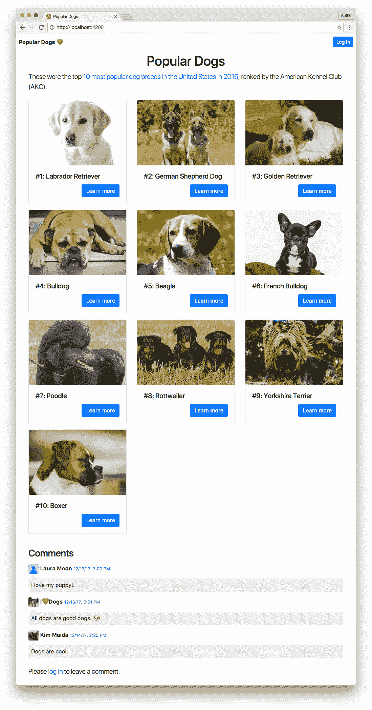
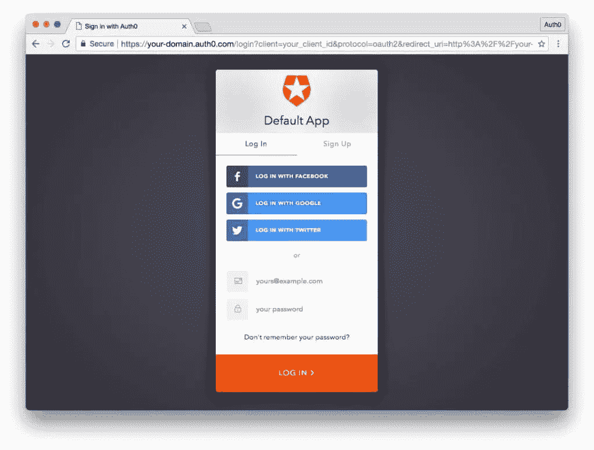
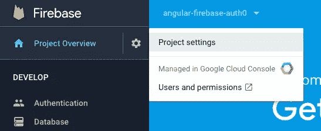
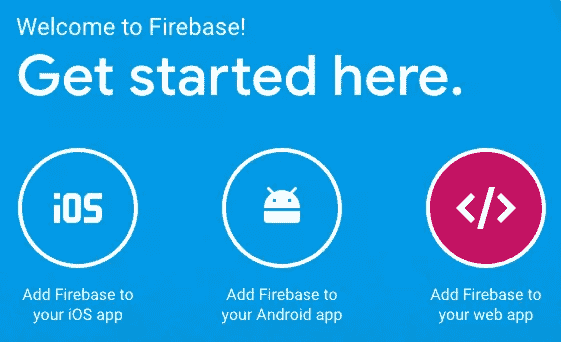

# 用 Auth0 认证 Firebase 和 Angular:第 1 部分

> 原文：<https://www.sitepoint.com/authenticating-firebase-angular-auth0-1/>

*本文最初发表在[Auth0.com 博客](https://auth0.com/blog/how-to-authenticate-firebase-and-angular-with-auth0-part-1/)上，经允许在此转载。*

在这个由两部分组成的教程系列中，我们将学习如何构建一个应用程序，通过 [Auth0](https://auth0.com) 认证来保护节点后端和有角度的前端。我们的服务器和应用程序还将使用自定义令牌对[Firebase](https://firebase.google.com)[Cloud Firestore 数据库](https://firebase.google.com/docs/firestore/)进行认证，这样用户可以在使用 Auth0 登录后以安全的方式留下实时评论。

Angular 应用程序代码可以在[Angular-firebase GitHub repo](https://github.com/auth0-blog/angular-firebase)中找到，节点 API 可以在[firebase-auth 0-nodeserver repo](https://github.com/auth0-blog/firebase-auth0-nodeserver)中找到。

## 用 Auth0 认证 Firebase 和 Angular:第 1 部分

本教程的第 1 部分将涵盖:

1.  [Firebase 和 Auth0](#firebaseandauth0)
2.  [我们将建造什么](#whatwellbuild)
3.  [角度 CLI](#angularcli)
4.  [Auth0 客户端和 API](#auth0clientandapi)
5.  [带服务帐户的 Firebase 项目](#firebaseprojectwithserviceaccount)
6.  [节点 API](#nodeapi)
7.  [设置角度 App](#setupangularapp)
8.  [Angular App 架构](#angularapparchitecture)
9.  [实现共享模块](#implementsharedmodules)
10.  [实现路由和惰性加载模块](#implementroutingandlazyloadedmodules)
11.  [加载和错误组件](#loadinganderrorcomponents)
12.  [认证逻辑](#authenticationlogic)
13.  [核心逻辑](#corelogic)
14.  [接下来的步骤](#nextsteps)

## Firebase 和 Auth0

[Firebase](https://firebase.google.com) 是一个移动和 web 应用开发平台。Firebase 于 2014 年被谷歌收购，并在谷歌旗下继续开发。Firebase 提供 NoSQL 数据库( [RTDB，或实时数据库](https://firebase.google.com/docs/database/)和[云 Firestore，在撰写](https://firebase.google.com/docs/firestore/)时处于测试阶段)托管在云中，并使用 web 套接字连接，为应用程序提供实时功能。

Auth0 是一个基于云的平台，提供身份验证和授权服务。作为身份验证提供者，Auth0 使开发人员能够轻松地为他们的应用程序实现和定制登录和授权安全性。

### 选择 Auth0 + Firebase 身份验证

如果你已经熟悉 Firebase 的产品，你可能会问:为什么我们要在 Firebase 中使用自定义令牌实现 Auth0，而不是坚持使用 Firebase 的内置身份验证功能？

首先，这里有一个重要的区别。使用 Auth0 来保护 Firebase 并不意味着你*没有*使用 Firebase auth。Firebase 有一个[定制认证方法](https://firebase.google.com/docs/auth/web/custom-auth)，允许开发者将他们首选的身份解决方案*与* Firebase auth 集成。这种方法使开发人员能够实现 Firebase auth，以便它能够与专有系统或其他身份验证提供者无缝协作。

我们希望将 Auth0 与 Firebase 身份验证集成有许多潜在的原因。或者，在某些情况下，使用基本的 Firebase auth 本身就足够了。我们来探索一下。

如果您满足以下条件，您可以使用 **Firebase 的内置身份验证功能**:

*   只想对 Firebase RTDB 或 Firestore 进行身份验证，而不需要对其他后端进行身份验证
*   只需要少量的登录选项，不需要企业身份提供商、与您自己的用户存储数据库集成等。
*   不需要广泛的用户管理、配置文件丰富等。并且通过 API 严格管理用户
*   不需要定制认证流程
*   不需要遵守关于用户数据存储的合规性法规。

如果您满足以下条件，您应该考虑使用自定义 Firebase 令牌对**进行身份验证:**

*   已经实施了 Auth0，并希望为您的应用程序添加实时功能
*   需要方便地使用颁发的令牌[来保护由 Firebase 提供的*而不是*后端](https://auth0.com/docs/apis)
*   需要整合除谷歌、脸书、推特和 GitHub 之外的社交身份提供商
*   需要集成[企业身份提供者](https://auth0.com/docs/identityproviders#enterprise)，如 Active Directory、LDAP、ADFS、SAMLP 等。
*   需要一个[定制的认证流程](https://auth0.com/docs/rules/current)
*   需要使用 API*和*进行强大的[用户管理，一个易于管理的仪表板](https://auth0.com/docs/users)
*   希望能够动态丰富用户配置文件
*   想要可定制的[无密码登录](https://auth0.com/docs/connections/passwordless)、[多元认证](https://auth0.com/docs/multifactor-authentication)、[破解密码安全](https://auth0.com/docs/anomaly-detection/breached-passwords)、[异常检测](https://auth0.com/docs/anomaly-detection)等功能。
*   必须遵守[合规性法规](https://auth0.com/docs/compliance)，如 HIPAA、GDPR、SOC2 等。

本质上，如果您有一个非常简单的应用程序，有基本的身份验证需求，并且只使用 Firebase 数据库，Firebase 的基本身份验证提供程序应该足够了。然而，如果你需要更多的东西， [Firebase 提供了一个很好的方式来使用他们的服务*和*其他认证解决方案](https://firebase.google.com/docs/admin/setup)。这是许多开发人员将面临的更现实的场景，所以我们将在这里详细探讨它。

## 我们将建造什么

我们将构建一个受 Auth0 保护的 Node.js API，它铸造定制的 Firebase 令牌，并返回十种不同狗品种的数据。

我们还将构建一个名为“受欢迎的狗”的棱角分明的前端应用程序，显示 2016 年最受欢迎的十只狗的信息，由美国养犬俱乐部(AKC)根据公众受欢迎程度进行排名。我们的 app 会被 Auth0 保护，调用节点 API 获取狗数据，调用 API 获取 Firebase 令牌授权用户使用 Cloud Firestore 实时添加和删除评论。该应用程序将使用共享模块，以及实现懒惰加载。



要实施该应用程序，您需要以下内容:

*   角度 CLI
*   配置了客户端和 API 的免费 Auth0 帐户
*   一个带有服务帐户的免费 Firebase 项目

我们开始吧！

## 角度 CLI

确保在本地机器上安装了带有 NPM 的 Node.js。运行以下命令，全局安装 [Angular CLI](https://github.com/angular/angular-cli) :

```
$ npm install -g @angular/cli@latest 
```

我们将使用 CLI 生成我们的 Angular 应用程序及其几乎所有的架构。

## Auth0 客户端和 API

您需要一个 [Auth0](https://auth0.com) 帐户来管理认证。你可以[在这里](https://auth0.com/signup)注册一个免费账户。



接下来，设置 Auth0 客户端应用程序和 API，以便 Auth0 可以与 Angular 应用程序和节点 API 进行交互。

### 设置 Auth0 客户端

1.  转到您的 [Auth0 仪表板](https://manage.auth0.com/#/)并点击 *[创建新客户端](https://manage.auth0.com/#/clients/create)* 按钮。
2.  给你的新应用命名(类似于`Angular Firebase`)并选择*单页网络应用*。
3.  在新的 Auth0 客户端应用的*设置*中，将`http://localhost:4200/callback`添加到*允许的回调 URL*。
4.  启用对*的切换使用 Auth0 代替 IdP 对*进行单点登录。
5.  在*设置*部分的底部，点击“显示高级设置”。选择 *OAuth* 选项卡，验证 *JsonWebToken 签名算法*是否设置为“RS256”。
6.  如果你愿意，你可以[建立一些社会关系](https://manage.auth0.com/#/connections/social)。然后你可以在*连接*标签下的*客户端*选项中为你的应用启用它们。上面截图中的例子使用了用户名/密码数据库、脸书、谷歌和 Twitter。

*注意:对于生产，请确保您设置了自己的社交密钥，并且不要将社交连接设置为使用 Auth0 dev 密钥。*

### 设置 Auth0 API

1.  在你的 Auth0 仪表板中进入[API](https://manage.auth0.com/#/apis)，点击“创建 API”按钮。输入 API 的名称，如`Firebase Dogs API`。将*标识符*设置为您的 API 端点 URL。在本教程中，我们的 API 标识符是`http://localhost:1337/`。*签名算法*应该是“RS256”。
2.  你可以在你的新 API 的设置中，查阅*快速入门*标签下的 Node.js 示例。在接下来的步骤中，我们将使用 [Express](https://expressjs.com/) 、 [express-jwt](https://github.com/auth0/express-jwt) 和 [jwks-rsa](https://github.com/auth0/node-jwks-rsa) 以这种方式实现我们的节点 API。

我们现在准备在 Angular 客户端和节点后端 API 上实现 Auth0 身份验证。

## 具有服务帐户的 Firebase 项目

接下来你将需要一个免费的 [Firebase](https://firebase.google.com) 项目。

### 创建一个 Firebase 项目

1.  进入 *[Firebase 控制台](https://console.firebase.google.com)* ，用你的谷歌账号登录。
2.  点击*添加项目*。
3.  在弹出的对话框中，给你的项目起个名字(比如`Angular Firebase Auth0`)。将根据您选择的名称生成项目 ID。然后，您可以选择您的国家/地区。
4.  点击*创建项目*按钮。

### 生成管理 SDK 密钥

为了[铸造自定义 Firebase 令牌](https://firebase.google.com/docs/auth/admin/create-custom-tokens)，你需要访问 [Firebase 管理 SDK](https://firebase.google.com/docs/admin/setup) 。要获得访问权限，您必须在新的 Firebase 项目中创建一个服务帐户。

点击 Firebase 控制台侧边栏中项目概述旁边的齿轮图标，并从出现的菜单中选择*项目设置*:



在设置视图中，点击[服务账户](https://console.firebase.google.com/u/0/project/_/settings/serviceaccounts/adminsdk)选项卡。将出现 *Firebase Admin SDK* UI，显示配置代码片段。默认情况下会选择 Node.js。这是我们想要的技术，我们将在我们的节点 API 中实现它。点击*生成新的私钥*按钮。

将出现一个对话框，警告您保密存储您的私钥。我们会注意不要将此密钥签入公共存储库。点击*生成密钥*按钮，下载密钥作为`.json`文件。我们很快会将这个文件添加到我们的节点 API 中。

## 节点 API

本教程完整的 Node.js API 可以在[firebase-auth 0-nodeserver GitHub repo](https://github.com/auth0-blog/firebase-auth0-nodeserver)中找到。让我们来学习如何构建这个 API。

### 节点 API 文件结构

我们需要建立以下文件结构:

```
firebase-auth0-nodeserver/
  |--firebase/
     |--.gitignore
     |--<your-firebase-admin-sdk-key>.json
  |--.gitignore
  |--config.js
  |--dogs.json
  |--package.json
  |--routes.js
  |--server.js 
```

您可以使用命令行生成必要的文件夹和文件，如下所示:

```
$ mkdir firebase-auth0-nodeserver
$ cd firebase-auth0-nodeserver
$ mkdir firebase
$ touch firebase/.gitignore
$ touch .gitignore
$ touch config.js
$ touch dogs.json
$ touch package.json
$ touch routes.js
$ touch server.js 
```

### Firebase 管理 SDK 密钥和 Git 忽略

现在，将您之前下载的 Firebase Admin SDK `.json`密钥文件移动到`firebase`文件夹中。我们会注意确保该文件夹被检入，但是它的*内容*绝不会像这样使用`firebase/.gitignore`被推送到回购:

```
# firebase/.gitignore
*
*/
!.gitignore 
```

这个`.gitignore`配置确保 Git 将忽略`firebase`目录*中的任何文件和文件夹，除了`.gitignore`文件本身的*。这允许我们提交一个(本质上)空文件夹。我们的`.json` Firebase Admin SDK 密钥可以保存在这个文件夹中，我们不必担心被*文件名*忽略。

注意:如果我们在多台机器上下载项目，并生成不同的键(具有不同的文件名),这将非常有用。

接下来让我们为根目录的`.gitignore`添加代码:

```
# .gitignore
config.js
node_modules 
```

### 狗 JSON 数据

接下来，我们将添加十个狗品种的数据。为了简洁起见，您可以简单地将数据复制并粘贴到您的`dogs.json`文件中。

### 属国

让我们像这样添加我们的`package.json`文件:

```
{
  "name": "firebase-auth0-nodeserver",
  "version": "0.1.0",
  "description": "Node.js server that authenticates with an Auth0 access token and returns a Firebase auth token.",
  "repository": "https://github.com/auth0-blog/firebase-auth0-nodeserver",
  "main": "server.js",
  "scripts": {
    "start": "node server"
  },
  "author": "Auth0",
  "license": "MIT",
  "dependencies": {},
  "devDependencies": {}
} 
```

我们将使用命令行安装依赖项，最新版本将自动保存到`package.json`文件中:

```
$ npm install --save body-parser cors express express-jwt jwks-rsa firebase-admin 
```

我们将需要`body-parser`、`cors`和`express`来服务我们的 API 端点。身份验证将依赖于`express-jwt`和`jwks-rsa`，而 Firebase 令牌生成是通过`firebase-admin` SDK 实现的(我们将使用我们生成的密钥访问该 SDK)。

### 配置

在`config.js`文件中，添加以下代码并用您自己的设置替换占位符值:

```
// config.js
module.exports = {
  AUTH0_DOMAIN: '<Auth0 Domain>', // e.g., you.auth0.com
  AUTH0_API_AUDIENCE: '<Auth0 API Audience>', // e.g., http://localhost:1337/
  FIREBASE_KEY: './firebase/<Firebase JSON>', // e.g., your-project-firebase-adminsdk-xxxxx-xxxxxxxxxx.json
  FIREBASE_DB: '<Firebase Database URL>' // e.g., https://your-project.firebaseio.com
}; 
```

### 计算机网络服务器

有了我们的数据、配置和依赖项，我们现在可以实现我们的节点服务器了。打开`server.js`文件并添加:

```
// server.js
// Modules
const express = require('express');
const bodyParser = require('body-parser');
const cors = require('cors');

// App
const app = express();
app.use(bodyParser.json());
app.use(bodyParser.urlencoded({ extended: false }));
app.use(cors());

// Set port
const port = process.env.PORT || '1337';
app.set('port', port);

// Routes
require('./routes')(app);

// Server
app.listen(port, () => console.log(`Server running on localhost:${port}`)); 
```

这将在`http://localhost:1337/`用 Express 启动我们的节点服务器。

*注意:注意这是我们在 Auth0 中设置的 API 标识符。*

### API 路线

接下来打开`routes.js`文件。在这里，我们将定义我们的 API 端点，保护它们，并创建自定义的 Firebase 令牌。添加以下代码:

```
// routes.js
// Dependencies
const jwt = require('express-jwt');
const jwks = require('jwks-rsa');
const firebaseAdmin = require('firebase-admin');
// Config
const config = require('./config');

module.exports = function(app) {
  // Auth0 athentication middleware
  const jwtCheck = jwt({
    secret: jwks.expressJwtSecret({
      cache: true,
      rateLimit: true,
      jwksRequestsPerMinute: 5,
      jwksUri: `https://${config.AUTH0_DOMAIN}/.well-known/jwks.json`
    }),
    audience: config.AUTH0_API_AUDIENCE,
    issuer: `https://${config.AUTH0_DOMAIN}/`,
    algorithm: 'RS256'
  });

  // Initialize Firebase Admin with service account
  const serviceAccount = require(config.FIREBASE_KEY);
  firebaseAdmin.initializeApp({
    credential: firebaseAdmin.credential.cert(serviceAccount),
    databaseURL: config.FIREBASE_DB
  });

  // GET object containing Firebase custom token
  app.get('/auth/firebase', jwtCheck, (req, res) => {
    // Create UID from authenticated Auth0 user
    const uid = req.user.sub;
    // Mint token using Firebase Admin SDK
    firebaseAdmin.auth().createCustomToken(uid)
      .then(customToken =>
        // Response must be an object or Firebase errors
        res.json({firebaseToken: customToken})
      )
      .catch(err =>
        res.status(500).send({
          message: 'Something went wrong acquiring a Firebase token.',
          error: err
        })
      );
  });

  // Set up dogs JSON data for API
  const dogs = require('./dogs.json');
  const getDogsBasic = () => {
    const dogsBasicArr = dogs.map(dog => {
      return {
        rank: dog.rank,
        breed: dog.breed,
        image: dog.image
      }
    });
    return dogsBasicArr;
  }

  // GET dogs (public)
  app.get('/api/dogs', (req, res) => {
    res.send(getDogsBasic());
  });

  // GET dog details by rank (private)
  app.get('/api/dog/:rank', jwtCheck, (req, res) => {
    const rank = req.params.rank * 1;
    const thisDog = dogs.find(dog => dog.rank === rank);
    res.send(thisDog);
  });
}; 
```

概括地说，我们的 routes 文件执行以下操作:

*   设置认证检查，以确保只有登录用户才能使用`jwtCheck`中间件访问路线
*   使用从 Firebase 项目服务帐户生成的私钥初始化 Firebase Admin SDK
*   提供一个安全的`GET`端点，该端点返回一个定制的 Firebase 令牌
*   提供一个公共的`GET` *端点，它返回一个简短版本的 dogs 数据
*   提供一个安全的`GET` *端点，该端点根据等级请求返回特定狗的详细数据。

**端点使用相同基础数据集的变体来模拟更复杂的 API。*

您可以阅读代码注释以了解更多细节。

### 为 API 服务

您可以通过运行以下命令来提供节点 API:

```
$ node server 
```

该 API 将在 [http://localhost:1337](http://localhost:1337) 上可用。

*注意:如果您试图在浏览器中访问安全路由，您应该会收到一个`401 Unauthorized`错误。*

这就是我们的服务器！保持 API 运行，以便 Angular 应用程序可以访问它，这是我们接下来要设置的。

## 设置角度应用程序

现在是时候创建我们的 Angular 应用程序并设置一些额外的依赖项了。

### 创建新的角度应用程序

你应该早就安装了[角度控制器](https://github.com/angular/angular-cli)。我们现在可以使用 CLI 来生成我们的项目及其架构。要创建新应用程序，请选择包含文件夹，然后运行以下命令:

```
$ ng new angular-firebase --routing --skip-tests 
```

`--routing`标志生成一个带有路由模块的 app，而`--skip-tests`生成一个没有`.spec.ts`文件的根组件。

注意:为了简洁，我们不打算在本文中讨论测试。如果您想了解更多关于 Angular 测试的知识，请查看本教程的结论以获得更多资源。

### 安装前端依赖项

现在让我们安装我们的前端依赖项:

```
$ cd angular-firebase
$ npm install --save auth0-js@latest firebase@latest angularfire2@latest 
```

我们将需要 [`auth0-js`库](https://github.com/auth0/auth0.js)在我们的 Angular 应用程序中实现 Auth0 认证。我们还需要 [`firebase` JS SDK](https://github.com/firebase/firebase-js-sdk) 和 [`angularfire2` Angular Firebase 库](https://github.com/angular/angularfire2/)来实现我们对 Firebase 的实时评论。

### 添加引导 CSS

为了简化样式，我们将把[引导 CSS](https://getbootstrap.com) CDN 链接添加到`index.html`文件的`<head>`中，如下所示:

```
<!-- src/index.html -->
...
<head>
  ...
  <title>Top 10 Dogs</title>
  ...
  <link
    rel="stylesheet"
    href="https://maxcdn.bootstrapcdn.com/bootstrap/4.0.0/css/bootstrap.min.css"
    integrity="sha384-Gn5384xqQ1aoWXA+058RXPxPg6fy4IWvTNh0E263XmFcJlSAwiGgFAW/dAiS6JXm"
    crossorigin="anonymous">
</head>
... 
```

### 为 Angular App 服务

您可以使用以下命令提供 Angular 应用程序:

```
$ ng serve 
```

该应用将在浏览器中运行于 [http://localhost:4200](http://localhost:4200) 。

## Angular App 架构

我们将使用 Angular CLI 预先为我们的应用程序生成完整的架构。这样，我们就可以在实现逻辑和模板之前确保模块正常工作。

我们的应用程序将使用*模块化方法和延迟加载*。本教程中的示例应用程序很小，但是我们希望以一种*可扩展的、真实世界*的方式来构建它。

### 根模块

使用`ng new`命令生成角度应用程序时，已经创建了根模块。根模块住在`src/app/app.module.ts`。我们在 Angular 应用程序中生成的任何组件，如果没有指定另一个模块的子目录，将自动导入并在我们的根模块中声明。

现在让我们用 CLI 生成一个组件:

```
# create CallbackComponent:
$ ng g component callback --is --it --flat --no-spec 
```

该命令由以下内容组成:

*   `ng g component`:生成一个`callback`组件文件，包含:
*   `--is`内嵌样式
*   `--it`内嵌模板
*   `--flat`没有包含文件夹
*   `--no-spec`没有`.spec`测试文件

在用户登录到我们的应用程序后，我们将使用回调组件来处理重定向。这是一个非常简单的组件。

*注意:`g`是`generate`的快捷方式。我们也可以使用`c`作为`component`的快捷方式，使这个命令成为`ng g c`。然而，为了清楚起见，本教程不会对生成的文件类型使用快捷方式。*

### 核心模块架构

接下来，我们将创建`CoreModule`及其组件和服务。这是一个*共享的*模块。从 Angular 项目文件夹的根目录，运行以下 CLI 命令。确保首先运行`ng g module core`命令*，就像这样:*

```
# create Core module:
$ ng g module core
# create API service with no .spec file:
$ ng g service core/api --no-spec
# create HeaderComponent with inline styles, no .spec file, and export in module:
$ ng g component core/header --is --no-spec --export=true
# create LoadingComponent with inline styles, inline template, no folder, no .spec file, and export in module:
$ ng g component core/loading --is --it --flat --no-spec --export=true
# create ErrorComponent with inline styles, inline template, no folder, no .spec file, and export in module:
$ ng g component core/error --is --it --flat --no-spec --export=true
# create Dog type interface:
$ ng g interface core/dog
# create DogDetail type interface:
$ ng g interface core/dog-detail 
```

首先创建模块可以确保在该模块的文件夹中创建的组件将被自动导入并声明到父模块中，而不是应用程序的根模块中。

*注意:如果你想在另一个模块中使用一个共享模块的组件，你需要`export`这些组件并声明它们。我们可以在 CLI 中使用`--export=true`标志自动完成这项工作。*

这是我们的应用程序需要访问的共享核心服务、组件和模型的基本架构。

### 授权模块架构

接下来我们将创建我们的`AuthModule`。执行以下 CLI 命令(同样，确保首先生成模块):

```
# create Auth module:
$ ng g module auth
# create AuthService with no .spec file:
$ ng g service auth/auth --no-spec
# create Auth route guard with no .spec file:
$ ng g guard auth/auth --no-spec 
```

我们的`Auth`模块提供了管理认证所需的服务和路由保护，但是没有任何组件。这也是一个*共享的*模块。

### Dogs 模块架构

我们应用程序的主页将由`DogsModule`提供。这将是 AKC 评选出的 2016 年十大最受欢迎的狗狗名单。使用以下 CLI 命令为这个延迟加载的页面模块生成结构:

```
# create Dogs module:
$ ng g module dogs
# create DogsComponent with inline styles and no .spec file:
$ ng g component dogs/dogs --is --no-spec 
```

### Dog 模块架构

我们的应用程序还将在 Dogs 组件中列出每只狗的详细页面，以便用户可以了解每个品种的更多信息。使用以下 CLI 命令为延迟加载的`DogModule`生成结构:

```
# create Dog module:
$ ng g module dog
# create DogComponent with inline styles and no .spec file:
$ ng g component dog/dog --is --no-spec 
```

### 注释模块架构

最后，我们需要实现 Firebase 实时注释所需的架构。使用以下 CLI 命令生成`CommentsModule`的结构:

```
# create Comments module:
$ ng g module comments
# create Comment model class:
$ ng g class comments/comment
# create CommentsComponent with no .spec file:
$ ng g component comments/comments --no-spec --export=true
# create CommentFormComponent with inline styles and no .spec file:
$ ng g component comments/comments/comment-form --is --no-spec 
```

### 环境配置

让我们将 Auth0 和 Firebase 的配置信息添加到我们的 Angular 前端。打开`environment.ts`文件并添加:

```
// src/environments/environment.ts
const FB_PROJECT_ID = '<FIREBASE_PROJECT_ID>';

export const environment = {
  production: false,
  auth: {
    clientId: '<AUTH0_CLIENT_ID>',
    clientDomain: '<AUTH0_DOMAIN>', // e.g., you.auth0.com
    audience: '<AUTH0_API_AUDIENCE>', // e.g., http://localhost:1337/
    redirect: 'http://localhost:4200/callback',
    scope: 'openid profile email'
  },
  firebase: {
    apiKey: '<FIREBASE_API_KEY>',
    authDomain: `${FB_PROJECT_ID}.firebaseapp.com`,
    databaseURL: `https://${FB_PROJECT_ID}.firebaseio.com`,
    projectId: FB_PROJECT_ID,
    storageBucket: `${FB_PROJECT_ID}.appspot.com`,
    messagingSenderId: '<FIREBASE_MESSAGING_SENDER_ID>'
  },
  apiRoot: '<API URL>' // e.g., http://localhost:1337/ (DO include trailing slash)
}; 
```

用适当的 Auth0、Firebase 和 API 信息替换`<angle brackets>`中的占位符。

您可以在您为本教程创建的客户端和 API 的设置中的 [Auth0 仪表板](https://manage.auth0.com)中找到您的 Auth0 配置。

点击标有*将 Firebase 添加到您的 web 应用*的大图标后，您可以在 [Firebase 控制台项目概述](https://console.firebase.google.com/u/0/project/_/overview)中找到您的 Firebase 配置，如下图所示:



### 添加加载图像

在我们开始在 Angular 应用程序中实现功能之前，我们要做的最后一件事是添加一个加载图像。创建以下文件夹:`src/assets/images`。

然后将[这个加载的 SVG 图像](https://cdn.auth0.com/blog/firebase-auth0/loading.svg)保存到那个文件夹:


## 实现共享模块

让我们设置我们的模块。我们将在我们的根`AppModule`中导入共享模块(`CoreModule`和`AuthModule`)。

### 核心模块

首先我们将实现我们的`CoreModule`。打开`core.module.ts`文件并更新到以下代码:

```
// src/app/core/core.module.ts
import { NgModule, ModuleWithProviders } from '@angular/core';
import { CommonModule } from '@angular/common';
import { HttpClientModule } from '@angular/common/http';
import { FormsModule } from '@angular/forms';
import { RouterModule } from '@angular/router';
import { Title } from '@angular/platform-browser';
import { DatePipe } from '@angular/common';
import { HeaderComponent } from './header/header.component';
import { ApiService } from './api.service';
import { LoadingComponent } from './loading.component';
import { ErrorComponent } from './error.component';

@NgModule({
  imports: [
    CommonModule,
    RouterModule,
    HttpClientModule, // AuthModule is a sibling and can use this without us exporting it
    FormsModule
  ],
  declarations: [
    HeaderComponent,
    LoadingComponent,
    ErrorComponent
  ],
  exports: [
    FormsModule, // Export FormsModule so CommentsModule can use it
    HeaderComponent,
    LoadingComponent,
    ErrorComponent
  ]
})
export class CoreModule {
  static forRoot(): ModuleWithProviders {
    return {
      ngModule: CoreModule,
      providers: [
        Title,
        DatePipe,
        ApiService
      ]
    };
  }
} 
```

由于这是一个共享模块，我们将导入其他模块、服务和组件，我们需要在整个应用程序中访问这些模块、服务和组件。

*注意:`CommonModule`被导入到所有* *而非*根模块的模块中。

在我们的`imports`数组中，我们将添加`CoreModule`中的服务或组件可能需要的任何模块，或者需要对我们应用中的*其他*模块可用的任何模块。CLI 应该已经自动将任何生成的组件添加到了`declarations`数组中。`exports`数组应该包含我们想让其他模块使用的任何模块或组件。

注意，我们已经从`@angular/core`导入了`ModuleWithProviders`。使用这个模块，我们可以创建一个`forRoot()`方法，当`CoreModule`被导入时，可以在根`app.module.ts`中调用这个方法。这样，我们可以确保我们添加到由`forRoot()`方法返回的`providers`数组中的任何服务在我们的应用程序中都保持*单态*。通过这种方式，如果应用程序中的其他模块也需要导入`CoreModule`，我们可以避免无意中出现多个实例。

### 授权模块

接下来，让我们向`auth.module.ts`文件中的`AuthModule`添加一些代码:

```
// src/app/auth/auth.module.ts
import { NgModule, ModuleWithProviders } from '@angular/core';
import { CommonModule } from '@angular/common';
import { AuthService } from './auth.service';
import { AuthGuard } from './auth.guard';
import { AngularFireAuthModule } from 'angularfire2/auth';

@NgModule({
  imports: [
    CommonModule,
    AngularFireAuthModule
  ]
})
export class AuthModule {
  static forRoot(): ModuleWithProviders {
    return {
      ngModule: AuthModule,
      providers: [
        AuthService,
        AuthGuard
      ]
    };
  }
} 
```

我们将导入`ModuleWithProviders`来实现`forRoot()`方法，就像我们对`CoreModule`所做的那样。然后我们将导入我们的`AuthService`和`AuthGuard`。我们还需要从`angularfire2/auth`导入`AngularFireAuthModule`，这样我们就可以在`AuthService`中保护我们的 Firebase 连接。然后，服务和防护应该在`forRoot()`方法的`providers`数组中返回。

### 评论模块

打开`comments.module.ts`文件实现`CommentsModule`,如下所示:

```
// src/app/comments/comments.module.ts
import { NgModule } from '@angular/core';
import { CommonModule } from '@angular/common';
import { CoreModule } from '../core/core.module';
import { environment } from './../../environments/environment';
import { AngularFireModule } from 'angularfire2';
import { AngularFirestoreModule } from 'angularfire2/firestore';
import { CommentsComponent } from './comments/comments.component';
import { CommentFormComponent } from './comments/comment-form/comment-form.component';

@NgModule({
  imports: [
    CommonModule,
    CoreModule, // Access FormsModule, Loading, and Error components
    AngularFireModule.initializeApp(environment.firebase),
    AngularFirestoreModule
  ],
  declarations: [
    CommentsComponent,
    CommentFormComponent
  ],
  exports: [
    CommentsComponent
  ]
})
export class CommentsModule { } 
```

我们需要导入`CoreModule`，这样我们就可以利用它导出的`FormsModule`、`LoadingComponent`和`ErrorComponent`。我们还需要从`environment.ts`文件中访问我们的配置。评论使用 Firebase 的云 Firestore 数据库，所以让我们导入`AngularFireModule`和`AngularFirestoreModule`以及我们的两个组件:`CommentsComponent`和`CommentFormComponent`。

当我们将`AngularFireModule`添加到@NgModule 的`imports`数组时，我们将调用它的`initializeApp()`方法，传递我们的 Firebase 配置。我们的两个组件应该已经在`declarations`数组中，并且`CommentsComponent`应该已经被添加到`exports`数组中，以便其他模块的其他组件可以使用它。

*注意:我们不需要导出`CommentsFormComponent`，因为它是`CommentsComponent`的子节点。*

`CommentsModule`不提供任何服务，所以不需要实现`forRoot()`方法。

### 应用模块

既然我们的`CoreModule`、`AuthModule`和`CommentsModule`已经实现，我们需要将它们导入到我们的根模块中，即位于`app.module.ts`文件中的`AppModule`:

```
// src/app/app.module.ts
import { BrowserModule } from '@angular/platform-browser';
import { NgModule } from '@angular/core';
import { AppRoutingModule } from './app-routing.module';
import { CoreModule } from './core/core.module';
import { AuthModule } from './auth/auth.module';
import { CommentsModule } from './comments/comments.module';
import { AppComponent } from './app.component';
import { CallbackComponent } from './callback.component';

@NgModule({
  declarations: [
    AppComponent,
    CallbackComponent
  ],
  imports: [
    BrowserModule,
    AppRoutingModule,
    CoreModule.forRoot(),
    AuthModule.forRoot(),
    CommentsModule
  ],
  bootstrap: [AppComponent]
})
export class AppModule { } 
```

CLI 已经自动添加了`AppComponent`和`CallbackComponent`。当我们将`CoreModule`和`AuthModule`添加到`imports`数组时，我们将调用`forRoot()`方法来确保不会为它们的服务创建额外的实例。`CommentsModule`不提供任何服务，所以这与该模块无关。

## 实现路由和延迟加载模块

我们有两个需要路由的模块:用于狗的主列表的`DogsModule`，以及包含显示狗品种的详细页面的组件的`DogModule`。

### 应用程序路由

首先让我们实现我们的应用程序的路由。打开`app-routing.module.ts`文件并添加以下代码:

```
// src/app/app-routing.module.ts
import { NgModule } from '@angular/core';
import { Routes, RouterModule } from '@angular/router';
import { CallbackComponent } from './callback.component';
import { AuthGuard } from './auth/auth.guard';

const routes: Routes = [
  {
    path: '',
    loadChildren: './dogs/dogs.module#DogsModule',
    pathMatch: 'full'
  },
  {
    path: 'dog',
    loadChildren: './dog/dog.module#DogModule',
    canActivate: [
      AuthGuard
    ]
  },
  {
    path: 'callback',
    component: CallbackComponent
  }
];

@NgModule({
  imports: [RouterModule.forRoot(routes)],
  exports: [RouterModule]
})
export class AppRoutingModule { } 
```

我们将导入我们的`CallbackComponent`和`AuthGuard`。剩下的路由将是对模块的字符串引用，而不是使用 T2 属性导入的组件。

我们将设置默认的`''`路径从`DogsModule`加载路由子节点，设置`'dog'`路径从`DogModule`加载路由子节点。`'dog'`路径也应该受到`AuthGuard`的保护，我们使用`canActivate`属性声明了 T5。如果我们需要不止一个的话，这可以容纳一系列的路线守卫。最后，`'callback'`路线应该简单的指向`CallbackComponent`。

### 狗模块

让我们给`dogs.module.ts`文件添加一些代码:

```
// src/app/dogs/dogs.module.ts
import { NgModule } from '@angular/core';
import { CommonModule } from '@angular/common';
import { Routes, RouterModule } from '@angular/router';
import { CoreModule } from '../core/core.module';
import { CommentsModule } from '../comments/comments.module';
import { DogsComponent } from './dogs/dogs.component';

const DOGS_ROUTES: Routes = [
  {
    path: '',
    component: DogsComponent
  }
];

@NgModule({
  imports: [
    CommonModule,
    CoreModule,
    RouterModule.forChild(DOGS_ROUTES),
    CommentsModule
  ],
  declarations: [
    DogsComponent
  ]
})
export class DogsModule { } 
```

除了`CoreModule`和`CommentsModule`之外，我们还将导入`Routes`和`RouterModule`(评论将出现在主狗列表页面上)。

这个模块有一个子 route，所以我们将创建一个包含数组的常量来保存我们的 route 对象。我们需要的唯一子路由继承了来自`app-routing.module.ts`的`''`路径，因此它的路径也应该是`''`。它将加载`DogsComponent`。在我们的`imports`数组中，我们将把我们的`DOGS_ROUTES`常量传递给`RouterModule`的`forChild()`方法。

### 狗模块

`DogModule`的工作方式与上面的`DogsModule`类似。打开`dog.module.ts`，添加以下内容:

```
// src/app/dog/dog.module.ts
import { NgModule } from '@angular/core';
import { CommonModule } from '@angular/common';
import { Routes, RouterModule } from '@angular/router';
import { CoreModule } from '../core/core.module';
import { DogComponent } from './dog/dog.component';

const DOG_ROUTES: Routes = [
  {
    path: ':rank',
    component: DogComponent
  }
];

@NgModule({
  imports: [
    CommonModule,
    CoreModule,
    RouterModule.forChild(DOG_ROUTES)
  ],
  declarations: [
    DogComponent
  ]
})
export class DogModule { } 
```

这个模块和`DogsModule`的一个区别是我们的`DOG_ROUTES`有一个`:rank`的路径。这样，任何特定狗的详细信息的路径都作为一个 URL 段传递，该 URL 段与我们的十大狗品种列表中的狗的等级相匹配，如下所示:

```
http://localhost:4200/dog/3 
```

另一个区别是我们将*而不是*进口`CommentsModule`。然而，如果我们愿意，我们可以在将来给狗的详细信息添加评论。

我们的应用程序的架构和路由现在已经完成了！应用程序应该成功编译并显示在浏览器中，延迟加载功能正常，可以加载共享代码和请求的特定路线的代码。

我们现在准备实现应用程序的逻辑。

## 加载和错误组件

加载和错误组件是基本的核心 UI 元素，可以在我们应用程序的许多不同地方使用。让我们现在就把他们安置好。

### 加载组件

`LoadingComponent`应该只显示加载图像。(回想一下，我们在设置应用程序的架构时已经保存了一个。)然而，它应该能够显示图像大和居中，*或*小和内嵌。

打开`loading.component.ts`文件并添加:

```
// src/app/core/loading.component.ts
import { Component, Input } from '@angular/core';

@Component({
  selector: 'app-loading',
  template: ` <div [ngClass]="{'inline': inline, 'text-center': !inline, 'py-2': !inline }">
      
    </div> `,
  styles: [` .inline {
      display: inline-block;
    }
    img {
      height: 80px;
      width: 80px;
    }
    .inline img {
      height: 24px;
      width: 24px;
    } `]
})
export class LoadingComponent {
  @Input() inline: boolean;
} 
```

使用 [`@Input()`装饰器](https://angular.io/guide/component-interaction#pass-data-from-parent-to-child-with-input-binding)，我们可以将信息从父组件传递到组件中，告诉它我们是否应该内联显示组件。我们将在模板中使用 [NgClass 指令](https://angular.io/api/common/NgClass) ( `[ngClass]`)有条件地为我们想要的显示添加适当的样式。在另一个模板中显示该组件将如下所示:

```
<!-- Large, full width, centered: -->
<app-loading></app-loading>
<!-- Inline: -->
<app-loading inline="true"></app-loading> 
```

### 误差分量

接下来让我们快速实现我们的`ErrorComponent`。如果显示，该组件将显示一条简单的错误消息。打开`error.component.ts`文件并添加:

```
// src/app/core/error.component.ts
import { Component } from '@angular/core';

@Component({
  selector: 'app-error',
  template: ` <p class="alert alert-danger">
      <strong>Error:</strong> There was an error retrieving data.
    </p> `
})
export class ErrorComponent {
} 
```

## 认证逻辑

现在让我们实现使我们的`AuthModule`功能正常工作所必需的代码。我们需要认证服务来构建`CoreModule`中的头，所以从这里开始是有意义的。我们已经安装了必要的依赖项(Auth0 和 FirebaseAuth)，所以让我们开始吧。

### 认证服务

在我们编写任何代码之前，我们将确定这个服务的需求是什么。我们需要:

*   创建一个`login()`方法，允许用户使用 Auth0 进行身份验证
*   如果用户被提示通过尝试访问受保护的路由来登录，请确保在成功进行身份验证后，他们可以被重定向到该路由
*   获取用户的配置文件信息并设置他们的会话
*   建立一种方法，让应用程序知道用户是否登录
*   通过 Auth0 访问令牌的授权，从 API 请求一个 Firebase 自定义令牌
*   如果成功获得 Firebase 令牌，使用返回的令牌登录 Firebase，并建立一种方法让应用程序知道用户是否登录到 Firebase
*   Firebase 制作的自定义令牌会在一小时后过期，因此我们应该设置一种方法来自动续订过期的令牌
*   创建一个`logout()`方法来清除会话并退出 Firebase。

打开我们之前生成的`auth.service.ts`文件。

为了使教程简洁，请点击查看 GitHub repo 的`auth.service.ts`文件中的完整代码。

事情很多，我们一步一步来。

首先，像往常一样，我们将导入我们的依赖项。这包括我们之前设置的用于提供 Auth0、Firebase 和 API 设置的`environment`配置，以及用于调用 API 以获得定制 Firebase 令牌的`auth0`和`firebase`库、`AngularFireAuth`、`HttpClient`，以及必要的 RxJS 导入。

关于我们的`AuthService`类的私有和公共成员的描述，你可以参考代码注释。

接下来是我们的构造函数，我们将使`Router`、`AngularFireAuth`和`HttpClient`在我们的类中可用。

`login()`方法如下所示:

```
login(redirect?: string) {
  // Set redirect after login
  const _redirect = redirect ? redirect : this.router.url;
  localStorage.setItem('auth_redirect', _redirect);
  // Auth0 authorize request
  this._auth0.authorize();
} 
```

如果一个`redirect` URL 段被传递到方法中，我们将把它保存在本地存储中。如果没有传递重定向，我们将简单地存储当前的 URL。然后，我们将使用我们在成员中创建的`_auth0`实例，并调用 [Auth0 的`authorize()`方法](https://auth0.com/docs/libraries/auth0js/v9#webauth-authorize-)，以转到 [Auth0 登录页面](https://auth0.com/docs/hosted-pages/login)，这样我们的用户就可以进行身份验证了。

接下来的三种方法是`handleLoginCallback()`、`getUserInfo()`和`_setSession()`:

```
handleLoginCallback() {
  this.loading = true;
  // When Auth0 hash parsed, get profile
  this._auth0.parseHash((err, authResult) => {
    if (authResult && authResult.accessToken) {
      window.location.hash = '';
      // Store access token
      this.accessToken = authResult.accessToken;
      // Get user info: set up session, get Firebase token
      this.getUserInfo(authResult);
    } else if (err) {
      this.router.navigate(['/']);
      this.loading = false;
      console.error(`Error authenticating: ${err.error}`);
    }
  });
}

getUserInfo(authResult) {
  // Use access token to retrieve user's profile and set session
  this._auth0.client.userInfo(this.accessToken, (err, profile) => {
    if (profile) {
      this._setSession(authResult, profile);
    } else if (err) {
      console.warn(`Error retrieving profile: ${err.error}`);
    }
  });
}

private _setSession(authResult, profile) {
  // Set tokens and expiration in localStorage
  const expiresAt = JSON.stringify((authResult.expiresIn * 1000) + Date.now());
  localStorage.setItem('expires_at', expiresAt);
  this.userProfile = profile;
  // Session set; set loggedIn and loading
  this.loggedIn = true;
  this.loading = false;
  // Get Firebase token
  this._getFirebaseToken();
  // Redirect to desired route
  this.router.navigateByUrl(localStorage.getItem('auth_redirect')); 
```

这些方法非常简单明了:它们使用 Auth0 方法 [`parseHash()`和`userInfo()`来提取认证结果并获得用户的配置文件](https://auth0.com/docs/libraries/auth0js/v9#extract-the-authresult-and-get-user-info)。我们还将设置服务的属性来存储必要的状态(例如用户的身份验证状态是否正在加载，以及他们是否登录)，处理错误，将数据保存到我们的服务和本地存储，并重定向到适当的路由。

我们还将使用身份验证结果的访问令牌来授权对我们的 API 的 HTTP 请求，以获得 Firebase 令牌。这是通过`_getFirebaseToken()`和`_firebaseAuth()`方法完成的:

```
 private _getFirebaseToken() {
    // Prompt for login if no access token
    if (!this.accessToken) {
      this.login();
    }
    const getToken$ = () => {
      return this.http
        .get(`${environment.apiRoot}auth/firebase`, {
          headers: new HttpHeaders().set('Authorization', `Bearer ${this.accessToken}`)
        });
    };
    this.firebaseSub = getToken$().subscribe(
      res => this._firebaseAuth(res),
      err => console.error(`An error occurred fetching Firebase token: ${err.message}`)
    );
  }

  private _firebaseAuth(tokenObj) {
    this.afAuth.auth.signInWithCustomToken(tokenObj.firebaseToken)
      .then(res => {
        this.loggedInFirebase = true;
        // Schedule token renewal
        this.scheduleFirebaseRenewal();
        console.log('Successfully authenticated with Firebase!');
      })
      .catch(err => {
        const errorCode = err.code;
        const errorMessage = err.message;
        console.error(`${errorCode} Could not log into Firebase: ${errorMessage}`);
        this.loggedInFirebase = false;
      });
  } 
```

我们将从对 API 的`/auth/firebase`端点的`GET`请求中创建一个`getToken$`可观察对象，并订阅它。如果成功，我们将把带有自定义 Firebase 令牌的返回对象传递给`_firebaseAuth()`方法，该方法将使用 [Firebase 的`signInWithCustomToken()`方法](https://firebase.google.com/docs/auth/web/custom-auth)对 Firebase 进行认证。这个方法返回一个承诺，当这个承诺被解决时，我们可以告诉我们的应用程序 Firebase 登录成功了。我们还可以安排 Firebase 令牌更新(我们很快就会看到这一点)。我们会妥善处理任何错误。

我们的自定义 Firebase 令牌将在`3600`秒(1 小时)后过期。这只是我们默认的 Auth0 访问令牌生命周期(即`7200`秒或 2 小时)的一半。为了避免用户在会话中途意外失去对 Firebase 的访问，我们将使用两种方法设置自动 Firebase 令牌更新:`scheduleFirebaseRenewal()`和`unscheduleFirebaseRenewal()`。

*注意:您也可以使用 [`checkSession()`方法](https://auth0.com/docs/libraries/auth0js/v9#using-checksession-to-acquire-new-tokens)以类似的方式用 Auth0 实现自动会话更新。此外，如果用户离开应用程序，稍后又返回，您可以使用`checkSession()`在构造函数中恢复未过期的身份验证会话。我们不会在本教程中涉及，但这是你应该自己尝试的事情！*

```
scheduleFirebaseRenewal() {
  // If user isn't authenticated, check for Firebase subscription
  // and unsubscribe, then return (don't schedule renewal)
  if (!this.loggedInFirebase) {
    if (this.firebaseSub) {
      this.firebaseSub.unsubscribe();
    }
    return;
  }
  // Unsubscribe from previous expiration observable
  this.unscheduleFirebaseRenewal();
  // Create and subscribe to expiration observable
  // Custom Firebase tokens minted by Firebase
  // expire after 3600 seconds (1 hour)
  const expiresAt = new Date().getTime() + (3600 * 1000);
  const expiresIn$ = Observable.of(expiresAt)
    .pipe(
      mergeMap(
        expires => {
          const now = Date.now();
          // Use timer to track delay until expiration
          // to run the refresh at the proper time
          return Observable.timer(Math.max(1, expires - now));
        }
      )
    );

  this.refreshFirebaseSub = expiresIn$
    .subscribe(
      () => {
        console.log('Firebase token expired; fetching a new one');
        this._getFirebaseToken();
      }
    );
}

unscheduleFirebaseRenewal() {
  if (this.refreshFirebaseSub) {
    this.refreshFirebaseSub.unsubscribe();
  }
} 
```

为了安排自动令牌续订，我们将创建一个计时器可观察值，该值倒计时到令牌的到期时间。我们可以订阅`expiresIn$` observable，然后再次调用我们的`_getFirebaseToken()`方法来获取一个新令牌。`signInWithCustomToken()` angularfire2 auth 方法返回一个承诺。当承诺完成时，`scheduleFirebaseRenewal()`被调用，这反过来确保只要用户登录到我们的应用程序，令牌就会继续更新。

我们还需要能够取消订阅令牌续订，因此我们也将为此创建一个方法。

最后，我们的认证服务中的最后两种方法是`logout()`和`tokenValid()`:

```
logout() {
  // Ensure all auth items removed
  localStorage.removeItem('expires_at');
  localStorage.removeItem('auth_redirect');
  this.accessToken = undefined;
  this.userProfile = undefined;
  this.loggedIn = false;
  // Sign out of Firebase
  this.loggedInFirebase = false;
  this.afAuth.auth.signOut();
  // Return to homepage
  this.router.navigate(['/']);
}

get tokenValid(): boolean {
  // Check if current time is past access token's expiration
  const expiresAt = JSON.parse(localStorage.getItem('expires_at'));
  return Date.now() < expiresAt;
} 
```

`logout()`方法从本地存储和我们的服务中删除所有会话信息，注销 Firebase Auth，并将用户重定向回主页(我们应用程序中唯一的公共路径)。

`tokenValid`访问器方法通过将 Auth0 访问令牌的到期时间与当前日期时间进行比较来检查它是否到期。这对于确定用户是否需要新的访问令牌是有用的；我们不会在本教程中涉及这一点，但您可能希望自己进一步探索 Auth0 会话续订。

我们的`AuthService`到此为止！

### 回调组件

回想一下，我们在根模块中创建了一个`CallbackComponent`。此外，我们将我们的`environment`的 Auth0 `redirect`设置为回调组件的路由。这意味着当用户使用 Auth0 登录时，他们将在`/callback`路径返回我们的应用程序，并在 URI 中附加认证哈希。

我们用处理认证和设置会话的方法创建了我们的`AuthService`,但是目前这些方法不能从任何地方被调用。回调组件是这段代码执行的合适位置。

打开`callback.component.ts`文件并添加:

```
// src/app/callback.component.ts
import { Component, OnInit } from '@angular/core';
import { AuthService } from './auth/auth.service';

@Component({
  selector: 'app-callback',
  template: ` <app-loading></app-loading> `
})
export class CallbackComponent implements OnInit {

  constructor(private auth: AuthService) { }

  ngOnInit() {
    this.auth.handleLoginCallback();
  }

} 
```

我们的回调组件需要做的就是在`AuthService`的`handleAuth()`方法执行时显示`LoadingComponent`。`handleLoginCallback()`方法将解析认证散列，获取用户的配置文件信息，设置他们的会话，并在应用程序中重定向到适当的路由。

### 授权保护

现在我们已经实现了身份验证服务，我们可以访问在整个 Angular 应用程序中有效使用身份验证状态所必需的属性和方法。让我们使用这个逻辑来实现我们的`AuthGuard`来保护路由。

使用 Angular CLI 应该已经生成了一些有用的样板代码，我们只需做一些小的修改，以确保我们的保护路由只有经过身份验证的用户才能访问。

*注意:需要注意的是，路线守卫* *本身*并不能提供足够的安全性。正如我们在本教程中所做的那样，你应该始终保护你的 API 端点，并且永远不要仅仅依靠客户端的*来授权对受保护数据的访问。*

打开`auth.guard.ts`文件，进行以下更改:

```
// src/app/auth/auth.guard.ts
import { Injectable } from '@angular/core';
import { CanActivate, ActivatedRouteSnapshot, RouterStateSnapshot } from '@angular/router';
import { Observable } from 'rxjs/Observable';
import { AuthService } from './auth.service';

@Injectable()
export class AuthGuard implements CanActivate {

  constructor(private auth: AuthService) { }

  canActivate(
    next: ActivatedRouteSnapshot,
    state: RouterStateSnapshot): Observable<boolean> | Promise<boolean> | boolean {
    if (this.auth.loggedIn) {
      return true;
    } else {
      // Send guarded route to redirect after logging in
      this.auth.login(state.url);
      return false;
    }
  }
} 
```

我们将导入`AuthService`并添加一个`constructor()`函数，以使我们的 route guard 中的服务可用。如果条件满足，则`canActivate()`方法应该返回`true`，否则返回`false`。在我们的例子中，如果经过身份验证，用户应该能够访问受保护的路由。来自我们的`AuthService`的`loggedIn`属性提供了这个信息。

如果用户没有有效的令牌，我们将提示他们登录。我们希望它们在通过身份验证后被重定向回受保护的路由，因此我们将调用`login()`方法并传递受保护的路由(`state.url`)作为重定向参数。

*注意:请记住，我们之前已经设置了整个应用的架构和路由。我们已经将`AuthGuard`添加到了我们的狗的详细路线中，所以它应该受到保护，因为我们已经实现了 guard。*

## 核心逻辑

在本节教程中，我们要做的最后一件事是构建属于我们的`CoreModule`的剩余组件和服务。我们已经处理了`LoadingComponent`和`ErrorComponent`，所以让我们继续标题。

### 标题组件

该标题将使用来自我们的身份验证服务的方法和逻辑来显示登录和注销按钮，以及显示用户的姓名和图片(如果他们已经过身份验证)。打开`header.component.ts`文件并添加:

```
// src/app/core/header/header.component.ts
import { Component } from '@angular/core';
import { AuthService } from '../../auth/auth.service';

@Component({
  selector: 'app-header',
  templateUrl: './header.component.html',
  styles: [` img {
      border-radius: 100px;
      width: 30px;
    }
    .loading { line-height: 31px; }
    .home-link { color: #212529; }
    .home-link:hover { text-decoration: none; } `]
})
export class HeaderComponent {

  constructor(public auth: AuthService) {}

} 
```

我们将添加一些简单的样式并导入我们的`AuthService`,使其成员对我们的 header 组件的模板公开可用。

接下来打开`header.component.html`文件并添加:

```
<!-- src/app/core/header/header.component.html -->
<nav class="nav justify-content-between mt-2 mx-2 mb-3">
  <div class="d-flex align-items-center">
    <strong class="mr-1"><a routerLink="/" class="home-link">Popular Dogs ❤</a></strong>
  </div>
  <div class="ml-3">
    <small *ngIf="auth.loading" class="loading">
      Logging in...
    </small>
    <ng-template [ngIf]="!auth.loading">
      <button
        *ngIf="!auth.loggedIn"
        class="btn btn-primary btn-sm"
        (click)="auth.login()">Log In</button>
      <span *ngIf="auth.loggedIn">
        
        <small>{{ auth.userProfile.name }}</small>
        <button
          class="btn btn-danger btn-sm"
          (click)="auth.logout()">Log Out</button>
      </span>
    </ng-template>
  </div>
</nav> 
```

标题现在显示:

*   我们应用程序的名称(“受欢迎的狗”)和一个到`/`路线的链接
*   如果用户未通过身份验证，则显示登录按钮
*   如果用户当前正在进行身份验证，则显示“正在登录…”消息
*   用户的照片、姓名和注销按钮(如果用户已通过身份验证)

现在我们已经构建了头部组件，我们需要在我们的应用程序中显示它。

打开`app.component.html`文件并添加:

```
<!-- src/app/app.component.html -->
<app-header></app-header>
<div class="container">
  <router-outlet></router-outlet>
</div> 
```

header 组件现在将显示在我们的应用程序中，当前路由的组件显示在其下方。在浏览器中检查并尝试登录！

### 狗和狗细节模型

让我们实现我们的`dog.ts`和`dog-detail.ts` [接口](https://www.typescriptlang.org/docs/handbook/interfaces.html)。这些模型指定了我们将在应用程序中使用的值的*形状*的类型。使用模型可以确保我们的数据具有我们期望的结构。

我们将从`dog.ts`界面开始:

```
// src/app/core/dog.ts
export interface Dog {
  breed: string;
  rank: number;
  image: string;
} 
```

接下来让我们实现`dog-detail.ts`接口:

```
// src/app/core/dog-detail.ts
export interface DogDetail {
  breed: string;
  rank: number;
  description: string;
  personality: string;
  energy: string;
  group: string;
  image: string;
  link: string;
} 
```

### API 服务

有了我们的节点 API 和模型，我们就可以实现调用 Angular 前端 API 的服务了。

打开`api.service.ts`文件并添加以下代码:

```
// src/app/core/api.service.ts
import { Injectable } from '@angular/core';
import { HttpClient, HttpHeaders, HttpErrorResponse } from '@angular/common/http';
import { environment } from './../../environments/environment';
import { AuthService } from './../auth/auth.service';
import { Observable } from 'rxjs/Observable';
import { catchError } from 'rxjs/operators';
import 'rxjs/add/observable/throw';
import { Dog } from './../core/dog';
import { DogDetail } from './../core/dog-detail';

@Injectable()
export class ApiService {
  private _API = `${environment.apiRoot}api`;

  constructor(
    private http: HttpClient,
    private auth: AuthService) { }

  getDogs$(): Observable<Dog[]> {
    return this.http
      .get(`${this._API}/dogs`)
      .pipe(
        catchError((err, caught) => this._onError(err, caught))
      );
  }

  getDogByRank$(rank: number): Observable<DogDetail> {
    return this.http
      .get(`${this._API}/dog/${rank}`, {
        headers: new HttpHeaders().set('Authorization', `Bearer ${this.auth.accessToken}`)
      })
      .pipe(
        catchError((err, caught) => this._onError(err, caught))
      );
  }

  private _onError(err, caught) {
    let errorMsg = 'Error: Unable to complete request.';
    if (err instanceof HttpErrorResponse) {
      errorMsg = err.message;
      if (err.status === 401 || errorMsg.indexOf('No JWT') > -1 || errorMsg.indexOf('Unauthorized') > -1) {
        this.auth.login();
      }
    }
    return Observable.throw(errorMsg);
  }

} 
```

我们将添加必要的导入来处理 Angular 中的 HTTP 以及环境配置、`AuthService`、RxJS 导入，以及我们刚刚创建的`Dog`和`DogDetail`模型。我们将为`_API`设置私有成员并存储`_accessToken`，然后让`HttpClient`和`AuthService`私有地供我们的 API 服务使用。

我们的 API 方法将返回 observabless，当 API 被成功调用或抛出错误时，observable 将发出一个值。`getDogs$()`流返回一个带有一系列`Dog`形状的对象的可观察对象。`getDogByRank$(rank)`流需要传入一个数字等级，然后将调用 API 来检索所请求的`Dog`的数据。这个 API 调用将发送一个包含认证用户的访问令牌的`Authorization`头。

最后，我们将创建一个错误处理程序，检查错误并评估用户是否未通过身份验证，如果是，则提示登录。然后，可观测值将因错误而终止。

*注意:我们使用箭头函数将参数传递给 RxJS 可管道操作符的处理函数(如`catchError`)。这样做是为了保留关键字`this`的范围(参见 [MDN arrow 函数文档](https://developer.mozilla.org/en-US/docs/Web/JavaScript/Reference/Functions/Arrow_functions)的“没有单独的`this`”部分)。*

## 后续步骤

我们已经在系列教程的第一部分完成了很多。在下一部分中，我们将完成受欢迎的狗应用程序。与此同时，这里有一些您可能想了解的其他资源:

### 角度测试资源

如果您有兴趣了解更多关于 Angular 测试的知识，我们在本教程中没有涉及到，请查看以下资源:

*   [角度测试](https://angular.io/guide/testing)
*   [深度角度测试:服务](https://auth0.com/blog/angular-2-testing-in-depth-services/)
*   [深度角度测试:HTTP 服务](https://auth0.com/blog/angular-testing-in-depth-http-services/)
*   [深度角度测试:组件](https://auth0.com/blog/angular-testing-in-depth-components)
*   [如何通过 Auth0 集成正确测试 Angular 4 应用](https://stackoverflow.com/questions/43784314/how-to-correctly-test-angular4-application-with-auth0-integration)

### 额外资源

您可以在这里找到更多关于 Firebase、Auth0 和 Angular 的资源:

*   [Firebase 文档](https://firebase.google.com/docs/)
*   [云 Firestore 文档](https://firebase.google.com/docs/firestore/)
*   [angularfire2 文档](https://github.com/angular/angularfire2/tree/master/docs)
*   [Auth0 文档](https://auth0.com/docs)
*   [Auth0 定价和功能](https://auth0.com/pricing)
*   [角度文件](https://angular.io/docs)
*   [角度 CLI](https://github.com/angular/angular-cli)
*   [角度标签页](https://angular.io/guide/cheatsheet)

在我们的 Auth0 + Firebase + Angular 教程的下一期中，我们将*显示来自我们的 dogs API* 的数据，并学习如何*用 Firebase* 设置和实现实时评论！现在就来看看[用 Auth0: Part 2](https://www.sitepoint.com/authenticating-firebase-angular-auth0-2) 认证火基和角。

## 分享这篇文章*