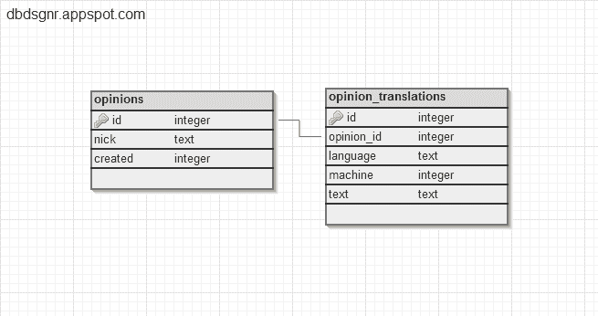
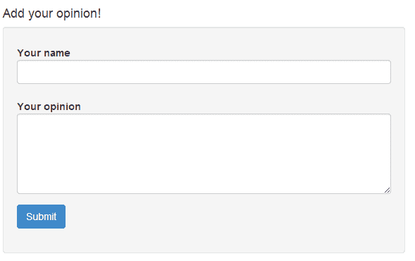

# 使用 Google 翻译 API 自动翻译用户内容

> 原文：<https://www.sitepoint.com/auto-translating-user-submitted-content-using-google-translate-api/>

谷歌翻译服务提供了一个 REST API，允许你直接从你的应用程序中获取翻译。在本教程中，您将学习如何构建一个单页网站，以不同的语言显示用户提交的意见，并允许访问者提交新的意见。该教程是谷歌翻译应用编程接口和 PHP 文章介绍的继续。

## 介绍

在我们的应用程序中，我们必须实现以下功能:
–使用 web 表单添加新的意见，
–将意见保存到数据库，
–获取翻译并将其保存到数据库，
–显示现有的意见及其翻译。

我们将使用的技术包括:
—[SQLite](http://www.sqlite.org/)数据库，用于存储用户意见和翻译，
—[cURL](https://www.sitepoint.com/using-curl-for-remote-requests/)库，用于连接到谷歌翻译 API，
—[Twitter Bootstrap](http://getbootstrap.com/)，用于获得一些漂亮的外观&。

我们网站内的请求将通过 AJAX 调用来实现，以便在一个页面内保存和获取意见。

最终的应用程序可以在 GitHub repo 中获得。你可以打开一个[现场演示](http://jacekbarecki.com/GoogleTranslate/)来看看我们通读教程后会达到什么效果。

## 数据库

#### 数据库引擎

因为我们将数据存储在 SQLite 数据库中，所以不需要做太多的配置。SQLite 将自己描述为一个零配置和无服务器的数据库，这是完全正确的。整个数据库只是服务器上的一个文件。值得注意的是，虽然 SQLite 帮助我们更快地开发我们的应用程序，并且非常适合这种快速原型制作，但您应该在生产中使用更安全和更健壮的东西，如 [MariaDB](http://mariadb.org/) 。要使用 PHP PDO 扩展连接数据库，我们需要一行代码:

```
<?php
    $db = new PDO('sqlite:opinions.db');
?>
```

然后，我们可以使用`$db`变量作为数据库连接处理程序来执行一些查询。

#### 数据库模式

我们的数据库将包含两个表-一个用于存储关于观点的一般信息，另一个包含所有文本和翻译:



`opinion_translations.machine`字段将告诉我们某一行是代表用户提交的文本(`machine = 0`)还是机器翻译(`machine = 1`)。

为了在`opinion_translations.language`字段中存储语言代码，我们将使用 Google Translate 在其 API 中使用的相同值(查看[文档](https://developers.google.com/translate/)中的完整列表)。

## 保存意见

我们将允许访问者使用简单的表格添加意见:



要知道意见的源语言是什么，表单包含一个指定它的隐藏字段:

```
<input type="hidden" name="language" id="inputLanguage" value="en">
```

如果我们的网站允许用户在不同的语言版本之间切换，我们只需将`inputLanguage`值更改为当前显示的语言代码。

当用户提交表单时，我们的应用程序将意见保存到数据库，然后获取必要的翻译。所有负责处理意见的代码都写在我们 app 的`Opinion`类中:

```
<?php
class Opinion {

        private $_languages = array('en', 'fr', 'es');

        public function getAll() {
           ...
        }

        public function addOpinion($nick, $text, $language) {
            ...
        }

        public function addTranslation($opinion_id, $language, $text, $machine) {
        ...
        }

        ...
    }
?>
```

如您所见，在`_languages`属性中存储了站点中使用的所有语言的全局列表。在添加意见时，我们将使用它来检查要获取哪些翻译。

## 获取翻译

为了连接 Google Translate API，我们将使用一个简单的`GoogleTranslator`类，作为 API 提供的方法的包装器。它提供了 3 个静态方法，其名称与 API 中可用的名称相同:

```
<?php
    class GoogleTranslator {
        static function translate($targetLanguage, $text, $sourceLanguage = null, $prettyprint = 'true', $format = 'html') {
            ...
        }

        static function detect($text) {
            ...
        }

        static function languages() {
            ...
        }

    }

?>
```

每种方法都基于传递的参数值构建一个适当的请求 URL。然后，它使用 cURL 向 API 发送一个请求，正如关于 Google Translate API 基础知识的文章中所描述的那样。

所以使用`GoogleTranslate`类获得翻译就像这样:

```
<?php
    $translation = GoogleTranslator::translate($targetLanguage, $text, $sourceLanguage);

?>
```

然后我们只需调用`Opinion->addTranslation()`方法就可以保存从 Google API 收到的翻译。我们可以添加尽可能多的翻译，条件是每个意见不超过一个由用户(`opinion_translations.machine = 0`)提交的文本，并且每种语言不超过一个翻译。

## 展示观点

成功保存意见后，我们将能够显示其原始内容和翻译内容。`Opinion->getAll()`方法将为我们提供所有意见的列表。我们可以通过在一行中显示一个意见以及允许访问者在不同语言之间切换的按钮来很好地展示它们:


当我们使用谷歌翻译 API 时，我们必须遵守某些规定:属性要求和 T2 HTML 标记要求。

第一份文件指出，我们必须在网站上显示的机器翻译文本旁边放置谷歌翻译标志。这就是为什么在我们的意见列表中显示翻译内容时会出现一个`translated by Google`图像。我们还必须添加一个免责声明，显示在我们的页面底部。

还有关于 HTML 标记的要求。当显示翻译的文本时，我们需要给包含文本的元素添加一个`lang`属性(一个`div`、`span`或任何其他元素)。属性的值由翻译的源语言和目标语言组成:

```
 <language code of the language to which the text was translated>-x-mtfrom-<language code of original language>
```

因此，一个从英语翻译成法语的观点样本可以使用如下代码插入到页面中:

```
<div lang="fr-x-mtfrom-en">
    J'aime vraiment vos produits.
</div>
```

谷歌解释说，添加这样的 HTML 属性可以让搜索引擎区分原文和译文。

## 将它们联系在一起

为了连接应用程序的所有部分，我们将构建一个单页面站点，它保存一个新的观点，并使用 AJAX 调用显示现有的观点。提交意见后，用户将收到结果通知，意见列表将被重新加载。当出现问题时，还会显示一条不错的错误消息。

看[演示](http://jacekbarecki.com/GoogleTranslate/)来检查它是如何工作的。由于谷歌翻译 API 是一项付费服务，我们的演示应用程序不会获取实际的翻译。要在下载代码后更改它，只需在`GoogleTranslator`类中输入您的 API 密钥，并将测试模式更改为`false`:

```
<?php
    class GoogleTranslator {
        private static $_apiKey = '<your API key>';
        private static $_testMode = false;
        ...
    }
?>
```

然后，每次添加新观点时，您的应用程序都会连接到 Google Translate API。

## 摘要

这篇文章描述了如何创建一个单页面站点，以不同的语言获取和显示观点。正如你所看到的，混合使用 SQLite、Google Translate REST API、Twitter Bootstrap 和 AJAX 等技术可以让你快速建立一个可以为你的客户服务的网站。

您可以扩展给定的代码，并添加一些更多的功能，如批准网站管理员的意见，或将意见与数据库中的产品相链接。

如果你对这篇文章有任何问题或评论，欢迎在下面发表评论或通过 [Google+](https://plus.google.com/112138584619019192671?rel=author) 联系我。

## 分享这篇文章