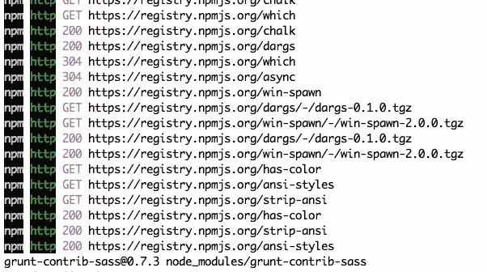
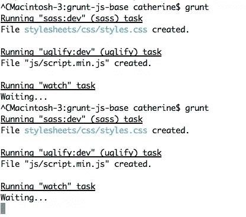
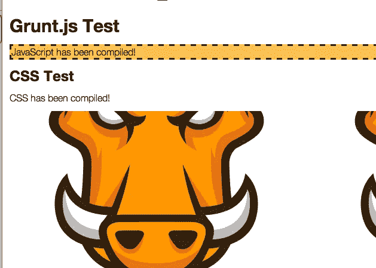

# 使用 Grunt.js 自动执行重复性任务

> 原文：<https://www.sitepoint.com/automate-recurring-tasks-grunt/>

我最近开始使用 Grunt.js 来运行任务，这些任务是我的开发工作流程的重要组成部分。Grunt 是一个命令行工具，可以让您在一个命令中运行一堆任务，所有任务都可以根据您的喜好和项目需求进行定制。它帮助我自动化重复性的工作，比如 CSS 预处理，或者为生产环境精简代码。

在 Happy Cog 的团队环境中使用 Grunt 后，它帮助我们解决了我们甚至没有预见到使用它的新问题，如图像优化、数据库同步和 WordPress 主题管理。继续阅读，了解如何使用 Grunt 自动化前端 Sass 和 JavaScript 任务，以及如何让您的项目立即使用它。

## 选择一项任务

Grunt 的开发者社区意味着有一个插件可以完成你想执行和自动化的几乎任何任务。然而，我发现开始使用 Grunt 最简单的方法是选择一两个您想要自动化的基本过程，并让它们在您的项目中运行。作为一名前端开发人员，我最重要的任务是 **Sass 编译**和 **JavaScript 拼接**。本文假设您已经安装了 Sass 3.3。要创建练习目录，下载或克隆我的 [grunt-js-base](http://github.com/cfarm/grunt-js-base) 项目到你的机器上，然后在浏览器中检查`index.html`。

碰巧的是， [Grunt.js 插件库](http://gruntjs.com/plugins)列出了两个官方维护的插件，它们将服务于这些目的: [Uglify](https://www.npmjs.org/package/grunt-contrib-uglify) 用于 js 缩小(以及更多)，以及 [grunt-contrib-sass](https://www.npmjs.org/package/grunt-contrib-sass) 。

## 安装 Node.js 和 Grunt 的命令行界面

在安装这些插件之前，我们需要在电脑上安装 **Node.js** 。幸运的是，它很容易安装在 Windows 或 Mac OS 上。只要去 nodejs.org 的[点击绿色的大安装按钮就可以下载了。](http://nodejs.org)

一旦你安装了 Node.js，你需要在你的电脑上安装 **Grunt 的命令行界面**工具。从终端窗口运行`npm install -g grunt-cli`。如果你得到一个权限错误，我建议阅读 npm 上的[这篇文章。本文由 Isaac Schlueter 撰写，将教您如何在不使用 sudo 的情况下安装模块。](http://howtonode.org/introduction-to-npm)

## 将`package.json`添加到您的项目

每个使用 Grunt 的项目都需要两个文件—`package.json`和`Gruntfile.js`。首先将`package.json`添加到你的项目文件夹中，在根目录下。您可以使用 Grunt.js 安装说明中的基本内容，替换为您的项目信息。随着时间的推移，您将开发出自己的项目初学者工具包。下面是我的[默认打杂项目](http://github.com/cfarm/grunt-js-base)的`package.json`:

```
{
  "name": "grunt-js-base",
  "version": "0.1.0",
  "devDependencies": {
    "grunt": "~0.4.2",
    "grunt-contrib-uglify": "~0.2.2",
    "matchdep": "*"
  },
  "repository": {
    "type": "git",
    "url": "git://github.com/cfarm/grunt-js-base.git"
  },
  "author": "Catherine Farman",
  "homepage": "http://cfarman.com"
}
```

如您所见，`package.json`文件是一组描述项目包的 JSON 对象和属性。这个文件中最重要的部分是`devDependencies`对象，当你添加插件到你的项目中时，它会发生变化。这里定义的属性是您的项目需要开发和测试的所有模块。在我们的例子中，到目前为止，我们已经有了 Grunt 模块本身，丑陋的插件，以及一个名为 [matchdep](https://www.npmjs.org/package/matchdep) 的模块，我们将在一会儿探讨它。

每次你添加一个新的插件到你的项目中，你会用插件名和版本号更新这个`devDependencies`列表。现在，将上面的文件保存在项目的根文件夹中，以便开始。

## 将 Gruntfile.js 添加到项目中

除了`package.json`之外，您还需要向项目的根添加一个`Gruntfile`。我的[默认的 Gruntfile 是这样的](https://github.com/cfarm/grunt-js-base)。同样，这只是一组 JSON 对象和属性，我们将对它们进行定制，以设置我们的任务按照我们想要的方式运行。您的大多数普通配置都将发生在这个文件中。

## 使用`matchdep`插件节省设置时间

请注意，我的 Gruntfile 的第二行有以下特殊说明:

```
require("matchdep").filterDev("grunt-*").forEach(grunt.loadNpmTasks);
```

这条指令调用 [matchdep 模块](https://www.npmjs.org/package/matchdep)来更容易地为我的项目安装新插件。每当你添加一个新任务，你通常需要为你的项目安装节点模块，*，然后* [在你的项目的 Gruntfile 中添加一行来加载任务](http://gruntjs.com/getting-started#loading-grunt-plugins-and-tasks)。有了上面这一行并安装了 matchdep 插件，无论何时向项目添加新插件，您都可以跳过这一步，从而节省安装时间。

## 为您的项目安装插件

虽然我们将使用的 Sass 和 Uglify 插件在`package.json`中列出，但我们需要采取另一个步骤将它们真正安装到我们的计算机上。在命令行上导航到项目目录，并运行`npm install`将这些模块添加到您的项目中。一个成功的安装看起来会像这样:



请注意，在您的项目根目录下已经创建了一个名为`node_modules`的新文件夹——所有插件依赖项都在这里。

## `grunt`命令

现在是关键时刻了！运行以下命令(仍然在您的项目目录中):

`grunt`

您的终端应该如下所示:



如果你正在使用我的 starter grunt 项目，你可以在你的浏览器中查看`index.html`,看看 grunt 已经运行了它的任务，将你的 Sass 编译成 CSS，并修改你的 JavaScript:



如果您遇到任何语法错误，Grunt 会告诉您修复哪一行。一旦你准备好再试一次，你可以按 Ctrl+C 退出观察，然后再次运行`grunt`来运行你的任务。

## 腹股沟解剖学

如果你想知道 Grunt 是怎么回事，看看`Gruntfile.js`看看我们的任务是如何定义的。

```
sass: {
  options: {
    precision: 5
  },
  dev: {
    options: {
      style: 'nested', // compact, compressed, nested or expanded
      sourcemap: true
    },
    files: {
      'stylesheets/css/styles.css' : 'stylesheets/scss/styles.scss'
    }
  },
  prod: {
    files: {
      'stylesheets/css/styles.css' : 'stylesheets/scss/styles.scss'
    }
  }
},
```

在 Grunt 的`initConfig`部分，我们正在创建我们的任务对象。对于 Sass 和 Uglify，我设置了两个不同的任务:一个默认任务在调用`grunt`命令时运行，一个生产任务在`grunt production.`下运行。每个任务的选项都不同，以反映本地开发环境的需求和生产网站的最终输出。

尝试运行`grunt production`,然后查看您的输出文件 script.min.js 和 styles.css。将它们与默认`grunt`任务创建的输出进行比较，以查看差异。

## 结论

有一整个世界的 Grunt 插件，当你构建你的项目时，它们可以为你解决很多问题。在[http://gruntjs.com/plugins](http://gruntjs.com/plugins)搜索任务。一旦你找到你感兴趣的插件，使用`npm install`将该模块添加到你的电脑中。另外，不要忘记将插件添加到您的`package.json`文件中。一旦它被安装并在`package.json`中列出，你需要添加任务选项到`Gruntfile.js`。最后，在`Gruntfile.js`的底部，将您的任务命令添加到开发任务、生产任务或两者中，使其成为一个普通任务。

如果您希望监视触发任务运行的文件更改，也可以将任务添加到 Gruntfile.js 中的监视任务中(对于前端更改非常有用)。这将保持 Grunt 任务在您的终端中运行，并且文件将在您保存它们时编译，因此您不必在工作时多次运行`grunt`命令。

既然你在 Grunt 中自动化了你的普通任务，你会发现你的工作流程有了很大的改进。

## 分享这篇文章