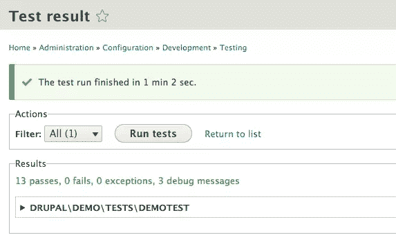

# Drupal 8 模块的自动化测试

> 原文：<https://www.sitepoint.com/automated-testing-drupal-8-modules/>

在本文中，我们将探讨 Drupal 8 中的自动化测试。更具体地说，我们将为我们在之前关于 Drupal 8 模块开发的 Sitepoint 文章中所写的一些业务逻辑编写一些集成测试。你可以在[这个库](https://github.com/upchuk/d8-demo-modules/tree/master/demo)中找到该代码的最新版本，以及我们今天编写的测试。


但在此之前，我们将讨论一下在 Drupal 8 中可以编写什么类型的测试，以及它们实际上是如何工作的。

## 简单测试(测试)

Simpletest 是 Drupal 特定的测试框架。对于 Drupal 6，它是一个贡献模块，但是从 Drupal 7 开始，它已经成为核心包的一部分。Simpletest 现在是 Drupal 核心开发不可或缺的一部分，由于广泛的代码库测试覆盖，允许安全的 API 修改。

马上我会提到用 Simpletest 测试 Drupal 的权威文档页面。在那里，您可以找到关于 Simpletest 如何工作、如何为它编写测试、可以使用什么 API 方法等信息的中心。

默认情况下，Drupal core 附带的 Simpletest 模块是未启用的，所以如果我们想要运行测试，我们必须自己完成。可以在名为`Testing`的扩展页面上找到。

一旦完成，我们就可以前往`admin/config/development/testing`并查看该站点当前可用的所有测试。这些包括核心和贡献模块测试。在最底部，还有一个`Clean environment`按钮，如果我们的任何测试意外退出，并且您的数据库中还有一些剩余的测试表，我们可以使用这个按钮。

### Simpletest 是如何工作的？

当我们运行一个为 Simpletest 编写的测试时，后者使用测试中发现的现有代码库和指令来创建一个单独的 Drupal 环境，测试可以在其中运行。这意味着向数据库添加额外的表(以`simpletest_`为前缀)和用于复制站点实例的测试数据。

根据我们正在运行的测试类型和它包含的内容，这个复制的性质可能会有所不同。换句话说，根据测试本身，环境可以有不同的数据和核心功能。

### Drupal 8 中有哪些种类的测试？

我们可以为 Drupal 8 编写两种主要类型的测试:使用 PHPUnit 的单元测试(现在在核心中)和功能测试(使用 Simpletest)。然而，后者也可以分为两种不同的类型: *web 测试*(需要 web 输出)和*内核测试*(不需要 web 输出)。在本文中，我们实际上将只涉及 *web 测试*，因为我们在之前的文章中编写的大多数功能都是通过输出来体现的，所以这也是我们需要测试的方式。

编写任何类型的测试都是从实现一个特定的类并把它放在它测试的模块的`src/Tests`文件夹中开始的。我也鼓励你阅读[这个文档页面](https://api.drupal.org/api/drupal/core!modules!system!core.api.php/group/testing/8)，它包含了更多关于这个主题的信息，因为我不想在这里重复。

## 我们的测试

正如我提到的，在这篇文章中，我们将关注于为我们在关于 [Drupal 8 模块开发](https://www.sitepoint.com/series/how-to-build-a-drupal-8-module/)的系列中创建的一些业务逻辑提供测试覆盖。虽然没有什么复杂的事情发生，但是我们构建的`demo`模块也为开始我们的测试过程提供了一个很好的例子。因此，让我们首先确定我们将测试什么。

通过查看[演示模块](https://github.com/upchuk/d8-demo-modules/tree/master/demo)，我们可以描绘出我们可以测试的以下方面:

*   我们有一个[路由](https://github.com/upchuk/d8-demo-modules/blob/master/demo/demo.routing.yml#L1)，[显示一个页面](https://github.com/upchuk/d8-demo-modules/blob/master/demo/src/Controller/DemoController.php#L41)，页面上有从[服务](https://github.com/upchuk/d8-demo-modules/blob/master/demo/demo.services.yml)加载的特定消息。
*   我们有一个显示[表单](https://github.com/upchuk/d8-demo-modules/blob/master/demo/src/Form/DemoForm.php)的[路线](https://github.com/upchuk/d8-demo-modules/blob/master/demo/demo.routing.yml#L9)，它有一些配置。
*   我们有一个[自定义块插件](https://github.com/upchuk/d8-demo-modules/blob/master/demo/src/Plugin/Block/DemoBlock.php)，我们可以配置并添加到一个页面。

差不多就是这样。我们在`demo.links.menu.yml`中定义的自定义菜单链接也可以被测试，但那应该已经可以开箱即用了，所以我不想测试。

为了简洁起见，事实上我们没有太多需要测试的，我将把我们所有的测试方法放在一个类中。但是，您可能应该根据他们实际负责的内容将您的类分成多个类。

在位于`src/Tests/`文件夹中的一个名为`DemoTest.php`的文件中，我们可以从添加以下内容开始:

```
<?php

namespace Drupal\demo\Tests;

use Drupal\simpletest\WebTestBase;

/**
 * Tests the Drupal 8 demo module functionality
 *
 * @group demo
 */
class DemoTest extends WebTestBase {

  /**
   * Modules to install.
   *
   * @var array
   */
  public static $modules = array('demo', 'node', 'block');

  /**
   * A simple user with 'access content' permission
   */
  private $user;

  /**
   * Perform any initial set up tasks that run before every test method
   */
  public function setUp() {
    parent::setUp();
    $this->user = $this->drupalCreateUser(array('access content'));
  }
}
```

这里我们有一个简单的测试类，对于它运行的每个测试，将启用`$modules`属性中的模块，并创建一个存储在`$user`属性中的新用户(通过运行`setUp()`方法)。

出于我们的目的，我们需要启用`demo`模块，因为这是我们正在测试的内容；启用`block`模块，因为我们需要测试一个定制的块插件；启用`node`模块，因为我们的逻辑使用了该模块定义的`access content`权限。此外，创建用户只是为了确保该权限得到尊重。

对于我们上面确定的三个要点，我们现在将创建三个测试方法。请记住，每个都需要以前缀`test`开头，以便 Simpletest 自动运行它们。

### 测试页面

我们可以从测试定制页面回调开始:

```
/**
 * Tests that the 'demo/' path returns the right content
 */
public function testCustomPageExists() {
  $this->drupalLogin($this->user);

  $this->drupalGet('demo');
  $this->assertResponse(200);

  $demo_service = \Drupal::service('demo.demo_service');
  $this->assertText(sprintf('Hello %s!', $demo_service->getDemoValue()), 'Correct message is shown.');
}
```

这是实现它的代码。

首先，我们使用在`setUp()`方法中创建的用户登录，然后导航到`demo`路径。Simpletest 使用它自己的内部*浏览器*来处理这个导航。接下来，我们断言最后访问的页面的响应是 200。这将验证该页面是否存在。然而，这还不够，因为我们需要确保页面上呈现的文本是从我们的服务加载的。

为此，我们静态访问`\Drupal`类并加载我们的服务。然后我们断言页面输出由硬编码的字符串和服务的`getDemoValue()`方法的返回值组成的 *hello* 消息。为服务内部发生的任何逻辑编写一个单元测试可能是一个好主意，但是对于我们的情况来说，这是非常多余的。

这就是与页面相关的逻辑。我们可以到我们站点上的测试页面，找到新创建的`DemoTest`并运行它。如果一切顺利的话，我们应该是一路绿灯，没有失败。



### 测试表单

对于表单，我们有另一个方法，尽管更有内容，它测试所有必要的逻辑:

```
/**
 * Tests the custom form
 */
public function testCustomFormWorks() {
  $this->drupalLogin($this->user);
  $this->drupalGet('demo/form');
  $this->assertResponse(200);

  $config = $this->config('demo.settings');
  $this->assertFieldByName('email', $config->get('demo.email_address'), 'The field was found with the correct value.');

  $this->drupalPostForm(NULL, array(
    'email' => 'test@email.com'
  ), t('Save configuration'));
  $this->assertText('The configuration options have been saved.', 'The form was saved correctly.');

  $this->drupalGet('demo/form');
  $this->assertResponse(200);
  $this->assertFieldByName('email', 'test@email.com', 'The field was found with the correct value.');

  $this->drupalPostForm('demo/form', array(
    'email' => 'test@email.be'
  ), t('Save configuration'));
  $this->assertText('This is not a .com email address.', 'The form validation correctly failed.');

  $this->drupalGet('demo/form');
  $this->assertResponse(200);
  $this->assertNoFieldByName('email', 'test@email.be', 'The field was found with the correct value.');
}
```

第一步和之前一样。我们转到表单页面并断言一个成功的响应。接下来，我们想测试一下`email`表单元素是否存在，以及它的默认值是否是默认模块配置中的值。为此，我们使用`assertFieldByName()`断言。

我们需要测试的另一个方面是，用正确的电子邮件地址保存表单是否完成了它应该做的事情:将电子邮件保存到配置。所以我们在父类上使用`drupalPostForm()`方法来提交带有正确电子邮件的表单，并断言一个成功的状态消息作为结果被打印在页面上。这证明表单保存成功，但不一定表示新邮件已保存。因此，我们重复前面的步骤，但这次断言 email 字段的默认值是新的电子邮件地址。

最后，我们还需要测试表单没有使用错误的电子邮件地址提交。我们分两步再次这样做:提交表单时测试表单验证失败，再次加载表单时不会将错误的电子邮件作为电子邮件字段的默认值。

### 测试块

```
/**
 * Tests the functionality of the Demo block
 */
public function testDemoBlock() {
  $user = $this->drupalCreateUser(array('access content', 'administer blocks'));
  $this->drupalLogin($user);

  $block = array();
  $block['id'] = 'demo_block';
  $block['settings[label]'] = $this->randomMachineName(8);
  $block['theme'] = $this->config('system.theme')->get('default');
  $block['region'] = 'header';
  $edit = array(
    'settings[label]' => $block['settings[label]'],
    'id' => $block['id'],
    'region' => $block['region']
  );
  $this->drupalPostForm('admin/structure/block/add/' . $block['id'] . '/' . $block['theme'], $edit, t('Save block'));
  $this->assertText(t('The block configuration has been saved.'), 'Demo block created.');

  $this->drupalGet('');
  $this->assertText('Hello to no one', 'Default text is printed by the block.');

  $edit = array('settings[demo_block_settings]' => 'Test name');
  $this->drupalPostForm('admin/structure/block/manage/' . $block['id'], $edit, t('Save block'));
  $this->assertText(t('The block configuration has been saved.'), 'Demo block saved.');

  $this->drupalGet('');
  $this->assertText('Hello Test name!', 'Configured text is printed by the block.');
}
```

对于这个测试，我们需要另一个用户也有权限管理块。然后，我们创建一个新的自定义实例`demo_block`，在`Who`字段中没有值，并断言结果是打印出一条成功的确认消息。接下来，我们导航到首页，断言我们的块出现并显示正确的文本:`Hello to no one`。

最后，我们编辑块并在`Who`字段中指定一个`Test name`,并断言保存块配置会导致出现一个成功的确认消息。最后，我们导航回主页，断言该块呈现了正确的文本。

## 结论

在本文中，我们看到了为 Drupal 8 业务逻辑编写一些基本的集成测试是多么简单。它包括创建一个或多个类文件，这些文件简单地利用大量的 API 方法和断言来测试我们代码的正确行为。我强烈建议您尝试一下，并尽可能早地开始测试您的定制代码，以便使它更加稳定，并且在以后进行更改时不容易被破坏。

此外，不要因为编写测试的缓慢过程而气馁。这只是在开始的时候，直到你习惯了 API，并且对你正在测试的实际逻辑很熟悉。我觉得值得一提的是，这篇文章高度概括了 Drupal 8 中的测试生态系统，并且保持了测试的简单性。我建议对这个话题进行更深入的研究。

## 分享这篇文章