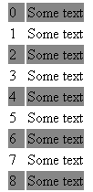
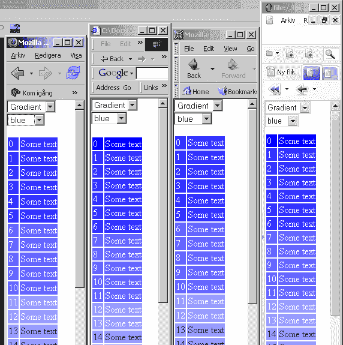

# 使用 JavaScript 改变表格行的背景颜色

> 原文：<https://www.sitepoint.com/background-colors-javascript/>

许多展示表格数据的网站使用交替的背景色来增加数据的可读性。当我开发一个网站时，我意识到我也想这样做。问题？在我的例子中，表格不是由服务器端应用程序或脚本生成的，您可以在 Web 上找到许多这样的例子。

显而易见的解决方案是每隔一行进行硬编码，以确保它有不同的背景颜色。但是我希望表格是动态的，这样就可以在表格中间添加一个新行，而不改变后面行的背景颜色属性。

我的解决方案使用 JavaScript，因为 CSS3 还不是真正可行的选项。今天的浏览器仍然很难支持 CSS1 和 CSS2。尽管 HTML 表格不推荐用于网页布局，但它们仍然非常适合于表格数据的表示。在本教程中，我将基于相同的想法给出三个例子。我只在 Windows 平台上测试了 IE6、Firefox 1.0、Mozilla 1.7.3 和 Opera 7.54 中的解决方案。

##### 入门指南

让我们从一个普通的 html 表格开始。在这种情况下，表格是否包含头/脚元素并不重要:

```
<table id="theTable"> 

<tr><td>0 - some txt</td></tr> 

<tr><td>1 - some txt</td></tr> 

  <tr><td>2 - some txt</td></tr> 

  <tr><td>3 - some txt</td></tr> 

  <tr><td>4 - some txt</td></tr>       

</table>
```

现在，我们需要检查浏览器是否相当新，是否具有必要的 JavaScript 功能(即 W3C DOM 支持)。下面一行执行了这一检查，取消了 Netscape 4 和该代产品的资格。这种浏览器不会尝试给表格着色。

```
if(document.getElementById)
```

还要注意，所有这些示例的共同点是以下代码:

```
var table = document.getElementById(id);   

var rows = table.getElementsByTagName("tr");   

for(i = 0; i < rows.length; i++){           

    //manipulate rows 

      ...
```

##### 示例 1

第一个例子使用了一个样式元素，通过它我们为背景色定义了两个类:

```
<style> 

  .odd{background-color: white;} 

  .even{background-color: gray;} 

</style>
```

样式是灵活的:它也可以定义其他东西，比如每隔一行用斜体显示。完整的函数如下所示:

```
function alternate(id){ 

  if(document.getElementsByTagName){  

    var table = document.getElementById(id);   

    var rows = table.getElementsByTagName("tr");   

    for(i = 0; i < rows.length; i++){           

  //manipulate rows 

      if(i % 2 == 0){ 

        rows[i].className = "even"; 

      }else{ 

        rows[i].className = "odd"; 

      }       

    } 

  } 

}
```

这里，`%`，模运算符，给出了除法中的余数。

上述函数应该从 body 标记的 onload 事件中调用:

```
<html> 

... 

<body onload="alternate('thetable')"> 

<table id="thetable"> 

<tr><td>...</td></tr> 

</table> 

...
```

结果可能如下所示:



##### 示例 2

让我们继续下一个例子——一个更冒险的例子。我想使用几种颜色，而不是两种交替的颜色。让我们添加一个保存所有这些颜色的数组。

由于有限数量的颜色在 HTML 中有定义的名称，我们将切换到十六进制值。结果颜色将由三个值组成:红色、绿色和蓝色。当所有三种颜色都在 max: `#ffffff`打开时，实现白色。对面，黑色的，是`#000000`。

```
//various gray shades  

var colors = new Array('#ffffff','#dddddd','#aaaaaa','#888888');
```

行操作代码将只包含一行，但我们不是复制和粘贴相同的代码，而是进行单独的函数调用:

```
for(...  

//manipulate rows  

doMultiple(rows[i], i);  

...  

function doMultiple(row, i){  

row.style.backgroundColor = colors[i % colors.length];  

}  

function doAlternate(row, i){  

  if(i % 2 == 0){  

    row.className = "even";  

  }else{  

    row.className = "odd";  

  }  

}
```

这里，我还为示例 1 添加了一个名为`doAlternate`的函数。这使得在不同的方法之间切换变得更加容易，通过这些方法我们可以改变表格的行颜色。

如上面的片段所示，可以为行设置 CSS 类名，或者 HTML 标记的特定属性:

```
rows[i].className  

rows[i].style.backgroundColor
```

示例 2 的结果可能如下所示:


##### 示例 3

最后一个例子展示了一个真正丰富多彩的变体，其中颜色是根据表中的行数、起始颜色和给定的因子来计算的。

首先，我们需要设置几个变量:

```
var color = 255;     //starting color (in decimal)  

var steps = 20;    //the factor, a "distance" between colors   

var down = true;  //direction, if going up or down when calculating //color value
```

我们现在添加一个新函数，`doGradient`。

```
function doGradient(row){  

  bgcolorValue = padHex() + bgcolor.toString(16)   

    + padHex() + bgcolor.toString(16) + "ff";   

  row.style.backgroundColor = "#" + bgcolorValue;   

  if(down && (bgcolor-steps) > 0){ //if subtracting, prevent negatives   

    bgcolor = (bgcolor - steps);   

  }else{ bgcolor = (bgcolor + steps);   

    down = false;   

  } if(bgcolor > 255){ //prevent too high values   

    bgcolor = (bgcolor - steps);   

    down = true;   

  }  

}
```

由于正在计算颜色，我们需要确保不超出范围，有效值从 0 到 255。颜色参数没有分成 RGB 值，所以如果低于 16，我们需要填充，否则，该值将是非法的。如果我们有一个很长的表或者一个很大的`steps`值，梯度将会转向另一个方向。在该功能中，`blue`部分是固定的，另外两个被修改。

当您需要转换数字时——在本例中是十进制到十六进制——,`toString`方法非常方便。`toString`中的参数是基数，即。二进制为 2，十进制为 10，十六进制为 16。下图显示了该表格在 Firefox 1.0、IE6、Mozilla 1.7 和 Opera 7.5 中的显示结果。



注意不要让显示过于鲜艳——我们仍然希望确保表格数据的可读性。对于某些颜色组合，甚至有必要使用如下方式更改表格文本的颜色:

```
if(color < switchingPoint){   

  row.style.color = "white";  

}else{  

  row.style.color = "black";  

}
```

##### 结论

使用 CSS 和 JavaScript，无需从服务器应用程序重新生成 HTML 页面，添加或增加代码的可读性是相当容易的。正如我们在这里看到的，它也可以添加到静态 HTML 页面上。要查看这些例子的运行情况，[下载包含代码](https://www.sitepoint.com/examples/colormanipulate/alternate.zip)的 HTML 文件。

## 分享这篇文章