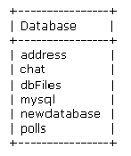

# 网站管理员日记第 4 部分——使用 MySQLDump 备份

> 原文：<https://www.sitepoint.com/backing-up-mysqldump/>

MySQL 是最流行的数据库管理系统之一，用于开发需要利用持久数据源的交互式网站。与所有其他流行的数据库管理系统一样，MySQL 提供了几种备份重要数据的方法。在本文中，我们将了解如何使用 MySQL 自带的 mysqldump 实用程序来备份数据库。我们将回顾几个使用 mysqldump 的例子，包括将数据库备份到一个文件、另一个服务器，甚至一个压缩的 gzip 文件。

我假设您在 Windows、Unix 或 Linux 机器上本地安装了 MySQL，并且您在该机器上拥有管理权限。我还假设您至少对 MySQL 和 SQL 语言语法有少量的了解。

##### mysqldump 实用程序

***什么是 mysqldump？***

mysqldump 实用程序是一个控制台驱动的可执行文件，它允许我们指定许多选项来将数据库备份到外部资源，例如文件，甚至是运行在世界另一端的完全不同的 MySQL 服务器！

我在这里使用“备份”这个词相当不严谨，因为 MySQL 本身并不备份我们的数据。相反，它创建了一组“CREATE TABLE”和“INSERT INTO”命令，可以对 MySQL 服务器执行这些命令来重新创建我们的数据库。

mysqldump 实用程序通常可以在 Windows 操作系统的 c:mysqlbin 中找到，也可以在安装了 mysql 的 Unix/Linux 系统的/usr/local/mysql/bin 目录中找到。mysqldump 实用程序接受几个命令行参数，您可以使用这些参数来更改数据库的备份方式。

最简单的 mysqldump 实用程序可以这样使用:

```
mysqldump ---user [user name] ---password=[password]  

[database name] > [dump file]
```

让我们看看可以传递给 mysqldump 实用程序的每个参数，如上所示:

**`--user [user name]`** :后跟有效 MySQL 用户名的`---user`标志告诉 MySQL 我们要用来执行数据库转储的帐户的用户名。mysql 用户帐户存储在“MySQL”数据库的“user”表中。通过在 MySQL 命令提示符下插入以下代码，可以查看用户列表及其对 MySQL 服务器的权限:

```
use mysql; 

select * from user;
```

**`--password=[password]`** :上述用户账号的密码。

**`[database name]`** :我们希望 mysqldump 实用程序备份的数据库的名称。我们可以使用–databases 或–all-databases 来备份 MySQL 服务器上的每个数据库，而不是指定一个数据库名称。

**`> [dump file]`** :如果你熟悉 DOS 和批处理文件，那么你会知道“`>`”符号指定我们将输出定向到一个流、端口或文件。对于 mysqldump 实用程序，我们在希望数据库备份到的文件名前面加上一个“`>`”。如果没有为文件指定路径，则将在当前目录中创建该文件。

现在我们已经精通了可以传递给 mysqldump 实用程序的基本参数，让我们看看使用 mysqldump 实用程序备份数据库的五种不同方式。

##### 方法 1

```
mysqldump ---user admin ---password=password mydatabase > sql.dump
```

在上面的例子中，我们指定 MySQL 应该检查密码为“password”的“admin”用户的用户帐户的授权。我在 Windows 2000 上运行 MySQL，这些是 admin 用户帐户的默认凭证。我选择将名为“mydatabase”的数据库备份到文件 sql.dump 中。

如果您不确定数据库的名称是什么，那么在 MySQL 命令提示符下使用以下命令来列出它们:

```
show databases;
```

在我的系统上，MySQL 的响应是这样的:
下面是我使用 mysqldump 实用程序进行数据库转储的一个片段，如上例所述:

```
# 

# Table structure for table 'tbl_contactemails' 

# 

CREATE TABLE tbl_contactemails ( 

 pk_ceId int(11) NOT NULL auto_increment, 

 ceEmail varchar(250) NOT NULL default '', 

 ceType int(11) default NULL, 

 PRIMARY KEY (pk_ceId), 

 UNIQUE KEY id (pk_ceId) 

) TYPE=MyISAM; 

# 

# Dumping data for table 'tbl_contactemails' 

# 

INSERT INTO tbl_contactemails VALUES (18,'mitchell@devarticles.com',1); 

INSERT INTO tbl_contactemails VALUES (17,'mitchell_harper@hotmail.com',1); 

INSERT INTO tbl_contactemails VALUES (16,'mytch@dingoblue.net.au',1);
```

如您所见，mysqldump 命令采用了我的`tbl_contactemails` 表(它是我选择备份的“mydatabase”数据库的一部分)的设计，并将其转换为一个`CREATE TABLE` 查询，如果需要的话，该查询(当导入回 MySQL 时)将重新创建`tbl_contactemails`表。

还要注意三个`INSERT INTO`语句，它们将数据行添加到`tbl_contactemails`表中。我的联系人电子邮件表中有三个电子邮件地址，当这些数据恢复后，MySQL 将直接对我的`tbl_contactemails`数据库执行这些插入命令，将这些行添加回表中。

##### 方法 2

```
mysqldump --opt mydatabase > sql.dump
```

在我们备份数据库时指定`--opt`参数，理论上应该可以给我们最快的转储，以便读回 MySQL 服务器中(opt 代表优化)。当我们指定 `--opt` 参数时，mysqldump 实用程序创建一组更复杂的转储命令，其中包括“`DROP TABLE IF EXISTS`”语句。当使用转储文件恢复数据库时，如果该表已经存在，则从数据库中删除该表。转储还包括几个表锁定语句。

下面是我用`---opt`参数备份同一个数据库时生成的 sql.dump 文件的示例:

```
#  

# Table structure for table 'tbl_contactemails'  

#  

DROP TABLE IF EXISTS tbl_contactemails;  

CREATE TABLE tbl_contactemails (  

 pk_ceId int(11) NOT NULL auto_increment,  

 ceEmail varchar(250) NOT NULL default '',  

 ceType int(11) default NULL,  

 PRIMARY KEY (pk_ceId),  

 UNIQUE KEY id (pk_ceId)  

) TYPE=MyISAM;  

#  

# Dumping data for table 'tbl_contactemails'  

#  

LOCK TABLES tbl_contactemails WRITE;  

INSERT INTO tbl_contactemails VALUES (18,'mitchell@devarticles.com',1),  

(17,'mitchell_harper@hotmail.com',1),(16,'mytch@dingoblue.net.au',1);  

UNLOCK TABLES;
```

##### 方法 3

```
mysqldump --host=host1 --opt mydatabase | mysql --host=host2   

-C newdatabase
```

mysqldump 实用程序的一个优秀特性是，它允许您使用一个命令将数据库从一个 MySQL 服务器备份到另一个服务器。在上面的示例中，我选择将“mydatabase”数据库从名为 host1 的服务器备份到名为 host2 的服务器。无论我在哪里运行这个命令，这两个服务器都必须允许 MySQL 连接，否则这个过程将不起作用。我使用了`--C` 参数告诉 mysqldump 实用程序在我的 MySQL 服务器和目标服务器之间强制执行数据压缩，如果它们都支持的话。最后，我已经指定来自`host1`上的“mydatabase”数据库的所有表都应该在`host2`服务器上名为“new database”的新数据库中创建。

在上面的例子中，我使用`host2`作为我将备份数据发送到的远程 MySQL 服务器的名称。您可以将其替换为网络或互联网上任何其他电脑的主机名或 IP 地址。

注意，使用这种方法有一个问题:目标数据库必须已经存在于远程服务器上。在我们的示例中，在运行 mysqldump 实用程序之前，我们将在 MySQL 控制台应用程序中使用以下命令:

```
create database newdatabase;
```

##### 方法 4

```
mysqldump ---user admin --password=password mydatabase |   

gzip > /usr/local/mydatabase.gz
```

MySQL 的另一个伟大特性是能够将数据库备份到 gzipped (Linux 的 ZIP 版本)文件中。请注意，这只能在 Unix/Linux 服务器上完成。正如您在上面的示例中看到的，我已经指定了我想要备份的数据库的名称(mydatabase)，后面是管道、插入符号、“gzip”关键字，最后是 mysqldump 应该将备份传输到的 gzip 文件的路径。

##### 方法 5

```
mysqldump --no-data --databases mydatabase1 mydatabase2 mydatabase3    

> sql.dump
```

上面的 mysqldump 命令使用了两个新参数:`--no-data`和`---databases`。`---no-data`参数告诉 MySQL 只转储数据库的结构，而不是任何实际数据。当我们想要备份多个数据库时，使用`---databases`参数。在上面的示例中，我备份了三个数据库，分别名为“我的数据库 1”、“我的数据库 2”和“我的数据库 3”。转储将被保存到一个名为 sql.dump 的文件中。

```
#   

# Table structure for table 'tbl_tempzips'   

#   

CREATE TABLE tbl_tempzips (   

 pk_zId int(11) NOT NULL auto_increment,   

 zBlob longblob NOT NULL,   

 PRIMARY KEY (pk_zId),   

 UNIQUE KEY ID (pk_zId)   

) TYPE=MyISAM;   

#   

# Table structure for table 'tbl_topics'   

#   

CREATE TABLE tbl_topics (   

 pk_tId int(11) NOT NULL auto_increment,   

 tName varchar(50) NOT NULL default '',   

 tType smallint(4) NOT NULL default '0',   

 PRIMARY KEY (pk_tId),   

 UNIQUE KEY ID (pk_tId)   

) TYPE=MyISAM;
```

请注意，转储中没有“INSERT INTO”查询，只有“CREATE TABLE”命令。

这就结束了我们对使用 mysqldump 实用程序备份 MySQL 数据库的研究。正如我前面提到的，还有很多其他参数可以传递给 mysqldump 实用程序。你应该看看 mysqldump 的 mysqldump 参考页面，以获得更多的信息和这些论点的例子。

##### 恢复备份

使用 mysqldump 实用程序导出我们的数据库备份固然很好，但是我们如何将这些数据读回 MySQL 来重建我们最初备份的数据库、表和记录呢？

实际上，很容易。您所要做的就是用几个参数调用 MySQL 控制台应用程序。下面是将参数传递给 MySQL 的方法:

```
mysql [database name] < [backup file name]
```

这些论点应该是不言自明的。“`[database name]`”参数指定要恢复的数据库的名称，“`[backup file name]`”参数应该指定 mysqldump 生成的文件的完整路径和文件名，如`sql.dump`。您还应该像往常一样指定您的 MySQL 用户名和密码。

因此，如果我想从名为`sql.dump`的文件中恢复名为 mydatabase 的数据库，我应该像这样运行 mysql:

```
mysql mydatabase < sql.dump
```

##### 结论

mysqldump 实用程序是备份 MySQL 数据库的众多方法之一。它有广泛的选择，灵活，快速，可以执行高级备份到远程服务器，平面文件，甚至备份您的数据库作为格式良好的 XML 文件！

如果你运行一个使用 MySQL 数据库的网站，那么你应该确保你的数据库每天都有备份。如果不是，那么考虑设置一个 cron 作业(在 Linux/Unix 上)或一个 NT 服务(在 Windows 上),使用 mysqldump 实用程序执行常规备份，如本文所述。

不久前，我参与了一个网站，在那里另一个程序员负责数据库，我负责界面和可用性。他忘记创建一个数据库备份脚本，并且总是“忘记”去做它。十个月后，MySQL 服务器着火了，所有数据(大约 100 万行)都丢失了。

如果那个程序员多花一个小时使用 mysqldump 实用程序创建一个备份脚本，那个站点今天还会存在。教训:花额外的时间来确保您的数据库被正确而有效地备份到另一台服务器，或者备份到诸如 zip 磁盘、磁带或可移动硬盘驱动器之类的便携式介质，确实是值得的。

## 分享这篇文章