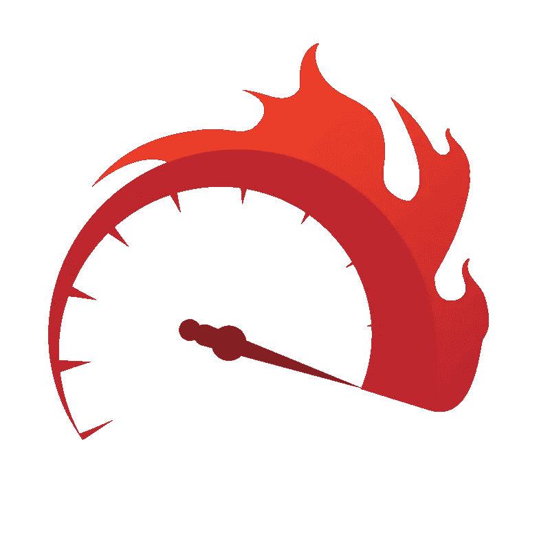
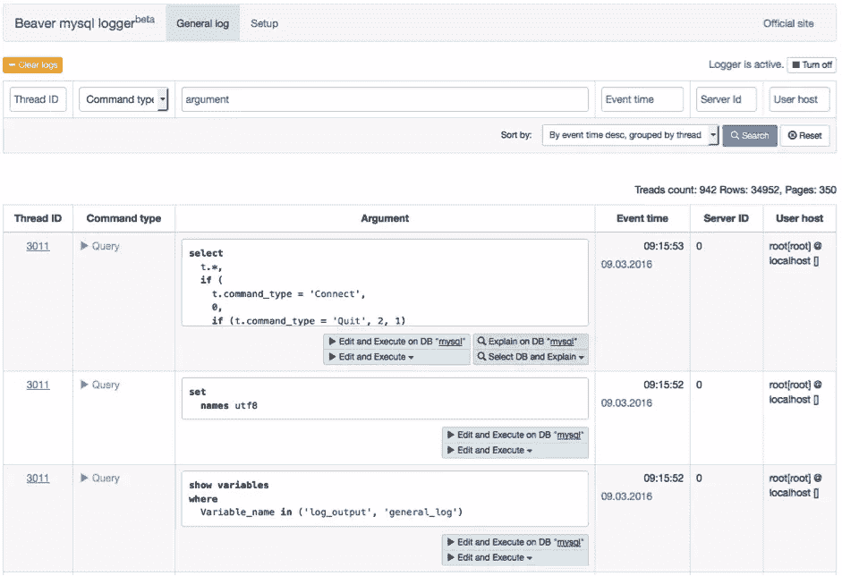
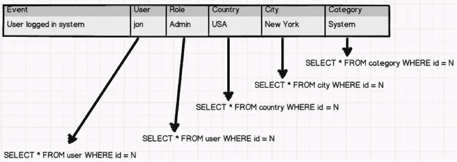

# 海狸在行动:实用的 MySQL 优化

> 原文：<https://www.sitepoint.com/beaver-in-action-practical-mysql-optimization/>

*这篇文章由[沃恩·安切塔](https://www.sitepoint.com/author/wancheta/)和[德姬·阿卡拉](https://www.sitepoint.com/author/dakala/)进行了同行评审。感谢 SitePoint 的所有同行评审员使 SitePoint 的内容尽可能做到最好！*

拥有现有应用程序的客户有时会要求我修复错误，通过加速应用程序来提高效率，或者给一些现有软件添加新功能。第一步是研究原始代码，也就是所谓的逆向工程。对于 SQL 数据库，MySQL 执行了哪些 SQL 查询并不总是显而易见的——特别是如果这些查询是由框架或某种外部库生成的。



在本文中，我将专门讨论 MySQL，并展示一个常见的优化用例，如果有一天您遇到类似的问题，它可能会派上用场。

MySQL 允许您将所有查询保存到日志中。

*打开 MySQL 控制台:*

```
mysql --user=USERNAME --password=PASSWORD 
```

*这将打开日志:*

```
set global general_log = "on"; 
```

*这将它保存到一个表:*

```
set global log_output = "table"; 
```

*查看您保存的日志:*

```
select * from mysql.general_log; 
```

*压缩您的日志:*

```
truncate mysql.general_log; 
```

然而，在 MySQL 的控制台中查看日志并没有想象中那么方便，因为:

*   没有突出显示或格式选项
*   从运行并行进程得到的庞大列表中很难找到有问题的查询。

由于我经常使用日志，我开发了一个名为“ [Beaver MySQL logger](http://beaver-mysql-logger.com/) 的工具来优化日志，让用户更容易分析。使用该工具，您可以:

*   打开/关闭日志记录
*   在一个漂亮的界面中查看日志
*   搜索日志
*   “解释”查询
*   清除日志

你可以在下面看到这个程序的截图:



## 客户端优化项目示例

我的一个 Upwork 客户要求我帮助优化他们的活动列表页面，这个页面加载太慢了。


在我打开日志记录之后，我看到每次页面加载大约执行 680 个 SQL 查询。我发现每个查询都单独加载，导致每页 100 个事件，并且每个事件都像这样额外加载:



*   用户

```
select * from user where id = N 
```

*   作用

```
select * from role where id = N 
```

*   国家

```
select * from country where id = N 
```

*   城市

```
select * from city where id = N 
```

*   种类

```
select * from category where id = N 
```

## 为什么？

为什么会发生这种情况？该项目使用 Yii 框架，这意味着数据访问代码使用以下语法:

```
$event->user->name;
$event->country->title;
$event->city->title;
$event->category->name;
$event->role->name; 
```

其中`$event`是表格中的一行。

这意味着该表必须执行 500 个额外的查询，这降低了效率并影响了整体性能。

## 怎么修

将必要的值合并到一个查询中会减少所需的服务器工作量:

```
select
    *
from
    event
    left join user on user.id = event.user_id
    left join country on country.id = event.country_id
    left join city on city.id = event.city_id
    left join category on category.id = event.categroy_id
    left join role on role.id = user.role_id 
```

由于项目是使用 Yii 框架开发的，因此可以通过使用以下枚举表来确定标准中的名称:

```
$criteria = new CDbCriteria([
    'width' => ['user.role', 'country.city', 'category']
]); 
```

万岁！现在，每个请求将少运行 500 个查询！

在进一步研究日志之后，我还发现对于应用程序中的每个菜单项，SQL 查询都检查每个访问级别，如下所示:

```
select level from acl where role_id = N and page_id = N 
```

这种访问级别检查会在每次页面加载时生成大约 150 个附加查询！解决这个问题最简单的方法是使用菜单小部件的缓存。

## 结论

在项目开始之前，页面加载需要 1100 毫秒。优化后，130ms。

日志系统是多功能的，也可以用来研究业务趋势或发现其他系统中的错误。通过遵循这个简单的过程，我们将 SQL 查询的数量从 650 个减少到了 150 个。虽然这是一个很大的进步，但它远非完美。

关于 MySQL 优化的更全面的指南可以在以下三篇文章中找到:

*   [优化 MySQL 索引](https://www.sitepoint.com/optimizing-mysql-indexes/)
*   [优化 MySQL 配置](https://www.sitepoint.com/optimizing-mysql-configuration/)
*   [优化 MySQL 瓶颈](https://www.sitepoint.com/optimizing-mysql-bottlenecks/)

你有哪些优化成功案例？有什么可以分享的吗？让我们知道！

## 分享这篇文章