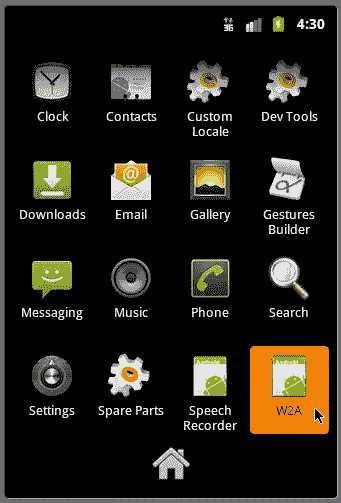

# Android 入门:安装和运行你的第一个应用

> 原文：<https://www.sitepoint.com/beginning-android-installing-and-running-your-first-app/>

第 6 课:安装并运行你的第一个应用程序

第 3 课向您介绍了一个名为 W2A 的应用程序，并向您展示了如何构建这个应用程序。现在你已经学会了创建和启动一个 AVD，第 6 课将向你展示如何在这个设备上安装和运行 W2A。

### 安装 W2A

第 3 课的 W2A 调试。apk 文件必须安装在 MyAVD 仿真设备上，然后才能运行此应用程序。假设是 Windows，执行下面的命令行在 MyAVD 上安装这个 APK，它必须正在运行:

```
adb install C:prjdevW2AbinW2A-debug.apk
```

如果 adb 输出错误:设备离线或没有完成，重新执行该命令行，直到该错误
消失。假设成功，您应该会看到类似于以下消息的消息:

```
31 KB/s (4508 bytes in 0.140s)

pkg: /data/local/tmp/W2A-debug.apk

Success
```

* * *

**注意:**如果您没有将 android- sdkplatform-tools 目录添加到 path 环境变量中，您必须在命令行中包含 adb 的路径。

* * *

### 运行 W2A

单击主屏幕的 app launcher 图标(矩形网格图标)并选择 W2A 图标，如图 18 所示。

[](https://www.sitepoint.com/wp-content/uploads/2012/04/figure18.jpg)

图 18: W2A 是 app launcher 屏幕上高亮显示的条目。

单击 W2A 图标启动此应用程序。您应该会看到屏幕的上部如图 19 所示。

[](https://www.sitepoint.com/wp-content/uploads/2012/04/figure19.jpg)

图 19: Android 向您发送问候。

查看完此应用程序后，按下 Esc 键或单击电话控制中的后退按钮返回到应用程序启动器屏幕，在这里您可以浏览和使用设备预装的应用程序。

### 回顾

以下复习问题有助于测试你对第六课材料的掌握程度:

*   您使用什么工具在仿真设备上安装 W2A 的 APK？
*   你是如何管理 W2A 的？

## 分享这篇文章